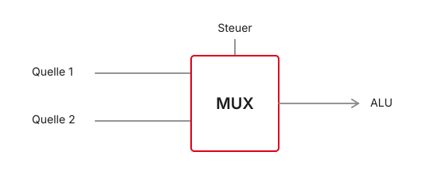
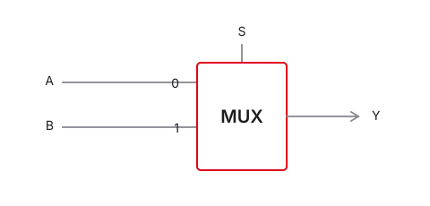
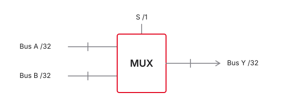
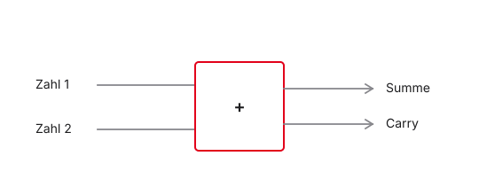
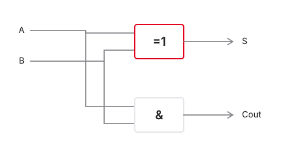
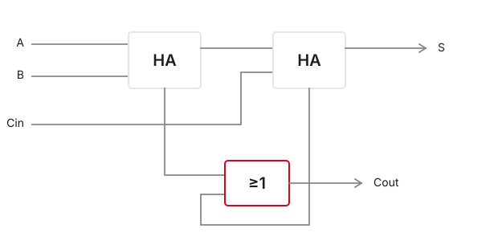
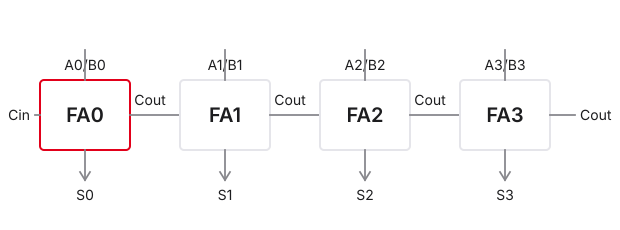
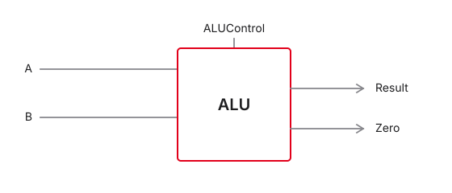
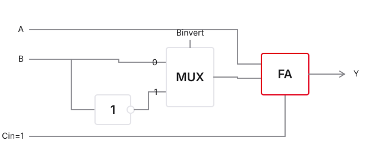
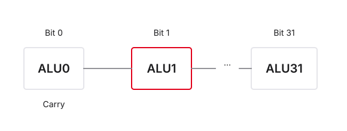

# Einleitung und Grundlagen

## Modul: Mikrocomputertechnik 1

- Studiengang: Elektro- und Informationstechnik
- Modulverantwortung: DHBW Stuttgart
- Schwerpunkt: RISC-V Architektur und Hardware-nahe Programmierung
- Zielsetzung: Verständnis des Datenpfads von der Logik bis zur Software

::: notes
Herzlich willkommen zur ersten Vorlesung im Modul Mikrocomputertechnik 1, kurz MCT 1. Ich freue mich, Sie in diesem Semester in die Computerarchitektur einzuführen. Wir vollziehen den Brückenschlag zwischen abstrakter Software und greifbarer Hardware: Sie lernen nicht nur, wie man programmiert, sondern was im Silizium passiert, wenn eine Instruktion ausgeführt wird. Ziel ist ein mechanisches Verständnis eines modernen Mikroprozessors — am Beispiel der RISC-V-Architektur.
:::

## Agenda für den Kickoff

1. Orga & Abstraktion
2. Datenrepräsentation
3. Kombinatorik & ALU
4. Zeit & Sequenz
5. Register File & Speicher

```{mermaid}
graph LR
  A[Daten] --> B[ALU] --> C[Takt] --> D[RF] --> E[Memory]
  style C fill:#FFFFFF,stroke:#E2001A,stroke-width:2px !important
  style A fill:#FFFFFF,stroke:#E5E5EA,stroke-width:1.5px
  style B fill:#FFFFFF,stroke:#E5E5EA,stroke-width:1.5px
  style D fill:#FFFFFF,stroke:#E5E5EA,stroke-width:1.5px
  style E fill:#FFFFFF,stroke:#E5E5EA,stroke-width:1.5px
```

::: notes
Heute legen wir das Fundament: von Datenrepräsentation über kombinatorische Logik und ALU bis zu Takt, sequenziellen Speichern, Register File und der Anbindung an den RAM — die Bausteine des späteren RISC-V-Datenpfads.
:::

## Über den Dozenten

- Name: Prof. Dr.-Ing. Daniel Klünder
- Fachgebiet: Mikrocomputertechnik / Rechnerarchitektur
- Kontakt: über Moodle und E-Mail
- Sprechstunde: Donnerstags, 14:00–15:00 Uhr (oder nach Vereinbarung)

::: notes
Kurzer Überblick zu mir. Mein Hintergrund liegt in der technischen Informatik und der hardwarenahen Entwicklung. Mir ist eine interaktive Vorlesung wichtig: Fragen bitte sofort stellen. Nutzen Sie die Sprechstunde, wenn Konzepte unklar bleiben. Ziel ist nicht das „Sieben“ durch die Klausur, sondern greifbares Verständnis.
:::

## Organisatorisches & Spielregeln

:::: {.columns}
::: {.column width="48%"}
- Klausur am Semesterende
- Labore essenziell
- Ankündigungen: Moodle
:::
::: {.column width="52%"}
| Einheit | Fokus |
|---------|-------|
| 1–4 VL | Theorie |
| 5–8 Lab | Assembler |
| 9–12 Lab | Datenpfad |
:::
::::

::: notes
Das Modul schließt mit einer schriftlichen Klausur ab — Theorie und Praxis (z. B. kurze Assembler-Routinen lesen oder schreiben). Wichtigster Rat: Mikrocomputertechnik lernt man nicht durch bloßes Zuhören. Datenpfad und Assembler brauchen Übung. Nutzen Sie die Laborzeiten intensiv: Fehler einbauen, debuggen, Simulatoren ausreizen. Wer die Labore aktiv bearbeitet, hat in der Klausur einen klaren Vorteil.
:::

## Skript & OER-Konzept

- OER unter CC BY 4.0 · Quelle auf GitHub
- Handout-PDF mit Begleittext unter jeder Folie
- Pull Requests willkommen

```{mermaid}
graph LR
  A[Markdown] --> B[Folien]
  A --> C[PDF]
  A --> D[Website]
  style A fill:#FFFFFF,stroke:#E2001A,stroke-width:2px !important
  style B fill:#FFFFFF,stroke:#E5E5EA,stroke-width:1.5px
  style C fill:#FFFFFF,stroke:#E5E5EA,stroke-width:1.5px
  style D fill:#FFFFFF,stroke:#E5E5EA,stroke-width:1.5px
```

::: notes
Diese Vorlesung ist als OER konzipiert: Quellcode, Skripte und Diagramme liegen offen auf GitHub. Im Hörsaal nicht abschreiben — auf die Konzepte konzentrieren. Im Handout-PDF finden Sie unter jeder Folie den Begleittext. Tippfehler oder Verbesserungsvorschläge? Gerne per Pull Request.
:::

## Die Literatur

**Sarah L. Harris, David Money Harris**  
*Digital Design and Computer Architecture — RISC-V Edition*

- Konsequenter Bottom-Up-Aufbau (von der Logik zur Software)
- Begleitende Lektüre für tieferes Verständnis
- Vertiefung: Patterson / Hennessy — *Computer Organization and Design* (RISC-V)

::: notes
Harris & Harris in der RISC-V-Edition ist unsere zentrale Referenz — didaktisch stark, vom Transistor bzw. von der Digitaltechnik bis zur Software. Wir orientieren uns an der Buchstruktur; zu den Themen folgen Leseempfehlungen. Patterson/Hennessy eignet sich zur Vertiefung von Architektur und Performance.
:::

## Die Werkzeuge im Praktikum

:::: {.columns}
::: {.column width="46%"}
- Venus: RISC-V-Assembler testen
- Ripes: Datenpfad / Pipeline
- GNU Toolchain: Assembler & C
:::
::: {.column width="54%"}
```text
1. Code in Venus
2. Debug im Terminal
3. Hex → Ripes
4. Datenpfad verfolgen
```
:::
::::

::: notes
Zwei Simulatoren im Labor: Venus für Assembler, Register und Software-Fokus. Ripes zeigt den hardwareseitigen Datenpfad — im Einzelschritt sehen Sie Multiplexer, ALU und Registerschreibungen. Die GNU Toolchain kommt bei Assembler- und C-Übungen dazu. In der Vorlesung nutzen wir die Tools, um Theorie sofort sichtbar zu machen.
:::

# 2. Warum Abstraktion?

## Strukturierung von Komplexität

- Verstecken von irrelevanten Details
- Schaffung standardisierter Schnittstellen
- Ermöglichung von Arbeitsteilung
- Das Fundament der Informatik und der Rechnerarchitektur

::: notes
Erstes Kernkonzept: Abstraktion. Bevor wir uns in Bits und Gattern verlieren: Warum denken wir in Schichten, Modellen und Hierarchien? Ohne Abstraktion wären moderne IT-Systeme — Smartphone wie Rechenzentrum — unmöglich.
:::

## Das Komplexitätsproblem

- Schiere Menge: moderne Prozessoren mit Milliarden Transistoren
- Dimension: Strukturen im Bereich weniger Nanometer
- Kognitive Limits: kein Mensch behält Milliarden Bauteile im Kopf
- Fehleranfälligkeit: ein falsch verbundener Transistor kann das System zerstören

Herausforderung: Wie organisiert man die Entwicklung eines solchen Systems?

::: notes
Stellen Sie sich den Entwurf eines modernen SoCs vor: zig Milliarden Transistoren. Transistor für Transistor zu planen übersteigt jede kognitive Kapazität. Ein Designfehler kann Millionen Chips wertlos machen. Die Ingenieursfrage seit den 1970ern: Wie baut man Maschinen, deren Komplexität unsere eigene Kapazität weit übersteigt?
:::

## Die Lösung: Teile und Herrsche

- Divide and Conquer · Kapselung · klare Schnittstellen
- Hierarchien aus Sub-Modulen · Wiederverwendbarkeit

```{mermaid}
graph LR
  A[System] --> B[Modul]
  B --> C[Sub-Modul]
  style A fill:#FFFFFF,stroke:#E2001A,stroke-width:2px !important
  style B fill:#FFFFFF,stroke:#E5E5EA,stroke-width:1.5px
  style C fill:#FFFFFF,stroke:#E5E5EA,stroke-width:1.5px
```

::: notes
Antwort auf extreme Komplexität: Divide and Conquer. Aus Transistoren ein Gatter — danach interessiert nur noch das Verhalten von außen. Aus Gattern ein Addierer — wieder kapseln. Strikte Schnittstellen ermöglichen parallele Arbeit: Das Addierer-Team muss das OS-Team nicht kennen. Das führt zur formellen Definition von Abstraktion.
:::

## Was ist Abstraktion?

- Irrelevante Details ausblenden · Fokus auf das Wesentliche
- Black Box: *was*, nicht zwingend *wie* · Verträge (API/ISA)

```{mermaid}
graph LR
  Input[Eingabe] --> B[Black Box] --> Output[Ausgabe]
  style B fill:#FFFFFF,stroke:#E2001A,stroke-width:2px !important
  style Input fill:#FFFFFF,stroke:#E5E5EA,stroke-width:1.5px
  style Output fill:#FFFFFF,stroke:#E5E5EA,stroke-width:1.5px
```

::: notes
Abstraktion heißt bewusstes Weglassen. Beim Autofahren: Pedal drücken beschleunigt — Einspritzung und Zündung bleiben Black Box. In der Informatik ebenso: In Python eine Variable deklarieren, ohne Elektronen im Silizium zu verfolgen. Ohne Abstraktion gäbe es keine moderne Software. Achtung: Abstraktion entbindet nicht von Verantwortung — in MCT1 schauen wir gezielt *unter* die Haube.
:::

## Das Schichtenmodell der IT

- Fokus MCT1: Digitaltechnik · Mikroarchitektur · ISA

```{mermaid}
graph LR
  A[Physik] --> B[Digital] --> C[µArch] --> D[ISA] --> E[Software]
  style B fill:#FFFFFF,stroke:#E2001A,stroke-width:2px !important
  style C fill:#FFFFFF,stroke:#E2001A,stroke-width:2px !important
  style D fill:#FFFFFF,stroke:#E2001A,stroke-width:2px !important
  style A fill:#FFFFFF,stroke:#E5E5EA,stroke-width:1.5px
  style E fill:#FFFFFF,stroke:#E5E5EA,stroke-width:1.5px
```

::: notes
Das Schichtenmodell ordnet die Welt von der Physik bis zur App. Die meisten Ingenieurinnen und Ingenieure arbeiten nur auf ein bis zwei Ebenen. In MCT1 liegen wir bewusst „in der Mitte“: Digitaltechnik als Fundament, Mikroarchitektur als konkrete Hardware-Realisierung, Architektur/ISA als Vertrag zwischen Soft- und Hardware. Genau diese drei Schichten (hier hervorgehoben) bilden unseren roten Faden.
:::

# 3. Datenrepräsentation

## Datenrepräsentation — Überblick

- Von Pegeln zu logischen Werten
- Wortbreiten und Hexadezimal
- Zweierkomplement für die ALU

```{mermaid}
graph TD
  A["Spannung 3.3V"] --> B["Binär 1"]
  B --> C[Hexadezimal]
  C --> D[Assembler]
  style B fill:#FFFFFF,stroke:#E2001A,stroke-width:2px !important
  style A fill:#FFFFFF,stroke:#E5E5EA,stroke-width:1.5px
  style C fill:#FFFFFF,stroke:#E5E5EA,stroke-width:1.5px
  style D fill:#FFFFFF,stroke:#E5E5EA,stroke-width:1.5px
```

::: notes
Willkommen zurück aus der Pause. In diesem Block: Datenrepräsentation. Komplexität kapseln wir durch Abstraktion — die Hardware kennt aber nur physikalische Zustände, meist Spannungspegel. Bevor wir einen Prozessor bauen oder RISC-V-Assembler schreiben, definieren wir, wie die Architektur diese Zustände als Daten interpretiert: Bündelung von Nullen und Einsen, lesbare Darstellung für Menschen, und wie die Hardware negative Zahlen auf Bitebene löst.
:::

## Alles ist eine Zahl

:::: {.columns}
::: {.column width="46%"}
- Nur Spannungszustände → Bits
- Text, Bild, Befehl: alles Zahlen
- Kontext entscheidet die Deutung
:::
::: {.column width="54%"}
```text
01001000 … 01101111
Text? Zahlen? Instruktion?
→ Kontext!
```
:::
::::

::: notes
Für den Prozessor ist absolut alles eine Zahl. String, JPEG, ausführbarer Befehl — auf dem Datenbus nur Nullen und Einsen. Physikalisch gibt es keinen Unterschied zwischen Pixel und Instruktion; die Interpretation liegt bei Architektur und Software. Unsere Aufgabe: Schaltungen entwerfen, die diese Bitströme korrekt und schnell verarbeiten.
:::

## Das Bit und das Byte

- Bit: kleinste Informationseinheit (Binary Digit, 0 oder 1)
- Nibble: genau 4 Bits (Halb-Byte)
- Byte: genau 8 Bits — kleinste adressierbare Speichereinheit
- Skalierung: Kilobyte (KB), Megabyte (MB), Gigabyte (GB)

```{mermaid}
graph TD
  A[1 Byte] --> B[Nibble High]
  A --> C[Nibble Low]
  B --> D[4 Bits]
  C --> E[4 Bits]
  style A fill:#FFFFFF,stroke:#E2001A,stroke-width:2px !important
  style B fill:#FFFFFF,stroke:#E5E5EA,stroke-width:1.5px
  style C fill:#FFFFFF,stroke:#E5E5EA,stroke-width:1.5px
  style D fill:#FFFFFF,stroke:#E5E5EA,stroke-width:1.5px
  style E fill:#FFFFFF,stroke:#E5E5EA,stroke-width:1.5px
```

::: notes
Vokabeln fürs Semester: Bit, Byte (8 Bits) als Standard-Container des Speichers — kleinste abrufbare Menge aus dem RAM. Das Nibble (4 Bits) wirkt zunächst unwichtig, wird aber bei der Hex-Umrechnung zum zentralen Werkzeug.
:::

## Das Word (Wortbreite)

- Word: natürliche Datenbreite einer Architektur
- Bits, die der Prozessor typischerweise in einem Schritt verarbeitet
- RISC-V RV32I: Wortbreite exakt 32 Bits
- Half-Word: 16 Bits (2 Bytes)
- Double-Word: 64 Bits (relevant für RV64)

| Byte 3 | Byte 2 | Byte 1 | Byte 0 |
|:------:|:------:|:------:|:------:|
| 8 Bit  | 8 Bit  | 8 Bit  | 8 Bit  |

$\rightarrow$ zusammen **1 Word = 32 Bit**

::: notes
Das Word klassifiziert den Prozessor: Breite der internen Busse und der ALU. Desktop-Chips oft 64 Bit; wir arbeiten mit RV32I — 32-Bit-Worte, 32-Bit-Register. Das Word ist das Standard-Datenpaket unserer Architektur.
:::

## Das Problem mit Binärzahlen

:::: {.columns}
::: {.column width="42%"}
- 32 Bit schwer lesbar
- Ein Bit kippen → Absturz
:::
::: {.column width="58%"}
```text
…0001010001…0110011
…0001010000…0110011
      ^
```
:::
::::

::: notes
Hardware liebt Binär (Strom an/aus). Menschen nicht: 32 Bits flimmern. Ein gekipptes Bit in der Mitte kann das Programm abstürzen lassen. Wir brauchen eine kompaktere Repräsentation mit gleichem Wert.
:::

## Die Lösung: Das Hexadezimalsystem

- Basis 16 (statt 2 oder 10)
- 16 Symbole: `0`–`9` und `A`–`F` (Werte 10–15)
- Extrem kompakte Schreibweise für lange Binärketten
- Basis 16 ist Zweierpotenz ($2^4$) → einfache Umrechnung aus Binär

::: notes
Hexadezimal löst das Lesbarkeitsproblem. Nach 9 kommen A–F (10–15). Warum 16 und nicht Dezimal? Weil $2^4$ — die Umrechnung Binär ↔ Hex ist fast magisch einfach.
:::

## Der magische Vierer-Block (Nibble)

- 4 Bits: genau $2^4 = 16$ Zustände
- 1 Hex-Ziffer: ebenfalls 16 Zustände
- **1 Hex-Ziffer = exakt 4 Bits** — ohne Modulo/Division
- 32-Bit-Word: exakt 8 Hex-Ziffern ($32 / 4 = 8$)

```text
Binär     Hex      Dezimal
0000  =   0    =   0
0101  =   5    =   5
1010  =   A    =   10
1111  =   F    =   15
```

::: notes
Der Trick: Nibble und Hex-Ziffer haben dieselbe Kardinalität — 1-zu-1-Zuordnung. Statt Potenzen über das ganze Wort: jeden 4-Bit-Block durch eine Ziffer ersetzen. 32 Bit → 8 Zeichen, kompakt und präzise.
:::

## Mustererkennung: Visuelle Umrechnung

1. Lange Binärkette nehmen
2. Von rechts nach links in 4-Bit-Blöcke zerschneiden
3. Jeden Block unabhängig übersetzen
4. Hex-Ziffern wieder aneinanderfügen

```{mermaid}
graph TD
  A["1101 1010 0011 1111"] --> B["1101"]
  A --> C["1010"]
  A --> D["0011"]
  A --> E["1111"]
  B --> F[D]
  C --> G[A]
  D --> H[3]
  E --> I[F]
  F --> J["DA3F"]
  G --> J
  H --> J
  I --> J
  style J fill:#FFFFFF,stroke:#E2001A,stroke-width:2px !important
```

::: notes
Algorithmus: von rechts (LSB) in Vierergruppen; bei Bedarf links mit Nullen auffüllen. `1111` → F, `1010` → A. Nach wenigen Übungen lesen Sie Binär fließend als Hex.
:::

## Notation und Präfixe im Code

- Ohne Präfix: fast immer Dezimal
- Präfix `0b`: Binär
- Präfix `0x`: Hexadezimal
- Gilt in C, C++, Java, Python und RISC-V-Assembler

```c
// Ein und derselbe Wert in drei Schreibweisen:
int dezimal = 42;
int binaer  = 0b101010;
int hex     = 0x2A;
```

::: notes
Compiler und Assembler brauchen die Basis: `10` ist dezimal zehn, `0b10` ist zwei, `0x10` ist sechzehn. `0x` wird zur Standardnotation für Adressen und Bitmasken.
:::

## Interaktive Übung: Konvertierung

Ziel: Hex-Wert `0xCAFEBABE` in Binär

| Hex | Dezimal | Binär |
|-----|---------|-------|
| C | 12 | `1100` |
| A | 10 | `1010` |
| F | 15 | `1111` |
| E | 14 | `1110` |
| B | 11 | `1011` |

```text
Resultat: 0b 1100 1010 1111 1110 1011 1010 1011 1110
```

::: notes
„Cafe Babe“ ist eine bekannte Magic Number (u. a. Java-Klassendateien). Hex → Binär geht blockweise im Kopf; Dezimal über $2^{31}$ wäre mühsam. Hex ist der natürliche Begleiter der Hardware-Entwicklung.
:::

# 4. Negative Zahlen in der Hardware

## Negative Zahlen — Überblick

- Kein Minus-Transistor · Sign-Magnitude vs. Zweierkomplement
- Fallstrick: Sign Extension

```{mermaid}
graph LR
  A[+Zahl] --> B[Algorithmus] --> C[-Zahl]
  style B fill:#FFFFFF,stroke:#E2001A,stroke-width:2px !important
  style A fill:#FFFFFF,stroke:#E5E5EA,stroke-width:1.5px
  style C fill:#FFFFFF,stroke:#E5E5EA,stroke-width:1.5px
```

::: notes
Wie rechnet ein Computer? Er addiert. Subtraktion ist Addition einer negativen Zahl: $5 - 3 = 5 + (-3)$. Es gibt keinen Minus-Transistor — nur 0 und 1. Wir brauchen eine Kodierung, mit der die Hardware negative Werte korrekt verarbeitet.
:::

## Das Vorzeichen-Problem der Hardware

- Mathematik: Negativität durch Symbol (−)
- Hardware: nur Low/High
- Kein „Negativ-Transistor“
- Subtraktion soll über denselben Addierer (ALU) laufen
- Gesucht: binäre Kodierung, die Additionen mit negativen Operanden erlaubt

::: notes
Auf Papier reicht ein Querstrich. Auf dem Chip: 32 Bits im Register. Zwei getrennte Rechenwerke (Addierer + Subtrahierer) wären teuer und stromhungrig. Ziel: eine Additionsschaltung, die durch die richtige Bitkodierung auch Subtraktion leistet.
:::

## Ansatz 1: Vorzeichen & Betrag (Sign-Magnitude)

- Intuitivste, „menschliche“ Idee
- MSB (ganz links) als Vorzeichen-Flag
- `0` → positiv, `1` → negativ
- Restliche Bits: absoluter Betrag

```{mermaid}
graph LR
  A["1"] -->|Vorzeichen: Minus| B["000 0101"]
  B -->|Betrag: 5| C["-5"]
  style A fill:#FFFFFF,stroke:#E2001A,stroke-width:2px !important
```

::: notes
Frühzeit der Computer: MSB zweckentfremden als Plus/Minus-Schalter, Rest = Betrag. Sign-Magnitude ist leicht lesbar — führt in der Schaltungstechnik aber in die Sackgasse.
:::

## Die +0 und die −0

:::: {.columns}
::: {.column width="46%"}
- Sign-Magnitude: `0000` = $+0$, `1000` = $-0$
- Mathematik kennt nur eine Null
- Hardware-Vergleicher: `0000 ≠ 1000`
- ALU-Schaltungsaufwand würde enorm steigen
:::
::: {.column width="54%"}
```c
int a = +0; // 0000
int b = -0; // 1000

if (a == b) {
    // würde bei Sign-Magnitude NIE laufen —
    // Bitmuster sind unterschiedlich!
}
```
:::
::::

::: notes
Zwei Bitmuster für denselben Wert Null: `if (a == b)` vergleicht bitweise und scheitert. Zusatzschaltungen wären langsam und teuer — Sign-Magnitude ist damit ungeeignet.
:::

## Ansatz 2: Das Zweierkomplement

- Industriestandard für Signed Integers
- MSB erhält **negatives** mathematisches Gewicht
- Übrige Bits: klassische positive Gewichte
- Genau eine Darstellung der Null (`0000…`)
- Standard-Addierer bleiben unverändert nutzbar

$$
N = -x_{n-1} \cdot 2^{n-1} + \sum_{i=0}^{n-2} x_i \cdot 2^i
$$

::: notes
Zweierkomplement: MSB zählt z. B. bei 8 Bit als $-128$, nicht als Fahne. Nur eine Null. Vorteil: der Addierer addiert stur Bits — das Ergebnis stimmt durch den Kodierungstrick.
:::

## Bildung des Zweierkomplements

1. Positive Zahl in Binär schreiben
2. Jedes Bit invertieren (Einerkomplement / NOT)
3. Exakt $+1$ addieren
4. Übertrag über das MSB hinaus: ignorieren

```text
1. Positiver Binärwert
2. Bits kippen (NOT)
3. +1 addieren
```

::: notes
Mechanischer Algorithmus, in Hardware leicht: invertieren, dann +1. Damit ist die Zahl negiert.
:::

## Rechenbeispiel: Aus +5 wird −5

- 8 Bit: invertieren, dann $+1$ · MSB = 1 ⇒ negativ

```{mermaid}
graph LR
  A["+5"] -->|NOT| B[Einerkompl.] -->|+1| C["-5"]
  style C fill:#FFFFFF,stroke:#E2001A,stroke-width:2px !important
  style A fill:#FFFFFF,stroke:#E5E5EA,stroke-width:1.5px
  style B fill:#FFFFFF,stroke:#E5E5EA,stroke-width:1.5px
```

::: notes
Durchrechnen: +5 → invertieren → +1 → `1111 1011`. Das MSB wird automatisch 1 — die „Negativ-Erkennung“ bleibt praktisch erhalten.
:::

## Die Symmetrie: Von −5 zu +5

- Derselbe Algorithmus in beide Richtungen
- $-5$: `1111 1011` → invertieren → `0000 0100` → $+1$ → `0000 0101` (= $+5$)
- Zweimal negieren führt zum Ursprung zurück

```text
-(-5) = +5
Der Algorithmus kümmert sich nicht darum,
ob der Startwert positiv oder negativ war!
```

::: notes
Symmetrie: keine neuen Regeln für die Rückrichtung. Eine simple Schaltung reicht, um Vorzeichen zu drehen.
:::

## Das Zahlenrad und der Überlauf (Overflow)

- Register begrenzt (z. B. 8 Bit) — wie ein Kilometerzähler
- Unsigned: $0$ bis $255$
- Signed (Zweierkomplement): $-128$ bis $+127$
- $+127 + 1$ → `1000 0000` (= $-128$)
- Dieser Sprung heißt **Overflow**

::: notes
Bei RV32I: 32-Bit-Register, harte Grenzen. Overflow: vom Maximalpositiven ins Extremnegative. Prozessoren setzen Flags, damit Software reagieren kann.
:::

## Vorzeichenerweiterung (Sign Extension)

- 8-Bit → 32-Bit-Register: Vorzeichenbit nach links kopieren
- RISC-V: `lb` (Load Byte mit Sign Extension)

```{mermaid}
graph LR
  A["8-Bit: -5"] --> B["32-Bit: Sign Ext."]
  style B fill:#FFFFFF,stroke:#E2001A,stroke-width:2px !important
  style A fill:#FFFFFF,stroke:#E5E5EA,stroke-width:1.5px
```

::: notes
Häufiger Laborfehler: $-5$ als 8 Bit laden und links mit Nullen auffüllen → MSB wird 0 → positive $+251$. Richtig: Vorzeichenbit nach links kopieren (Sign Extension).
:::

# 5. Speicherausrichtung (Endianness)

## Speicherausrichtung — Überblick

- RAM als lineares Array von Bytes
- Adressen als „Hausnummern“
- Byte-Adressierbarkeit als Standard
- Big-Endian vs. Little-Endian

```{mermaid}
graph TD
  A[CPU] -->|0x00| B[RAM Byte]
  A -->|0x01| C[RAM Byte]
  A -->|0x02| D[RAM Byte]
  style A fill:#FFFFFF,stroke:#E2001A,stroke-width:2px !important
```

::: notes
Daten liegen in Registern — müssen aber aus dem RAM geladen und zurückgeschrieben werden. Organisation und Byte-Reihenfolge: Endianness. In Venus schauen Sie oft direkt in den Speicher — dieses Modell brauchen Sie zum Debuggen.
:::

## Der Speicher als lineares Array

- Jede Zelle: exakt 1 Byte (8 Bits)
- Jede Zelle: eindeutige Adresse $0, 1, 2, \ldots$
- Byte-Adressierbarkeit
- RV32I: Adressen selbst 32 Bit → bis ca. 4 GB adressierbar

| Adresse | Inhalt |
|---------|--------|
| `0x00` | Byte (8 Bit) |
| `0x01` | Byte (8 Bit) |
| `0x02` | Byte (8 Bit) |
| `0x03` | Byte (8 Bit) |

::: notes
Mentales Modell: endloses Regal, jedes Fach ein Byte. 32-Bit-Adressen → rund 4 Milliarden Hausnummern ≈ 4 GB — das klassische 32-Bit-Limit.
:::

## Das Platzproblem im Speicher

- Register: 32-Bit-Word (4 Bytes), z. B. `0xDEADBEEF`
- Speicherfach: nur 1 Byte
- Lösung: Word auf 4 aufeinanderfolgende Adressen aufteilen
- Streitfrage: Welches Byte kommt an die kleinste Adresse?

```text
DE  (MSB)   AD   BE   EF  (LSB)

Wohin mit EF — Adresse 0x00 oder 0x03?
```

::: notes
32-Bit-Word passt nicht in ein 8-Bit-Fach → vier aufeinanderfolgende Bytes. Reihenfolge: Kopf (DE) zuerst oder Schwanz (EF) zuerst?
:::

## Big-Endian vs. Little-Endian

- Big-Endian: MSB an die kleinste Adresse (wie von links nach rechts lesen)
- Little-Endian: LSB an die kleinste Adresse
- Name aus *Gullivers Reisen* (an welcher Seite das Ei aufschlagen?)
- Netzwerke oft Big-Endian; viele PCs Little-Endian

::: notes
Historischer „Glaubenskrieg“. Big-Endian: Speicher-Dump sieht aus wie die Zahl. Little-Endian: LSB zuerst. Die Namen sind ein Insider-Witz aus Gulliver.
:::

## Endianness in der RISC-V Architektur

- RISC-V (wie x86): **Little-Endian**
- `0xDEADBEEF` ab Adresse `0x00`:

| Adresse | Byte |
|---------|------|
| `0x00` | `EF` (LSB) |
| `0x01` | `BE` |
| `0x02` | `AD` |
| `0x03` | `DE` (MSB) |

- Ein Pointer auf ein Word zeigt auf das LSB!

::: notes
Im Labor: `DEADBEEF` erscheint im Speicher als `EF BE AD DE` — kein Simulatorfehler, sondern korrektes Little-Endian. MSB auf der höchsten Adresse. Damit sind Sie für den Speicherdump in Venus gerüstet.
:::

# 6. Kombinatorische Logik

## Kombinatorische Logik — Überblick

- Kein Gedächtnis: Ausgang nur von aktuellen Eingängen
- Fundament für ALU und Routing (MUX)

```{mermaid}
graph LR
  A[A] --> C[Logik] --> Y[Y]
  B[B] --> C
  style C fill:#FFFFFF,stroke:#E2001A,stroke-width:2px !important
  style A fill:#FFFFFF,stroke:#E5E5EA,stroke-width:1.5px
  style B fill:#FFFFFF,stroke:#E5E5EA,stroke-width:1.5px
  style Y fill:#FFFFFF,stroke:#E5E5EA,stroke-width:1.5px
```

::: notes
Zweiter großer Block: Wir wissen, wie Daten als Bits kodiert werden — jetzt: durch welche Strukturen fließen sie? Kombinatorische Logik kennt kein Gedächtnis und keine Zeitachse: Der Ausgang hängt nur von den aktuellen Eingängen ab. Darauf bauen wir ALU und Routing-Infrastruktur auf.
:::

## Kombinatorik vs. Sequenzielle Logik

:::: {.columns}
::: {.column width="46%"}
- Kombinatorisch: Ausgang nur von aktuellen Eingängen; gedächtnislos
- Beispiele: Gatter, Multiplexer, Addierer, ALU
- Sequenziell: Ausgang hängt auch vom vorherigen Zustand ab
- Taktung: Flip-Flops/Register speichern Zustände
:::
::: {.column width="54%"}
| Eigenschaft | Kombinatorisch | Sequenziell |
|-------------|----------------|-------------|
| Gedächtnis | Nein | Ja |
| Takt-Abhängigkeit | Nein | Ja (meist) |
| Primärer Zweck | Rechnen / Routen | Speichern (Zustand) |
:::
::::

::: notes
Zwei Fundamentalkategorien: Kombinatorik wie eine Waage — reagiert nur auf den Ist-Zustand (Addierer, MUX). Sequenziell hat Gedächtnis (Flip-Flop behält eine 1). Der Prozessor vereint beides: Register speichern, kombinatorische ALUs rechnen.
:::

## Refresher: Die grundlegenden Logikgatter

- Logikgatter = elementare Bausteine der Hardware-Abstraktion
- AND · OR · XOR · NOT — IEC-60617-Symbole
- Ab jetzt: Gatter als Black Boxes mit bekanntem Verhalten


::: notes
Kurzer Digitaltechnik-Rückblick. Wir sprechen nicht mehr über einzelne MOSFETs in einem NAND — wir arbeiten auf Gatterebene. XOR wird zentral für die Addition. Die Schaltsymbole folgen IEC 60617 (rechteckig: `&`, `≥1`, `=1`, NOT mit Negationskreis).
:::

## Das „Weichen“-Problem im Datenpfad

- Datenströme fließen über Busse
- Oft muss gewählt werden: z. B. Konstante oder Registerwert an die ALU?
- Gesucht: elektronisch schaltbare „Eisenbahnweiche“
- Steuerung über ein separates Steuersignal



::: notes
Routing-Problem: Manchmal `R1 + R2`, manchmal `R1 + 5` (Immediate). Der zweite ALU-Eingang muss umschaltbar sein — Register-File oder Instruktionswort. Wir brauchen eine digitale Weiche.
:::

## Der Multiplexer (MUX)

- Lösung für das Weichen-Problem
- Mehrere Dateneingänge (z. B. $A$, $B$), ein Ausgang $Y$
- Select-Signal $S$ bestimmt den durchgeschalteten Eingang
- Symbol: Rechteck (IEC 60617) mit Select-Eingang
- Häufigster Routing-Baustein in der Architektur



::: notes
2-zu-1-MUX: Eingänge A und B, Ausgang Y, Select S. Bei $S=0$ fließt A nach Y, bei $S=1$ fließt B. Die Control-Unit steuert die Weiche.
:::

## Die Logik des 2:1-Multiplexers

- Wahrheitstabelle beschreibt das Verhalten
- Boole'sche Gleichung: $Y = (\overline{S} \cdot A) + (S \cdot B)$
- $S = 0$: Term mit $B$ wird 0 → $Y = A$
- $S = 1$: Term mit $A$ wird 0 → $Y = B$

| Select ($S$) | Eingang $A$ | Eingang $B$ | Ausgang $Y$ |
|:------------:|:-----------:|:-----------:|:-----------:|
| 0 | 0 | X | 0 |
| 0 | 1 | X | 1 |
| 1 | X | 0 | 0 |
| 1 | X | 1 | 1 |

::: notes
Plus = OR, Punkt = AND. Bei $S=0$ wird $\overline{S}=1$, also $Y=A$; der $B$-Term fällt weg. „X“ = Don't Care: Der nicht gewählte Eingang ist egal.
:::

## Der Multiplexer in reiner Hardware

- Keine Magie: reine Gatter-Logik
- NOT für $\overline{S}$
- Zwei AND-Gatter sperren bzw. freigeben $A$ und $B$
- OR führt die freigegebenen Pfade zusammen


::: notes
$S$ geht einmal direkt (Pfad B) und einmal invertiert (Pfad A) in die AND-Gatter — Verriegelung: immer nur ein Pfad offen. Das OR sammelt das aktive Signal.
:::

## Die Brücke zur Software: MUX = IF/ELSE

:::: {.columns}
::: {.column width="46%"}
- Software: `if`/`else` als Kontrollfluss
- Hardware: kein sequenzieller Sprung — alles existiert gleichzeitig
- MUX filtert das unerwünschte Ergebnis weg
- Ternärer Operator `? :` ≈ Software-MUX
:::
::: {.column width="54%"}
```c
// MUX als ternärer Operator:
int Y = (S == 1) ? B : A;

// Alternativ:
if (S == 1) {
    Y = B;
} else {
    Y = A;
}
```
:::
::::

::: notes
Software springt in einen Zweig. Hardware: A und B liegen permanent an; der MUX wählt, was weiterfließt. Der ternäre Operator bildet genau dieses Verhalten ab.
:::

## Vom 1-Bit- zum 32-Bit-Bus-Multiplexer

- RISC-V: komplette 32-Bit-Wörter schalten
- 32-Bit-MUX = 32 parallele 1-Bit-MUX
- Ein gemeinsames Select-Signal $S$ für alle Slices
- In Diagrammen: Bus mit Querstrich und Breite (`/32`)



::: notes
Ein Blockschaltbild-MUX meint eine Batterie aus 32 Weichen. Ein Bit $S$ klappt alle synchron um — das ganze Word von B fließt durch.
:::

# 7. Addition in Hardware

## Addition in Hardware — Überblick

- Vom Routing zur mathematischen Verarbeitung
- Mechanische Regeln der binären Addition
- Halbaddierer als Grundbaustein
- Kaskadierung für große Wortbreiten



::: notes
Signale leiten wir mit dem MUX — jetzt rechnen. Keine Magie: Grundschul-Additionsregeln mit Gattern nachbauen. Zuerst 1 Bit, dann 32 Bit.
:::

## Binäre Addition (mentales Modell)

:::: {.columns}
::: {.column width="50%"}
| $A$ | $B$ | Summe | Carry |
|:---:|:---:|:-----:|:-----:|
| 0 | 0 | 0 | 0 |
| 0 | 1 | 1 | 0 |
| 1 | 0 | 1 | 0 |
| 1 | 1 | 0 | 1 |

- Summe $\leftrightarrow$ XOR · Carry $\leftrightarrow$ AND
:::
::: {.column width="50%"}
```text
  1011  (11)
+ 0011  ( 3)
-------
  1110  (14)
```
:::
::::

::: notes
Bei $1+1$ gibt es keine „2“ — wir schreiben 0 und Carry 1. Summenspalte = XOR-Wahrheitstabelle, Carry = AND. Mathematik wird zu Logik.
:::

## Der Halbaddierer (Half-Adder)

- Nur zwei Gatter: XOR und AND
- Eingänge: $A$, $B$
- Ausgänge: Summe $S$, Carry Out $C_{out}$
- $S = A \oplus B$,\quad $C_{out} = A \cdot B$
- Problem: kein Carry-In von einer vorherigen Stelle



::: notes
„Halb“, weil nur zwei Operanden — reicht für die LSB-Stelle. Weiter links brauchen wir drei Eingänge: $A$, $B$ und den Übertrag der rechten Spalte.
:::

## Der Volladdierer (Full-Adder)

- Drei Eingänge: $A$, $B$, $C_{in}$
- Ausgänge: Summe $S$, $C_{out}$
- Intern: typisch zwei Halbaddierer + OR
- Standard-Rechenzelle in jedem Prozessor



::: notes
$C_{in}$ kommt von der vorherigen Stelle. Als Systemarchitekten: Volladdierer fortan als Black Box — elementarer ALU-Baustein.
:::

## Kaskadierung: Ripple-Carry-Adder (RCA)

- 32 Volladdierer · Carry von Bit $i$ nach $i+1$



::: notes
32 Volladdierer nebeneinander, Carry-Kette von Bit 0 bis 31 — exakt wie mit dem Stift. Name: Ripple-Carry-Adder.
:::

## Das Problem der Laufzeit (Ripple Delay)

- Signale brauchen Gatterlaufzeiten
- FA 31 wartet auf Carry von FA 30 → … → FA 0
- Carry „plätschert“ (*ripple*) durch alle Stufen
- Längster kritischer Pfad begrenzt die Taktfrequenz
- Industrie: schnellere Designs (z. B. Carry-Lookahead); fürs Verständnis: RCA reicht

::: notes
Logisch korrekt, physikalisch langsam bei 32/64 Bit. Der kritische Pfad diktiert den Takt. Für RISC-V-Verständnis bleiben wir mental beim RCA.
:::

# 8. Die Arithmetic Logic Unit (ALU)

## Die ALU — Überblick

- Mathematischer Motor jedes Prozessors
- Arithmetik: Add, Sub
- Logik: And, Or, Xor, …
- Vereint Addierer und Routing (MUX)
- Reagiert auf Control Signals aus der Instruktion



::: notes
MUX + Volladdierer → ALU. In Software `C = A + B` landet hier. Multifunktional: addieren, subtrahieren, bitweise Verknüpfen.
:::

## Ein Taschenrechner ohne Tasten

- Keine „Plus-Taste“ — Auswahl über Steuersignale
- Trick: intern oft alle Operationen parallel
- Ergebnis fließt durch Addierer, AND, OR, …
- MUX am Ende wählt das gewünschte Ergebnis
- Select kommt von der Control Unit

::: notes
Daten fließen parallel in alle Rechenpfade; der MUX wirft unerwünschte Ergebnisse weg. Effizient in Silizium, anders als sequentieller Software-Kontrollfluss.
:::

## Struktur einer 1-Bit-ALU

- Parallel: AND · OR · FA → MUX → $Y$ (ALUControl)


::: notes
Beispiel-Kodierung: `00` AND, `01` OR, `10` Addierer; `11` oft Reserve. Genau dieses Muster skaliert auf 32 Bit.
:::

## Subtraktion elegant integrieren

- $A - B = A + \overline{B} + 1$ · MUX vor $B$, $C_{in}=1$



::: notes
Aus dem Zweierkomplement-Block: Bits kippen und +1. Der MUX vor $B$ liefert $\overline{B}$; das $+1$ kommt als Carry-In. Reines Routing macht aus dem Addierer einen Subtrahierer.
:::

## Das Zero-Flag (Null-Erkennung)

- Status-Flags neben dem Ergebnis $Y$
- Zero-Flag ($Z$): 1, wenn Ergebnis exakt 0
- Hardware: oft großes NOR über alle Ergebnis-Bits
- Vergleich $A == B$: rechne $A - B$; $Z=1$ ⇒ gleich

```c
// Software:
if (A == B) { ... }

// Hardware-Idee:
Ergebnis = A - B;
if (Zero_Flag == 1) { ... }
```

::: notes
Wichtigstes Flag für bedingte Sprünge in RISC-V. Control Unit liest $Z$ und entscheidet über den Kontrollfluss.
:::

## Die 32-Bit RISC-V ALU

- 32 Slices · gemeinsame ALUControl · Carry wie RCA



::: notes
32 Scheiben, Carry verbunden, gemeinsame Steuerung — der Motor für Integer-Arithmetik und Logik.
:::

## Das ALU-Schaltsymbol

- Interne Gatter final abstrahiert (Black Box)
- Klassisches Symbol: „hosenförmiges“ V / Trapez
- Oben: Operanden $A$, $B$ (32 Bit)
- Unten: Ergebnis (32 Bit)
- Seitlich: ALUControl und Flags (z. B. Zero)

::: notes
Kreis zur Abstraktion: Transistor → Gatter → Addierer → 32-Bit-ALU. Ab der nächsten Einheit zeichnen wir nur noch das V-Symbol — Sie wissen, dass dahinter Multiplexer umklappen und Carry-Ketten laufen.
:::

# 9. Die Notwendigkeit der Zeit

## Die Notwendigkeit der Zeit — Überblick

- Die vierte Dimension der Computerarchitektur
- Warum kombinatorische Logik allein keinen Computer ergibt
- Zeitliche Synchronisation in Hardware
- Fließende vs. diskrete Daten
- Vorbereitung auf sequenzielle Schaltungstechnik

```{mermaid}
graph LR
  A[Kombinatorik] -->|Ohne Gedächtnis| B[Daten fließen sofort ab]
  C[Sequenziell] -->|Mit Gedächtnis| D[Daten warten auf den Takt]
  style C fill:#FFFFFF,stroke:#E2001A,stroke-width:2px !important
  style A fill:#FFFFFF,stroke:#E5E5EA,stroke-width:1.5px
```

::: notes
Letzter großer Grundlagenblock: MUX und ALU haben wir — aber kein Gedächtnis. Wir fügen die Dimension Zeit hinzu und führen den Takt (Clock) als Herzschlag des Systems ein.
:::

## Das Problem der reinen Kombinatorik

- Reagiert sofort auf Eingangsänderungen
- Kein Mechanismus, ein Ergebnis „einzufrieren“
- Fallen die Eingänge weg, ist das Ergebnis weg
- Laufzeitunterschiede → temporäre Glitches
- Fazit: Mit einer ALU allein lassen sich keine Programme ausführen

::: notes
Metapher: ALU wie ein Rohrsystem — ohne Pumpe läuft es leer. Für $C = A + B$ und später $D = C + 5$ brauchen wir Schleusen: Ergebnisse müssen überleben, wenn sich die Eingänge ändern.
:::

## Die Lösung: Zustandsspeicherung

- Bauteile, die Ladungen/Daten über Zeit halten
- Globale Synchronisation aller Speicherelemente
- Speicherelemente = Dämme/Schleusen im Datenpfad
- ALU-Ergebnisse werden zwischengespeichert
- Weiterfluss erst beim Öffnen der Schleusen

```{mermaid}
graph LR
  A[ALU-Ausgang] -->|fließendes Datum| B[Schleuse / Speicher]
  B -->|gefrorener Zustand| C[Neue Berechnung]
  S[Synchronisation] -.-> B
  style B fill:#FFFFFF,stroke:#E2001A,stroke-width:2px !important
```

::: notes
Datentresore im Datenpfad — nicht asynchron jeder für sich, sondern global synchron: im selben Nanosekundenbruchteil öffnen, aufnehmen, verriegeln. Dirigent: der Taktgeber.
:::

## Das Taktsignal (Clock / CLK)

- Oszillator = Herzschlag / Metronom des Prozessors
- Periodisches Rechtecksignal ($0 \leftrightarrow 1$)
- Periode $T$: Dauer eines Zyklus (z. B. $1\,\text{ns}$)
- Frequenz $f = 1/T$ (z. B. $1\,\text{GHz}$)
- Alle Speicherelemente hören auf dieses globale Signal

::: notes
CLK vom Quarz-Oszillator: Bei 3 GHz tickt das Metronom drei Milliarden Mal pro Sekunde — jeder Tick ein Schritt vorwärts für die gesamte CPU.
:::

## Flankensteuerung (Edge-Triggering)

:::: {.columns}
::: {.column width="46%"}
- Reaktion nicht auf konstanten Pegel, sondern auf den Übergang
- Steigende Flanke: $0 \rightarrow 1$
- Fallende Flanke: $1 \rightarrow 0$
- RISC-V / die meisten CPUs: Speichern primär bei steigender Flanke
:::
::: {.column width="54%"}
```text
Clock: 00000000111111110000000011111111
              ^       ^       ^       ^
            Rise    Fall    Rise    Fall
(Prozessor speichert typisch nur beim Rise)
```
:::
::::

::: notes
Edge-Triggering: Bei konstantem CLK-Pegel passiert im Speicher nichts. Nur im Moment der steigenden Flanke öffnet der Tresor kurz, nimmt D auf und verriegelt wieder — danach hat die ALU Zeit bis zum nächsten Tick.
:::

# 10. Sequenzielle Logik

## Sequenzielle Logik — Überblick

- Entwurf elementarer Speicherzellen
- Rückkopplung zur Zustandserhaltung
- Physikalische Grenzen des Speicherns
- Vom Flip-Flop zum Register
- Setup-/Hold-Time als zeitliche Parameter

```{mermaid}
graph LR
  A[Eingang] --> B[Sequenzielle Logik]
  B -->|Gedächtnis-Schleife| B
  CLK[Takt] -.-> B
  B --> C[Ausgang]
  style B fill:#FFFFFF,stroke:#E2001A,stroke-width:2px !important
```

::: notes
Aus kombinatorischen Gattern per Rückkopplung ein Gedächtnis bauen → D-Flip-Flop. Kurz: warum Overclocking scheitert (Setup/Hold).
:::

## Das Rückkopplungs-Konzept

- Kombinatorik: Fluss Eingang → Ausgang
- Gedächtnis: Ausgang wieder auf den eigenen Eingang zurückführen
- Bistabile Kippstufe / Latch hält sich selbst
- Zustand bleibt, bis ein externes Signal ihn überschreibt

```{mermaid}
graph LR
  Eingang --> OR[OR]
  OR --> Y[Ausgang]
  Y -->|Rückkopplung| OR
  style OR fill:#FFFFFF,stroke:#E2001A,stroke-width:2px !important
```

::: notes
OR mit Feedback: kurze 1 am Eingang → Ausgang 1 → rückgekoppelt → bleibt 1, auch wenn der Impuls weg ist. Basis aller Speicherzellen — wir abstrahieren das sofort zum D-FF.
:::

## Das D-Flip-Flop (D-FF)

- Wichtigster 1-Bit-Speicher der Architektur
- D (Data): neuer Wert
- Q: aktuell gespeicherter Wert
- CLK (Dreieck): flankengesteuerter Takteingang
- Ignoriert $D$, bis die steigende Flanke an CLK eintrifft

::: notes
Symbol: Rechteck, D links, Q rechts, Dreieck = Edge-Triggered. Taub gegenüber $D$, außer im Moment der steigenden Flanke.
:::

## Das Verhalten der Kamera (Metapher)

- Motiv vor der Linse = Eingang $D$ (darf sich ändern)
- Foto in der Hand = Ausgang $Q$ (bleibt)
- Auslöser = Taktflanke
- Nur im Klick-Moment wird $D$ auf $Q$ eingefroren

```text
Zeit 1: D=1, Q=0, CLK=0        → Q bleibt 0
Zeit 2: D=1, Q=0, CLK=RISING   → Q wird 1
Zeit 3: D=0, Q=1, CLK=1        → Q bleibt 1
```

::: notes
Kamera-Metapher prägt sich ein: Motiv ändert sich, Foto nicht — bis zum nächsten Auslöser.
:::

## Physikalische Limits: Setup- und Hold-Time

- Setup: $D$ stabil *vor* der Flanke · Hold: *danach*
- Verletzung → Metastabilität · ALU muss rechtzeitig fertig sein

```{mermaid}
graph LR
  A[ALU] --> B[Setup] --> C[Flanke] --> D[Hold]
  style C fill:#FFFFFF,stroke:#E2001A,stroke-width:2px !important
  style A fill:#FFFFFF,stroke:#E5E5EA,stroke-width:1.5px
  style B fill:#FFFFFF,stroke:#E5E5EA,stroke-width:1.5px
  style D fill:#FFFFFF,stroke:#E5E5EA,stroke-width:1.5px
```

::: notes
Zu hoher Takt → ALU zu langsam → Setup verletzt → undefinierte Zustände / Absturz. Deshalb gibt es eine maximale sinnvolle Frequenz.
:::

## Vom 1-Bit-D-FF zum 32-Bit-Register

- RV32I arbeitet mit 32-Bit-Words
- Ein D-FF speichert 1 Bit
- Lösung: 32 D-FFs parallel
- Gemeinsames CLK-Signal an alle — synchroner „Auslöser“

```{mermaid}
graph TD
  Bus[32-Bit Data In] -->|Bit 31| FF31[D-FF 31]
  Bus -->|Bit 0| FF0[D-FF 0]
  CLK[Clock] --> FF31
  CLK --> FF0
  style CLK fill:#FFFFFF,stroke:#E2001A,stroke-width:2px !important
```

::: notes
32 Kameras, ein gemeinsamer Auslöser — ein 32-Bit-Zustandsspeicher.
:::

## Das Write-Enable-Signal (WE)

- Problem: sonst Speichern bei *jedem* Takt
- Oft soll ein Register unverändert bleiben
- WE / EN: Erlaubnis-Pin
- WE = 0: Flanke ignorieren; WE = 1: bei Flanke speichern

```c
if (RISING_EDGE(clock)) {
    if (WriteEnable == 1) {
        Register = DataIn;
    }
}
```

::: notes
Sicherungshebel am Auslöser: Nur wenn die Control Unit WE = 1 setzt, überschreibt die Flanke den Inhalt.
:::

## Das abstrahierte Register-Symbol

- Komplexität → Black Box „Register“
- Symbol: stehendes Rechteck
- Ports: Data In ($D$), Data Out ($Q$), CLK (Dreieck), WE
- Baustein für Registersatz und Program Counter

::: notes
Ab jetzt: Viereck mit $D$, $Q$, WE und Dreieck. Innere Rückkopplungen und Setup-Zeiten bleiben im Hintergrund — wir nutzen das Register als Baustein.
:::

# 11. Das Register File (Registersatz)

## Das Register File — Überblick

- Extrem schnelle „Werkbank“ der ALU
- Zusammenschluss vieler Register
- Bindeglied Software-Variablen ↔ Hardware
- Multi-Porting: gleichzeitig lesen und schreiben
- RISC-V-Konvention: u. a. hartverdrahtetes $x0$

```{mermaid}
graph LR
  A[Register File] -->|Operanden| B[ALU]
  B -->|Ergebnis| A
  style A fill:#FFFFFF,stroke:#E2001A,stroke-width:2px !important
```

::: notes
ALU = Taschenrechner, Register File = Schreibtisch daneben. Kleiner, ultraschneller On-Chip-Speicher — jede Assembler-Rechnung liest und schreibt hier.
:::

## Was ist ein Registersatz?

- RAM: groß, aber weit weg und langsam
- ALU braucht Daten ohne Wartezeit
- Register File: lokales Array direkt auf dem Die
- Adressierung per Assembler (z. B. `x5`)
- Zwischenspeicher für intensiv genutzte Variablen

::: notes
Physik der Distanz: RAM-Zugriff ist teuer. Register File = Werkbank — Daten einmal holen, dann schnell rechnen, ohne ständig ins Lager zu laufen.
:::

## Architektur des Register Files

Befehl `add x3, x1, x2` in einem Durchlauf:

- Lesen: $A1$/$A2$ → $RD1$/$RD2$ · Schreiben: $A3$, $WD3$, freigegeben durch $WE3$

```{mermaid}
graph LR
  A1[A1] --> RF[Register File]
  A2[A2] --> RF
  RF --> RD1[RD1]
  RF --> RD2[RD2]
  WD3[WD3] --> RF
  A3[A3] --> RF
  style RF fill:#FFFFFF,stroke:#E2001A,stroke-width:2px !important
```

::: notes
A1/A2 wählen die Quellregister → Daten an RD1/RD2 zur ALU. Ergebnis zurück auf WD3; A3 und Write-Enable WE3 wählen das Zielregister.
:::

## Interner Aufbau: Lesen (kombinatorisch)

- Intern: 32 Register ($x0$–$x31$)
- Jeder Leseausgang: großer 32-zu-1-MUX
- 5-Bit-Adressen $A1$/$A2$ = Select
- Lesen **ohne Takt** — asynchron/kombinatorisch

```{mermaid}
graph LR
  R1[Reg x1] --> MUX["32:1 MUX"]
  R2[Reg x2] --> MUX
  R31[Reg x31] --> MUX
  A1[Adresse A1] -.->|Select| MUX
  MUX --> RD1[RD1]
  style MUX fill:#FFFFFF,stroke:#E2001A,stroke-width:2px !important
```

::: notes
Sobald A1 wechselt, schaltet der MUX um — Wert fließt sofort nach RD1. Lesen ist reine Kombinatorik.
:::

## Interner Aufbau: Schreiben (sequenziell)

- $WD3$ liegt parallel an allen 32 Registern
- Decoder: 5-Bit-$A3$ → genau ein WE-Pin aktiv
- Schreiben erst bei steigender Flanke

```text
A3 = 00101 (Register 5), WE3 = 1

Reg 0 WE = 0
...
Reg 5 WE = 1   ← nur x5 speichert
...
```

::: notes
Alle sehen dieselben Daten; nur das dekodierte Register hat WE = 1 und übernimmt bei der Flanke.
:::

## Die RISC-V-Register ($x0$–$x31$)

- RV32I: exakt 32 Architekturregister à 32 Bit
- Assembler: `x0` … `x31` (plus ABI-Aliase: `sp`, `ra`, …)
- 5 Bit Adresse reichen: $2^5 = 32$

| Register | Alias | Zweck |
|----------|-------|-------|
| $x0$ | `zero` | hartverdrahtete 0 |
| $x1$ | `ra` | Return Address |
| $x2$ | `sp` | Stack Pointer |
| $x10$–$x17$ | `a0`–`a7` | Argumente / Rückgabewerte |

::: notes
Kompakte Instruktionskodierung: je 5 Bit für rs1, rs2, rd. ABI-Namen vertiefen wir im Praktikum.
:::

## Das Hardwired-Zero-Register ($x0$)

- Fest auf logisch 0 verdrahtet
- Schreiben wird ignoriert — Wert bleibt 0
- Spart Spezialbefehle (RISC-Philosophie)
- Beispiel „Copy“: `add x2, x1, x0` ⇒ $x2 = x1 + 0$

```asm
add x2, x1, x0   # Kopie: x2 ← x1
```

::: notes
Kein eigener MOVE-Befehl nötig — Addition mit Null recycelt die ALU-Hardware. Typisch RISC: wenige Instruktionen, clever genutzt.
:::

# 12. Speicherarchitektur

## Speicherarchitektur — Überblick

- Big Picture: CPU und Außenwelt (RAM)
- Flaschenhals des gemeinsamen Busses
- Zwei Denkschulen: Von Neumann vs. Harvard
- Vorbereitung auf den Single-Cycle-Datenpfad in Ripes

```{mermaid}
graph LR
  A[CPU] <-->|Befehle & Daten| B[(Arbeitsspeicher)]
  style B fill:#FFFFFF,stroke:#E2001A,stroke-width:2px !important
```

::: notes
Register File speichert nur 32 Werte — Programme und große Arrays liegen im RAM. Zwei Anschlussschulen; im Simulator nutzen wir die eine, im PC oft die andere (bzw. Hybride).
:::

## Wo liegen die Programme?

- Register File: 32 Wörter — zu wenig für Code
- Programm und große Daten: im RAM
- RAM: byte-adressierbar, Gigabytes
- CPU: Instruction Fetch aus dem RAM
- Daten: Load/Store zwischen CPU und RAM

::: notes
Binary landet im RAM; die CPU holt den ersten Befehl (Fetch). Load holt Daten — wieder RAM. Ständiger Ansprechpartner für Code und Daten.
:::

## Die Von-Neumann-Architektur

- 1940er (John von Neumann)
- Ein gemeinsamer Speicher für Code und Daten
- Ein gemeinsamer Bus
- Vorteil: flexibel
- Nachteil (Flaschenhals): nicht gleichzeitig Instruktion lesen und Daten speichern

```{mermaid}
graph LR
  CPU[CPU] <-->|Bus Flaschenhals| RAM[Gemeinsamer Speicher]
  RAM --- C[Code]
  RAM --- D[Daten]
  style RAM fill:#FFFFFF,stroke:#E2001A,stroke-width:2px !important
```

::: notes
Standard in PCs/Macs: Code und Daten sind Zahlen im selben Speicher. Flexibel, aber der eine Bus serialisiert Zugriffe.
:::

## Die Harvard-Architektur

- Getrennte Speicher für Instruktionen und Daten
- Zwei physische Busse zur CPU
- Vorteil: Fetch und Datenzugriff parallel möglich
- Nachteil: starre Grenzen zwischen den Speichern

```{mermaid}
graph LR
  IM[(Instruction Memory)] -->|Befehls-Bus| CPU[CPU]
  CPU <-->|Daten-Bus| DM[(Data Memory)]
  style CPU fill:#FFFFFF,stroke:#E2001A,stroke-width:2px !important
```

::: notes
Harvard (Mark I): getrennte Welten — kein Buskonflikt, aber kein „Ausborgen“ von Platz zwischen den Speichern.
:::

## Der RISC-V-Kompromiss im Labor

:::: {.columns}
::: {.column width="46%"}
- Ripes: Harvard (getrennte Memories)
- Ziel: Single-Cycle ohne Buskonflikt
:::
::: {.column width="54%"}
```text
1. Fetch (IM)
2. Register lesen
3. ALU
4. Store (DM)
```
:::
::::

::: notes
Nächste Schritte: In Ripes zwei Speicherblöcke — Fetch und Memory-Access parallel. Damit schließen wir den Kickoff: Sie haben die Bausteine für den vollständigen RISC-V-Datenpfad. Vielen Dank für Ihre Mitarbeit!
:::
