::: notes
Mikrocomputertechnik 1, kurz MCT1, an der DHBW Stuttgart verbindet Digitaltechnik mit der softwareseitig sichtbaren Maschine. DHBW bedeutet Duale Hochschule Baden-Württemberg. Der Studiengang ist Elektro- und Informationstechnik. Informationstechnik, kurz IT, ist hier die Verarbeitung von Information durch Schaltungen und Programme.

Die Folien bleiben im Vortrag knapp. Die Lernfassung enthält dieselben Folien mit diesen Notizen, einschließlich der Rechnungen. Die Leitfrage lautet: Wie wird aus Bits ein gespeichertes und berechenbares Ergebnis?

Kontrollfrage: Ist diese Titelfolie bereits der Datenpfad? Nein. Die nächste Folie grenzt die heutigen Grundlagen ein.
:::
# Einleitung und Grundlagen


::: notes
Der Kickoff stellt Modelle und Bausteine bereit. Daraus entsteht in späteren Einheiten ein programmierbarer Datenpfad. Nötig sind elementare Gatter, der Unterschied zwischen 0 und 1 und die Idee eines Registers. Die lokale Auffrischung ersetzt keine stillen Voraussetzungen.

CPU bedeutet Central Processing Unit, der Prozessor. ALU bedeutet Arithmetic Logic Unit, die arithmetisch-logische Einheit. Heute bleiben wir bei Darstellung, Auswahl, Addition und Zustand.

Kontrollfrage: Programmieren wir heute schon vollständige Assemblerprogramme? Nein, das folgt in Einheit 2. Zuerst kommt der Auftrag des Moduls.
:::
## Modul: Mikrocomputertechnik 1

- Studiengang: Elektro- und Informationstechnik
- Schwerpunkt: RISC-V Architektur und Hardware-nahe Programmierung
- Zielsetzung: Verständnis des Datenpfads von der Logik bis zur Software

::: notes
MCT1 benutzt RISC-V als Befehlssatzarchitektur, englisch Instruction Set Architecture, kurz ISA. Die ISA beschreibt beobachtbares Verhalten. Die Mikroarchitektur, kurz µArch, ist eine konkrete Umsetzung. Hardwarenahe Programmierung meint hier: Operanden sind Registerzustände, Gatter verarbeiten sie, ein Ergebnis wird gespeichert.

Lehrbild: zwei Register halten 5 und 3. Eine ALU addiert sie zu 8 und ein Register übernimmt 8 an der aktiven Flanke. Das ist unser Kursmodell, kein vollständiger moderner Prozessor mit Caches und mehreren Kernen.

Kontrollfrage: Schreibt die ISA die Transistorverdrahtung vor? Nein. Die Agenda ordnet die dafür nötigen Begriffe.
:::

## Agenda für den Kickoff

1. Orga & Abstraktion
2. Datenrepräsentation
3. Kombinatorik & ALU
4. Zeit & Sequenz
5. Register File & Speicher

```{mermaid}
%%| fig-width: 3.5
%%{init: {'theme': 'base', 'themeVariables': {'background': '#FFFFFF', 'primaryColor': '#FFFFFF', 'primaryBorderColor': '#E5E5EA', 'primaryTextColor': '#1D1D1F', 'lineColor': '#86868B', 'secondaryColor': '#F5F5F7', 'tertiaryColor': '#FFFFFF', 'mainBkg': '#FFFFFF', 'nodeBorder': '#E5E5EA', 'clusterBkg': '#F5F5F7', 'clusterBorder': '#E5E5EA', 'titleColor': '#1D1D1F', 'edgeLabelBackground': '#FFFFFF'}}}%%
graph LR
  A[Daten] --> B[ALU] --> C[Takt] --> D[RF] --> E[Memory]
  style C fill:#FFFFFF,stroke:#E2001A,stroke-width:2px !important
  style A fill:#FFFFFF,stroke:#E5E5EA,stroke-width:1.5px
  style B fill:#FFFFFF,stroke:#E5E5EA,stroke-width:1.5px
  style D fill:#FFFFFF,stroke:#E5E5EA,stroke-width:1.5px
  style E fill:#FFFFFF,stroke:#E5E5EA,stroke-width:1.5px
```

::: notes
ALU, Register File und RAM sind Themen, kein physikalischer Datenweg. Register File, kurz RF, ist die Registerbank, keine Datei. RAM bedeutet Random Access Memory, den Arbeitsspeicher. Die Lernfolge ist: Bits darstellen, verrechnen, speichern und adressieren.

Ohne feste Breite ist ein Bitmuster mehrdeutig. Ohne Zustand überlebt ein ALU-Ergebnis die nächste Eingangsänderung nicht. Ohne Adressen gibt es keinen Hauptspeicher neben den Registern.

Kontrollfrage: Fließen die Agenda-Kästen in dieser Reihenfolge als Spannungen? Nein, sie sind der Themenplan. Die Lernziele sagen, was danach überprüfbar sein soll.
:::

## Lernziele

- Hex und Binär ineinander umrechnen und dieselben Bitmuster vorzeichenlos sowie als Zweierkomplement lesen.
- Einen 2:1-MUX und einen Volladdierer an einem konkreten Eingang erklären.
- Eine Registerübernahme mit Write Enable und aktiver Flanke vorhersagen.
- Byte-Reihenfolge und Alignment als getrennte Begriffe verwenden.
- Steigende Taktflanke sowie Setup/Hold als Eigenschaft **dieses** Flip-Flop-Lehrmodells beschreiben.

::: notes
Am Ende dieser Einheit sollen Sie eine Hexzahl in Bits zerlegen, ein Bitmuster vorzeichenlos und als Zweierkomplement lesen, einen Multiplexer, kurz MUX, umschalten und einen Volladdierer erklären. Außerdem sagen Sie voraus, wann ein Register mit Write Enable, kurz WE, einen neuen Wert übernimmt.

n ist die festgelegte Bitbreite. Der signed Bereich ist minus 2 hoch n-1 bis 2 hoch n-1 minus 1. Alignment ist die Ausrichtung einer Adresse; Setup und Hold sind Stabilitätszeiten um die aktive Flanke. Die Sign-Magnitude-Frage zu 0000 und 1000 beantworten wir, sobald diese Codierung eingeführt ist.

Kontrollfrage: Welche drei Leistungen sind heute zentral? Umrechnen, Auswählen beziehungsweise Addieren, und eine Registerübernahme vorhersagen. Organisation und Übungen zeigen den Weg dorthin.
:::

## Organisatorisches & Spielregeln

- Klausur am Semesterende · Übungsblätter essenziell

:::: {.columns}
::: {.column width="48%"}
| Block | UE | Themen |
|------:|:--:|:-------|
| 1 | 4 | **Kickoff & Datenrepräsentation** · **Logik-Refresher** |
| 2 | 4 | **RISC-V Basis** · **Erster Code** |
| 3 | 4 | **Speicher & Kontrollfluss** · **Algorithmen** |
| 4 | 4 | **Funktionen & Stack** · **Unterprogramme** |
| 5 | 4 | **Single-Cycle-Datenpfad** · **Unter der Haube** |
:::
::: {.column width="48%"}
| Block | UE | Themen |
|------:|:--:|:-------|
| 6 | 4 | **Steuerwerk** · **Signal-Analyse** |
| 7 | 4 | **Performance & Pipelining** · **Hazards live** |
| 8 | 4 | **I/O & System** · **Interaktion** |
| 9 | 4 | **Wrap-Up (C-to-Assembly)** · **Finale** |
:::
::::

::: notes
UE bedeutet Unterrichtseinheit. Die Tabelle gibt jedem der neun Blöcke 4 UE, zusammen 36 UE. Ob eine UE 45 Minuten dauert, ist eine übliche Hochschulkonvention; die Minuten dieser Veranstaltung stehen in der bestätigten Modulplanung. Block 9 mit dem Vermerk 1 plus 3 meint in der vorhandenen Planung die Aufteilung innerhalb seiner vier UE, keine neue Prüfungsregel.

I/O bedeutet Input/Output, Ein- und Ausgabe. Single-Cycle ist ein Lehrmodell mit einer nativen Instruktion pro Takt. Pipeline und Hazard kommen später: überlappte Ausführung und ihre Konflikte. C-to-Assembly bedeutet die spätere Zuordnung von C zu Assembler.

Vorbereitung: die Hex- und Zweierkomplementbeispiele dieser Notizen nachrechnen. Nachbereitung: MUX, Volladdierer und die Registerflanke ohne Folie erklären.

Kontrollfrage: Sind 9 mal 4 gleich 36 UE? Ja, nach dieser Tabelle. Die Literatur stützt die Nachbereitung.
:::


## Literatur

**Sarah L. Harris, David Money Harris**  
*Digital Design and Computer Architecture — RISC-V Edition*

- Konsequenter Bottom-Up-Aufbau (von der Logik zur Software)
- Begleitende Lektüre für tieferes Verständnis
- Vertiefung: Patterson / Hennessy — *Computer Organization and Design* (RISC-V)

::: notes
Bottom-Up bedeutet hier der Aufbau von der Digitaltechnik zur sichtbaren Maschine. Zentrale Literatur ist Sarah L. Harris und David Money Harris, Digital Design and Computer Architecture, RISC-V Edition. Zur Vertiefung dienen David A. Patterson und John L. Hennessy, Computer Organization and Design, ebenfalls RISC-V Edition. Seitenzahlen erfinden wir nicht; die Notizen bleiben ohne Buch verständlich.

Heute passen Zahlendarstellung, Gatter, Addierer und Register zu den Grundlagenkapiteln dieser Bücher. Performance und Pipeline sind optionale spätere Vertiefung.

Kontrollfrage: Ersetzt das Buch die Rechnung auf der Folie? Nein. Die Werkzeuge machen die Modelle beobachtbar.
:::

## Die Werkzeuge im Praktikum

:::: {.columns}
::: {.column width="46%"}
- Venus: RISC-V-Assembler testen
- Ripes: Datenpfad / Pipeline
- GNU Toolchain: Assembler & C
:::
::: {.column width="54%"}
```text
Schematisch, nicht als geprüfter Dateitransfer:
1. Assembler in Venus betrachten
2. Wirkung an Registern prüfen
3. Dasselbe Befehlsmodell in Ripes nachvollziehen
```
:::
::::

::: notes
Ein Simulator führt ein Modell aus, kein Silizium. Assemblersprache ist der Text; der Assembler übersetzt ihn. GNU steht für GNU's Not Unix, GCC für die GNU Compiler Collection. Eine Toolchain ist die zusammengehörige Werkzeugkette. Venus schaltet einen ISA-Schritt weiter. Ripes kann einen Modelltakt eines gewählten Prozessormodells zeigen. Beides ist weder eine Quelltextzeile noch eine gemessene Chipzeit.

Der Kasten ist eine schematische Übersicht. Ein Dateitransfer von Venus nach Ripes ist nur gültig, wenn Format, ISA-Subset und Speicherabbild zusammenpassen. Diese Fassung hat keinen solchen Transfer ausgeführt.

Kontrollfrage: Ist ein Venus-Schritt ein Ripes-Takt? Nein. Vor den Werkzeugdetails brauchen wir das Prinzip der Abstraktion.
:::

# 2. Warum Abstraktion?


::: notes
Ein Prozessor wird über Ebenen und Schnittstellen verstanden. Die nächsten Folien begründen, warum ein Modell Details auswählen muss. Weglassen ist nur dann zulässig, wenn die gewählte Aufgabe diese Details nicht braucht. Timing kann zum Vertrag einer Schaltung gehören, auch wenn die Transistoren verborgen sind.

Kontrollfrage: Ist jede weggelassene Eigenschaft irrelevant? Nein, nur für die gerade gestellte Frage. Die Strukturierung macht diese Auswahl konkret.
:::
## Strukturierung von Komplexität

- Verstecken von irrelevanten Details
- Schaffung standardisierter Schnittstellen
- Ermöglichung von Arbeitsteilung
- Das Fundament der Informatik und der Rechnerarchitektur

::: notes
Abstraktion zeigt eine Schnittstelle und verbirgt eine Umsetzung. Ein Addierer zeigt Eingänge, Summe und gegebenenfalls den Übertrag. Die Transistorschaltung bleibt zunächst verborgen. IT bedeutet Informationstechnik. Trotzdem können gültige Pegel und Laufzeit Teil des Vertrags sein, sobald wir speichern oder takten.

Dieselbe Addition 1 plus 1 ist auf Gatterebene ein Übertrag, auf Wortbreite ein Bitmuster und auf Systemebene ein Befehlseffekt.

Kontrollfrage: Darf man die Laufzeit immer weglassen? Nein, nicht wenn die Frage den Takt betrifft. Die Größenordnung realer Systeme erklärt den Nutzen der Methode.
:::

## Das Komplexitätsproblem

- Ein SoC enthält sehr viele Transistoren; eine Zahl nur mit datiertem Produkt
- Nanometer bezeichnen einen Fertigungsprozess, nicht jede Transistorlänge
- Schnittstellen machen den Entwurf prüfbar
- Ein Verdrahtungsfehler kann eine Fehlfunktion verursachen

Herausforderung: Wie organisiert man die Entwicklung eines solchen Systems?

::: notes
SoC bedeutet System on Chip, ein Chip mit Prozessor und weiteren Funktionen. Transistor ist das Schaltelement. nm, Nanometer, ist bei Fertigungsbezeichnungen nicht automatisch die Länge jedes Transistors. Eine Milliardenangabe bleibt weg, solange kein datiertes Produkt genannt ist. Ein Verdrahtungsfehler kann eine Fehlfunktion verursachen; er zerstört nicht zwingend das Silizium.

Gegenmittel sind Module mit prüfbaren Schnittstellen und Verifikation, also der Abgleich von Soll- und Istverhalten.

Kontrollfrage: Ist jede Nanometerangabe eine gemessene Gate-Länge? Nein. Module teilen den Entwurf in Aufgaben.
:::

## Die Lösung: Teile und Herrsche

- Divide and Conquer · Kapselung · klare Schnittstellen
- Hierarchien aus Sub-Modulen · Wiederverwendbarkeit

```{mermaid}
%%| fig-width: 3.5
%%{init: {'theme': 'base', 'themeVariables': {'background': '#FFFFFF', 'primaryColor': '#FFFFFF', 'primaryBorderColor': '#E5E5EA', 'primaryTextColor': '#1D1D1F', 'lineColor': '#86868B', 'secondaryColor': '#F5F5F7', 'tertiaryColor': '#FFFFFF', 'mainBkg': '#FFFFFF', 'nodeBorder': '#E5E5EA', 'clusterBkg': '#F5F5F7', 'clusterBorder': '#E5E5EA', 'titleColor': '#1D1D1F', 'edgeLabelBackground': '#FFFFFF'}}}%%
graph LR
  A[System] --> B[Modul]
  B --> C[Sub-Modul]
  style A fill:#FFFFFF,stroke:#E2001A,stroke-width:2px !important
  style B fill:#FFFFFF,stroke:#E5E5EA,stroke-width:1.5px
  style C fill:#FFFFFF,stroke:#E5E5EA,stroke-width:1.5px
```

::: notes
Divide and Conquer bedeutet Teile und Herrsche. Ein Modul kapselt eine Aufgabe hinter einer Schnittstelle. Auf Gatterebene sind Summe und Übertrag die Schnittstelle eines Volladdierers. Auf Addiererebene ist es das 32-Bit-Ergebnis. Auf Systemebene ist es die Wirkung eines Additionsbefehls. OS, Operating System, das Betriebssystem, ist eine noch höhere Schicht und hier nur Einordnung.

Die Dreierkette ist eine Hierarchie, kein Stromfluss.

Kontrollfrage: Sind die drei Ebenen drei Takte? Nein. Abstraktion beschreibt, welche Details jede Ebene sichtbar hält.
:::

## Was ist Abstraktion?

- Irrelevante Details ausblenden · Fokus auf das Wesentliche
- Black Box: *was*, nicht zwingend *wie* · Verträge (API/ISA)

```{mermaid}
%%| fig-width: 3.5
%%{init: {'theme': 'base', 'themeVariables': {'background': '#FFFFFF', 'primaryColor': '#FFFFFF', 'primaryBorderColor': '#E5E5EA', 'primaryTextColor': '#1D1D1F', 'lineColor': '#86868B', 'secondaryColor': '#F5F5F7', 'tertiaryColor': '#FFFFFF', 'mainBkg': '#FFFFFF', 'nodeBorder': '#E5E5EA', 'clusterBkg': '#F5F5F7', 'clusterBorder': '#E5E5EA', 'titleColor': '#1D1D1F', 'edgeLabelBackground': '#FFFFFF'}}}%%
graph LR
  Input[Eingabe] --> B[Black Box] --> Output[Ausgabe]
  style B fill:#FFFFFF,stroke:#E2001A,stroke-width:2px !important
  style Input fill:#FFFFFF,stroke:#E5E5EA,stroke-width:1.5px
  style Output fill:#FFFFFF,stroke:#E5E5EA,stroke-width:1.5px
```

::: notes
Eine Black Box zeigt Verhalten und Voraussetzungen, nicht die Innenschaltung. Eine API, Application Programming Interface, ist eine Softwareschnittstelle. Die ISA ist die Befehlsschnittstelle der Maschine. Beides sind Verträge, aber nicht derselbe Vertrag.

Die Autometapher hilft nur bis zur Grenze: Sie dürfen das Verhalten nutzen, ohne den Motor zu öffnen. Eine Python-Zuweisung ist keine formale Deklarationspflicht dieser Vorlesung. Am Addierer bleibt sichtbar: zwei Operanden hinein, Summe und Carry hinaus.

Kontrollfrage: Ist die ISA eine Python-API? Nein. Ein Schichtenbild ordnet die Schnittstellen.
:::

## Das Schichtenmodell der IT

- Fokus MCT1: Digitaltechnik · Mikroarchitektur · ISA

```{mermaid}
%%| fig-width: 3.5
%%{init: {'theme': 'base', 'themeVariables': {'background': '#FFFFFF', 'primaryColor': '#FFFFFF', 'primaryBorderColor': '#E5E5EA', 'primaryTextColor': '#1D1D1F', 'lineColor': '#86868B', 'secondaryColor': '#F5F5F7', 'tertiaryColor': '#FFFFFF', 'mainBkg': '#FFFFFF', 'nodeBorder': '#E5E5EA', 'clusterBkg': '#F5F5F7', 'clusterBorder': '#E5E5EA', 'titleColor': '#1D1D1F', 'edgeLabelBackground': '#FFFFFF'}}}%%
graph LR
  A[Physik] --> B[Digital] --> C[µArch] --> D[ISA] --> E[Software]
  style B fill:#FFFFFF,stroke:#E2001A,stroke-width:2px !important
  style C fill:#FFFFFF,stroke:#E2001A,stroke-width:2px !important
  style D fill:#FFFFFF,stroke:#E2001A,stroke-width:2px !important
  style A fill:#FFFFFF,stroke:#E5E5EA,stroke-width:1.5px
  style E fill:#FFFFFF,stroke:#E5E5EA,stroke-width:1.5px
```

::: notes
Die Pfeile im Schichtenbild bedeuten Abstraktion und Implementierung, keinen Strom. Digitaltechnik liefert Gatter. Die Mikroarchitektur verdrahtet sie. Die ISA verspricht die sichtbare Wirkung. Dieselbe ISA kann mehrere Mikroarchitekturen haben.

Ein add liest zwei Registerwerte, verrechnet sie und schreibt ein Ziel. Darunter wählen Gatter Summe oder Übertrag. Es gibt keine Regel, dass jede Ingenieurin nur ein oder zwei Ebenen sehen darf.

Kontrollfrage: Erzwingt eine ISA eine einzige ALU-Verdrahtung? Nein. Die nächste Abstraktion betrifft die Darstellung der Daten.
:::

# 3. Datenrepräsentation


::: notes
Dieselben Bits können Zahlen, Zeichen oder Befehle darstellen. Heute klären wir Breiten und Interpretationsregeln, bevor wir rechnen und speichern. Bit bedeutet Binary Digit. Ein Byte hat im Kurs acht Bit.

Kontrollfrage: Hat ein Bitmuster ohne Kontext bereits eine Bedeutung? Nein. Der Überblick verbindet Repräsentation und logische Werte.
:::
## Datenrepräsentation — Überblick

- Von Pegeln zu logischen Werten
- Wortbreiten und Hexadezimal
- Zweierkomplement für die ALU

```{mermaid}
%%| fig-width: 3.5
%%{init: {'theme': 'base', 'themeVariables': {'background': '#FFFFFF', 'primaryColor': '#FFFFFF', 'primaryBorderColor': '#E5E5EA', 'primaryTextColor': '#1D1D1F', 'lineColor': '#86868B', 'secondaryColor': '#F5F5F7', 'tertiaryColor': '#FFFFFF', 'mainBkg': '#FFFFFF', 'nodeBorder': '#E5E5EA', 'clusterBkg': '#F5F5F7', 'clusterBorder': '#E5E5EA', 'titleColor': '#1D1D1F', 'edgeLabelBackground': '#FFFFFF'}}}%%
graph TD
  A["Beispielpegel, nicht universell"] --> B["logisches Bit"]
  B --> C["Hex als Schreibweise"]
  C --> D["Befehlswirkung"]
  style B fill:#FFFFFF,stroke:#E2001A,stroke-width:2px !important
  style A fill:#FFFFFF,stroke:#E5E5EA,stroke-width:1.5px
  style C fill:#FFFFFF,stroke:#E5E5EA,stroke-width:1.5px
  style D fill:#FFFFFF,stroke:#E5E5EA,stroke-width:1.5px
```

::: notes
Binär ist die Basis 2, Hex die Basis 16. Die alte Kette von 3,3 Volt zu Assembler vermischt einen Beispielpegel, eine Schreibweise und eine Programmsprache. 3,3 Volt ist keine universelle Eins. High und Low sind logische Pegelbereiche; die Voltgrenzen gehören zu einem genannten Bauteil.

Ebenen: ein physikalischer Zustand kann ein Bit repräsentieren, Bits bilden Muster, Hex macht Muster lesbar, ein Befehl deutet Muster als Operation.

Kontrollfrage: Ist jede hohe Spannung eine logische Eins? Nein. Das Bitmuster erhält erst durch Kontext eine Bedeutung.
:::

## Alles ist eine Zahl

:::: {.columns}
::: {.column width="46%"}
- Bits repräsentieren Information; sie sind nicht selbst schon eine Bedeutung
- Dieselben Bits können Zahl, Zeichen oder Befehl sein
- Kontext allein macht ein Muster nicht zu einem gültigen Befehl
:::
::: {.column width="54%"}
```text
01001000 … 01101111
Text? Zahlen? Instruktion?
→ Kontext!
```
:::
::::

::: notes
Information wird durch Bitmuster repräsentiert. Ein String ist eine Zeichenfolge, JPEG ein Bildformat; beide bleiben Bitmuster. 01000001 ist unsigned 65 und im genannten ASCII, American Standard Code for Information Interchange, der Buchstabe A. Nicht jedes Muster ist ein gültiger Befehl. Kontext wählt die Deutung, die ISA entscheidet die Gültigkeit.

Kontrollfrage: Ist 01000001 immer der Buchstabe A? Nur in der genannten Zeichencodierung. Bitgruppen erhalten dafür feste Namen.
:::

## Das Bit und das Byte

- Bit: kleinste Informationseinheit (Binary Digit, 0 oder 1)
- Nibble: genau 4 Bits (Halb-Byte)
- Byte: im Kurs acht Bit und kleinste adressierbare Einheit des RV32-Speichermodells
- kB, MB, GB sind dezimal; KiB, MiB, GiB sind Zweierpotenzen. b und B nicht verwechseln

```{mermaid}
%%| fig-width: 3.5
%%{init: {'theme': 'base', 'themeVariables': {'background': '#FFFFFF', 'primaryColor': '#FFFFFF', 'primaryBorderColor': '#E5E5EA', 'primaryTextColor': '#1D1D1F', 'lineColor': '#86868B', 'secondaryColor': '#F5F5F7', 'tertiaryColor': '#FFFFFF', 'mainBkg': '#FFFFFF', 'nodeBorder': '#E5E5EA', 'clusterBkg': '#F5F5F7', 'clusterBorder': '#E5E5EA', 'titleColor': '#1D1D1F', 'edgeLabelBackground': '#FFFFFF'}}}%%
graph TD
  A[1 Byte] --> B[Nibble High]
  A --> C[Nibble Low]
  B --> D[4 Bits]
  C --> E[4 Bits]
  style A fill:#FFFFFF,stroke:#E2001A,stroke-width:2px !important
  style B fill:#FFFFFF,stroke:#E5E5EA,stroke-width:1.5px
  style C fill:#FFFFFF,stroke:#E5E5EA,stroke-width:1.5px
  style D fill:#FFFFFF,stroke:#E5E5EA,stroke-width:1.5px
  style E fill:#FFFFFF,stroke:#E5E5EA,stroke-width:1.5px
```

::: notes
Ein Nibble ist vier Bit. High und Low bezeichnen hier die obere und untere Vier-Bit-Gruppe, nicht Voltwerte. Im Kursmodell ist das Byte die kleinste adressierbare Einheit. Ein RAM-Transfer oder eine Cachezeile kann größer sein. kB ist 1000 Byte, KiB ist 1024 Byte. Ein kleines b wäre Bit, ein großes B ist Byte. 1 KiB sind 1024 Byte, nicht 1000 Bit.

Kontrollfrage: Ist ein Kilobyte in jeder Schreibweise 1024 Byte? Nein. Word und Registerbreite bilden größere Pakete.
:::

## Das Word (Wortbreite)

- RISC-V-Word: 32 Bit, auch wenn XLEN bei RV64 gleich 64 ist
- XLEN: Breite der allgemeinen Architekturregister; im Kurs 32
- Halfword: 16 Bit; Doubleword: 64 Bit
- Registerbreite, Busbreite und Taktzahl sind verschiedene Größen

| Byte 3 | Byte 2 | Byte 1 | Byte 0 |
|:------:|:------:|:------:|:------:|
| 8 Bit  | 8 Bit  | 8 Bit  | 8 Bit  |

$\rightarrow$ zusammen **1 Word = 32 Bit**

::: notes
Ein RISC-V-Word bleibt 32 Bit, auch wenn bei RV64 die Registerbreite XLEN gleich 64 ist. XLEN ist die Breite der allgemeinen Architekturregister. Halfword ist 16 Bit, Doubleword 64 Bit. Vier Byte sind ein Word, acht Hexziffern stellen es dar. Die Aussage, ein Word werde in einem Schritt verarbeitet, gilt nicht als Taktzahl. Registerbreite, Busbreite und Instruktionslänge bleiben getrennt. Im Kurs sind Register und unkomprimierte Instruktionen 32 Bit.

Kontrollfrage: Wird Word bei RV64 zu 64 Bit? Nein, das wäre das Doubleword. Hex verkürzt die Binärmuster.
:::

## Das Problem mit Binärzahlen

:::: {.columns}
::: {.column width="42%"}
- 32 Bit sind für Menschen schwer lesbar
- Ein geändertes Bit kann Daten oder die Operation verändern
:::
::: {.column width="58%"}
```text
…0001010001…0110011
…0001010000…0110011
      ^
```
:::
::::

::: notes
Bits sind abstrakte Werte, nicht pauschal Strom an oder aus. Zwei Muster 00000101 und 00000111 unterscheiden sich in Bit 1. Der erste Wert ist 5, der zweite 7. Ein gekipptes Bit kann ein anderes Ergebnis liefern; es muss nicht das ganze System zerstören. Die Schreibweise ändert das Muster nicht.

Kontrollfrage: Macht Hex aus einer 5 eine andere Zahl? Nein, nur die Darstellung ändert sich. Das Hexadezimalsystem ist diese Darstellung.
:::

## Die Lösung: Das Hexadezimalsystem

- Basis 16 (statt 2 oder 10)
- 16 Symbole: `0`–`9` und `A`–`F` (Werte 10–15)
- Extrem kompakte Schreibweise für lange Binärketten
- Basis 16 ist Zweierpotenz ($2^4$) → einfache Umrechnung aus Binär

::: notes
Basis 16 nutzt die Ziffern 0 bis 9 und A bis F für 10 bis 15. 0x2A ist 2 mal 16 plus 10, also 42. Dieselbe Zahl ist als acht Bit 00101010. Die Vier-Bit-Gruppen sind 0010 und 1010, also 2 und A. Hex ist keine eigene Hardwareart.

Kontrollfrage: Welcher Dezimalwert ist 0x2A? 42. Ein Nibble entspricht genau einer Hexziffer.
:::

## Der magische Vierer-Block (Nibble)

- 4 Bits: genau $2^4 = 16$ Zustände
- 1 Hex-Ziffer: ebenfalls 16 Zustände
- **1 Hex-Ziffer = exakt 4 Bits** — ohne Modulo/Division
- 32-Bit-Word: exakt 8 Hex-Ziffern ($32 / 4 = 8$)

```text
Binär     Hex      Dezimal
0000  =   0    =   0
0101  =   5    =   5
1010  =   A    =   10
1111  =   F    =   15
```

::: notes
Vier Bit haben 2 hoch 4 gleich 16 Muster, ebenso eine Hexziffer. Deshalb ist die Zuordnung eins zu eins. 32 geteilt durch 4 ist 8 Hexziffern, 8 geteilt durch 4 ist 2. Führende Nullen sichern die Breite und ändern den unsigned Wert nicht. Die Tabelle 0 bis F steht im Arbeitsblatt; Ausschnitt: 0000 ist 0, 1010 ist A gleich 10, 1111 ist F gleich 15.

Kontrollfrage: Wie viele Hexziffern hat ein Byte? Zwei. Damit rechnen wir längere Ketten blockweise um.
:::

## Mustererkennung: Visuelle Umrechnung

1. Lange Binärkette nehmen
2. Von rechts nach links in 4-Bit-Blöcke zerschneiden
3. Jeden Block unabhängig übersetzen
4. Hex-Ziffern wieder aneinanderfügen

```{mermaid}
%%| fig-width: 3.5
%%{init: {'theme': 'base', 'themeVariables': {'background': '#FFFFFF', 'primaryColor': '#FFFFFF', 'primaryBorderColor': '#E5E5EA', 'primaryTextColor': '#1D1D1F', 'lineColor': '#86868B', 'secondaryColor': '#F5F5F7', 'tertiaryColor': '#FFFFFF', 'mainBkg': '#FFFFFF', 'nodeBorder': '#E5E5EA', 'clusterBkg': '#F5F5F7', 'clusterBorder': '#E5E5EA', 'titleColor': '#1D1D1F', 'edgeLabelBackground': '#FFFFFF'}}}%%
graph TD
  A["1101 1010 0011 1111"] --> B["1101"]
  A --> C["1010"]
  A --> D["0011"]
  A --> E["1111"]
  B --> F[D]
  C --> G[A]
  D --> H[3]
  E --> I[F]
  F --> J["DA3F"]
  G --> J
  H --> J
  I --> J
  style J fill:#FFFFFF,stroke:#E2001A,stroke-width:2px !important
```

::: notes
LSB bedeutet Least Significant Bit, das niederwertige Bit, hier rechts. 1101 1010 0011 1111 wird blockweise D, A, 3, F, also 0xDA3F. Die Gruppen bleiben in derselben Reihenfolge. Links mit Nullen aufzufüllen gruppiert eine unsigned Darstellung. Das ist keine Vorzeichenerweiterung einer negativen Zahl.

Kontrollfrage: Wird aus 1010 durch Auffüllen links eine negative Zahl? Nein, nicht allein dadurch. Programmiersprachen brauchen eine definierte Literalnotation.
:::

## Notation und Präfixe im Code

- Im Kurs: Dezimal ohne Präfix, Hexadezimal mit `0x`
- `0b` ist in C ab C23 standard und in älterem GNU C eine Erweiterung
- Eine führende Null ist in C oktal: `010` bedeutet 8, nicht zehn

```c
/* Dieselbe Zahl 42. 0b nur mit C23 oder als GNU-Erweiterung. */
int dezimal = 42;
int hex     = 0x2A;
```

::: notes
0x leitet Hexadezimal ein, 0b Binär. 0b ist in C erst ab C23 standard; in älterem GNU C kann es eine Erweiterung sein. Der C11-Kurs nutzt deshalb 42 und 0x2A. 0b101010 ist dieselbe 42 nur dort, wo das Binärliteral erlaubt ist. In C bedeutet eine führende Null Oktal: 010 ist 8, nicht zehn. Assemblerregeln prüft man am jeweiligen Werkzeug, nicht an einer universellen Sprachliste.

Kontrollfrage: Ist 010 in C gleich zehn? Nein, oktal acht. Die nächste Übung nutzt nur die Vier-Bit-Zuordnung.
:::

## Interaktive Übung: Konvertierung

Ziel: Hex-Wert `0xCAFEBABE` in Binär

| Hex | Dezimal | Binär |
|-----|---------|-------|
| C | 12 | `1100` |
| A | 10 | `1010` |
| F | 15 | `1111` |
| E | 14 | `1110` |
| B | 11 | `1011` |

```text
Resultat: 0b 1100 1010 1111 1110 1011 1010 1011 1110
```

::: notes
Aufgabe zuerst: 0xCAFEBABE in 32 Bit. Hilfe: jede Ziffer ist ein Nibble. C ist 1100, A ist 1010, F ist 1111, E ist 1110, B ist 1011. Auch wiederholte Ziffern werden ausgeschrieben. Das Ergebnis ist 1100 1010 1111 1110 1011 1010 1011 1110. Die Leerzeichen sind Gruppierung, kein Quelltextliteral. Magic Number bedeutet eine vereinbarte Dateikennung; der Java-Bezug bleibt ein optionaler Exkurs.

Kontrollfrage: Wie viele Bit hat das Ergebnis? 32. Unsigned Interpretation reicht nun nicht mehr für negative Werte.
:::

# 4. Negative Zahlen in der Hardware


::: notes
Negative Zahlen brauchen eine Codierung bei festgelegter Breite. Wir vergleichen Sign-Magnitude und Zweierkomplement, bevor die ALU damit rechnet. Signed bedeutet vorzeichenbehaftet, unsigned vorzeichenlos.

Kontrollfrage: Reicht ein Minuszeichen im Register? Nein, das Register speichert Bits. Die Grundfrage ist, wie das Minus im Muster liegt.
:::
## Negative Zahlen — Überblick

- Kein Minus-Transistor · Sign-Magnitude vs. Zweierkomplement
- Fallstrick: Sign Extension

```{mermaid}
%%| fig-width: 3.5
%%{init: {'theme': 'base', 'themeVariables': {'background': '#FFFFFF', 'primaryColor': '#FFFFFF', 'primaryBorderColor': '#E5E5EA', 'primaryTextColor': '#1D1D1F', 'lineColor': '#86868B', 'secondaryColor': '#F5F5F7', 'tertiaryColor': '#FFFFFF', 'mainBkg': '#FFFFFF', 'nodeBorder': '#E5E5EA', 'clusterBkg': '#F5F5F7', 'clusterBorder': '#E5E5EA', 'titleColor': '#1D1D1F', 'edgeLabelBackground': '#FFFFFF'}}}%%
graph LR
  A[+Zahl] --> B[Algorithmus] --> C[-Zahl]
  style B fill:#FFFFFF,stroke:#E2001A,stroke-width:2px !important
  style A fill:#FFFFFF,stroke:#E5E5EA,stroke-width:1.5px
  style C fill:#FFFFFF,stroke:#E5E5EA,stroke-width:1.5px
```

::: notes
Sign-Magnitude trennt Vorzeichen und Betrag. Zweierkomplement gibt dem höchsten Bit ein negatives Gewicht. Sign Extension, die Vorzeichenerweiterung, kopiert dieses Bit beim Verbreitern. Die ALU kann modular addieren; sie muss nicht nur addieren dürfen. Die Metapher vom fehlenden Minus-Transistor begründet kein Verbot anderer Operationen.

Für 5 minus 3 schreiben wir 5 plus minus 3 in fester Breite. Ziel ist eine Codierung, deren Bitmuster zur modularen Addition passen.

Kontrollfrage: Ist jede Subtraktion eine eigene Subtrahierhardware? In unserem Modell nicht. Zunächst wird Vorzeichen und Betrag getrennt codiert.
:::

## Das Vorzeichen-Problem der Hardware

- Mathematik: Negativität durch Symbol (−)
- Hardware: nur Low/High
- Kein „Negativ-Transistor“
- Subtraktion soll über denselben Addierer (ALU) laufen
- Gesucht: binäre Kodierung, die Additionen mit negativen Operanden erlaubt

::: notes
Register speichern Bits, nicht Dezimalzeichen. Low und High sind hier logische Werte. Gemeinsame Additionshardware ist ein Entwurfsziel, keine ISA-Pflicht und kein Energiebeleg. Plus 5 und minus 5 sind bei acht Bit verschiedene Muster. Eine negative Zahl ist nicht dasselbe wie das Invertieren einzelner Bits.

Kontrollfrage: Sieht die Hardware das Zeichen minus? Nein, nur das Bitmuster. Sign-Magnitude setzt die naheliegende Vorzeichenidee um.
:::

## Ansatz 1: Vorzeichen & Betrag (Sign-Magnitude)

- Intuitivste, „menschliche“ Idee
- MSB (ganz links) als Vorzeichen-Flag
- `0` → positiv, `1` → negativ
- Restliche Bits: absoluter Betrag

```{mermaid}
%%| fig-width: 3.5
%%{init: {'theme': 'base', 'themeVariables': {'background': '#FFFFFF', 'primaryColor': '#FFFFFF', 'primaryBorderColor': '#E5E5EA', 'primaryTextColor': '#1D1D1F', 'lineColor': '#86868B', 'secondaryColor': '#F5F5F7', 'tertiaryColor': '#FFFFFF', 'mainBkg': '#FFFFFF', 'nodeBorder': '#E5E5EA', 'clusterBkg': '#F5F5F7', 'clusterBorder': '#E5E5EA', 'titleColor': '#1D1D1F', 'edgeLabelBackground': '#FFFFFF'}}}%%
graph LR
  A["1"] -->|Vorzeichen: Minus| B["000 0101"]
  B -->|Betrag: 5| C["-5"]
  style A fill:#FFFFFF,stroke:#E2001A,stroke-width:2px !important
```

::: notes
MSB bedeutet Most Significant Bit, das höchste Bit. Bei acht Bit Sign-Magnitude ist 10000101 das Vorzeichen 1 und der Betrag 5, also minus 5. Der Bereich ist minus 127 bis plus 127. 00000000 und 10000000 sind zwei Nullen. Dieselben Bits bedeuten im Zweierkomplement etwas anderes: 10000101 wäre dort minus 123. Die Schwierigkeiten betreffen hier Integeraddition und Nullerkennung, nicht jede denkbare Anwendung.

Kontrollfrage: Ist 10000101 in beiden Codierungen minus 5? Nur in Sign-Magnitude. Zwei Nullcodierungen zeigen die Grenze eines bloßen Bitvergleichs.
:::

## Die +0 und die −0

- Hypothetische 4-Bit-Sign-Magnitude-Codierung
- `0000` und `1000`: verschiedene Bitmuster, numerisch beide Null
- Bitmustervergleich: ungleich
- Numerischer Vergleich: gleich
- C vergleicht Werte, nicht rohe Codierungen

| Codierung | Bitmustervergleich | numerischer Wert |
|-----------|--------------------|------------------|
| `0000` | Referenz | $0$ |
| `1000` | verschieden von `0000` | $0$ |

::: notes
In einer hypothetischen 4-Bit-Sign-Magnitude-Codierung sind 0000 und 1000 beide numerisch null, aber verschiedene Muster. Ein C-Programm vergleicht int-Werte numerisch: plus 0 und minus 0 sind dort gleich. 0b1000 ist nicht automatisch ein C-Objekt für negative Null. Gleitkomma ist hier nicht das Thema. Die vorgezogene Prüffrage ist damit beantwortet: Die Muster unterscheiden sich, der C-Vergleich folgt daraus nicht.

Kontrollfrage: Darf man 0000 und 1000 bitweise als gleiche C-ints behandeln? Nein. Zweierkomplement vermeidet für diese Integerdarstellung die doppelte Null.
:::

## Ansatz 2: Das Zweierkomplement

- Industriestandard für Signed Integers
- MSB erhält **negatives** mathematisches Gewicht
- Übrige Bits: klassische positive Gewichte
- Genau eine Darstellung der Null (`0000…`)
- Standard-Addierer bleiben unverändert nutzbar

$$
N = -x_{n-1} \cdot 2^{n-1} + \sum_{i=0}^{n-2} x_i \cdot 2^i
$$

::: notes
Bei Breite n hat das Bit i das Gewicht 2 hoch i, außer dem höchsten Bit mit Gewicht minus 2 hoch n-1. Für n gleich 8 ist 11111011 gleich minus 128 plus 64 plus 32 plus 16 plus 8 plus 0 plus 2 plus 1, also minus 5. Der Addierer liefert die unteren n Bits, also modulo 2 hoch n. Liegt das mathematische Ergebnis außerhalb des signed Bereichs, ist das ein Overflow, ein Überlauf, und kein automatischer Trap der ISA.

Das MSB ist keine getrennt umschaltbare Vorzeichenfahne. Es trägt Gewicht.

Kontrollfrage: Welches Gewicht hat Bit 7 bei acht Bit? Minus 128. NOT plus eins liefert das Gegenstück innerhalb der Breite.
:::

## Bildung des Zweierkomplements

1. Positive Zahl in Binär schreiben
2. Jedes Bit invertieren (Einerkomplement / NOT)
3. Exakt $+1$ addieren
4. Übertrag über das MSB hinaus: ignorieren

```text
1. Positiver Binärwert
2. Bits kippen (NOT)
3. +1 addieren
```

::: notes
Vor dem Invertieren steht die Breite fest. NOT kippt jedes Bit. Plus eins kann einen Übertrag erzeugen, der über das Wort hinaus verworfen wird. Plus 5 ist 00000101. NOT ergibt 11111010, hexadezimal 0xFA. Plus eins ergibt 11111011, 0xFB, signed minus 5. Null wird zu null. Der kleinste signed Wert, bei acht Bit 10000000, bleibt bei modularer Negation dasselbe Muster, weil plus 128 nicht darstellbar ist.

Kontrollfrage: Welche drei Muster durchläuft plus 5? 00000101, 11111010, 11111011. Das nächste Bild zeigt genau diese Schritte.
:::

## Rechenbeispiel: Aus +5 wird −5

- 8 Bit: invertieren, dann $+1$ · MSB = 1 ⇒ negativ

```{mermaid}
%%| fig-width: 3.5
%%{init: {'theme': 'base', 'themeVariables': {'background': '#FFFFFF', 'primaryColor': '#FFFFFF', 'primaryBorderColor': '#E5E5EA', 'primaryTextColor': '#1D1D1F', 'lineColor': '#86868B', 'secondaryColor': '#F5F5F7', 'tertiaryColor': '#FFFFFF', 'mainBkg': '#FFFFFF', 'nodeBorder': '#E5E5EA', 'clusterBkg': '#F5F5F7', 'clusterBorder': '#E5E5EA', 'titleColor': '#1D1D1F', 'edgeLabelBackground': '#FFFFFF'}}}%%
graph LR
  A["+5"] -->|NOT| B[Einerkompl.] -->|+1| C["-5"]
  style C fill:#FFFFFF,stroke:#E2001A,stroke-width:2px !important
  style A fill:#FFFFFF,stroke:#E5E5EA,stroke-width:1.5px
  style B fill:#FFFFFF,stroke:#E5E5EA,stroke-width:1.5px
```

::: notes
Die Grafik beginnt beim Bitmuster, nicht bei der Dezimalbeschriftung. NOT von der Zahl plus 5 ohne Bits wäre missverständlich. n ist 8. 00000101 wird 11111010 und dann 11111011. Die Hexwerte sind 0x05, 0xFA und 0xFB. MSB gleich 1 bedeutet negativ nur in der signed Zweierkomplementlesart. Unsigned wäre 0xFB gleich 251.

Kontrollfrage: Ist 11111011 unsigned ebenfalls minus 5? Nein, unsigned 251. Die Rückrichtung verwendet dieselbe modulare Negation.
:::

## Die Symmetrie: Von −5 zu +5

- Derselbe Algorithmus in beide Richtungen
- $-5$: `1111 1011` → invertieren → `0000 0100` → $+1$ → `0000 0101` (= $+5$)
- Zweimal negieren führt zum Ursprung zurück

```text
-(-5) = +5
Der Algorithmus kümmert sich nicht darum,
ob der Startwert positiv oder negativ war!
```

::: notes
Von 11111011 kippt NOT auf 00000100, plus eins ergibt 00000101, also plus 5. Zweimalige modulare Negation stellt das Ausgangsmuster wieder her, außer beim kleinsten signed Wert. Bei acht Bit bleibt 10000000 gleich 10000000, weil plus 128 nicht in acht Bit signed passt. Es gibt keine uneingeschränkte Vorzeichensymmetrie des Wertebereichs.

Kontrollfrage: Hat minus 128 bei acht Bit ein positives Gegenstück? Nein. Das Zahlenrad zeigt die endliche Wertemenge.
:::

## Das Zahlenrad und der Überlauf (Overflow)

- Register begrenzt (z. B. 8 Bit) — wie ein Kilometerzähler
- Unsigned: $0$ bis $255$
- Signed (Zweierkomplement): $-128$ bis $+127$
- Kleinster Wert $-128$ hat kein positives Gegenstück in 8 Bit
- $+127 + 1$ → `1000 0000` (= $-128$)
- Registerarithmetik: modulo $2^{n}$, ISA-Regel ohne Trap in RV32I

::: notes
Bei vier Bit laufen unsigned die Werte 0 bis 15 im Kreis. Signed sind es 0 bis 7 und dann minus 8 bis minus 1. 0111 plus 1 wird 1000: unsigned 8, signed minus 8. Das ist signed Overflow, obwohl man es auch als Wrap sehen kann.

Bei acht Bit: 0x7F plus 1 wird 0x80, Carry-Out 0, aber signed Overflow. 0xFF plus 1 wird 0x00, Carry-Out 1; signed ist das minus 1 plus 1 gleich 0, ohne signed Overflow. RV32I-add schreibt die unteren 32 Bits und löst dafür keinen Overflow-Trap aus. Das ist nicht die C-Regel für signed Overflow.

Kontrollfrage: Bedeutet Carry-Out immer signed Overflow? Nein. Beim Verbreitern muss die Interpretation erhalten bleiben.
:::

## Vorzeichenerweiterung (Sign Extension)

- 8-Bit → 32-Bit-Register: Vorzeichenbit nach links kopieren
- RISC-V: `lb` (Load Byte mit Sign Extension)

```{mermaid}
%%| fig-width: 3.5
%%{init: {'theme': 'base', 'themeVariables': {'background': '#FFFFFF', 'primaryColor': '#FFFFFF', 'primaryBorderColor': '#E5E5EA', 'primaryTextColor': '#1D1D1F', 'lineColor': '#86868B', 'secondaryColor': '#F5F5F7', 'tertiaryColor': '#FFFFFF', 'mainBkg': '#FFFFFF', 'nodeBorder': '#E5E5EA', 'clusterBkg': '#F5F5F7', 'clusterBorder': '#E5E5EA', 'titleColor': '#1D1D1F', 'edgeLabelBackground': '#FFFFFF'}}}%%
graph LR
  A["8-Bit: -5"] --> B["32-Bit: Sign Ext."]
  style B fill:#FFFFFF,stroke:#E2001A,stroke-width:2px !important
  style A fill:#FFFFFF,stroke:#E5E5EA,stroke-width:1.5px
```

::: notes
Sign Extension kopiert das Vorzeichenbit. Zero Extension füllt mit Nullen. Minus 5 als 0xFB wird auf 32 Bit zu 0xFFFFFFFB und bleibt minus 5. Die oberen 24 Bit sind Einsen, kopiert von Bit 7. Zero Extension ergibt 0x000000FB, unsigned 251. lb, Load Byte, würde vorzeichenerweitern, lbu mit Nullen. Das ist eine Vorschau auf Einheit 3, keine vorausgesetzte Programmierübung.

Kontrollfrage: Welcher 32-Bit-Wert ist die signed Erweiterung von 0xFB? 0xFFFFFFFB. Ein Mehrbytewert muss danach auf Adressen verteilt werden.
:::

# 5. Byte-Reihenfolge (Endianness)


::: notes
Bisher lag das Muster in einem Register. Im Speicher liegt es in Bytezellen. Endianness ordnet die Bytes eines Mehrbytewerts den Adressen zu. Sie vertauscht nicht die Bits innerhalb eines Bytes und ändert nicht den bereits interpretierten Registerwert.

Kontrollfrage: Dreht Little Endian die Bits eines Bytes um? Nein. Der Überblick stellt Adresse, Inhalt und Ordnung gegenüber.
:::
## Byte-Reihenfolge — Überblick

- RAM als lineares Array von Bytes
- Adressen als „Hausnummern“
- Byte-Adressierbarkeit als Standard
- Big-Endian vs. Little-Endian

```{mermaid}
%%| fig-width: 3.5
%%{init: {'theme': 'base', 'themeVariables': {'background': '#FFFFFF', 'primaryColor': '#FFFFFF', 'primaryBorderColor': '#E5E5EA', 'primaryTextColor': '#1D1D1F', 'lineColor': '#86868B', 'secondaryColor': '#F5F5F7', 'tertiaryColor': '#FFFFFF', 'mainBkg': '#FFFFFF', 'nodeBorder': '#E5E5EA', 'clusterBkg': '#F5F5F7', 'clusterBorder': '#E5E5EA', 'titleColor': '#1D1D1F', 'edgeLabelBackground': '#FFFFFF'}}}%%
graph TD
  A[CPU] -->|0x00| B[RAM Byte]
  A -->|0x01| C[RAM Byte]
  A -->|0x02| D[RAM Byte]
  style A fill:#FFFFFF,stroke:#E2001A,stroke-width:2px !important
```

::: notes
RAM ist ein möglicher Speicher, nicht der einzige. Ein Array ist hier eine Folge von Bytezellen. Byte-Adressierbarkeit bedeutet: jede Adresse nennt ein Byte. Die Zeichnung soll ein zusammenhängendes Feld sein, nicht getrennte Speicher je Adresse. Ein Pfeil zur Adresse ist kein Datenwert. Registerinhalt, Speicherinhalt und Adresse bleiben drei Spalten.

Kontrollfrage: Ist die Adresse 0x01 dasselbe wie der Inhalt 0x01? Nein. Das Feld erhält eindeutig beschriftete Adressen.
:::

## Der Speicher als lineares Array

- Jede Zelle: exakt 1 Byte (8 Bits)
- Jede Zelle: eindeutige Adresse $0, 1, 2, \ldots$
- Byte-Adressierbarkeit
- RV32I: 32-Bit-Adressen, also $2^{32}$ Byte = 4 GiB Adressraum
- Nicht jeder Adresswert ist eingebauter oder zugreifbarer RAM

| Adresse | Inhalt |
|---------|--------|
| `0x00` | Byte (8 Bit) |
| `0x01` | Byte (8 Bit) |
| `0x02` | Byte (8 Bit) |
| `0x03` | Byte (8 Bit) |

::: notes
Der Adressraum von RV32 umfasst 2 hoch 32 Byte, das sind 4 GiB oder 4 294 967 296 Byte. GiB ist 2 hoch 30 Byte, GB dezimal ist 10 hoch 9 Byte. Das Regal ist endlich. Nicht jede Adresse ist zugreifbarer RAM. In der Tabelle ist die linke Spalte die Adresse und die rechte der Inhalt. Adresse 0x01 ist nicht der Inhalt 0x01.

Kontrollfrage: Sind 4 GiB der eingebaute Speicher? Nein, die Größe des Adressraums. Vier Bytezellen müssen einen 32-Bit-Wert aufnehmen.
:::

## Das Platzproblem im Speicher

- Register: 32-Bit-Word (4 Bytes), z. B. `0xDEADBEEF`
- Speicherfach: nur 1 Byte
- Lösung: Word auf 4 aufeinanderfolgende Adressen aufteilen
- Streitfrage: Welches Byte kommt an die kleinste Adresse?

```text
DE  (MSB)   AD   BE   EF  (LSB)

Wohin mit EF — Adresse 0x00 oder 0x03?
```

::: notes
MSB und LSB bedeuten hier Most und Least Significant Byte, nicht Bit. 0xDEADBEEF zerfällt in die Bytes DE, AD, BE und EF. Jedes Byte ist zwei Hexziffern. Vier aufeinanderfolgende Adressen nehmen sie auf. Das Platzproblem ist das byteadressierte Modell, nicht die Behauptung, der Speicher führe vier einzelne Transaktionen aus.

Kontrollfrage: Wie viele Byte hat 0xDEADBEEF? Vier. Endianness legt ihre Zuordnung fest.
:::

## Big-Endian vs. Little-Endian

- Big-Endian: MSB an die kleinste Adresse (wie von links nach rechts lesen)
- Little-Endian: LSB an die kleinste Adresse
- Name aus *Gullivers Reisen* (an welcher Seite das Ei aufschlagen?)
- Netzwerke oft Big-Endian; viele PCs Little-Endian

::: notes
Big Endian legt das höchstwertige Byte an die kleinste Adresse, Little Endian das niederwertigste. Zuerst gespeichert ist missverständlich; gemeint ist die kleinste Adresse, keine zeitliche Reihenfolge. Für 0x12345678 ab der illustrativen Adresse 0x100 steht bei Little Endian 78, 56, 34, 12 und bei Big Endian 12, 34, 56, 78. Gulliver und Cohen bleiben ein optionaler Namenshinweis, keine Überlegenheit. Die Rekonstruktion bei Little Endian ist 0x78 plus 0x56 verschoben um 8 plus 0x34 um 16 plus 0x12 um 24.

Kontrollfrage: Welches Byte liegt bei Little Endian an 0x100? 0x78. Die Kursumgebung wählt eine Ordnung ausdrücklich.
:::

## Endianness in der Kursumgebung

- Gewählte Kurs- und Simulatorumgebung: **Little Endian**
- Der Zeiger bezeichnet die erste adressierte Speicherstelle
- Dort liegt das niederwertigste Byte eines Mehrbytewerts
- Alignment ist ein anderes Thema (Einheit 3)

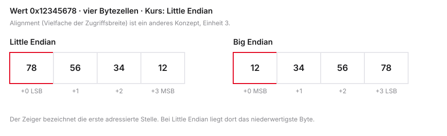

- Beispiel `0xDEADBEEF` ab Adresse `0x00`:

| Adresse | Byte |
|---------|------|
| `0x00` | `EF` (LSB) |
| `0x01` | `BE` |
| `0x02` | `AD` |
| `0x03` | `DE` (MSB) |

- Ein Zeiger auf das Wort zeigt auf das LSB.

::: notes
Little Endian ist die Festlegung dieser Kurs- und Simulatorumgebung, keine universelle RISC-V-Pflicht. Alignment fragt, ob die Adresse zur Zugriffsbreite passt, etwa ein Word an einer durch vier teilbaren Adresse. 0x100 modulo 4 ist 0. Die Abbildung zeigt 0x12345678. Die Tabelle mit 0xDEADBEEF ist ein zweites Beispiel: Little Endian EF, BE, AD, DE. Ein Zeiger bezeichnet die Startadresse. Nur bei diesem little-endian Mehrbyteobjekt liegt dort das niederwertigste Byte.

Kontrollfrage: Zeigt jeder Zeiger auf das niederwertigste Byte? Nur in dieser Little-Endian-Lesart eines Mehrbyteobjekts. Mit diesen Regeln lässt sich die logische Verarbeitung erklären.
:::

# 6. Kombinatorische Logik


::: notes
Bisher ging es um Darstellungen. Nun berechnen Schaltungen neue Bitwerte. Kombinatorisch bedeutet: ohne bewusst gespeicherten Zustand, nicht ohne physikalische Laufzeit. Nach der Stabilisierung gilt der Ausgang als Funktion der Eingänge.

Kontrollfrage: Ist eine kombinatorische Schaltung zeitlos? Nein. Der Überblick benennt die Bausteine.
:::
## Kombinatorische Logik — Überblick

- Kein Gedächtnis: Ausgang nur von aktuellen Eingängen
- Fundament für ALU und Routing (MUX)

```{mermaid}
%%| fig-width: 3.5
%%{init: {'theme': 'base', 'themeVariables': {'background': '#FFFFFF', 'primaryColor': '#FFFFFF', 'primaryBorderColor': '#E5E5EA', 'primaryTextColor': '#1D1D1F', 'lineColor': '#86868B', 'secondaryColor': '#F5F5F7', 'tertiaryColor': '#FFFFFF', 'mainBkg': '#FFFFFF', 'nodeBorder': '#E5E5EA', 'clusterBkg': '#F5F5F7', 'clusterBorder': '#E5E5EA', 'titleColor': '#1D1D1F', 'edgeLabelBackground': '#FFFFFF'}}}%%
graph LR
  A[A] --> C[Logik] --> Y[Y]
  B[B] --> C
  style C fill:#FFFFFF,stroke:#E2001A,stroke-width:2px !important
  style A fill:#FFFFFF,stroke:#E5E5EA,stroke-width:1.5px
  style B fill:#FFFFFF,stroke:#E5E5EA,stroke-width:1.5px
  style Y fill:#FFFFFF,stroke:#E5E5EA,stroke-width:1.5px
```

::: notes
Ein MUX, Multiplexer, wählt eine Datenquelle. Routing meint diese Auswahl, nicht einen Netzwerkrouter. Keine Zeitachse bedeutet: nach der Stabilisierung hängt Y nur von den aktuellen Eingängen ab. Änderungen brauchen trotzdem Laufzeit. Ein AND mit Eingängen 1 und 0 liefert nach dieser Laufzeit 0. Vorher ist ein Zwischenwert möglich.

Kontrollfrage: Ist der AND-Ausgang im selben Moment 0, in dem ein Eingang fällt? Nicht physikalisch. Der Vergleich grenzt Verarbeitung von Speicherung ab.
:::

## Kombinatorik vs. Sequenzielle Logik

:::: {.columns}
::: {.column width="46%"}
- Kombinatorisch: Ausgang nur von aktuellen Eingängen; gedächtnislos
- Beispiele: Gatter, Multiplexer, Addierer, ALU
- Sequenziell: Ausgang hängt auch vom vorherigen Zustand ab
- Taktung: Flip-Flops/Register speichern Zustände
:::
::: {.column width="54%"}
| Eigenschaft | Kombinatorisch | Sequenziell |
|-------------|----------------|-------------|
| Gedächtnis | Nein | Ja |
| Takt-Abhängigkeit | Nein | Ja (meist) |
| Primärer Zweck | Rechnen / Routen | Speichern (Zustand) |
:::
::::

::: notes
Kombinatorisch: der stabile Ausgang folgt nur den aktuellen Eingängen. Sequenziell: der Ausgang hängt von einem gespeicherten Zustand ab. Sequenziell ist nicht dasselbe wie global getaktet. Unser Flip-Flop-Modell ist taktsynchron. Gatter rechnen auch zwischen den Flanken. Ein Latch ist pegelsensitiv und hier nur die Vorstufe zum Flip-Flop.

Kontrollfrage: Rechnet ein Gatter nur bei der Taktflanke? Nein. Grundgatter liefern die Funktionen für MUX und Addierer.
:::

## Refresher: Die grundlegenden Logikgatter

- Logikgatter = elementare Bausteine der Hardware-Abstraktion
- AND · OR · XOR · NOT — IEC-60617-Symbole
- Ab jetzt: Gatter als Black Boxes mit bekanntem Verhalten

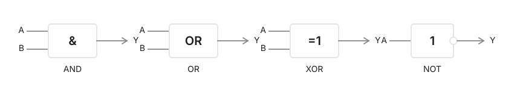

::: notes
AND ist Und, OR ist Oder, XOR ist exklusives Oder, NOT ist Negation. XOR ist bei genau einem von zwei Eingängen eins; bei zwei Einsen ist es null. IEC ist die International Electrotechnical Commission. Ein rechteckiges Symbol in der Abbildung ist unsere Lehrzeichnung. Die Konformität zu IEC 60617 folgt nicht allein aus der Rechteckform; Negationskreise müssen am konkreten Symbol geprüft werden. MOSFET, der Metal-Oxide-Semiconductor Field-Effect Transistor, bleibt unter dieser Gatterebene. Später gilt die Funktion je Bit eines Busses.

Kontrollfrage: Ist XOR bei zwei Einsen eins? Nein, es ist null. Ein MUX verwendet diese Funktionen zur Auswahl.
:::

## Das „Weichen“-Problem im Datenpfad

- Datenströme fließen über Busse
- Oft muss gewählt werden: z. B. Konstante oder Registerwert an die ALU?
- Gesucht: elektronisch schaltbare „Eisenbahnweiche“
- Steuerung über ein separates Steuersignal

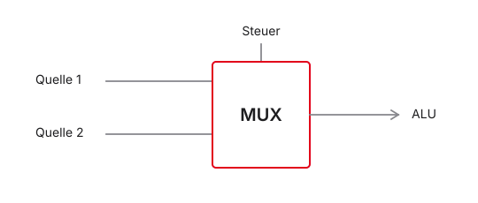

::: notes
Ein Datenbus bündelt Leitungen. Ein Immediate ist eine im Befehl codierte Konstante, nicht das ganze Instruktionswort. Das Register File liefert einen Registerwert. Die ALU ist das Ziel der Auswahl, nicht der Takt. Lehrquellen: Registerwert 7 und Konstante 5. S, das Select-Signal, wählt eine Quelle. Es ist selbst keine dritte Datenquelle und kein Taktsignal.

Kontrollfrage: Liegt die Konstante 5 als eigenes Datenwort im RAM, nur weil sie gewählt wird? Nein, sie kann aus dem Befehl aufbereitet sein. Das MUX-Symbol fasst die Auswahl zusammen.
:::

## Der Multiplexer (MUX)

- Lösung für das Weichen-Problem
- Mehrere Dateneingänge (z. B. $A$, $B$), ein Ausgang $Y$
- Select-Signal $S$ bestimmt den durchgeschalteten Eingang
- Symbol: Rechteck (IEC 60617) mit Select-Eingang
- Häufigster Routing-Baustein in der Architektur

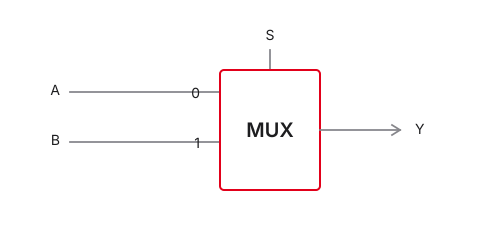

::: notes
Ein 2:1-MUX hat Eingänge A und B, Ausgang Y und Select S. In unserem Modell gilt S gleich 0 ergibt Y gleich A, S gleich 1 ergibt Y gleich B, jeweils nach Stabilisierung. Beispiel: A ist 0 und B ist 1. Dann ist Y bei S gleich 0 gleich 0 und bei S gleich 1 gleich 1. Die Control Unit, das Steuerwerk, wird später S setzen. Der MUX hat keinen CLK-Eingang und speichert nicht.

Kontrollfrage: Welcher Ausgang entsteht bei S gleich 0? Y gleich A. Eine Wahrheitstabelle macht das formal prüfbar.
:::

## Die Logik des 2:1-Multiplexers

- Wahrheitstabelle beschreibt das Verhalten
- Boole'sche Gleichung: $Y = (\overline{S} \land A) \lor (S \land B)$
- $S = 0$: Term mit $B$ wird 0 → $Y = A$
- $S = 1$: Term mit $A$ wird 0 → $Y = B$

| Select ($S$) | Eingang $A$ | Eingang $B$ | Ausgang $Y$ |
|:------------:|:-----------:|:-----------:|:-----------:|
| 0 | 0 | X | 0 |
| 0 | 1 | X | 1 |
| 1 | X | 0 | 0 |
| 1 | X | 1 | 1 |

::: notes
Die Gleichung lautet Y gleich nicht S und A oder S und B. Der Überstrich ist die Negation. AND und OR sind Und und Oder. X in einer verkürzten Tabelle ist ein Don't-Care-Platzhalter, kein elektrisch undefinierter Draht. Bei S gleich 0 wird der erste Term A und der zweite 0, also Y gleich A. Bei S gleich 1 wird Y gleich B. Die ungewählte Leitung darf real weiter anliegen. Alle acht Kombinationen stehen im Arbeitsblatt als Selbstkontrolle.

Kontrollfrage: Was bedeutet X in der verkürzten Tabelle? Einen zusammengefassten, hier nicht unterschiedenen Fall. Die Gleichung lässt sich mit Gattern bauen.
:::

## Der Multiplexer in reiner Hardware

- Umsetzung mit NOT, AND und OR; die stabile Auswahl folgt der Gleichung
- NOT für $\overline{S}$
- Zwei AND-Gatter sperren bzw. freigeben $A$ und $B$
- OR führt die freigegebenen Pfade zusammen

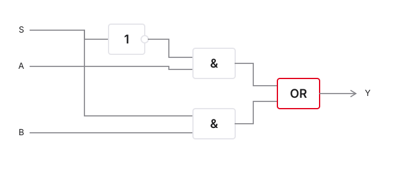

::: notes
S geht direkt in ein AND und invertiert in das andere. Die beiden UND-Terme treffen sich im ODER. Lehrwerte: A gleich 1, B gleich 0. Bei S gleich 0 ist Y gleich 1. Bei S gleich 1 ist Y gleich 0. Im stabilen Idealmodell ist nur ein Term aktiv. Beim Umschalten können Verzögerungen einen Zwischenwert erzeugen. Glitchfreiheit ist nicht garantiert.

Kontrollfrage: Ist während des Umschaltens jeder Zwischenwert ausgeschlossen? Nein. Software kann dieselbe Auswahl beschreiben, ohne denselben Ablauf zu haben.
:::

## Die Brücke zur Software: MUX = IF/ELSE

:::: {.columns}
::: {.column width="46%"}
- Software: `if`/`else` als Kontrollfluss
- Hardware: kein sequenzieller Sprung — alles existiert gleichzeitig
- MUX filtert das unerwünschte Ergebnis weg
- Ternärer Operator `? :` ≈ Software-MUX
:::
::: {.column width="54%"}
```c
// MUX als ternärer Operator:
int Y = (S == 1) ? B : A;

// Alternativ:
if (S == 1) {
    Y = B;
} else {
    Y = A;
}
```
:::
::::

::: notes
Der C-Ausdruck y gleich S gleich 1 ? B : A beschreibt für ein boolesches S dieselbe Ergebniswahl. Er beweist nicht, dass der Compiler einen physischen MUX oder einen Sprung einbaut. S gleich 1 ist enger als jede Nichtnull-Bedingung. C wertet beim bedingten Operator nur den gewählten Operanden aus. An den Hardwareeingängen können A und B gleichzeitig anliegen. Die beiden Beschreibungen sind Analogien, keine identischen Abläufe.

Kontrollfrage: Liegt an einem Hardware-MUX nur der gewählte Eingang elektrisch an? Nein, beide können anliegen. Dieselbe Auswahl gilt für alle Bits eines Wortes.
:::

## Vom 1-Bit- zum 32-Bit-Bus-Multiplexer

- RISC-V: komplette 32-Bit-Wörter schalten
- 32-Bit-MUX = 32 parallele 1-Bit-MUX
- Ein gemeinsames Select-Signal $S$ für alle Slices
- In Diagrammen: Bus mit Querstrich und Breite (`/32`)

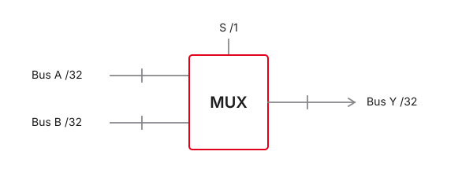

::: notes
Ein Bus-MUX besteht aus 32 Ein-Bit-MUX mit demselben S. Der Schrägstrich 32 meint 32 Datenleitungen, nicht 32 Takte. Bei S gleich 0 kommt das Wort A, bei S gleich 1 das Wort B. Synchron umklappen meint hier dasselbe Steuersignal, keine Taktflanke. Beispiel: A ist 0x00000005, B ist 0x0000000A. S gleich 0 liefert 5, S gleich 1 liefert 10. Kleine Laufzeitunterschiede zwischen den Bits bleiben möglich.

Kontrollfrage: Schaltet der Bus-MUX mit der Clock? Nein. Aus gewählten Bits sollen nun Rechenergebnisse entstehen.
:::

# 7. Addition in Hardware


::: notes
Der MUX hat Daten gewählt. Ein Addierer berechnet daraus neue Werte. Zuerst gelten die Stellenregeln eines Bits, danach die Kaskade. Summe ist das Stellenbit, Carry der Übertrag zur nächsten Stelle.

Kontrollfrage: Kann die zweite Stelle rechnen, bevor ihr Carry festliegt? Im Ripple-Modell nein. Der Überblick legt die Bausteine fest.
:::
## Addition in Hardware — Überblick

- Vom Routing zur mathematischen Verarbeitung
- Mechanische Regeln der binären Addition
- Halbaddierer als Grundbaustein
- Kaskadierung für große Wortbreiten

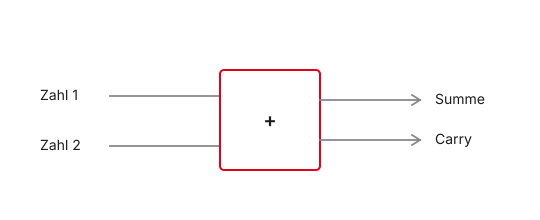

::: notes
Ein Volladdierer braucht den Carry der Nachbarstelle, Cin. Cout ist der ausgehende Übertrag. Eine Vier-Bit-Zeichnung ist kein 32-Bit-Addierer, sondern ein Ausschnitt oder ein kleines Beispiel. Die Breite steht an den Leitungen. Kaskadieren heißt, Cout der Stelle i wird Cin der Stelle i plus 1.

Kontrollfrage: Reicht für Stelle 3 der eigene Wert von A und B? Nein, der eingehende Carry fehlt dann. Die Binärregeln erklären die Gattergleichungen.
:::

## Binäre Addition (mentales Modell)

:::: {.columns}
::: {.column width="50%"}
| $A$ | $B$ | Summe | Carry |
|:---:|:---:|:-----:|:-----:|
| 0 | 0 | 0 | 0 |
| 0 | 1 | 1 | 0 |
| 1 | 0 | 1 | 0 |
| 1 | 1 | 0 | 1 |

- Summe $\leftrightarrow$ XOR · Carry $\leftrightarrow$ AND
:::
::: {.column width="50%"}
```text
  1011  (11)
+ 0011  ( 3)
-------
  1110  (14)
```
:::
::::

::: notes
1011 plus 0011, also 11 plus 3, von rechts: Bit 0 ist 1 plus 1, Summe 0, Carry 1. Bit 1 ist 1 plus 1 plus 1, Summe 1, Carry 1. Bit 2 ist 0 plus 0 plus 1, Summe 1, Carry 0. Bit 3 ist 1 plus 0 plus 0, Summe 1. Ergebnis 1110, unsigned 14. Die Zweieingangstabelle gilt nur bei Cin gleich 0. Mit Carry-In ist die Summe eine Dreieingangsparität, XOR allein reicht nicht.

Kontrollfrage: Welcher Wert entsteht? 14 unsigned. Der Halbaddierer setzt genau den Fall ohne Cin um.
:::

## Der Halbaddierer (Half-Adder)

- Nur zwei Gatter: XOR und AND
- Eingänge: $A$, $B$
- Ausgänge: Summe $S$, Carry Out $C_{out}$
- $S = A \oplus B$,\quad $C_{out} = A \land B$
- Problem: kein Carry-In von einer vorherigen Stelle

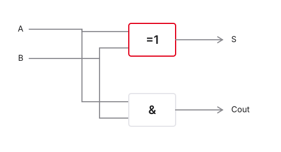

::: notes
HA bedeutet Half-Adder, Halbaddierer. S ist A XOR B, Cout ist A AND B. Die vier Zeilen: 00 ergibt Summe 0 Carry 0; 01 und 10 ergeben Summe 1 Carry 0; 11 ergibt Summe 0 Carry 1. Halb meint fehlenden Cin, nicht die halbe Breite. An der niedrigsten Stelle reicht er nur bei Startcarry 0. Eine Subtraktion mit Startcarry 1 braucht dort einen Volladdierer. Die Abbildung ordnet XOR der Summe und AND dem Carry zu.

Kontrollfrage: Was liefert A gleich B gleich 1? Summe 0, Carry 1. Der Volladdierer nimmt den Übertrag der vorigen Stelle hinzu.
:::

## Der Volladdierer (Full-Adder)

- Drei Eingänge: $A$, $B$, $C_{in}$
- Ausgänge: Summe $S$, $C_{out}$
- Intern: typisch zwei Halbaddierer + OR
- Standard-Rechenzelle in jedem Prozessor

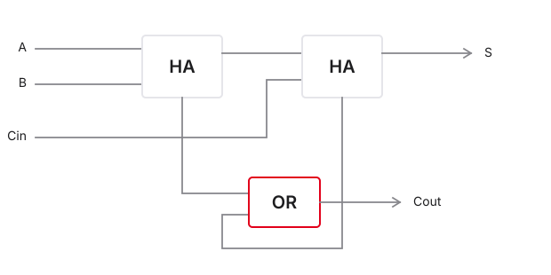

::: notes
FA bedeutet Full-Adder. S ist A XOR B XOR Cin. Cout ist A AND B ODER Cin AND (A XOR B). Alle acht Zeilen erfüllen A plus B plus Cin gleich S plus 2 mal Cout. Bei A gleich B gleich Cin gleich 1 entstehen S gleich 1 und Cout gleich 1, denn 3 gleich 1 plus 2. Zwei Halbaddierer und ein ODER der Carryanteile sind eine mögliche Umsetzung, kein Naturgesetz jedes Prozessors. Es ist der Baustein unseres Addierermodells.

Kontrollfrage: Welches Paar entsteht bei drei Einsen? S gleich 1, Cout gleich 1. Mehrere Zellen bilden den Mehrbitaddierer.
:::

## Kaskadierung: Ripple-Carry-Adder (RCA)

- 32 Volladdierer · Carry von Bit $i$ nach $i+1$

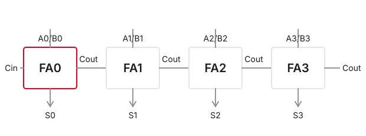

::: notes
RCA bedeutet Ripple-Carry-Adder. Bitindex i läuft von der niedrigen Stelle nach oben. C0 ist der erste Carry-Eingang. Die Abbildung zeigt vier Zellen als Ausschnitt; eine 32-Bit-Kette setzt dasselbe Prinzip fort. Beispiel 0111 plus 0001 mit C0 gleich 0: jede der unteren drei Stellen erzeugt Summe 0 und Carry 1, die höchste Stelle ergibt Summe 1 und Carry 0. Ergebnis 1000. Jede Zelle hat ein Summebit. Der Carry fließt zur nächsthöheren Stelle.

Kontrollfrage: Welches Bit ist S0 in diesem Beispiel? 0. Die Carryabhängigkeit kann einen langen Pfad ergeben.
:::

## Das Problem der Laufzeit (Ripple Delay)

- Signale brauchen Gatterlaufzeiten
- FA 31 wartet auf Carry von FA 30 → … → FA 0
- Carry „plätschert“ (*ripple*) durch alle Stufen
- Längster kritischer Pfad begrenzt die Taktfrequenz
- Lösung in der Praxis: den Übertrag **vorausberechnen**

::: notes
Ripple Delay ist die Laufzeit entlang der Carrykette. Der kritische Pfad ist der längste für das gewählte Timing relevante Pfad, nicht jeder Eingabefall. Ein Register-zu-Register-Takt muss zusätzlich die Clock-to-Q-Zeit tCQ und die Setup-Zeit aufnehmen. Eine Pfeilfolge ist keine Messung. GHz- oder Gatterzeiten ohne Datenblatt bleiben weg.

Kontrollfrage: Dauert jede Addition die maximale Carrykette? Nein, nur der sensitierte Fall kann sie auslösen. Carrynetzwerke können die Abhängigkeit anders organisieren.
:::

## Carry-Lookahead als schnellere Addiererstruktur

- Idee: Carry nicht durchreichen, sondern **vorhersagen**
- Pro Bit zwei Hilfssignale (nur aus $A_i$, $B_i$ — ohne Warten):
  - Generate: $G_i = A_i \land B_i$ (erzeugt Carry unabhängig von $C_i$)
  - Propagate: $P_i = A_i \oplus B_i$ (reicht $C_i$ weiter)
- Carry-Formel: $C_{i+1} = G_i \lor (P_i \land C_i)$
- Alle $G_i$, $P_i$ parallel → Carry-Netzwerk berechnet $C_1 \ldots C_{32}$ in wenigen Gatterstufen
- Preis: mehr Hardware; Speedup oft von $O(n)$ auf $O(\log n)$

::: notes
CLA bedeutet Carry-Lookahead-Adder, eine andere Addiererimplementierung, nicht der einzig echte Addierer. G, Generate, ist A AND B. P, Propagate, ist A XOR B. Der nächste Carry ist G ODER P AND Cin. Für zwei Bit lässt sich C2 aus C0, G0, P0, G1 und P1 ausrollen. O von log n beschreibt geeignete hierarchische Netze unter einem Modell, keine Messgarantie jedes CLA. Fan-in begrenzt die ideale Tiefe. Diese Folie ist Vertiefung; die Grundaddition bleibt der Volladdierer.

Kontrollfrage: Schätzt der Lookahead den Carry? Nein, er berechnet ihn boolesch. Die ALU kombiniert Addition mit weiteren Operationen.
:::

# 8. Die Arithmetic Logic Unit (ALU)


::: notes
ALU bedeutet Arithmetic Logic Unit. Die bisherigen MUX- und Addiererblöcke können ein Rechenwerk mit mehreren Funktionen bilden. Welche Funktion aktiv ist, bestimmt ein modellabhängiges Steuersignal, nicht schon der Name RISC-V.

Kontrollfrage: Ist jede ALU ein einzelner Volladdierer? Nein. Der Überblick benennt Operationen und Steuersignale.
:::
## Die ALU — Überblick

- Mathematischer Motor jedes Prozessors
- Arithmetik: Add, Sub
- Logik: And, Or, Xor, …
- Vereint Addierer und Routing (MUX)
- Reagiert auf Control Signals aus der Instruktion

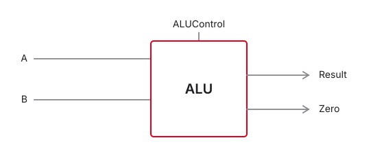

::: notes
Add und Sub sind Addition und Subtraktion, AND, OR und XOR die bitweisen Funktionen. Control Signals sind die Steuersignale. Zero, Z, ist ein aktueller Nullerkennungsdraht, kein RISC-V-Flagregister. Lehrwerte A gleich 5 und B gleich 3: Addition liefert 8, Subtraktion 2. Das Steuerwerk übersetzt Instruktionsinformation in ALUControl. Die Instruktionsbits sind nicht automatisch diese zwei Steuerbits.

Kontrollfrage: Ist Z ein Register, das die nächste Instruktion vorfindet? In RV32I nicht als Condition Code. Die Auswahl kann ein MUX zwischen Pfaden sein.
:::

## Ein Taschenrechner ohne Tasten

- Keine „Plus-Taste“ — Auswahl über Steuersignale
- Trick: intern oft alle Operationen parallel
- Ergebnis fließt durch Addierer, AND, OR, …
- MUX am Ende wählt das gewünschte Ergebnis
- Select kommt von der Control Unit

::: notes
Das Bild mit parallelen Rechenpfaden ist ein Lehrmodell. Reale ALUs können Pfade abschalten oder teilen. Eine Aussage über Siliziumeffizienz bleibt qualitativ. Die Control Unit wählt am Ausgangsmultiplexer eines der Kandidatenergebnisse. Dieselben Eingänge 5 und 3 liefern je nach Wahl 8, 2 oder ein bitweises Muster. Nicht jeder Pfad muss dafür gleichzeitig ein zweites, anderes Ergebnis schreiben.

Kontrollfrage: Rechnen in diesem Bild alle Pfade mit verschiedenen Eingaben? Nein, mit derselben Belegung. Eine Bitzelle macht die Struktur übersichtlich.
:::

## Struktur einer 1-Bit-ALU

- Parallel: AND · OR · FA → MUX → $Y$ (ALUControl)

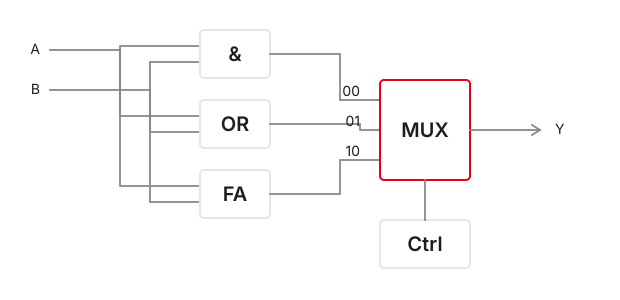

::: notes
Die 1-Bit-Zelle enthält einen Volladdierer, Logikpfade und einen MUX auf Y. Cin und Cout verbinden die Stellen. Die Codierung 00 AND, 01 OR, 10 Addierpfad und 11 Reserve ist ein Lehrmodell, keine ISA. XOR kann die Reserve belegen; sonst bleibt 11 unbenutzt. Subtraktion braucht zusätzlich die Invertierung von B und C0 gleich 1. Diese Codes gelten in allen folgenden ALU-Bildern dieser Einheit.

Kontrollfrage: Ist 10 der Opcode von add? Nein, es ist unser Steuerwert. Ein gemeinsamer Addierer kann subtrahieren.
:::

## Subtraktion elegant integrieren

- $A - B = A + \overline{B} + 1$ · MUX vor $B$, $C_{in}=1$

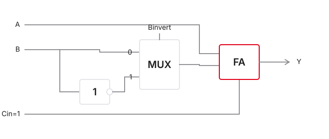

::: notes
A minus B ist bei fester Breite A plus NOT B plus 1. Nur der erste Carry-Eingang C0 wird auf eins gesetzt. Höhere Stellen erhalten den weitergereichten Carry. Vier Bit: 7 ist 0111, 3 ist 0011, NOT B ist 1100. Mit C0 gleich 1 entsteht 0100 und ein herauslaufender Carry. Die unteren vier Bits sind 4. Binvert wählt im MUX das invertierte B. Der hinauslaufende Carry ist nicht pauschal ein signed Overflow. Seine Bedeutung als Borrow hängt von der Konvention ab.

Kontrollfrage: Setzen wir an jeder Stelle Cin gleich 1? Nein, nur an der ersten. Nullerkennung wertet das Ergebnis zusätzlich aus.
:::

## Das Zero-Signal (Null-Erkennung)

- $Z$ ist ein kombinatorischer Ausgang unseres ALU-Lehrmodells
- $Z = 1$, wenn alle Ergebnisbits 0 sind: NOR über diese Bits
- RV32I speichert dafür kein Condition-Code-Register
- BEQ und BNE vergleichen Register; ein Subtraktionspfad ist nur eine mögliche Umsetzung

::: notes
Z, Zero, ist die kombinatorische Nullerkennung. Alle Ergebnisbits werden mit ODER verknüpft und danach invertiert. Bei A gleich B gleich 5 ist die Differenz null und Z wird eins. Bei A gleich 5 und B gleich 3 entsteht 2, also mindestens ein gesetztes Bit, und Z ist null. Das Signal folgt nach der Laufzeit des Netzes und muss nicht gespeichert werden.

RV32I hat für diese Integeroperationen kein Condition-Code-Register. BEQ und BNE, Branch if Equal und Branch if Not Equal, vergleichen die genannten Register. Eine Schaltung darf den Vergleich intern subtrahieren. Die Software sieht den Registervergleich. Die Syntax folgt in Einheit 3.

Kontrollfrage: Muss vor BEQ ein sub stehen? Nein. Die nächste Folie skaliert die Zellen auf 32 Bit.
:::

## Die 32-Bit RISC-V ALU

- 32 Slices · gemeinsame ALUControl · Carry wie RCA

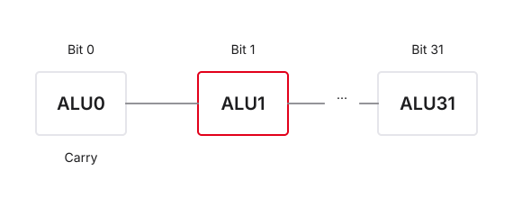

::: notes
Die Kaskade ist eine 32-Bit-Lehrimplementierung für RV32I, nicht der vorgeschriebene Aufbau jeder RISC-V-ALU. Alle Stellen teilen ALUControl. 32 Ergebnisbits entstehen. Der Carry verbindet die Addierpfade. Schiebeoperationen brauchen andere Verbindungen als eine reine RCA-Kette; sie sind hier noch nicht diese Kaskade. Beispiel: die Subtraktion 5 minus 3 schreibt in die unteren Bits 0x00000002, die oberen Bits bleiben 0.

Kontrollfrage: Kann diese Kette allein einen variablen Shift? Nicht als reine Carry-Kette. Das Symbol verbirgt die Details hinter einer Schnittstelle.
:::

## Das ALU-Schaltsymbol

- Interne Gatter final abstrahiert (Black Box)
- Klassisches Symbol: „hosenförmiges“ V / Trapez
- Oben: Operanden $A$, $B$ (32 Bit)
- Unten: Ergebnis (32 Bit)
- Seitlich: ALUControl und Flags (z. B. Zero)

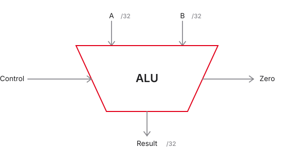

::: notes
Das Symbol zeigt zwei 32-Bit-Operanden, ein 32-Bit-Ergebnis, ALUControl und das interne Z. Trapez oder V-Form beweisen allein keine Norm. Zur Schnittstelle gehören die gewählte Operation und die gültige Verzögerung. Z ist kein automatisch sichtbares Architekturflag. Ab jetzt nutzen wir das Symbol, wenn die Innenschaltung nicht gefragt ist.

Kontrollfrage: Verschwindet die Laufzeit durch das Symbol? Nein. Für mehrschrittige Arbeit müssen Ergebnisse gespeichert werden.
:::

# 9. Die Notwendigkeit der Zeit


::: notes
Die ALU hat keinen eigenen Zustand. Ein Ergebnis muss gehalten werden, wenn die Eingänge sich ändern. Zeit erscheint als Laufzeit und als erlaubter Übernahmezeitpunkt. Die aktive Flanke ist die Stelle, an der unser Modell den Zustand aktualisiert.

Kontrollfrage: Speichert die ALU allein den vorigen Wert? Nein. Der Überblick trennt Verarbeitung und Übernahme.
:::
## Die Notwendigkeit der Zeit — Überblick

- Die vierte Dimension der Computerarchitektur
- Warum kombinatorische Logik allein keinen Computer ergibt
- Zeitliche Synchronisation in Hardware
- Fließende vs. diskrete Daten
- Vorbereitung auf sequenzielle Schaltungstechnik

```{mermaid}
%%| fig-width: 3.5
%%{init: {'theme': 'base', 'themeVariables': {'background': '#FFFFFF', 'primaryColor': '#FFFFFF', 'primaryBorderColor': '#E5E5EA', 'primaryTextColor': '#1D1D1F', 'lineColor': '#86868B', 'secondaryColor': '#F5F5F7', 'tertiaryColor': '#FFFFFF', 'mainBkg': '#FFFFFF', 'nodeBorder': '#E5E5EA', 'clusterBkg': '#F5F5F7', 'clusterBorder': '#E5E5EA', 'titleColor': '#1D1D1F', 'edgeLabelBackground': '#FFFFFF'}}}%%
graph LR
  A[Kombinatorik] -->|nach Laufzeit| B[Ausgang folgt den Eingängen]
  C[Registermodell] -->|aktive Flanke| D[Q hält bis zur nächsten Übernahme]
  style C fill:#FFFFFF,stroke:#E2001A,stroke-width:2px !important
  style A fill:#FFFFFF,stroke:#E5E5EA,stroke-width:1.5px
```

::: notes
CLK bedeutet Clock, das Taktsignal. Kombinatorische Ausgänge folgen nach Laufzeit. Q eines Registers hält einen Zustand bis zur erlaubten Aktualisierung. Die Kästchenkette ist kein Zeitdiagramm. Physikalisch verläuft die Spannung kontinuierlich; logisch zählen wir Zustände und Ereignisse wie die aktive Flanke.

Kontrollfrage: Warten Daten im wörtlichen Sinn auf den Takt? Nur die Übernahme in den Speicherbaustein ist an die Flanke gebunden. Eine ALU allein bewahrt das vorige Ergebnis nicht.
:::

## Das Problem der reinen Kombinatorik

- Der Ausgang folgt den Eingängen nach einer endlichen Laufzeit
- Es gibt keinen gespeicherten Zustand, der ein Ergebnis festhält
- Verschiedene Pfadlaufzeiten können einen Glitch erzeugen
- Für einen programmierbaren Ablauf brauchen wir gespeicherten Zustand

::: notes
Sofort heißt hier nach endlicher Laufzeit, nicht im selben idealen Zeitpunkt. Ein Glitch ist ein Zwischenwert, weil Pfade verschieden schnell sind. Für C gleich A plus B und danach D gleich C plus 5 muss der Zwischenwert entweder stabil anliegen oder gespeichert werden. Nicht jede Reihenschaltung braucht dafür ein Register. Ein programmierbarer Ablauf braucht jedoch gespeicherten Zustand, sonst gibt es keinen nächsten Schritt.

Kontrollfrage: Muss zwischen zwei Gattern immer ein Register stehen? Nein. Ein Register kann den Wert über spätere Eingangsänderungen erhalten.
:::

## Die Lösung: Zustandsspeicherung

- Im Kursmodell übernimmt ein Register seinen neuen Wert an der gemeinsamen Sollflanke
- Q bleibt danach erhalten, auch wenn sich der ALU-Eingang ändert
- Reale Verzögerungen bleiben; es gibt keinen gemeinsamen Nanosekundenpunkt ohne Versatz

```{mermaid}
%%| fig-width: 3.5
%%{init: {'theme': 'base', 'themeVariables': {'background': '#FFFFFF', 'primaryColor': '#FFFFFF', 'primaryBorderColor': '#E5E5EA', 'primaryTextColor': '#1D1D1F', 'lineColor': '#86868B', 'secondaryColor': '#F5F5F7', 'tertiaryColor': '#FFFFFF', 'mainBkg': '#FFFFFF', 'nodeBorder': '#E5E5EA', 'clusterBkg': '#F5F5F7', 'clusterBorder': '#E5E5EA', 'titleColor': '#1D1D1F', 'edgeLabelBackground': '#FFFFFF'}}}%%
graph LR
  A[ALU-Ausgang] -->|fließendes Datum| B[Schleuse / Speicher]
  B -->|gefrorener Zustand| C[Neue Berechnung]
  S[Synchronisation] -.-> B
  style B fill:#FFFFFF,stroke:#E2001A,stroke-width:2px !important
```

::: notes
Die globale Synchronisation gilt für das Kursmodell mit einer Taktdomäne. Ein Register speichert einen logischen Zustand; nicht jeder Speicher hält ihn nur als isolierte Ladung. Die gemeinsame Sollflanke hat reale Verzögerungen, keinen identischen Nanosekundenpunkt. Zeigt die ALU danach einen anderen Wert, bleibt Q bis zur nächsten erlaubten Übernahme erhalten. Q ist auch zwischen den Flanken sichtbar.

Kontrollfrage: Wird Q erst beim nächsten Öffnen sichtbar? Nein, es hält den bereits übernommenen Wert. CLK legt die Übernahmeereignisse fest.
:::

## Das Taktsignal (Clock / CLK)

- CLK ist das Taktsignal der betrachteten Taktdomäne
- Periode $T$, Frequenz $f = 1/T$; $1\,\text{ns}$ entspricht $1\,\text{GHz}$
- Ein Tick ist kein universeller Instruktionsschritt
- Nicht jedes Speicherelement jedes Systems hängt an diesem einen Takt

::: notes
T ist die Periodendauer, f gleich 1 geteilt durch T die Frequenz. Eine Nanosekunde entspricht einem Gigahertz. Drei Gigahertz entsprächen etwa 0,333 Nanosekunden; das ist eine Umrechnung, keine Messung unseres Modells. Ein Quarz liefert nicht pauschal direkt den Kerntakt. Ein Tick ist kein vollständiger Instruktionsschritt. Gemeint sind die Register der betrachteten Taktdomäne, nicht alle Speicherelemente jedes Systems.

Kontrollfrage: Bedeutet 1 ns immer 3 GHz? Nein, 1 ns entspricht 1 GHz. Die aktive Flanke ist genauer als ein hoher Pegel.
:::

## Flankensteuerung (Edge-Triggering)

:::: {.columns}
::: {.column width="46%"}
- Reaktion auf den Übergang, nicht auf einen dauerhaft hohen Pegel
- Steigende Flanke: $0 \rightarrow 1$; fallende Flanke: $1 \rightarrow 0$
- Unser D-FF-Lehrmodell übernimmt bei der steigenden Flanke
- Das ist keine Vorschrift der RISC-V-ISA
:::
::: {.column width="54%"}
```text
CLK:  niedriger Pegel, steigende Flanke, hoher Pegel, fallende Flanke
Q:    bleibt, übernimmt D nach tCQ, hält, hält
```
:::
::::

::: notes
Unser D-FF übernimmt bei der steigenden Flanke. Das ist die Lehrmodellannahme, keine RISC-V-ISA-Zusage. Ein hoher CLK-Pegel öffnet dieses Flip-Flop nicht dauerhaft. Ein Latch wäre pegelsensitiv und ist ein anderer Baustein. Q erscheint nach tCQ, der Clock-to-Q-Verzögerung. Zwischen den Flanken arbeitet die Kombinatorik weiter. Die ASCII-Folge aus Nullen und Einsen ersetzen wir durch diese Ereignisbeschreibung: Flanke, danach neues Q, Halten im hohen und niedrigen Pegel.

Kontrollfrage: Darf D während des hohen Pegels Q sofort ändern? Nein, nicht in diesem FF-Modell. Der Baustein braucht einen Zustand für diese Übernahme.
:::

# 10. Sequenzielle Logik


::: notes
Nicht jede sequenzielle Schaltung ist flankengesteuert. Wir führen den Baustein mit Eingängen und Zeitbedingungen ein. Zustand bedeutet: der Ausgang hängt von der Vergangenheit ab, nicht nur von den momentanen Eingängen.

Kontrollfrage: Ist jede Rückkopplung bereits ein D-FF? Nein. Der Überblick nennt Rückkopplung, Flip-Flop, Register und Zeitbedingungen.
:::
## Sequenzielle Logik — Überblick

- Entwurf elementarer Speicherzellen
- Rückkopplung zur Zustandserhaltung
- Physikalische Grenzen des Speicherns
- Vom Flip-Flop zum Register
- Setup-/Hold-Time als zeitliche Parameter

```{mermaid}
%%| fig-width: 3.5
%%{init: {'theme': 'base', 'themeVariables': {'background': '#FFFFFF', 'primaryColor': '#FFFFFF', 'primaryBorderColor': '#E5E5EA', 'primaryTextColor': '#1D1D1F', 'lineColor': '#86868B', 'secondaryColor': '#F5F5F7', 'tertiaryColor': '#FFFFFF', 'mainBkg': '#FFFFFF', 'nodeBorder': '#E5E5EA', 'clusterBkg': '#F5F5F7', 'clusterBorder': '#E5E5EA', 'titleColor': '#1D1D1F', 'edgeLabelBackground': '#FFFFFF'}}}%%
graph LR
  A[Eingang] --> B[Sequenzielle Logik]
  B -->|Gedächtnis-Schleife| B
  CLK[Takt] -.-> B
  B --> C[Ausgang]
  style B fill:#FFFFFF,stroke:#E2001A,stroke-width:2px !important
```

::: notes
D-FF bedeutet D-Flip-Flop. Setup und Hold sind die Zeiten, in denen D um die Flanke stabil bleiben muss. Rückkopplung ist ein Prinzip. Eine beliebige Gatterschleife ist noch kein steuerbarer Speicher. Eine zu hohe Frequenz kann das Setup-Budget verletzen. Hold-Probleme entstehen auch bei kurzen Pfaden und Taktversatz, nicht nur durch zu schnelles Takten. Die Formeln bleiben optional.

Kontrollfrage: Beseitigt langsameres Takten jedes Hold-Problem? Nein. Ein konkreter Speicher muss Setzen, Rücksetzen und Halten unterscheiden.
:::

## Das Rückkopplungs-Konzept

- Eine OR-Schleife kann eine Eins festhalten, sie aber nicht gezielt löschen
- Steuerbares Beispiel: zwei gekreuzte NOR-Gatter, aktives High
- $S=1, R=0$ setzt; $S=0, R=1$ setzt zurück; $S=R=0$ hält
- $S=R=1$ ist in dieser NOR-Schaltung verboten
- Ein SR-Latch ist noch kein flankengesteuertes D-Flip-Flop

| $S$ | $R$ | Wirkung |
|:---:|:---:|:--------|
| 0 | 0 | halten |
| 1 | 0 | setzen, $Q=1$ |
| 0 | 1 | rücksetzen, $Q=0$ |
| 1 | 1 | verboten |

::: notes
Die OR-Schleife hält eine einmal gesetzte Eins, kann sie aber nicht löschen. Sie ist keine allgemeine Basis aller Speicherzellen. Das steuerbare Beispiel sind zwei gekreuzte NOR-Gatter, aktives High. S gleich 1 und R gleich 0 setzt Q auf 1. S gleich 0 und R gleich 1 setzt Q auf 0. S und R gleich 0 halten. S und R gleich 1 ist verboten, weil die NOR-Schaltung dann keinen stabilen komplementären Zustand zusichert. Der Anfangswert ist nicht automatisch null. Ein SR-Latch ist pegelgesteuert und noch kein flankengesteuertes D-FF.

Kontrollfrage: Kann die OR-Schleife eine Eins wieder löschen? Nein. Das D-FF bietet die einfachere Flankenschnittstelle.
:::

## Das D-Flip-Flop (D-FF)

- Wichtigster 1-Bit-Speicher der Architektur
- D (Data): neuer Wert
- Q: aktuell gespeicherter Wert
- CLK (Dreieck): flankengesteuerter Takteingang
- Ignoriert $D$, bis die steigende Flanke an CLK eintrifft


::: notes
D ist der Dateneingang, Q der gespeicherte Ausgang, Q quer der invertierte Ausgang. CLK mit Dreieck bedeutet Flankensteuerung. Ein zusätzlicher Inversionskreis an CLK würde die aktive Flanke umkehren; unser Symbol hat diesen Kreis nicht. Positive Flanke, kombinatorisches Lesen der Registerbank und synchrones Schreiben sind Modellannahmen, keine ISA-Pflicht. Ignoriert D heißt: außerhalb der Übernahme hält Q. Um die Flanke muss D trotzdem stabil sein.

Kontrollfrage: Ändert ein Wechsel von D bei niedrigem CLK sofort Q? Nein. Ein Zeitverlauf zeigt D und Q gemeinsam.
:::

## Das Verhalten der Kamera (Metapher)

:::: {.columns}
::: {.column width="46%"}
- Motiv vor der Linse = Eingang $D$
- Foto in der Hand = Ausgang $Q$
- Auslöser = Taktflanke
- Nur im Klick-Moment: $D \rightarrow Q$
:::
::: {.column width="54%"}
| Zeit | $D$ | $Q$ | CLK | Ergebnis |
|:----:|:---:|:---:|:---:|:---------|
| 1 | 1 | 0 | 0 | $Q$ bleibt 0 |
| 2 | 1 | 0 | $\uparrow$ | $Q$ wird 1 |
| 3 | 0 | 1 | 1 | $Q$ bleibt 1 |
:::
::::

::: notes
Die Kamera ist nur der Einstieg. Die Tabelle meint: solange keine aktive Flanke kommt, bleibt Q. An der Flanke wird der stabile D-Wert übernommen, sichtbar nach tCQ. Ein Klick ist keine zeitlose Aufnahme. Q gleich 0 am Anfang ist eine gesetzte Anfangsannahme, kein universeller Einschaltzustand. Danach darf sich das Motiv ändern, ohne das gespeicherte Bild zu ändern.

Kontrollfrage: Ist der Einschaltwert immer 0? Nein, nur unsere Annahme. Setup und Hold legen das Stabilitätsfenster fest.
:::

## Physikalische Limits: Setup- und Hold-Time

- Setup: $D$ stabil *vor* der Flanke · Hold: *danach*
- Verletzung → Metastabilität · ALU muss rechtzeitig fertig sein

```{mermaid}
%%| fig-width: 3.5
%%{init: {'theme': 'base', 'themeVariables': {'background': '#FFFFFF', 'primaryColor': '#FFFFFF', 'primaryBorderColor': '#E5E5EA', 'primaryTextColor': '#1D1D1F', 'lineColor': '#86868B', 'secondaryColor': '#F5F5F7', 'tertiaryColor': '#FFFFFF', 'mainBkg': '#FFFFFF', 'nodeBorder': '#E5E5EA', 'clusterBkg': '#F5F5F7', 'clusterBorder': '#E5E5EA', 'titleColor': '#1D1D1F', 'edgeLabelBackground': '#FFFFFF'}}}%%
graph LR
  A[ALU] --> B[Setup] --> C[Flanke] --> D[Hold]
  style C fill:#FFFFFF,stroke:#E2001A,stroke-width:2px !important
  style A fill:#FFFFFF,stroke:#E5E5EA,stroke-width:1.5px
  style B fill:#FFFFFF,stroke:#E5E5EA,stroke-width:1.5px
  style D fill:#FFFFFF,stroke:#E5E5EA,stroke-width:1.5px
```

::: notes
D muss die Setup-Zeit vor der steigenden Flanke und die Hold-Zeit danach stabil bleiben. Im Zeitbild liegen diese Fenster links und rechts der Flanke. Q wechselt nach tCQ. Eine Verletzung kann einen falschen Wert oder Metastabilität erzeugen, einen vorübergehend nicht eindeutig aufgelösten Zustand. Nicht jede Verletzung ist ein sofortiger Absturz. Setup belastet der längste Datenpfad. Hold betrifft auch kurze Pfade. Ohne Taktversatz gilt als optionales Modell: die Periode ist mindestens tCQ maximal plus tPD maximal plus tSetup. Hold verlangt tCQ minimal plus tPD minimal mindestens tHold. tPD ist die kombinatorische Laufzeit. Zahlen ohne Datenblatt setzen wir nicht ein.

Kontrollfrage: Darf D direkt nach der Flanke springen? Nein, erst nach der Hold-Zeit. 32 solche Bits bilden ein Register.
:::

## Vom 1-Bit-D-FF zum 32-Bit-Register

- RV32I arbeitet mit 32-Bit-Words
- Ein D-FF speichert 1 Bit
- Lösung: 32 D-FFs parallel
- Gemeinsames CLK-Signal an alle — synchroner „Auslöser“

```{mermaid}
%%| fig-width: 3.5
%%{init: {'theme': 'base', 'themeVariables': {'background': '#FFFFFF', 'primaryColor': '#FFFFFF', 'primaryBorderColor': '#E5E5EA', 'primaryTextColor': '#1D1D1F', 'lineColor': '#86868B', 'secondaryColor': '#F5F5F7', 'tertiaryColor': '#FFFFFF', 'mainBkg': '#FFFFFF', 'nodeBorder': '#E5E5EA', 'clusterBkg': '#F5F5F7', 'clusterBorder': '#E5E5EA', 'titleColor': '#1D1D1F', 'edgeLabelBackground': '#FFFFFF'}}}%%
graph TD
  Bus[32-Bit Data In] -->|Bit 31| FF31[D-FF 31]
  Bus -->|Bit 0| FF0[D-FF 0]
  CLK[Clock] --> FF31
  CLK --> FF0
  style CLK fill:#FFFFFF,stroke:#E2001A,stroke-width:2px !important
```

::: notes
32 D-Flip-Flops mit gemeinsamem CLK bilden ein 32-Bit-Register. D von 31 bis 0 geht nach Q von 31 bis 0. RV32I nutzt solche Wortbreiten im Kursmodell. Jedes Flip-Flop hält ein Bit. Zusammen sind es 32 Bit, ein RISC-V-Word. Die Übernahme ist die gemeinsame Sollflanke; Clock-Skew, der Taktversatz, und tCQ verhindern perfekte Gleichzeitigkeit. Die Zeichnung braucht Ausgänge, nicht nur Eingänge.

Kontrollfrage: Wie viele Zustandsbits hält das Register? 32. WE entscheidet, ob die Flanke den Wert wirklich übernimmt.
:::

## Das Write-Enable-Signal (WE)

- Problem: sonst Speichern bei *jedem* Takt
- Oft soll ein Register unverändert bleiben
- WE / EN: Erlaubnis-Pin
- WE = 0: Flanke ignorieren; WE = 1: bei Flanke speichern

```c
if (RISING_EDGE(clock)) {
    if (WriteEnable == 1) {
        Register = DataIn;
    }
}
```

::: notes
WE oder EN ist die Schreibfreigabe. Der Pseudocode wenn steigende Flanke und WE dann Q gleich D sonst Q halten ist Verhalten, kein C-Programm. Anfang Q gleich 0. Ohne Flanke bleibt Q 0, auch wenn D und WE eins sind. Erste Flanke mit D gleich 1 und WE gleich 1: Q wird 1 nach tCQ. Wechselt D danach auf 0 ohne Flanke, bleibt Q 1. Zweite Flanke mit WE gleich 0 hält Q auf 1. Dritte Flanke mit D gleich 0 und WE gleich 1 übernimmt 0. Eine mögliche Umsetzung ist ein Datenmultiplexer vor dem Flip-Flop: bei WE gleich 0 wird Q wieder nach D geführt. WE gattert nicht willkürlich den Taktpin. Daten und Freigabe müssen Setup und Hold erfüllen.

Kontrollfrage: Hält WE gleich 0 den Takt an? Nein, es verhindert die Datenübernahme. Das Symbol fasst die Schnittstelle zusammen.
:::

## Das abstrahierte Register-Symbol

- Komplexität → Black Box „Register“
- Symbol: stehendes Rechteck
- Ports: Data In ($D$), Data Out ($Q$), CLK (Dreieck), WE
- Baustein für Registersatz und Program Counter

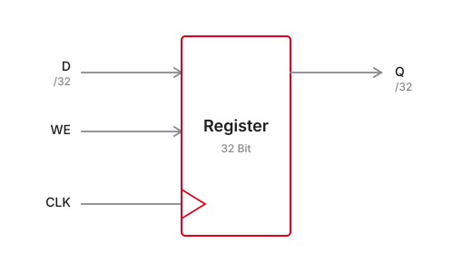

::: notes
Das Symbol zeigt D, Q, CLK und WE. Der Vertrag: bei aktiver Flanke und WE gleich 1 wird D nach Q übernommen, sonst bleibt Q. Die Zeitbedingungen bleiben gültig, auch wenn die Innenschaltung verborgen ist. Der PC, Program Counter, ist ein eigener gespeicherter Adresszustand, kein zusätzliches allgemeines Register x32.

Kontrollfrage: Ist der PC eines der Register x0 bis x31? Nein. Mehrere Register werden über Auswahlports nutzbar.
:::

# 11. Das Register File (Registersatz)


::: notes
Register File bedeutet Registerbank. Aus einem Wortzustand wird ein Satz wählbarer Operanden und Ziele. Die nächsten Folien verbinden diese Bank mit der ALU. Die Portzahl des Lehrmodells ist nicht die ISA.

Kontrollfrage: Erzeugt der Name File eine Datei? Nein. Der Überblick zeigt die Schleife zur ALU.
:::
## Das Register File — Überblick

- Extrem schnelle „Werkbank“ der ALU
- Zusammenschluss vieler Register
- Bindeglied Software-Variablen ↔ Hardware
- Multi-Porting: gleichzeitig lesen und schreiben
- RISC-V-Konvention: u. a. hartverdrahtetes $x0$

```{mermaid}
%%| fig-width: 3.5
%%{init: {'theme': 'base', 'themeVariables': {'background': '#FFFFFF', 'primaryColor': '#FFFFFF', 'primaryBorderColor': '#E5E5EA', 'primaryTextColor': '#1D1D1F', 'lineColor': '#86868B', 'secondaryColor': '#F5F5F7', 'tertiaryColor': '#FFFFFF', 'mainBkg': '#FFFFFF', 'nodeBorder': '#E5E5EA', 'clusterBkg': '#F5F5F7', 'clusterBorder': '#E5E5EA', 'titleColor': '#1D1D1F', 'edgeLabelBackground': '#FFFFFF'}}}%%
graph LR
  A[Register File] -->|Operanden| B[ALU]
  B -->|Ergebnis| A
  style A fill:#FFFFFF,stroke:#E2001A,stroke-width:2px !important
```

::: notes
Multi-Porting meint mehrere gleichzeitige Zugriffsports. x0 ist das Nullregister. Eine Softwarevariable liegt nicht fest in einem bestimmten Register. Nicht jede Instruktion liest zwei Register und schreibt eines; das gilt für den folgenden add-Fall. Zwei Leseports und ein Schreibport, 2R1W, sind unser Modell. Die Schleife ALU und Registerbank enthält einen Speicherzustand, sonst wäre das Ergebnis weg.

Kontrollfrage: Liest jede Instruktion genau zwei Register? Nein. Registerbank und Hauptspeicher haben verschiedene Aufgaben.
:::

## Was ist ein Registersatz?

- RAM: groß, aber weit weg und langsam
- Der Registerinhalt folgt nach der Laufzeit des Auswahlnetzwerks
- Kombinatorisches Lesen ist die Annahme unserer Registerbank, nicht jede physische Bank
- Register File: lokales Array direkt auf dem Die
- Adressierung per Assembler (z. B. `x5`)
- Zwischenspeicher für intensiv genutzte Variablen

::: notes
Ohne Wartezeit wäre falsch. Die Zugriffszeit ist modellabhängig und klein gegenüber einem einfachen Hauptspeicherbild, aber nicht null. Der Die ist das Halbleiterplättchen. Die Nummer x5 ist nicht der Inhalt und keine Byteadresse. Steht in x5 der Wert 7, sind fünf die Nummer und sieben die Daten. Welche C-Variable dort liegt, entscheidet der Compiler. Physische Entfernung ist nur ein Faktor der RAM-Latenz.

Kontrollfrage: Ist x5 die Adresse 5 im RAM? Nein. Die Ports wählen zwei Operanden gleichzeitig.
:::

## Architektur des Register Files

Lehrzustand `add x7, x5, x6`: $x5=7$, $x6=3$, Ziel $x7$.

- Lesen: $A1=5$, $A2=6$ liefern $RD1=7$, $RD2=3$
- Schreiben: $A3=7$, $WD3=10$, $WE3=1$, Übernahme an der positiven Flanke
- Fünf Bit wählen die Nummer; 32 Bit sind die Daten

```{mermaid}
%%| fig-width: 3.5
%%{init: {'theme': 'base', 'themeVariables': {'background': '#FFFFFF', 'primaryColor': '#FFFFFF', 'primaryBorderColor': '#E5E5EA', 'primaryTextColor': '#1D1D1F', 'lineColor': '#86868B', 'secondaryColor': '#F5F5F7', 'tertiaryColor': '#FFFFFF', 'mainBkg': '#FFFFFF', 'nodeBorder': '#E5E5EA', 'clusterBkg': '#F5F5F7', 'clusterBorder': '#E5E5EA', 'titleColor': '#1D1D1F', 'edgeLabelBackground': '#FFFFFF'}}}%%
graph LR
  A1[A1] --> RF[Register File]
  A2[A2] --> RF
  RF --> RD1[RD1]
  RF --> RD2[RD2]
  WD3[WD3] --> RF
  A3[A3] --> RF
  WE3[WE3] --> RF
  CLK[CLK] --> RF
  style RF fill:#FFFFFF,stroke:#E2001A,stroke-width:2px !important
```

::: notes
add x7, x5, x6 mit den Lehrwerten x5 gleich 7, x6 gleich 3 und x7 anfänglich 0. A1 und A2 sind fünf Bit und wählen die Quellen, RD1 und RD2 sind 32-Bit-Lesedaten. Nach der Leselaufzeit sind das 7 und 3. Die ALU addiert zu 10. A3 gleich 7, WD3 gleich 10, WE3 gleich 1. An der positiven Flanke wird x7 zu 10. x5 und x6 bleiben. Ein Durchlauf ist hier kein allgemeines Taktversprechen, sondern die Beschreibung dieses Lehrschritts. Die Grafik zeigt A1, A2, A3, RD1, RD2, WD3, WE3 und CLK.

Kontrollfrage: Ist 00111 der Datenwert 7? Nein, die Zielnummer 7. Die Leseports wählen die aktuellen Werte.
:::

## Interner Aufbau: Lesen (kombinatorisch)

- Intern: 32 Register ($x0$–$x31$)
- Jeder Leseausgang: großer 32-zu-1-MUX
- 5-Bit-Adressen $A1$/$A2$ = Select
- Der neue Wert erscheint nach der Laufzeit des Multiplexers, nicht zeitlos

```{mermaid}
%%| fig-width: 3.5
%%{init: {'theme': 'base', 'themeVariables': {'background': '#FFFFFF', 'primaryColor': '#FFFFFF', 'primaryBorderColor': '#E5E5EA', 'primaryTextColor': '#1D1D1F', 'lineColor': '#86868B', 'secondaryColor': '#F5F5F7', 'tertiaryColor': '#FFFFFF', 'mainBkg': '#FFFFFF', 'nodeBorder': '#E5E5EA', 'clusterBkg': '#F5F5F7', 'clusterBorder': '#E5E5EA', 'titleColor': '#1D1D1F', 'edgeLabelBackground': '#FFFFFF'}}}%%
graph LR
  R1[Reg x1] --> MUX["32:1 MUX"]
  R2[Reg x2] --> MUX
  R31[Reg x31] --> MUX
  A1[Adresse A1] -.->|Select| MUX
  MUX --> RD1[RD1]
  style MUX fill:#FFFFFF,stroke:#E2001A,stroke-width:2px !important
```

::: notes
Jeder Leseport ist ein 32-zu-1-Multiplexer. Fünf Bit an A1 oder A2 wählen eines von 32 Registern. x0 liefert dabei null, unabhängig vom Speicherversuch. Ein neuer Index erscheint nach der MUX-Laufzeit an RD1 oder RD2, nicht zeitlos. Kombinatorisches Lesen ist unsere Implementierung. Eine andere physische Bank darf anders arbeiten. Beide Leseports können verschiedene Nummern gleichzeitig wählen.

Kontrollfrage: Erscheint der neue Wert im selben idealen Zeitpunkt wie der Indexwechsel? Nein, nach der Laufzeit. Beim Schreiben kommen Nummer, Daten, Freigabe und Flanke zusammen.
:::

## Interner Aufbau: Schreiben (sequenziell)

- $WD3$ liegt parallel an allen 32 Registern
- Decoder: 5-Bit-$A3$ → genau ein WE-Pin aktiv
- Schreiben erst bei steigender Flanke

```text
A3 = 00111 (Nummer 7, nicht der Datenwert 7)
WD3 = 10, WE3 = 1
Nach der positiven Flanke: x7 = 10
x0 wird auch bei A3 = 0 nicht beschrieben
```

::: notes
Der Decoder bildet aus A3 und WE3 je Register ein Freigabesignal: WE der Stelle i ist WE3 und die Bedingung, dass A3 gleich i ist. Ist WE3 null, ist kein Ziel aktiv. Schreiben auf x0 wird unterdrückt. Beispiel: vor der Flanke sind A3 gleich 7 und WD3 gleich 10. Danach ist x7 gleich 10, alle anderen bleiben. Liest man im Kursmodell gleichzeitig das Register, das geschrieben wird, gilt der alte Wert bis zur Flanke; der neue Wert gilt danach an den Leseports nach deren Laufzeit. Das ist eine Modellfestlegung, keine ISA-Latenz.

Kontrollfrage: Ändert A3 gleich 0 das Register x0? Nein. Die ISA benennt diese Register unabhängig vom Schaltbild.
:::

## Die RISC-V-Register ($x0$–$x31$)

- RV32I: exakt 32 Architekturregister à 32 Bit
- Assembler: `x0` … `x31` (plus ABI-Aliase: `sp`, `ra`, …)
- 5 Bit Adresse reichen: $2^5 = 32$

| Register | Alias | Zweck |
|----------|-------|-------|
| $x0$ | `zero` | hartverdrahtete 0 |
| $x1$ | `ra` | Return Address |
| $x2$ | `sp` | Stack Pointer |
| $x10$–$x17$ | `a0`–`a7` | Argumente; einfaches Integerergebnis in `a0` |

::: notes
RV32I hat die Architekturregister x0 bis x31, jedes im Kurs 32 Bit, plus den PC als eigenen Zustand. rs1, rs2 und rd sind die Felder für Quell- und Zielnummern. ABI, Application Binary Interface, gibt Aliase: ra ist x1, die Rücksprungadresse, sp ist x2, der Stackzeiger, a0 bis a7 sind x10 bis x17. Ein Alias ist kein zusätzliches Register. Einfache Integerergebnisse stehen in a0, nicht in allen acht a-Registern. 32 Flip-Flops je Register sind eine mögliche Umsetzung, keine ISA-Pflicht.

Kontrollfrage: Ist a0 ein 33. Register neben x10? Nein. x0 hat eine besondere Wirkung.
:::

## Das Hardwired-Zero-Register ($x0$)

- Fest auf logisch 0 verdrahtet
- Schreiben wird ignoriert — Wert bleibt 0
- Spart Spezialbefehle (RISC-Philosophie)
- Beispiel: `add x6, x5, x0` kopiert $x5$ nach $x6$
- `mv` ist eine Pseudoinstruktion, oft als `addi` mit Immediate 0

```asm
add x6, x5, x0   # x5 = 42 bleibt; x6 wird 42; x0 bleibt 0
```

::: notes
Jedes Lesen von x0, Alias zero, liefert null. Ein Schreibziel x0 verändert den Wert nicht. Das ist die Semantik, keine zwingende Drahtart. add x6, x5, x0 mit x5 gleich 42 schreibt 42 nach x6. x5 bleibt 42, x0 bleibt 0. mv ist eine Pseudoinstruktion, üblicherweise addi mit Immediate 0, kein fehlender MOVE in der Assemblersprache. Ein Befehl mit Ziel x0 kann bei Speicher- oder Systemwirkung trotzdem andere Effekte haben. Für diese Kopie genügt die Nullregel.

Kontrollfrage: Welcher Wert steht nach der Kopie in x0? Null. Größere Daten brauchen adressierten Speicher.
:::

# 12. Speicherarchitektur


::: notes
Die Registerbank und der Hauptspeicher sind verschiedene Schnittstellen. Der Abschluss zeigt logische Organisation und Ressourcen. Den vollständigen Datenpfad leiten wir noch nicht her. Fetch ist das Holen einer Instruktion, Load und Store sind Datentransfers.

Kontrollfrage: Liegt das Programm in x0 bis x31? Nein. Der Überblick trennt Fetch, Datenzugriff und Busressourcen.
:::
## Speicherarchitektur — Überblick

- Big Picture: CPU und Außenwelt (RAM)
- Flaschenhals des gemeinsamen Busses
- Zwei Denkschulen: Von Neumann vs. Harvard
- Vorbereitung auf den Single-Cycle-Datenpfad in Ripes

```{mermaid}
%%| fig-width: 3.5
%%{init: {'theme': 'base', 'themeVariables': {'background': '#FFFFFF', 'primaryColor': '#FFFFFF', 'primaryBorderColor': '#E5E5EA', 'primaryTextColor': '#1D1D1F', 'lineColor': '#86868B', 'secondaryColor': '#F5F5F7', 'tertiaryColor': '#FFFFFF', 'mainBkg': '#FFFFFF', 'nodeBorder': '#E5E5EA', 'clusterBkg': '#F5F5F7', 'clusterBorder': '#E5E5EA', 'titleColor': '#1D1D1F', 'edgeLabelBackground': '#FFFFFF'}}}%%
graph LR
  A[CPU] <-->|Befehle & Daten| B[(Arbeitsspeicher)]
  style B fill:#FFFFFF,stroke:#E2001A,stroke-width:2px !important
```

::: notes
Code liegt nicht im allgemeinen Registersatz. RAM ist nur ein möglicher Programmspeicher. Ein gemeinsamer Adressraum und ein gemeinsamer Port sind zwei Entscheidungen. Die Kästchenkette ist ein ausdrücklich gewähltes Ein-Port-Bild, nicht jedes Von-Neumann-System. Fetch holt eine Instruktion, ein Datenzugriff überträgt einen Wert. Beide können um denselben Port konkurrieren, müssen es aber nicht.

Kontrollfrage: Erzwingt ein gemeinsamer Adressraum einen Buskonflikt? Nein. Der Programmspeicher liefert Instruktionen, Datenzugriffe übertragen Werte.
:::

## Wo liegen die Programme?

- Der Registersatz hält Operanden, nicht das Programm
- Instruktionen kommen aus einem adressierbaren Instruktionsspeicher
- RAM, Flash oder ein Cache sind mögliche Umsetzungen
- Eine Instruktionsadresse ist keine Registernummer

::: notes
Ein Binary ist hier das ausführbare Abbild. Instruction Fetch liest eine Instruktion aus einem adressierbaren Speicher. Load liest Daten, Store schreibt Daten. Programme können im RAM, im Flash oder über einen Cache erreichbar sein. Nicht jedes Lehrbild hat Gigabytes RAM. Eine Instruktionsadresse ist keine Registernummer. Die genaue Load- und Store-Syntax folgt später.

Kontrollfrage: Muss jedes Programm im RAM liegen? Nein. Ein gemeinsamer Code- und Datenadressraum ist das erste Organisationsmodell.
:::

## Die Von-Neumann-Architektur

- 1940er (John von Neumann)
- Gemeinsamer Adressraum für Code und Daten
- Ein gemeinsamer Bus ist ein zusätzliches Ressourcenmodell
- Der Buskonflikt entsteht erst, wenn Fetch und Datenzugriff denselben Port brauchen
- Ein gemeinsamer Adressraum allein erzwingt diesen Konflikt nicht

```{mermaid}
%%| fig-width: 3.5
%%{init: {'theme': 'base', 'themeVariables': {'background': '#FFFFFF', 'primaryColor': '#FFFFFF', 'primaryBorderColor': '#E5E5EA', 'primaryTextColor': '#1D1D1F', 'lineColor': '#86868B', 'secondaryColor': '#F5F5F7', 'tertiaryColor': '#FFFFFF', 'mainBkg': '#FFFFFF', 'nodeBorder': '#E5E5EA', 'clusterBkg': '#F5F5F7', 'clusterBorder': '#E5E5EA', 'titleColor': '#1D1D1F', 'edgeLabelBackground': '#FFFFFF'}}}%%
graph LR
  CPU[CPU] <-->|Bus Flaschenhals| RAM[Gemeinsamer Speicher]
  RAM --- C[Code]
  RAM --- D[Daten]
  style RAM fill:#FFFFFF,stroke:#E2001A,stroke-width:2px !important
```

::: notes
Von Neumann bezeichnet hier das Modell eines gemeinsamen Adressraums für Instruktionen und Daten. John von Neumann steht für die historische Einordnung der 1940er Jahre; die Folie hängt nicht an einem einzelnen Datum. Ein gemeinsamer Bus ist ein zusätzliches Ressourcenmodell. Der Flaschenhals entsteht, wenn Fetch und Datenzugriff denselben Port brauchen. Die Grafik ist deshalb ein Ein-Port-Modell. Zwei Ports allein machen eine Maschine nicht zur reinen Harvard-Architektur.

Kontrollfrage: Konflikten Fetch und Daten immer? Nur bei gemeinsamer Ressource. Die Gegenüberstellung zeigt getrennte Bereiche.
:::

## Die Harvard-Architektur

- Getrennte Speicher für Instruktionen und Daten
- Zwei physische Busse zur CPU
- Vorteil: Fetch und Datenzugriff parallel möglich
- Nachteil: starre Grenzen zwischen den Speichern

```{mermaid}
%%| fig-width: 3.5
%%{init: {'theme': 'base', 'themeVariables': {'background': '#FFFFFF', 'primaryColor': '#FFFFFF', 'primaryBorderColor': '#E5E5EA', 'primaryTextColor': '#1D1D1F', 'lineColor': '#86868B', 'secondaryColor': '#F5F5F7', 'tertiaryColor': '#FFFFFF', 'mainBkg': '#FFFFFF', 'nodeBorder': '#E5E5EA', 'clusterBkg': '#F5F5F7', 'clusterBorder': '#E5E5EA', 'titleColor': '#1D1D1F', 'edgeLabelBackground': '#FFFFFF'}}}%%
graph LR
  IM[(Instruction Memory)] -->|Befehls-Bus| CPU[CPU]
  CPU <-->|Daten-Bus| DM[(Data Memory)]
  style CPU fill:#FFFFFF,stroke:#E2001A,stroke-width:2px !important
```

::: notes
IM und DM bedeuten Instruction Memory und Data Memory. Reine Harvard-Organisation trennt Instruktions- und Datenadressräume. Eine modifizierte Harvard-Organisation kann getrennte Zugriffspfade bei gemeinsamem Hauptspeicher haben. Zwei Ports erlauben parallele Zugriffe, garantieren aber nicht jede Instruktionsdauer. Starre Grenzen können eine Entwurfsfolge sein, sind keine automatische ISA-Eigenschaft. Dieselbe Legende wie zuvor trennt Adressraum, Baustein und Port.

Kontrollfrage: Sind zwei Ports immer reine Harvard-Architektur? Nein. Für das Labor zählt das gewählte Ripes-Modell.
:::

## Der RISC-V-Kompromiss im Labor

:::: {.columns}
::: {.column width="46%"}
- Gewähltes Ripes-Lehrbild: getrennte Instruktions- und Datenpfade
- Single-Cycle bedeutet hier eine native Instruktion pro Modelltakt
- `add`: Fetch, Register lesen, ALU, Registerwriteback; Datenmemory unbenutzt
- Load liest Datenmemory; Store schreibt Datenmemory und kein Ergebnisregister
:::
::: {.column width="54%"}
```text
add in einem Modelltakt:
1. Fetch aus dem Instruktionsspeicher
2. Register lesen
3. ALU
4. Registerwriteback, nicht Store
```
:::
::::

::: notes
Ripes ist der visuelle Simulator. Seine Portstruktur hängt von Version und gewähltem Prozessormodell ab; diese Fassung hat kein konkretes Modell gestartet. Single-Cycle bedeutet im Lehrmodell eine native Instruktion pro Takt, nicht vier Takte für Fetch, Lesen, ALU und Store. Ein add schreibt das Zielregister. Der Datenspeicher bleibt unbenutzt. Ein Load liest den Datenspeicher und schreibt ein Register. Ein Store schreibt den Datenspeicher und kein Ergebnisregister. Die Reihenfolge ist kausal innerhalb des Modellzyklus, keine ISA-Pflicht zur Harvard-Trennung.

Kontrollfrage: Führt add einen Store aus? Nein. Das Abschlussblatt bündelt die Modelle und die Kontrollaufgaben.
:::

## Abschlussblatt

- Begriffe: Zweierkomplement, Byte-Reihenfolge, Alignment, kombinatorisch, sequenziell.
- Modellannahme: positive Flanke und Little Endian der Kursumgebung.
- Typischer Fehler: C-Vergleich mit einem Bitmustervergleich von Sign-Magnitude gleichsetzen.
- Übung: acht Hexziffern eines 32-Bit-Werts; Little-Endian-Byte von `0x12345678`; Volladdierer bei $A=B=C_{in}=1$.

::: notes
Ein RISC-V-Word hat vier Byte und acht Hexziffern. 11111011 ist ohne Lesart nicht eindeutig: unsigned 251, als 8-Bit-Zweierkomplement minus 5. Bei Little Endian liegt für 0x12345678 an der Startadresse 0x78. Unser MUX liefert bei S gleich 0, A gleich 1 und B gleich 0 den Wert 1. Der Volladdierer mit drei Einsen liefert Summe 1 und Carry 1. Ändert sich D bei hohem CLK ohne neue Flanke, bleibt Q im Flip-Flop-Modell. WE gleich 0 übernimmt nicht. Ein internes Z ist kein vorgeschriebenes RISC-V-Statusregister.

Alignment betrifft die Adresse, nicht die Byteordnung. Little Endian, die positive Flanke, kombinatorisches Lesen und synchrones Schreiben sind Kursannahmen. Einheit 2 nutzt diese Register, ALU-Operationen und Zustandswechsel für die ersten Assemblerbefehle.

Kontrollfrage: Welche Hexziffern hat ein Word? Acht. Damit beginnt die programmierte Nutzung der hier erklärten Bausteine.
:::
