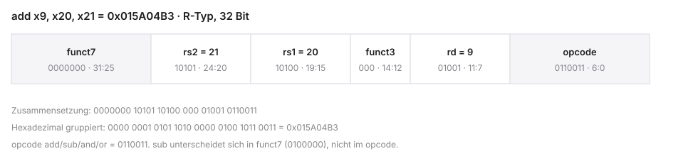

# RISC-V Basics


::: notes
Die zweite Einheit Mikrocomputertechnik 1 (MCT1) an der DHBW Stuttgart verbindet die bekannten Digitalbausteine mit ihrer programmierten Nutzung. Basics bedeutet Grundlagen. Die Leitfragen lauten: Welche Wirkung hat ein Befehl, und wie wird diese Wirkung in Bits codiert?

CPU bedeutet Central Processing Unit, also der Prozessor. ISA bedeutet Instruction Set Architecture, die Befehlssatzarchitektur. Sie beschreibt beobachtbares Verhalten, nicht die konkrete Verdrahtung.

Kontrollfrage: Welche zwei Fragen soll diese Einheit beantworten? Die Wirkung eines Befehls und seine Bitcodierung. Die Agenda zeigt den Weg von den Architekturbegriffen zu einem ersten ausgeführten Programm.
:::

## Agenda für Block 2

1. Architektur-Philosophie — CISC vs. RISC
2. Die RV32I Basis-Architektur — Register File & Spezifikation
3. R-Type-Befehle — Rechnen mit Registern
4. Maschinencode — Assembler → 32-Bit Hex
5. I-Type-Befehle — Konstanten (Immediates)
6. Praxis (Venus) — Simulator und erste Programme

```{mermaid}
%%| fig-width: 3.5
%%{init: {'theme': 'base', 'themeVariables': {'background': '#FFFFFF', 'primaryColor': '#FFFFFF', 'primaryBorderColor': '#E5E5EA', 'primaryTextColor': '#1D1D1F', 'lineColor': '#86868B', 'secondaryColor': '#F5F5F7', 'tertiaryColor': '#FFFFFF', 'mainBkg': '#FFFFFF', 'nodeBorder': '#E5E5EA', 'clusterBkg': '#F5F5F7', 'clusterBorder': '#E5E5EA', 'titleColor': '#1D1D1F', 'edgeLabelBackground': '#FFFFFF'}}}%%
graph LR
  A[Philosophie] --> B[Architektur]
  B --> C[Assembler]
  C --> D[Maschinencode]
  D --> E[Venus]
  style A fill:#FFFFFF,stroke:#E2001A,stroke-width:2px !important
  style B fill:#FFFFFF,stroke:#E5E5EA,stroke-width:1.5px
  style C fill:#FFFFFF,stroke:#E5E5EA,stroke-width:1.5px
  style D fill:#FFFFFF,stroke:#E5E5EA,stroke-width:1.5px
  style E fill:#FFFFFF,stroke:#E5E5EA,stroke-width:1.5px
```

::: notes
Vor dem ersten Befehl brauchen wir eine Reihenfolge. CISC (Complex Instruction Set Computer) und RISC (Reduced Instruction Set Computer) sind historische Entwurfsrichtungen, keine Energiegarantie. RV32I ist die 32-Bit-Integerbasis: XLEN, die Registerbreite, ist 32. Das Register File ist die Registerbank. R-Type und I-Type sind Formate für Register- und Immediate-Operanden. Immediate bedeutet eine direkt codierte Konstante. Maschinencode ist das 32-Bit-Wort. Venus ist der Assembler und ISA-Simulator dieser Einheit.

Lernziele: einen Registerwert vorhersagen, eine R-Type-Instruktion codieren, die Grenze kleiner Konstanten erklären und ein kleines Programm im Simulator prüfen. Die Themen hängen voneinander ab: erst die Schnittstelle, dann Register, dann Wirkung, dann Bits, dann die Prüfung im Tool.

Kontrollfrage: Warum steht die Codierung nach der Befehlswirkung? Weil ein Bitfeld erst sinnvoll ist, wenn die Operation bekannt ist. Als Nächstes aktivieren wir die bisher betrachteten Hardwarebegriffe.
:::
## Rückblick: Was wir bisher gebaut haben

- 32-Bit-ALU: Add, Sub, Logik
- Register File: 32 schnelle Speicherplätze
- Multiplexer für steuerbare Datenpfade
- Anbindung an den Arbeitsspeicher (RAM)
- Globales Taktsignal (Clock) synchronisiert alles

::: notes
Bisher haben wir ein Lehrmodell betrachtet, keine aufgebaute Platine. Die ALU (Arithmetic Logic Unit) verknüpft Operanden. Die Registerbank hält die 32-Bit-Werte. Ein MUX (Multiplexer) wählt eine Datenquelle. RAM (Random Access Memory) ist der Arbeitsspeicher. Clock, das Taktsignal, übernimmt Zustände in speichernde Bausteine. Kombinatorische Logik arbeitet nicht nur im Moment der Flanke.

Beispiel: In zwei Registern stehen 5 und 10. Für eine Addition müssen beide Register gelesen, die ALU auf Addition gestellt und das Ergebnis in ein Zielregister geschrieben werden. Welches Steuerwerk diese Auswahlen für ein Programm erzeugt, leiten wir hier noch nicht her.

Kontrollfrage: Rechnet die ALU nur während der Taktflanke? Nein. Die Flanke übernimmt das Ergebnis, die Verknüpfung ist kombinatorisch. Offen bleibt, wer diese Auswahlen für ein Programm vorgibt.
:::
## Das Problem der Steuerung

- Hardwarekomponenten brauchen Steuersignale
- ALU: z. B. 2-Bit-Code für die Operation
- Register-File-Decoder: 5-Bit-Adresse für das Fach
- Frage: Wie teilen wir der Hardware mit, welche Leitungen wann aktiv sind?
- Antwort: Instruktionen im Speicher; im Kursmodell liegen sie im RAM

```{mermaid}
%%| fig-width: 3.5
%%{init: {'theme': 'base', 'themeVariables': {'background': '#FFFFFF', 'primaryColor': '#FFFFFF', 'primaryBorderColor': '#E5E5EA', 'primaryTextColor': '#1D1D1F', 'lineColor': '#86868B', 'secondaryColor': '#F5F5F7', 'tertiaryColor': '#FFFFFF', 'mainBkg': '#FFFFFF', 'nodeBorder': '#E5E5EA', 'clusterBkg': '#F5F5F7', 'clusterBorder': '#E5E5EA', 'titleColor': '#1D1D1F', 'edgeLabelBackground': '#FFFFFF'}}}%%
graph LR
  Prog[Programmierer] -->|schreibt Befehl| RAM[(Speicher)]
  RAM -->|Bits| CU[Control Unit]
  CU -.->|Steuersignale| ALU[ALU & MUX]
  style CU fill:#FFFFFF,stroke:#E2001A,stroke-width:2px !important
  style Prog fill:#FFFFFF,stroke:#E5E5EA,stroke-width:1.5px
  style RAM fill:#FFFFFF,stroke:#E5E5EA,stroke-width:1.5px
  style ALU fill:#FFFFFF,stroke:#E5E5EA,stroke-width:1.5px
```

::: notes
Die vorige Folie hat die nötigen Auswahlen genannt. Diese Folie fragt, wer sie setzt. Ein opcode (operation code) ist die Befehlsklasse. 0110011 kennzeichnet Registerarithmetik und Registerlogik, nicht bereits Addition. add, sub, and und or brauchen zusätzlich funct3 und funct7. funct3 und funct7 sind die drei- und sieben-Bit-Funktionsfelder.

Fünf Bit wählen eines von 32 Architekturregistern, denn 2 hoch 5 ist 32. Ein zwei-Bit-ALU-Code wäre nur die Codierung unseres kleinen Lehrmodells, keine ISA-Vorgabe. Instruktionen können im Kurs im RAM liegen; auf anderen Plattformen auch im Flash. RAM ist nicht der einzige mögliche Instruktionsspeicher.

Beispiel: dieselben Registerfelder und derselbe Opcode können add oder sub sein. Erst Bit 30 im funct7, 0000000 gegen 0100000, trennt diese Gruppe.

Kontrollfrage: Reicht 0110011, um add von sub zu unterscheiden? Nein. Die nächste Folie legt fest, dass die ISA die zulässigen Befehle als gemeinsame Schnittstelle beschreibt.
:::
# 1. Die Architektur-Philosophie


::: notes
Der Steuerungsfrage folgt jetzt der Vergleich von Entwurfsentscheidungen. Die nächsten Folien betrachten die sichtbare Befehlsschnittstelle. Sie bewerten nicht pauschal jeden realen Prozessor.

CISC und RISC bleiben historische Etiketten. Ein komplexer interner Ablauf macht eine ISA nicht automatisch zur anderen. Energie, Takt und Chipfläche folgen aus der Mikroarchitektur, also der konkreten Umsetzung.

Kontrollfrage: Bewerten die folgenden Folien Chips oder Schnittstellenmerkmale? Schnittstellenmerkmale. Ein konkreter Übersetzungsweg führt von der Software zum ausführenden Prozessor.
:::

## Von Software zu Transistoren

- Weg von abstrakter Software zu schaltenden Transistoren
- Hardware und Software brauchen einen festen Vertrag
- Historischer Einfluss teurer Hardware auf Prozessor-Design
- CISC, etwa x86: variable Länge und Befehle mit Speicheroperanden
- RISC, etwa Arm und RISC-V: wenige Formate und Load/Store

```{mermaid}
%%| fig-width: 3.5
%%{init: {'theme': 'base', 'themeVariables': {'background': '#FFFFFF', 'primaryColor': '#FFFFFF', 'primaryBorderColor': '#E5E5EA', 'primaryTextColor': '#1D1D1F', 'lineColor': '#86868B', 'secondaryColor': '#F5F5F7', 'tertiaryColor': '#FFFFFF', 'mainBkg': '#FFFFFF', 'nodeBorder': '#E5E5EA', 'clusterBkg': '#F5F5F7', 'clusterBorder': '#E5E5EA', 'titleColor': '#1D1D1F', 'edgeLabelBackground': '#FFFFFF'}}}%%
graph LR
  CISC["variable Laenge"] --- VS((ISA))
  VS --- RISC["Load/Store"]
  style RISC fill:#FFFFFF,stroke:#E2001A,stroke-width:2px !important
  style CISC fill:#FFFFFF,stroke:#E5E5EA,stroke-width:1.5px
  style VS fill:#FFFFFF,stroke:#E5E5EA,stroke-width:1.5px
```

::: notes
Quelltext wird vom Compiler in Assembler und dann in Maschinencode übersetzt. Der Prozessor führt die Wirkung der ISA aus. Dieselbe Schnittstelle kann mehrere Mikroarchitekturen haben. Arm und RISC-V sind ISA-Familien. Hersteller und konkrete Chips sind eine andere Ebene.

CISC steht hier für variable Instruktionslänge und Speicheroperanden, RISC für wenige Formate und die Load/Store-Trennung. Diese Merkmale garantieren keine Energie- oder Geschwindigkeitswerte. Intel und AMD sind Hersteller; x86 und AMD64 sind Befehlssatzfamilien.

Kontrollfrage: Liegt die ISA oberhalb oder unterhalb der Transistoren? Sie ist die Grenze zwischen Softwaredarstellung und möglicher Hardwareumsetzung. Diese Grenze wird nun definiert.
:::
## Was ist eine ISA?

- ISA = Instruction Set Architecture (Befehlssatzarchitektur)
- Scharnier zwischen Software und Hardware
- Definiert, welche Befehle die CPU versteht
- Definiert **nicht**, wie sie elektronisch umgesetzt werden
- Das „Wie“ ist die Mikroarchitektur
- Verbindlicher Vertrag: Compiler-Autor → Chip-Designer

::: notes
Die Instruction Set Architecture ist der Vertrag zwischen Compiler und Chip. Die CPU muss die vereinbarten Befehle mit der vereinbarten Wirkung ausführen. gcc aus der GNU Compiler Collection und Clang sind Beispiele für Compiler, keine Vorschrift der ISA. GNU ist das Projekt hinter dieser Compiler-Sammlung.

add liest zwei Quellregister, liefert die unteren 32 Ergebnisbits und schreibt das Ziel. Eine Single-Cycle-Umsetzung und eine Pipeline könnten denselben Vertrag erfüllen. Die ISA schreibt die konkrete ALU-Verdrahtung nicht vor. Pipeline meint hier nur eine mögliche überlappende Ausführung, kein Thema dieser Einheit.

Kontrollfrage: Dürfen zwei Chips add unterschiedlich verdrahten, solange das Ergebnisbitmuster stimmt? Ja. Historische Randbedingungen erklären, warum verschiedene Schnittstellen entstanden.
:::
## Der historische Kontext (1970er)

- In vielen Systemen der 1970er war Arbeitsspeicher teuer und klein
- Codegröße meint codierte Bytes, nicht nur die Instruktionsanzahl
- Ein komplexerer Befehl kann mehrere Schritte bündeln
- Das ist ein Entwurfsdruck, nicht die Beschreibung jeder Maschine

::: notes
In vielen, nicht in allen Systemen der 1970er war Arbeitsspeicher teuer und klein. RAM bedeutet Random Access Memory. Codegröße ist die Anzahl codierter Bytes, nicht bloß die Instruktionsanzahl. Ein komplexerer Befehl kann mehrere Arbeitsschritte zusammenfassen und muss trotzdem nicht in jedem Programm Speicher sparen.

Die Entstehung von CISC lässt sich nicht auf einen einzigen Grund oder Zeitpunkt reduzieren. Die Folie nutzt diesen Druck nur als Motiv für das folgende x86-Beispiel.

Kontrollfrage: Sparen zehn komplexe Befehle automatisch mehr Bytes als dreißig einfache? Nein, das hängt von der Codierung ab. Das x86-Beispiel macht zusammengefasste Abläufe anschaulich.
:::
## CISC (Complex Instruction Set Computer)

- Vertreter: Intel x86, AMD64 (viele PCs)
- Philosophie: Programmierer/Compiler entlasten
- Viele spezialisierte Instruktionen mit umfangreicher Semantik
- Ein Befehl kann lesen, rechnen und in den RAM schreiben
- Variable Befehlslänge (z. B. 1 bis 15 Bytes)

```text
// Extrembeispiel x86 — String-Operation:
REP MOVSB
// Was dieser EINE Befehl tut:
// 1. Byte aus dem RAM laden
// 2. an andere RAM-Adresse schreiben
// 3. zwei Adress-Pointer inkrementieren
// 4. Zähler dekrementieren
// 5. wiederholen, bis Zähler = 0
```

::: notes
CISC bedeutet Complex Instruction Set Computer. Die sichtbare x86-ISA von Intel und AMD erlaubt Befehle mit umfangreicher Semantik und variabler Länge, grob 1 bis 15 Byte. Das ist nicht dieselbe Aussage wie die interne Mikroarchitektur.

REP MOVSB ist ein Vergleichsmotiv, keine x86-Prüfung. Repeat und Move String Byte kopieren Bytes. Bei Direction Flag DF gleich 0 werden die Zeiger erhöht. Ist der Zähler 0, wird nichts kopiert. Ein Befehl garantiert keine atomare Kopie des ganzen Blocks. Interne micro-operations, kurz µops, sind implementierungsabhängig. Sie sind nicht allgemein gleich lang und keine eigene RISC-ISA. Arm- und RISC-V-Befehle sind ebenfalls nicht pauschal alle gleich lang, sobald eine Komprimerweiterung existiert.

Kontrollfrage: Wird bei Zähler 0 einmal kopiert? Nein. Komplexere Codierungen können die Decodierung beeinflussen, ohne einen universellen Leistungsvergleich zu erlauben.
:::
## Die Nachteile von CISC

- Variable Länge und komplexe Semantik können den Decoderaufwand erhöhen
- Latenzen hängen von der Implementierung ab, nicht fest von der ISA
- Eine Pipeline bleibt eine Mikroarchitekturfrage
- Rückwärtskompatibilität bindet spätere Chips an ältere Befehle

```{mermaid}
%%| fig-width: 3.5
%%{init: {'theme': 'base', 'themeVariables': {'background': '#FFFFFF', 'primaryColor': '#FFFFFF', 'primaryBorderColor': '#E5E5EA', 'primaryTextColor': '#1D1D1F', 'lineColor': '#86868B', 'secondaryColor': '#F5F5F7', 'tertiaryColor': '#FFFFFF', 'mainBkg': '#FFFFFF', 'nodeBorder': '#E5E5EA', 'clusterBkg': '#F5F5F7', 'clusterBorder': '#E5E5EA', 'titleColor': '#1D1D1F', 'edgeLabelBackground': '#FFFFFF'}}}%%
graph LR
  Befehl[CISC-Befehl] --> Decoder[Decoder]
  Decoder --> M1[µOp 1]
  Decoder --> M2[µOp 2]
  Decoder --> MN[µOp N]
  style Decoder fill:#FFFFFF,stroke:#E2001A,stroke-width:2px !important
  style Befehl fill:#FFFFFF,stroke:#E5E5EA,stroke-width:1.5px
  style M1 fill:#FFFFFF,stroke:#E5E5EA,stroke-width:1.5px
  style M2 fill:#FFFFFF,stroke:#E5E5EA,stroke-width:1.5px
  style MN fill:#FFFFFF,stroke:#E5E5EA,stroke-width:1.5px
```

::: notes
Variable Instruktionslänge und komplexe Semantik können den Decoderaufwand erhöhen. Decoder bedeutet die Schaltung oder das Verfahren, das Felder eines Befehls auswertet. Eine Pipeline verarbeitet mehrere Befehle überlappend. µop bedeutet eine interne Mikrooperation. Die Bildkette CISC, Decoder, µops beschreibt eine mögliche Implementierung, keinen allgemeingültigen Chipaufbau.

Feste Beispiele wie 1 Takt gegen 120 Takte bleiben hier weg, weil sie ohne benanntes Modell irreführen. Auch RISC-Befehle haben nicht zwingend identische Latenzen. Rückwärtskompatibilität ist ein Entwurfskostenpunkt, keine Siliziummessung.

Kontrollfrage: Folgt aus einem langen Befehl automatisch ein Pipelining-Verbot? Nein. Das Lehrsubset von RISC-V bietet einfache Formate und eine klare Load/Store-Trennung.
:::
## RISC (Reduced Instruction Set Computer)

- Vertreter: ARM, MIPS, RISC-V
- Entwurfsidee dieses Befehlssatzes: feste Länge, Load/Store, wenige Befehlsformate
- Ein einzelner RISC-Befehl ist kein Synchronisationsvertrag einer atomaren Speicheroperation
- Pipelining ist eine Mikroarchitekturfrage; CISC-Implementierungen zerlegen oft in einfachere µOps
- Kompromiss: der Compiler erzeugt oft mehr Befehle

```text
// Dieselbe Schleife in RISC:
LOOP:
    Lade Byte aus RAM in Register A
    Schreibe Register A in RAM
    Addiere 1 zu Pointer 1
    Addiere 1 zu Pointer 2
    Subtrahiere 1 vom Zähler
    Springe zu LOOP, wenn Zähler > 0
```

::: notes
RISC bedeutet Reduced Instruction Set Computer. Load/Store trennt Rechnen in Registern vom Speichertransfer. Der Kasten ist Pseudocode, kein ausführbarer RV32I-Quelltext. Die Schleife setzt eine positive Anzahl voraus. Bei Anzahl 0 darf nichts kopiert werden, analog zum Zähler 0 bei REP.

Atomar bedeutet hier eine Synchronisationsgarantie, nicht bloß ein Befehl. Die A-Erweiterung für atomare Speicheroperationen ist nur eine Einordnung, kein Stoff dieser Einheit. Energie, Taktzahl und Pipeline folgen nicht aus dem RISC-Etikett.

Kontrollfrage: Ist der Pseudocode bereits ein Venus-Programm? Nein. Die für unsere Programme nötige Trennung betrifft Rechnen und Speicherzugriff.
:::
## Die eiserne RISC-Regel: Load/Store

- Registerarithmetik verarbeitet Registeroperanden, nicht RAM-Inhalte
- Die ALU darf trotzdem eine effektive Adresse berechnen
- RAM-Zugriff nur über zwei Befehlstypen:
  - Load: RAM → Register
  - Store: Register → RAM

```{mermaid}
%%| fig-width: 3.5
%%{init: {'theme': 'base', 'themeVariables': {'background': '#FFFFFF', 'primaryColor': '#FFFFFF', 'primaryBorderColor': '#E5E5EA', 'primaryTextColor': '#1D1D1F', 'lineColor': '#86868B', 'secondaryColor': '#F5F5F7', 'tertiaryColor': '#FFFFFF', 'mainBkg': '#FFFFFF', 'nodeBorder': '#E5E5EA', 'clusterBkg': '#F5F5F7', 'clusterBorder': '#E5E5EA', 'titleColor': '#1D1D1F', 'edgeLabelBackground': '#FFFFFF'}}}%%
graph LR
  RAM[(Arbeitsspeicher)] -->|Load| RF[Register File]
  RF -->|Store| RAM
  RF <-->|Operanden| ALU[ALU]
  style ALU fill:#FFFFFF,stroke:#E2001A,stroke-width:2px !important
  style RF fill:#FFFFFF,stroke:#E5E5EA,stroke-width:1.5px
  style RAM fill:#FFFFFF,stroke:#E5E5EA,stroke-width:1.5px
```

::: notes
Registerarithmetik verarbeitet Registeroperanden. Loads und Stores veranlassen die Speichertransfers. Die ALU kann dennoch eine effektive Adresse berechnen. ALU ist die arithmetisch-logische Einheit, RAM der Arbeitsspeicher.

Als Ausblick, noch ohne vollständige Syntax: zwei Loads holen Werte, add verrechnet sie, ein Store kann das Ergebnis zurückschreiben. Adressweg und Datenweg sind verschieden. Getrennte Latenzklassen sind keine Garantie einer konkreten Ausführungsdauer.

Kontrollfrage: Darf die ALU eine Adresse berechnen, obwohl sie keine RAM-Daten verknüpft? Ja. Die Trennung strukturiert Software und Hardware, ist aber kein quantitatives Nullsummengesetz.
:::
## Die Waage der Komplexität

- Architektur-Design: Aufwand verteilt sich auf Compiler, Decoder und Ausführung, ohne festes Nullsummengesetz
- Codeumfang, Compileraufwand und Decoderdesign sind verschiedene Größen
- CISC verlagert oft Semantik in einzelne Befehle
- RISC verlagert oft die Zerlegung in den Compiler
- Energie folgt aus Workload, Fertigung und Mikroarchitektur, nicht aus dem Etikett

::: notes
Eine Waage ist hier nur ein qualitatives Bild. Codeumfang, Compileraufwand, Decoderdesign, Ausführungseinheiten und Speicherverhalten sind verschiedene Größen. Es gibt kein festes Nullsummenspiel und keine hundert Prozent Problemkomplexität, die nur die Seite wechseln.

AWS bedeutet Amazon Web Services. Weder Akkulaufzeit noch ein Cloudanbieter folgt automatisch aus CISC oder RISC. Konkrete Workloads, Fertigung und Mikroarchitektur entscheiden. Die Folie zeigt deshalb keine Energiebalken.

Kontrollfrage: Gewinnt RISC-V deshalb jede Energiemessung? Nein. Im Kurs wählen wir RISC-V wegen der transparenten Schnittstelle und der Lehrbarkeit.
:::
## Warum RISC-V?

- Offene, gebührenfreie ISA; die Coreimplementierung kann kommerziell sein
- Dokumentierte Formate und eine überschaubare Integerbasis
- Erweiterungen bleiben vom Kurskern RV32I getrennt
- Embedded Systems und IoT sind Anwendungsfelder, kein Energieversprechen

::: notes
RISC-V ist der Name der offenen Befehlssatzarchitektur. Offen und gebührenfrei betrifft die ISA. Eine Coreimplementierung, Core-IP oder ein Werkzeug darf kommerziell und geschlossen sein. IoT bedeutet Internet of Things, Embedded Systems sind eingebettete Systeme.

Für diese Einheit zählen dokumentierte Formate, die überschaubare Integerbasis und die Erweiterbarkeit. Eine neue ISA enthält weiterhin schwierige Entwurfsentscheidungen. Lizenzpreisvergleiche ohne Beleg bleiben weg.

Kontrollfrage: Muss ein RISC-V-Chip quelloffen sein? Nein. Ein bis zwei belegte Einsatzmuster können die Anwendung illustrieren, ohne Stückzahlen zu erfinden.
:::
## RISC-V in der Industrie

- Ankündigung, ausgelieferter Kern und konkretes Produkt sind zu trennen
- Steuerkerne in Controllern sind ein belegbares Einsatzmuster
- KI-Beschleuniger und GPUs können einen RISC-V-Kern als Steuerung nutzen
- Daraus folgt keine Stückzahl und keine Marktprognose

::: notes
Industriebeispiele trennen Ankündigung, ausgelieferten Kern und konkretes Produkt. KI bedeutet Künstliche Intelligenz, GPU bedeutet Graphics Processing Unit. Ein RISC-V-Kern kann in einem Controller oder als Steuerkern neben einer GPU arbeiten. Ohne datierte Primärquelle nennen wir keine Milliarden Stück und keine Marktprognose.

Die Abbildung, soweit sie bleibt, soll Einsatz und Aufgabe des Kerns zeigen, keine Logos. Arbeitsmarktrelevanz und ein Standard der kommenden Jahrzehnte sind keine gesicherten Aussagen.

Kontrollfrage: Ist eine Pressemeldung bereits eine ausgelieferte Stückzahl? Nein. Für unsere Programme genügt zunächst die konkrete RV32I-Basis.
:::
# 2. Die RV32I Basis-Architektur


::: notes
Der Vergleich der Herstellerfragen endet hier. Jetzt werden die softwareseitig sichtbaren Register und ihre Benennung eingeführt. RV32I bedeutet RISC-V, Registerbreite XLEN gleich 32, Integerbasis I.

Der Modulkasten beschreibt den Befehlssatz, nicht den Markt. Architekturregister und Softwarekonventionen sind zwei Ebenen.

Kontrollfrage: Gehört eine Verkaufszahl zur RV32I-Definition? Nein. Als Nächstes trennen wir diese beiden Ebenen genauer.
:::

## Überblick RV32I

- Modularer RISC-V-Baukasten
- Fokus: Integer-Basis-Erweiterung RV32I
- Register File als zentrales Arbeitswerkzeug
- 32 Architektur-Register: Hardware- und ABI-Namen
- Application Binary Interface (ABI) als Software-Konvention

```{mermaid}
%%| fig-width: 3.5
%%{init: {'theme': 'base', 'themeVariables': {'background': '#FFFFFF', 'primaryColor': '#FFFFFF', 'primaryBorderColor': '#E5E5EA', 'primaryTextColor': '#1D1D1F', 'lineColor': '#86868B', 'secondaryColor': '#F5F5F7', 'tertiaryColor': '#FFFFFF', 'mainBkg': '#FFFFFF', 'nodeBorder': '#E5E5EA', 'clusterBkg': '#F5F5F7', 'clusterBorder': '#E5E5EA', 'titleColor': '#1D1D1F', 'edgeLabelBackground': '#FFFFFF'}}}%%
graph LR
  A[Modular] --> B[RV32I]
  B --> C[32 Register]
  C --> D[ABI]
  style B fill:#FFFFFF,stroke:#E2001A,stroke-width:2px !important
  style A fill:#FFFFFF,stroke:#E5E5EA,stroke-width:1.5px
  style C fill:#FFFFFF,stroke:#E5E5EA,stroke-width:1.5px
  style D fill:#FFFFFF,stroke:#E5E5EA,stroke-width:1.5px
```

::: notes
RV32I legt 32 Architekturregister und die Integerbefehle fest. Das Register File ist die Registerbank. Die ABI, das Application Binary Interface, ist eine Softwarevereinbarung über Namen und Erhaltung, keine zweite Hardware.

Das Beispiel Linux und Windows on Arm ist vorsichtig zu lesen: selbst bei ähnlicher ISA können Binärformat, Systemdienste, Laufzeit und ABI inkompatibel sein. Nicht jede Arm-Konfiguration ist dieselbe ISA. C, C++, Rust und Go lassen sich nur über eine passende gemeinsame Schnittstelle verbinden. Typen, Namenskonventionen und Laufzeitregeln zählen mit. Der Kursumfang sind einfache Integerfunktionen.

Kontrollfrage: Erzeugt das Etikett gleiche ABI automatisch eine Rust-Bibliothek für C? Nein. Der Modulkasten beschreibt zuerst den Befehlssatz.
:::
## Der RISC-V Modulbaukasten

- Nicht ein starrer Satz, sondern modular
- Unsere gewählte Basis: RV32I
- Weitere Basen existieren; `I` ist nicht die einzige zulässige Basis
- Optionale Extensions, u. a.:
  - `M` — Multiply/Divide
  - `F` / `D` — Float / Double
  - `C` — Compressed (16-Bit-Befehle); in den Kernbeispielen aus
- `G` = `IMAFD` sowie `Zicsr` und `Zifencei`

| String | Bedeutung |
|--------|-----------|
| RV32I | 32-Bit-Basis dieses Kurses, ohne `C` |
| RV64G | RV64 mit I, M, A, F, D, Zicsr, Zifencei |
| RV64GC | RV64G plus Compressed |

::: notes
I ist die Integerbasis, M Multiply/Divide, A Atomic, F und D Single- und Double-Precision Floating-Point. Float und Double sind Gleitkommaformate, keine Registerbreite. C, Compressed, ergänzt 16-Bit-Instruktionen und macht nicht jeden Befehl 16 Bit lang. G ist der Alias für IMAFD plus Zicsr und Zifencei.

Zicsr definiert Zugriffsbefehle für CSR, Control and Status Registers. Privilegien, Interrupts und konkrete Zähler gehören zu weiteren Spezifikationsteilen. Zifencei und fence.i stellen auf demselben Hart, einem Hardware-Ausführungskontext, vorherige Stores für spätere Instruktionsfetches sichtbar. Ein Cache-Reset ist eine mögliche Umsetzung, keine Vorschrift, und gilt nicht allein für alle anderen Harts.

Die M-Division durch null hat ein definiertes Ergebnis und keine verpflichtende Exception. RV32I enthält div nicht. G ist nicht automatisch die vollständige Anforderung jedes Linux-Systems. Der Kurs verwendet RV32I ohne C. Alles andere ist Einordnung.

Kontrollfrage: Gehören Interruptregeln zu Zicsr? Nein, Zicsr sind die Zugriffsbefehle. Als Nächstes grenzt die Definition den Kursvertrag ein.
:::
## Die Definition von RV32I

- RV: Architektur-Familie RISC-V
- 32: Datenpfad- und Adressbreite 32 Bit
- I: Integer-Basis; Gleitkommabefehle gehören zu F und D
- mul und div gehören zur Erweiterung M, nicht zu RV32I
- Im Kurs sind die nativen Instruktionen unkomprimiert 32 Bit lang

```text
Word Size:     32 Bits (4 Bytes)
Registers:     32 Stück
Address Space: 2^32 Byte = 4 GiB
```

::: notes
RV steht für RISC-V, 32 für XLEN gleich 32, I für die Integerbasis. Registerbreite, Instruktionsbreite und Adressraum sind drei Größen. Ein RV32-Word ist 32 Bit, also vier Byte. Der Byteadressraum hat 2 hoch 32 Adressen, das sind 4 GiB, Gibibyte als 2 hoch 30 Byte. Das ist nicht der installierte RAM.

Keine mul- oder Gleitkommabefehle im Basisumfang verbieten entsprechende Hardware in einer erweiterten CPU nicht. 5 mal 4 lässt sich als Shift um zwei bilden, nicht nur als Additionsschleife.

Kontrollfrage: Sind 4 GiB der eingebaute Speicher? Nein, es ist die Größe des Adressraums. Die allgemeinen Register tragen Operanden und Ergebnisse.
:::
## Die 32 Architektur-Register

- Register File der ISA: 32 Architekturregister ($x0$–$x31$)
- Nicht dasselbe wie physische Register einer Mikroarchitektur
- Adressierung im Befehlswort: $5$ Bits ($2^5 = 32$)
- `x0` ist fest 0; die übrigen 31 sind beschreibbar
- Die ISA schreibt keine bestimmte Flip-Flop-Bank vor

```{mermaid}
%%| fig-width: 3.5
%%{init: {'theme': 'base', 'themeVariables': {'background': '#FFFFFF', 'primaryColor': '#FFFFFF', 'primaryBorderColor': '#E5E5EA', 'primaryTextColor': '#1D1D1F', 'lineColor': '#86868B', 'secondaryColor': '#F5F5F7', 'tertiaryColor': '#FFFFFF', 'mainBkg': '#FFFFFF', 'nodeBorder': '#E5E5EA', 'clusterBkg': '#F5F5F7', 'clusterBorder': '#E5E5EA', 'titleColor': '#1D1D1F', 'edgeLabelBackground': '#FFFFFF'}}}%%
graph LR
  x0[x0] --- x1[x1] --- dots[...] --- x31[x31]
  style x0 fill:#FFFFFF,stroke:#E2001A,stroke-width:2px !important
  style x1 fill:#FFFFFF,stroke:#E5E5EA,stroke-width:1.5px
  style dots fill:#FFFFFF,stroke:#E5E5EA,stroke-width:1.5px
  style x31 fill:#FFFFFF,stroke:#E5E5EA,stroke-width:1.5px
```

::: notes
x0 bis x31 sind Architekturbezeichner. Das Register File ist die Bank dieser Register, keine Datei. Fünf Bits wählen eines von 32 Registern. x0 ist fest null, 31 Register sind beschreibbar. 31 mal 4 Byte sind 124 Byte Architekturzustand, nicht die Speicherkapazität der CPU.

Physische Register einer Mikroarchitektur dürfen zahlreicher sein, etwa durch Umbenennung. Flip-Flops sind ein mögliches Lehrmodell, keine ISA-Vorschrift. Mehr Architekturregister garantieren keine niedrigere Taktfrequenz.

Die Tabelle trennt Nummer, ABI-Alias und aktuellen Wert. Der Alias ist kein zweites Register.

Kontrollfrage: Wie viele Register wählt ein 5-Bit-Feld? 32. x0 hat eine besondere Semantik, die einfache Idiome ermöglicht.
:::
## Das Spezialregister $x0$ (zero)

- $x0$ physisch oft fest auf 0 verdrahtet (Hardwired Zero)
- Lesen: immer $0$
- Schreiben: wird ignoriert (verpufft)
- Nutzen: Operationen aus Standardbefehlen „basteln“ (Kopieren, Negieren, …)

```c
// Metapher:
const int x0 = 0;
```

::: notes
Hardwired Zero bedeutet: jedes Lesen von x0, Alias zero, liefert null. Das ist eine Architektureigenschaft, nicht zwingend eine bestimmte Drahtschaltung. addi x0, x0, 7 lässt x0 bei 0. Das geschriebene Ergebnis wird verworfen.

Daraus folgt nicht, dass jede Instruktion mit Ziel x0 wirkungslos ist. Speicher- oder Systemeffekte können bestehen. Für die jetzigen Registerrechnungen genügt die Nullregel. Ein const int in C ist keine Hardwarebeschreibung dieses Registers.

Kontrollfrage: Welchen Wert hat x0 nach einem Schreibversuch? 0. Der PC ist ein eigener Adresszustand und gehört nicht zu x0 bis x31.
:::
## Der Program Counter (PC)

- Zusätzlich zu $x0$–$x31$: isoliertes PC-Register
- Speichert die Adresse der aktuell auszuführenden / als Nächstes geholten Instruktion
- 32 Bit breit
- Folgeinstruktion: $PC+4$ (bei RV32I ein Word); Venus zeigt den PC der aktuellen Instruktion

```{mermaid}
%%| fig-width: 3.5
%%{init: {'theme': 'base', 'themeVariables': {'background': '#FFFFFF', 'primaryColor': '#FFFFFF', 'primaryBorderColor': '#E5E5EA', 'primaryTextColor': '#1D1D1F', 'lineColor': '#86868B', 'secondaryColor': '#F5F5F7', 'tertiaryColor': '#FFFFFF', 'mainBkg': '#FFFFFF', 'nodeBorder': '#E5E5EA', 'clusterBkg': '#F5F5F7', 'clusterBorder': '#E5E5EA', 'titleColor': '#1D1D1F', 'edgeLabelBackground': '#FFFFFF'}}}%%
graph LR
  PC["PC: 0x00400000"] -->|Fetch| IM[Instruction Memory]
  IM -->|Befehl| CU[Control & ALU]
  style PC fill:#FFFFFF,stroke:#E2001A,stroke-width:2px !important
  style IM fill:#FFFFFF,stroke:#E5E5EA,stroke-width:1.5px
  style CU fill:#FFFFFF,stroke:#E5E5EA,stroke-width:1.5px
```

::: notes
Der PC, Program Counter, ist im ISA- und Venus-Modell die Adresse der aktuellen Instruktion. Formulierungen wie als Nächstes geholt gehören in einen Mikroarchitekturkontext und werden hier nicht vermischt.

Bei nativen unkomprimierten Instruktionen steigt die sequenzielle Adresse um vier Byte. Eine kleine Adressliste 0, 4, 8 zeigt zwei solche Schritte. Die konkreten Startadressen eines Tools sind nicht erfunden. Labels, Kommentare und Pseudozeilen haben keine eigene einheitliche PC-Schrittweite. Sprünge kommen in Einheit 3.

Kontrollfrage: Um wie viele Byte steigt der PC bei einem normalen RV32I-Rechenbefehl? Um 4. Die allgemeinen Register bekommen nun softwareseitige Aliasnamen.
:::
## Was ist eine ABI?

- $x0$–$x31$: physikalische Hardware-Namen
- Software nutzt ABI-Namen (Application Binary Interface)
- Konvention: wofür welche Register dienen
- Hardware erzwingt das nicht — ohne ABI bricht C-Interoperabilität
- Beispiel: $x10$ = `a0` (Argument / Rückgabewert)

| Hardware | ABI | Nutzung | Preserved? |
|----------|-----|---------|------------|
| $x5$–$x7$ | `t0`–`t2` | temporär | nein |
| $x8$–$x9$ | `s0`–`s1` | gespeichert | ja |

::: notes
ABI bedeutet Application Binary Interface, die binäre Schnittstellenvereinbarung. x5, x8 und x10 sind Architekturbezeichner, keine physikalischen Hardware-Namen. t0, s0 und a0 sind Aliase derselben Register: t0 ist x5, s0 ist x8, a0 ist x10.

Die Namen erzeugen keine zusätzlichen Register und keine automatische Sicherung. Saved bedeutet: bei Rückkehr einer ABI-konformen Funktion ist der Eintrittswert wiederhergestellt, nicht dass der Wert immer im RAM liegt.

Kurzorientierung: x0 zero bleibt null. x1 ra ist die Rücksprungadresse, x2 sp der Stackzeiger, x3 gp und x4 tp sind reservierte Rollen und hier nur Vorschau. Der PC ist kein General Purpose Register.

Kontrollfrage: Ist t0 ein 33. Register neben x5? Nein. Die temporären Register erlauben Zwischenwerte mit klarer Zuständigkeit.
:::
## ABI: Temporäre Register (`t`)

- Namen: `t0`–`t6` ($x5$–$x7$, $x28$–$x31$)
- Zweck: flüchtige Zwischenrechnungen
- Not Preserved (Caller-Saved)
- Nach Funktionsaufruf: Inhalt darf überschrieben sein

```asm
# Schnelles Zwischenergebnis
add t0, a1, a2   # t0 = a1 + a2
sub a0, t0, a3   # a0 = t0 - a3
# t0 danach nicht mehr benötigt
```

::: notes
t bedeutet temporary. Caller ist die aufrufende Funktion. Caller-Saved bedeutet: wenn der Caller den Wert nach einem normalen Aufruf noch braucht, muss er selbst für die Erhaltung sorgen. Es gibt keine automatische Hardwaresicherung.

t0 bis t2 sind x5 bis x7, t3 bis t6 sind x28 bis x31. Lehrwerte: a1 gleich 5, a2 gleich 10, a3 gleich 3. Dann kann t0 die Summe 15 halten und a0 das Ergebnis 12, wenn das Snippet diese Eingaben bereits gesetzt hat. Ein Venus-ecall ist ein anderer Vertrag und erhält t-Register nicht nach der Funktions-ABI.

Kontrollfrage: Darf eine aufgerufene Funktion t0 überschreiben? Ja, bei einem normalen Aufruf. Die s-Gruppe gibt eine andere Zusage.
:::
## ABI: Gespeicherte Register (`s`)

- Namen: `s0`–`s11` ($x8$–$x9$, $x18$–$x27$)
- Zweck: längerlebige Variablen
- Preserved (Callee-Saved)
- Nutzt die Callee `s0`, muss sie vorher auf dem Stack sichern und später wiederherstellen

```c
int main(void) {
    int wichtig = 42; // typisch: s-Register
    fremde_funktion();
    // wichtig ist danach garantiert noch 42
}
```

::: notes
s bedeutet saved, Callee ist die aufgerufene Funktion. Callee-Saved bedeutet: verändert die Funktion ein s-Register, muss sie bei Rückkehr den Eintrittswert wiederherstellen. Bloßes Lesen verlangt kein Sichern. Der Stack, Zeiger sp, ist der übliche Ort, nicht der einzig denkbare. Eine vollständige Stacksequenz folgt in Einheit 4.

s0 und s1 sind x8 und x9, s2 bis s11 sind x18 bis x27. Ein C-Compiler muss eine Variable nicht in s0 legen. Ungenutztes kann entfallen. Die Zuordnung im Beispiel ist eine Lehrannahme. Nach dem Aufruf muss ein benutzter s-Wert noch lesbar sein, sonst sieht man die Zusage nicht.

Kontrollfrage: Muss eine Funktion s0 sichern, wenn sie es nur liest? Nein. Die a-Gruppe überträgt einfache Parameter und Ergebnisse.
:::
## ABI: Argument-Register (`a`)

- Namen: `a0`–`a7` ($x10$–$x17$)
- Zweck: Parameterübergabe an Funktionen
- Rückgabewert unserer einfachen Integer-Funktionen: `a0`
- Ebenfalls flüchtig (Not Preserved)
- Simulator-`ecall` ist ein anderer Vertrag: in Venus Dienstkennung in `a0`, erster Parameter in `a1`

```c
int sum(int a, int b) { return a + b; }

// Unter der Haube (ABI):
// a  → Register a0
// b  → Register a1
// Ergebnis → Register a0
```

::: notes
a bedeutet argument. a0 bis a7 sind x10 bis x17. Bei der einfachen Funktion int sum(int a, int b) stehen die Parameter in a0 und a1, der skalare Rückgabewert wieder in a0. ILP32 bedeutet: int, long und Pointer sind je 32 Bit.

Lehrgang: sum(5, 10) findet a0 gleich 5 und a1 gleich 10 vor und liefert a0 gleich 15. t- und a-Register bleiben über den Aufruf nicht erhalten. s-Register schon, falls die Funktion sie verändert. Der Venus-Druckdienst nutzt a0 als Dienstnummer und a1 als Druckwert. Das ist nicht derselbe Vertrag. Größere Typen und mehr Argumente sparen wir aus.

Kontrollfrage: Wo steht das Integerergebnis von sum? In a0. Ein Vertragsvergleich verhindert die Verwechslung mit dem Simulatordienst.
:::
## Warum sich an die ABI halten?

- Venus erzwingt die ABI nicht
- Normale Funktion und `ecall` nicht vermischen
- Venus-Druck einer Ganzzahl: `a0 = 1`, Wert in `a1`; Exit: `a0 = 10`
- Funktionsergebnis skalarer 32-Bit-Werte: `a0`
- Im Kurs: ABI-Namen für Funktionen

| Vertrag | Kennung | Argument | Rückgabe |
|---------|---------|----------|----------|
| ILP32-Funktion | — | `a0`, `a1`, … | `a0` |
| Venus-`ecall` | `a0` | erster Wert in `a1` | abhängig vom Dienst |
| Ripes-`ecall` | Tabelle der installierten Version | nicht mit Venus gleichsetzen | siehe `ecalls.md` |

```{mermaid}
%%| fig-width: 3.5
%%{init: {'theme': 'base', 'themeVariables': {'background': '#FFFFFF', 'primaryColor': '#FFFFFF', 'primaryBorderColor': '#E5E5EA', 'primaryTextColor': '#1D1D1F', 'lineColor': '#86868B', 'secondaryColor': '#F5F5F7', 'tertiaryColor': '#FFFFFF', 'mainBkg': '#FFFFFF', 'nodeBorder': '#E5E5EA', 'clusterBkg': '#F5F5F7', 'clusterBorder': '#E5E5EA', 'titleColor': '#1D1D1F', 'edgeLabelBackground': '#FFFFFF'}}}%%
graph LR
  Code[Ihr Assembler] -->|Parameter in a0| OS[OS / C-Lib]
  OS -->|Ergebnis in a0| Code
  style OS fill:#FFFFFF,stroke:#E2001A,stroke-width:2px !important
  style Code fill:#FFFFFF,stroke:#E5E5EA,stroke-width:1.5px
```

::: notes
Eine normale Funktion und ein Simulatordienst sind verschiedene Schnittstellen. In der Funktion sum steht das Ergebnis 15 in a0. Für die klassische Venus-Ausgabe wird 15 zuerst nach a1 kopiert, danach a0 auf 1 gesetzt. Dienst 1 druckt die ganze Zahl, Dienst 10 beendet. Einen Verweis auf eine externe Datei braucht diese Folie nicht.

Die Grafik darf nicht suggerieren, Venus starte eine C-Bibliothek oder einen Betriebssystemkern. OS bedeutet Operating System. Ripes ist ein späteres Werkzeug mit anderer Dienstkonvention und wird hier nicht gemischt. ecall ist kein normaler Funktionsaufruf nach der psABI.

Kontrollfrage: Darf a0 gleichzeitig Ergebnis 15 und Dienstnummer 1 sein? Nicht im selben Schritt. Die ABI-Namen sind nun bekannt und werden zu Operanden der Rechenbefehle.
:::
# 3. R-Type Befehle (Register)


::: notes
R-Type bezeichnet das Format der Register-Register-Rechnungen. Bisher kennen wir Registerrollen. Jetzt kommt die Wirkung einer Instruktion, danach ihre Bits.

rd ist das Zielregister, rs1 und rs2 sind die Quellregister. Die Namen sind Nummernfelder, nicht die Daten.

Kontrollfrage: Steht die Konstante dieser Befehle im Instruktionswort? Nein, beide Operanden kommen aus Registern. Zwei Quellen und ein Ziel bilden das Grundmuster.
:::

## Einstieg: R-Type

- Einstieg in die Assembler-Programmierung
- Syntax: Ziel, Quelle1, Quelle2
- Arithmetik: Addition und Subtraktion
- Bitweise Logik: AND, OR, XOR
- Shifts: mathematische Bedeutung der Verschiebungen

```{mermaid}
%%| fig-width: 3.5
%%{init: {'theme': 'base', 'themeVariables': {'background': '#FFFFFF', 'primaryColor': '#FFFFFF', 'primaryBorderColor': '#E5E5EA', 'primaryTextColor': '#1D1D1F', 'lineColor': '#86868B', 'secondaryColor': '#F5F5F7', 'tertiaryColor': '#FFFFFF', 'mainBkg': '#FFFFFF', 'nodeBorder': '#E5E5EA', 'clusterBkg': '#F5F5F7', 'clusterBorder': '#E5E5EA', 'titleColor': '#1D1D1F', 'edgeLabelBackground': '#FFFFFF'}}}%%
graph LR
  R1[rs1] --> ALU[ALU]
  R2[rs2] --> ALU
  ALU --> Dest[rd]
  style ALU fill:#FFFFFF,stroke:#E2001A,stroke-width:2px !important
  style R1 fill:#FFFFFF,stroke:#E5E5EA,stroke-width:1.5px
  style R2 fill:#FFFFFF,stroke:#E5E5EA,stroke-width:1.5px
  style Dest fill:#FFFFFF,stroke:#E5E5EA,stroke-width:1.5px
```

::: notes
Ein R-Type-Befehl liest zwei Registerwerte, verknüpft sie in der ALU und schreibt ein Ziel. Die Felder rs1, rs2 und rd enthalten Nummern. Die Register enthalten die Daten. Eine Registernummer ist keine RAM-Adresse.

Drei verwandte Aufgaben nutzen dasselbe Muster: Arithmetik, bitweise Logik und Shifts. Ein Diagramm muss Quellen, ALU und Ziel getrennt beschriften.

Lehrwert: rs1 hält 5, rs2 hält 10, die Operation ist Addition, rd erhält 15. Die Quellen bleiben 5 und 10.

Kontrollfrage: Steht in rs1 die Zahl 5 oder die Registernummer? Im Feld die Nummer, im Register der Wert. Die lesbare Schreibweise ist Assemblersprache.
:::
## Was ist Assembler?

- C, Java oder Python sind Hochsprachen (hardware-unabhängig)
- Prozessoren verarbeiten ausschließlich Maschinencode (`0` und `1`)
- Assembler: für Menschen lesbare Text-Repräsentation dieses Codes
- Fast 1:1-Mapping: eine Textzeile entspricht einem 32-Bit-Maschinenbefehl
- Mnemonics wie `add` oder `sub` ersetzen unlesbare Binärcodes

```text
C-Code:       a = b + c;
Assembler:    add x10, x11, x12
Maschine:     0000000 01100 01011 000 01010 0110011
```

::: notes
Assemblersprache ist die Textform. Der Assembler ist das Programm, das sie übersetzt. Hochsprachen können portabel sein, ihre Ausführung braucht aber passende Übersetzer oder Laufzeiten.

Ein nativer Befehl dieses Kurses wird ein 32-Bit-Instruktionswort. Eine Pseudoinstruktion kann mehrere native Instruktionen erzeugen. Label, Kommentar und Direktive erzeugen keine. Deshalb ist nicht jede Zeile ein Maschinenbefehl, und der Text kontrolliert nicht jeden Hardwaretakt.

add x10, x11, x12 beschreibt Registerarithmetik. Die Codierung 0x00C58533 hängt nur von den Nummern ab, nicht von den aktuellen Werten. Sie ist nicht automatisch eine ABI-konforme Funktion.

Kontrollfrage: Erzeugt eine Kommentarzeile einen PC-Schritt? Nein. Für die nativen Registerrechnungen gilt ein einfaches Operandenmuster.
:::
## Die Grund-Syntax der R-Types

- Grammatik ist strikt — hält den Decoder einfach
- Operationsname (Mnemonic) zuerst
- Operanden strikt durch Kommas getrennt
- Goldene Regel: Zielregister `rd` steht fast immer links
- Danach Quellen: `rs1`, dann `rs2`

```asm
# Standard-Muster für R-Type:
operation   rd, rs1, rs2

# gelesen als:
# rd wird zu rs1 verknüpft mit rs2
```

::: notes
Der Mnemonic ist das Kürzel der Operation. Bei diesen Registerrechnungen steht das Ziel links: rd, dann rs1, dann rs2. Kommas gehören zum Quelltext. Der Assemblerparser braucht sie. Der CPU-Decoder sieht das Maschinenwort und keine Kommas. Die Ziel-links-Regel gilt nicht für jeden RISC-V-Befehl.

Beispiel: t1 ist 5, t2 ist 10. add t0, t1, t2 schreibt 15 nach t0. Ein fehlendes Komma ist ein Fehler vor der Ausführung. Eine unbelegte Neunzig-Prozent-Regel bleibt weg.

Kontrollfrage: Sieht die ALU das Komma? Nein. add ist das erste konkrete Rechenbeispiel.
:::
## Addition (`add`)

- Fundamentalster Rechenbefehl der ALU
- $rd = rs1 + rs2$ (32-Bit-Integer, Zweierkomplement)
- Überlauf (Overflow): Hardware schneidet stumm ab — kein Trap
- Überlauf: die unteren 32 Bit bleiben; kein automatischer Trap

```asm
add t0, t1, t2
# t0 = t1 + t2
```

::: notes
add addiert die unteren 32 Bit von rs1 und rs2 und schreibt rd. Die Quellen bleiben unverändert. Signed und unsigned sind Interpretationen desselben Bitmusters. Ein arithmetischer Überlauf erzeugt hier keinen Trap. Das ist modulare Maschinenarithmetik modulo 2 hoch 32, keine Erlaubnis für signed Overflow in C.

Lehrrechnung: 5 plus 10 bleibt 15. Zusätzlich: 0xFFFFFFFF plus 1 wird 0. 0x7FFFFFFF plus 1 wird 0x80000000, unsigned 2147483648 und signed minus 2147483648. Eine Dauer in Takten folgt aus diesem Befehl nicht.

Kontrollfrage: Bleibt t1 nach add t0, t1, t2 gleich? Ja. Ein Compiler kann solche Operationen für C-Ausdrücke verwenden.
:::
## Mapping auf die C-Welt

- Keine Variablennamen wie `temperatur` — nur Register
- Compiler mappt C-Variablen auf ABI-Register (`s0`, `s1`, …)
- Keine Typen in der reinen Hardware-Ausführung
- Eine C-Zuweisung wird oft zu einem R-Type
- Ob ASCII oder Zahl: der Programmierer muss es wissen

```c
// Hochsprache
int a, b, c; // z. B. a=s0, b=s1, c=s2
a = b + c;

// Generierter Assembler
add s0, s1, s2
```

::: notes
a gleich s0, b gleich s1 und c gleich s2 ist eine illustrative Zuordnung, keine Compilerzusage. Der Compiler darf andere Register, Speicher oder eine Optimierung wählen. Unter dieser Annahme wird a gleich b plus c zu add s0, s1, s2.

ASCII, American Standard Code for Information Interchange, wäre nur eine Zeichencodierung, falls ein Vergleich Zeichen zeigt. C-Typen verschwinden nicht als Sprachregeln. Sie werden in Operationen und Layouts übersetzt. Die Registerbank speichert Bitmuster ohne C-Typetikett. Wir verwenden kleine sichere Werte, damit kein signed Overflow in C entsteht.

Kontrollfrage: Muss der Compiler b in s1 legen? Nein. Bei der Subtraktion kommt die Reihenfolge der Quellen dazu.
:::
## Subtraktion (`sub`)

- $rd = rs1 - rs2$ (Reihenfolge nicht kommutativ!)
- Intern: Zweierkomplement-Trick aus Block 1 (invertieren $+1$)
- Kein eigener Befehl für „plus negative Konstante“ — später I-Type

```asm
sub t0, t1, t2
# t0 = t1 - t2   (nicht t2 - t1!)
```

::: notes
sub rd, rs1, rs2 berechnet rs1 minus rs2. Der erste Quelloperand ist der Minuend, der zweite der Subtrahend. Mit t1 gleich 7 und t2 gleich 3 liefert sub t0, t1, t2 den Wert 4. Vertauschte Quellen liefern minus 4, also das Zweierkomplement von 4.

Eine ALU kann das als A plus invertiertes B plus 1 umsetzen, mit einem MUX und Carry-In. Das ist ein Lehrmodell, keine vorgeschriebene ISA-Verdrahtung. rd darf eine Quelle sein: zuerst gelten die alten Werte, danach wird geschrieben.

Kontrollfrage: Was liefert sub t0, t2, t1 bei 7 und 3? minus 4. Längere Ausdrücke brauchen mehrere solche Schritte.
:::
## Komplexe Gleichungen

- Maximal zwei Quellregister im R-Format dieses Befehlssatzes
- C-Zeile `a = b + c - d` passt nicht in ein R-Format
- Die ALU dieses Lehrmodells hat zwei Dateneingänge
- Drei Quellregister wären ein anderes Befehlsformat, kein physikalisches Verbot von 32 Bit
- Der Compiler zerlegt den Ausdruck in mehrere Instruktionen

```c
// a=s0, b=s1, c=s2, d=s3
a = b + c - d;
```

::: notes
Dieses R-Format hat zwei Quellfelder. 32 Bit verbieten nicht grundsätzlich andere Instruktionen mit mehr Quellen. Die Grenze gilt für dieses Format.

Lehrbelegung: b, c und d sind 5, 10 und 3 in s1, s2 und s3. a gleich b plus c minus d braucht einen Zwischenwert, weil ein R-Befehl nur zwei Quellen liest. Eine C-Zeile ist damit nicht eine Maschinenoperation.

Kontrollfrage: Kann add drei Registerwerte in einem Befehl lesen? In diesem Format nein. Ein temporäres Register hält den Zwischenwert.
:::
## Lösung: Mehrzeiler

- Zerlegung in Zwischenschritte
- Temporäre Register (`t0`–`t6`) als Schmierzettel
- Schritt 1: $b + c$ → temporär
- Schritt 2: temporär $- d$ → Ziel
- Software-Code länger, Hardware bleibt schnell

```asm
# Ziel: s0 = s1 + s2 - s3
add t0, s1, s2    # t0 = b + c
sub s0, t0, s3    # a  = t0 - d
```

::: notes
t0 ist ein temporary-Register für den Zwischenwert. add t0, s1, s2 liest 5 und 10 und schreibt 15. sub s0, t0, s3 liest 15 und 3 und schreibt 12. s1, s2 und s3 bleiben unverändert. Das Snippet setzt die Eingaben voraus.

Dieselben einfachen Operationen werden zweimal verwendet. Daraus folgt keine Laufzeit. Die Tabelle hat zwei Schritte: Zwischenwert 15, Endwert 12.

Kontrollfrage: Welcher Wert stünde in s0, wenn die Subtraktion die Quellen vertauscht? 3 minus 15, also minus 12. Außer Arithmetik können dieselben Register bitweise verarbeitet werden.
:::
## Logische Operationen (`and`, `or`, `xor`)

- Bitweise Boolesche Algebra — alle 32 Bits parallel
- `and`: Bits ausmaskieren ($Y = A \land B$)
- `or`: Bits setzen ($Y = A \lor B$)
- `xor`: Bits toggeln / Ungleichheit ($Y = A \oplus B$)

```asm
# Bit-Maskierung (AND):
# t1 = ...00001111  (0x0F)
# t2 = ...10100101  (0xA5)
and t0, t1, t2
# t0 = ...00000101
```

::: notes
and, or und xor arbeiten bitweise auf 32 Bit. Jede Position wird mit derselben Position des anderen Operanden verknüpft. In C sind &, | und ^ die bitweisen Operatoren. && und || sind logische Verknüpfungen und hier nicht gemeint.

Für die unteren acht Bit von 0xA5 und 0x0F gilt: AND liefert 0x05, OR 0xAF, XOR 0xAA. XOR gleicher Werte liefert 0. Bei Ungleichheit entstehen die unterschiedlichen Bits, nicht zwingend die Zahl 1. Maskieren behält gesetzte Bits, Setzen schreibt Einsen, Toggeln kippt eine Position.

Kontrollfrage: Liefert xor t0, t1, t1 den Wert 1 oder 0? 0. Shifts verändern die Positionen statt sie paarweise zu verknüpfen.
:::
## Bit-Shifting (Verschiebungen)

- Bits um $N$ Positionen nach links oder rechts
- Eine Seite: Bits fallen „über die Klippe“
- Andere Seite: Lücken müssen aufgefüllt werden
- In Hardware nicht pauschal schneller als eine Multiplikation; das hängt von der Implementierung ab

```{mermaid}
%%| fig-width: 3.5
%%{init: {'theme': 'base', 'themeVariables': {'background': '#FFFFFF', 'primaryColor': '#FFFFFF', 'primaryBorderColor': '#E5E5EA', 'primaryTextColor': '#1D1D1F', 'lineColor': '#86868B', 'secondaryColor': '#F5F5F7', 'tertiaryColor': '#FFFFFF', 'mainBkg': '#FFFFFF', 'nodeBorder': '#E5E5EA', 'clusterBkg': '#F5F5F7', 'clusterBorder': '#E5E5EA', 'titleColor': '#1D1D1F', 'edgeLabelBackground': '#FFFFFF'}}}%%
graph LR
  A["1 0 1 1 0"] -->|"Shift Left 1"| B["0 1 1 0 0"]
  style B fill:#FFFFFF,stroke:#E2001A,stroke-width:2px !important
  style A fill:#FFFFFF,stroke:#E5E5EA,stroke-width:1.5px
```

::: notes
Ein Shift verschiebt Bits. Herausfallende Bits gehen verloren, neu entstehende Positionen werden aufgefüllt. Eine Shiftweite ist die Anzahl der Stellen. Ein Vergleich, Shifts seien generell schneller als eine Multiplikation, bleibt weg.

Die Fünf-Bit-Skizze 10110, also 22, wird um eine Stelle nach links zu 01100, also 12 im Fünf-Bit-Ausschnitt. Das Fragezeichen ist damit aufgelöst: die neue Stelle rechts ist 0. Ein begrenzter Ausschnitt ist nicht das volle Register. Als RV32-Wert wird 22 um eins links zu 44, hexadezimal 0x2C.

Kontrollfrage: Welches Bit wird in der Fünf-Bit-Skizze rechts eingefügt? Eine Null. sll legt denselben Vorgang für 32-Bit-Register fest.
:::
## Logical Shift Left (`sll`)

- Bits nach links; LSB-Lücke mit $0$ gefüllt
- Entspricht einer Multiplikation mit $2^{k}$ nur, wenn keine relevanten Bits herausfallen
- Registershift: nur die unteren fünf Bits des Shift-Registers zählen
- Ein C-Shift um 32 ist ein anderer, undefinierter Fall

```asm
# t1 = 5 (...0101), t2 = 1
sll t0, t1, t2
# t0 = 10 (...1010)
```

::: notes
sll bedeutet Shift Left Logical. Das LSB, Least Significant Bit, ist das niederwertige Bit. Die effektive Weite ist Inhalt von rs2 UND 0x1F, also die unteren fünf Bit.

t1 gleich 5 und t2 gleich 1 ergeben 10. t2 gleich 32 ergibt effektive Weite 0, das Ergebnis bleibt 5. t2 gleich 33 ergibt Weite 1. Für t1 gleich 0x80000001 und Weite 1 fällt das hohe Bit heraus, das Ergebnis ist 0x00000002.

Multiplikation mit 2 hoch k stimmt als unbeschränkte Zahl nur ohne relevanten Verlust. C-Shiftregeln sind ein anderer Vertrag. Eine übergroße Weite ist in C undefiniert, nicht automatisch die RISC-V-Maske.

Kontrollfrage: Welche effektive Weite hat ein Registerinhalt 32? 0. Beim Rechtsshift entscheidet, was oben eingefüllt wird.
:::
## Logical Shift Right (`srl`)

- Bits nach rechts; MSB-Lücke mit $0$ gefüllt
- Entspricht der Division des **vorzeichenlos** gelesenen Bitmusters durch $2^{k}$
- Bei negativem Zweierkomplement zerstört die Nullfüllung das Vorzeichen

```asm
# t1 = 12 (...1100), t2 = 2
srl t0, t1, t2
# t0 = 3 (...0011)
```

::: notes
srl bedeutet Shift Right Logical. Das MSB, Most Significant Bit, wird durch Nullen ersetzt. Die Operation ist vorzeichenlos zu lesen. 12 um zwei Stellen wird 3. 0xFFFFFFFD um eine Stelle logisch wird 0x7FFFFFFE, unsigned 2147483646. Das ist nicht die signed Division von minus 3.

Es gibt keine geheime Typkennung im Register. Nur die Zielzuweisung ändert ein Bitmuster. Die Quellen bleiben, wenn sie nicht zugleich Ziel sind.

Kontrollfrage: Welches Bit steht nach srl um 1 an Position 31? Eine Null. sra bietet den Rechtsshift mit Fortführung des Vorzeichenbits.
:::
## Arithmetic Shift Right (`sra`)

- Lücke links: Sign-Extension (altes MSB nachfüllen)
- Rundet bei negativen Werten nach $-\infty$, nicht wie C gegen 0
- Beispiel: `srai` von $-3$ um 1 ergibt $-2$; in C gilt $-3/2 = -1$

```asm
# t1 = -4 (1111...1100); Shift-Amount 1 in t2
sra t0, t1, t2
# t0 = -2 (1111...1110)

# srai von -3 um 1 → -2, nicht -1
```


::: notes
sra bedeutet Shift Right Arithmetic. Der Befehl kopiert das ursprüngliche MSB in die neuen oberen Stellen. minus 3 ist im RV32-Modell 0xFFFFFFFD. sra um 1 schreibt 0xFFFFFFFE, signed minus 2. Der Acht-Bit-Ausschnitt zeigt 11111101 nach 11111110. Die Grafik schreibt minus 3, minus 2, minus 1 und minus unendlich aus.

Der arithmetische Shift rundet nach minus unendlich. Die C-Integerdivision minus 3 durch 2 ergibt seit C99 minus 1, weil gegen null gerundet wird. Diese Rundung folgt nicht aus ILP32. Bei minus 4 durch 2 stimmen beide Ergebnisse mit minus 2 überein. Das erlaubt keine allgemeine Gleichsetzung. Der C-Operator für Rechtsshift negativer signed Werte ist im C11-Entwurf N1570 implementationsdefiniert.

srl derselben Zahl ergibt 0x7FFFFFFE. Für das signed Verhalten brauchen wir sra oder später srai.

Kontrollfrage: Welches Ergebnis hat die C-Division minus 3 durch 2? minus 1. Die nächste Folie nutzt x0, um einen Registerwert zu kopieren.
:::
## Der $x0$-Trick: Variablen kopieren

- Kein nativer `MOV` — spart Chipfläche
- Kopie: $t2 = t1 + 0$ über Hardwired Zero
- Compiler „erfindet“ Move aus vorhandener Hardware

```asm
add t2, t1, x0
# t2 = t1 + 0
```

::: notes
x0, Alias zero, liefert null. add t2, t1, x0 kopiert deshalb t1 nach t2. Steht in t1 der Lehrwert 42, steht danach auch in t2 die 42. t1 bleibt unverändert.

mv t2, t1 ist eine Pseudoinstruktion. Ihre kanonische Entsprechung ist addi t2, t1, 0. Die gezeigte add-Variante ist gültig, aber nicht die zwingende Expansion jedes mv. Eine Ersparnis an Chipfläche ist eine Entwurfsüberlegung, keine gemessene Zahl.

Kontrollfrage: Ändert die Kopie den Quellwert? Nein. Subtraktion von null bildet die Negation des 32-Bit-Werts.
:::
## Der $x0$-Trick: Vorzeichen invertieren

- Kein natives `NEG`
- $0 - X = -X$ über `sub` und `x0`

```asm
sub t1, x0, t1
# t1 = 0 - t1
```

::: notes
sub t1, x0, t1 berechnet 0 minus den alten Wert von t1. Bei Ausgangswert 5 entsteht minus 5. Dieselbe Registernummer darf Quelle und Ziel sein, weil zuerst gelesen und danach geschrieben wird. Die Negation gilt modulo 2 hoch 32.

Der Grenzfall 0x80000000 bleibt als Bitmuster gleich, weil plus 2147483648 nicht als signed 32-Bit-Zahl darstellbar ist. neg ist ein Pseudoalias für sub rd, x0, rs, kein zusätzlicher RV32I-Befehl. not und xori invertieren bitweise und sind nicht diese arithmetische Negation.

Kontrollfrage: Was liefert die Negation von 0? 0. Die Übersicht fasst die behandelten Register-Register-Befehle zusammen.
:::
## R-Type Übersicht

Alle R-Types: nur Register, treiben primär die ALU; Syntax `befehl rd, rs1, rs2`.

| Mnemonic | Name | Operation |
|----------|------|-----------|
| `add` | Add | $rd = rs1 + rs2$ |
| `sub` | Subtract | $rd = rs1 - rs2$ |
| `and` | AND | $rd = rs1 \land rs2$ |
| `or` | OR | $rd = rs1 \lor rs2$ |
| `xor` | XOR | $rd = rs1 \oplus rs2$ |
| `sll` | Shift Left Logical | $rd = rs1 \ll rs2$ |
| `srl` | Shift Right Logical | $rd = rs1 \gg rs2$ (0-Fill) |
| `sra` | Shift Right Arithmetic | $rd = rs1 \gg rs2$ (Sign-Fill) |

::: notes
Die Tabelle zeigt den behandelten R-Type-Ausschnitt, nicht sämtliche RV32I-Instruktionen. add und sub rechnen modulo 2 hoch 32. and, or und xor verknüpfen bitweise. sll, srl und sra schieben. Die effektive Weite ist der Inhalt von rs2 UND 31, nicht der gesamte unbegrenzte Registerinhalt. sll und srl füllen mit Nullen. sra kopiert das Vorzeichenbit.

Auswahl: Welcher Rechtsshift erhält das Vorzeichen? sra.

Kontrollfrage: Welche effektive Weite hat der Registerwert 32? 0. Jetzt wird die lesbare Syntax in ein 32-Bit-Wort umgesetzt.
:::
# 4. Maschinencode & Decodierung


::: notes
Die Wirkung der Befehle ist bekannt. Jetzt werden die Bitpositionen bestimmt. Encodieren oder Assemblieren schreibt Felder in ein Wort. Decodieren liest sie zurück. Das Beispiel wird zuerst codiert und danach zur Kontrolle gelesen.

Mnemonic und Registerbezeichner müssen in feste Felder. Ein Datenwert fließt in diese Codierung nicht ein.

Kontrollfrage: Ist Decodieren dasselbe wie Assemblieren? Nein, es ist die Gegenrichtung. Als Nächstes übertragen wir die Bezeichner in Felder.
:::

## Von Text zu Bits

- Text ist nur für Menschen
- Notwendigkeit: 32-Bit-Codierung
- Instruction Format: wo liegt welches Bit?
- Aufbau des 6-Felder-R-Type-Formats
- Wir spielen Assembler — manuell

```{mermaid}
%%| fig-width: 3.5
%%{init: {'theme': 'base', 'themeVariables': {'background': '#FFFFFF', 'primaryColor': '#FFFFFF', 'primaryBorderColor': '#E5E5EA', 'primaryTextColor': '#1D1D1F', 'lineColor': '#86868B', 'secondaryColor': '#F5F5F7', 'tertiaryColor': '#FFFFFF', 'mainBkg': '#FFFFFF', 'nodeBorder': '#E5E5EA', 'clusterBkg': '#F5F5F7', 'clusterBorder': '#E5E5EA', 'titleColor': '#1D1D1F', 'edgeLabelBackground': '#FFFFFF'}}}%%
graph LR
  A["Text: add t0, t1, t2"] --> B[Assembler]
  B --> C["Binär / Hex"]
  C --> D[Hardware-Decoder]
  style C fill:#FFFFFF,stroke:#E2001A,stroke-width:2px !important
  style A fill:#FFFFFF,stroke:#E5E5EA,stroke-width:1.5px
  style B fill:#FFFFFF,stroke:#E5E5EA,stroke-width:1.5px
  style D fill:#FFFFFF,stroke:#E5E5EA,stroke-width:1.5px
```

::: notes
Der Assembler wandelt den Mnemonic in ein Instruktionsformat. Der Decoder wertet die Felder aus. Das gemeinsame Beispiel der Codierfolien ist add x9, x20, x21. x9 wird zur Nummer 9, nicht zum Datenwert 9.

Der Simulator führt später die Bedeutung aus. Elektrische Pegel sind nur der Physikbezug, kein Ersatz für die Feldaufteilung. Das Maschinenwort dieser Zeile ist 0x015A04B3.

Kontrollfrage: Ändert ein anderer Inhalt von x20 die Codierung? Nein. Eine gespeicherte Hexzahl bleibt ohne Feldaufteilung unlesbar.
:::
## Text ist eine Illusion

- Im RAM liegen keine Befehl-Strings
- Fertiges Programm: Hex-Dump (32-Bit-Wörter)
- Decoder muss blind Multiplexer steuern
- Bitmuster muss starr und logisch aufgebaut sein

```text
Adresse 0x00: 0x007102B3   # Zahl oder ADD?
Adresse 0x04: 0x40628333   # SUB?
```

::: notes
Im Instruktionsspeicher liegen nach dem Assemblieren Bitmuster, keine Befehlsnamen. Textdaten können natürlich an anderer Stelle im Speicher stehen. 0x007102B3 ist add x5, x2, x7. 0x40628333 ist sub x6, x5, x6. Diese Kontrollen ersetzen nicht das gemeinsame Beispiel add x9, x20, x21.

Der Decoder entscheidet anhand der Felder, nicht anhand von Kommas und nicht in einer fest versprochenen Nanosekundenfolge.

Kontrollfrage: Liegt der Text add als Zeichenkette im Instruktionswort? Nein. Ein Format ordnet die 32 Bits den benötigten Informationen zu.
:::
## Das Format-Problem

- Exakt 32 Bits für vier Kerninformationen
- Operation (z. B. Addition)
- Ziel `rd` (5 Bits), Quellen `rs1`/`rs2` (je 5 Bits)
- Lösung: feste Instruction Formats (Schablonen)

::: notes
Ein R-Befehl braucht die Operation und drei Registernummern. Drei Felder zu je fünf Bit sind 15 Bit. Es bleiben 17 Bit: sieben für funct7, drei für funct3 und sieben für den opcode. Die Summe ist 32.

Registerwahl und Operationswahl sind getrennte Informationen. Andere Formate brauchen andere Operanden. Dieses Formular ist kein Universalmuster.

Kontrollfrage: Wie viele Bits bleiben nach drei Registerfeldern? 17. Die konkrete Schablone legt alle sechs Felder fest.
:::
## Das R-Type Instruction Format

Sechs Felder, Bits von rechts (Bit 0, LSB) nach links (Bit 31, MSB):

| Feld | Bits | Breite | Bedeutung |
|------|------|--------|-----------|
| `funct7` | 31–25 | 7 | Sub-Feature |
| `rs2` | 24–20 | 5 | Source 2 |
| `rs1` | 19–15 | 5 | Source 1 |
| `funct3` | 14–12 | 3 | Sub-Kategorie |
| `rd` | 11–7 | 5 | Destination |
| `opcode` | 6–0 | 7 | Befehlsfamilie |

::: notes
Von links nach rechts, Bit 31 bis Bit 0: funct7 ist 31 bis 25, rs2 ist 24 bis 20, rs1 ist 19 bis 15, funct3 ist 14 bis 12, rd ist 11 bis 7, opcode ist 6 bis 0. Die Breiten 7, 5, 5, 3, 5 und 7 ergeben 32. funct7 ist eine zusätzliche Funktionskennung, kein beliebiges Untermerkmal.

Acht Hexziffern sind 32 Bit. Die Vierergruppen überqueren teilweise die Feldgrenzen. Registerfeldbits sind Nummern, keine Registerdaten. Die Abbildung soll die Felder proportional zeigen.

Kontrollfrage: Welche Breite hat funct3? Drei Bit. Der Opcode bestimmt zunächst die Befehlsklasse.
:::
## Der `opcode` (7 Bit)

- Bits 0–6 — die Hardware schaut zuerst hier hin
- Definiert die Befehlsfamilie / Struktur
- Beispiel: `0110011` = R-Type-Arithmetik/Logik
- `add`, `sub`, `and`, `or`, … teilen sich denselben Opcode

```text
31                                              6       0
+-------+-----+-----+-------+-----+-------------+-------+
|       |     |     |       |     |             |OPCODE |
+-------+-----+-----+-------+-----+-------------+-------+
                                                 0110011
```

::: notes
Der opcode liegt in den Bits 6 bis 0. 0110011 ist hexadezimal 0x33 und die Klasse der hier behandelten Registerarithmetik und Registerlogik. add und sub teilen ihn. Erst die Funktionsfelder trennen die Operation. Das korrigiert die frühere Versuchung, den Opcode schon Addition zu nennen.

Die Hardware kann die Felder parallel auswerten. Zuerst auf den Opcode schauen ist eine didaktische Reihenfolge, keine zwingende Zeitfolge.

Kontrollfrage: Unterscheidet der Opcode add von sub? Nein. Die Registerfelder wählen Operandenspeicher und Ziel.
:::
## Die Register-Felder (`rd`, `rs1`, `rs2`)

- Je 5 Bits (Werte 0–31)
- Direkt an Adressports des Register Files
- `rd` → Write-Port $A3$; `rs1`/`rs2` → Read-Ports $A1$/$A2$
- Beispiel: $x9$ → `01001`

```text
31          24    19    14      11      7       0
+-------+-----+-----+-------+-----+-------------+
|       | rs2 | rs1 |       |  rd |             |
+-------+-----+-----+-------+-----+-------------+
          =21   =20            =9
```

::: notes
rd, rs1 und rs2 sind Nummern. A1, A2 und A3 sind Namen der Lese- und Schreibports im Lehrmodell, keine ISA-Latenz. x9 als Feld ist 01001, die Nummer neun, nicht der Datenwert neun.

Im Beispiel add x9, x20, x21 stehen die Felder 9, 20 und 21. Die aktuellen Inhalte dürfen beliebig anders sein. Lesen und Schreiben ordnen wir dem Lehrmodell zu und leiten keine Taktzahl ab. Die Bitgrenzen bleiben dieselben wie in der Schablone: rd in 11 bis 7, rs1 in 19 bis 15, rs2 in 24 bis 20.

Kontrollfrage: Ist 01001 der Inhalt von x9? Nein, es ist seine Nummer. Funktionsfelder unterscheiden Operationen innerhalb derselben Klasse.
:::
## Die Function Codes (`funct3` & `funct7`)

- Gleicher Opcode → Feinunterscheidung über `funct3`/`funct7`
- Gemeinsam: exakte ALU-Operation
- `add`: `funct3=000`, `funct7=0000000`
- `sub`: `funct3=000`, `funct7=0100000`
- Erkenntnis: ADD und SUB unterscheiden sich in einem Bit (`funct7`)

| Mnemonic | funct7 | funct3 | opcode |
|----------|--------|--------|--------|
| `add` | `0000000` | `000` | `0110011` |
| `sub` | `0100000` | `000` | `0110011` |

::: notes
funct3 und funct7 unterscheiden die Operation. add und sub haben beide funct3 gleich 000 und den Opcode 0110011. funct7 ist 0000000 bei add und 0100000 bei sub. Bei gleichen Registern ist Bit 30 der sichtbare Unterschied. Opcode und die übrigen benötigten Bits bleiben trotzdem zu prüfen.

Ein Decoderausschnitt darf diese Felder zeigen. Ein vollständiges Steuerwerk und ein Mikrocodepfad werden hier nicht behauptet.

Kontrollfrage: Welches funct7 hat sub? 0100000. Jetzt setzen wir Register- und Funktionswerte zusammen.
:::
## Live-Decoding (Schritt 1: Mapping)

- Code: `add x9, x20, x21` ($rd=9$, $rs1=20$, $rs2=21$)
- Opcode R-Type: `0110011`
- Register → 5-Bit-Binär
- `add`: `funct3=000`, `funct7=0000000`

```text
rd  (x9)  = 01001
rs1 (x20) = 10100
rs2 (x21) = 10101
```

::: notes
Dieser Schritt ist manuelles Encodieren. Decodieren wäre die Gegenrichtung. Für add x9, x20, x21 gilt rd gleich 9 gleich 01001, rs1 gleich 20 gleich 10100, rs2 gleich 21 gleich 10101, funct3 gleich 000, funct7 gleich 0000000 und opcode gleich 0110011.

Kein aktueller Registerinhalt fließt ein. Jede Nummer braucht fünf Bit, führende Nullen eingeschlossen.

Kontrollfrage: Welche fünf Bit hat die Nummer 20? 10100. Die Felder werden anschließend zusammengesetzt.
:::
## Live-Decoding (Schritt 2: Assemblierung)

`[funct7][rs2][rs1][funct3][rd][opcode]`

```text
0000000 10101 10100 000 01001 0110011

Binär: 0000 0001 0101 1010 0000 0100 1011 0011
Hex:     0    1    5    A    0    4    B    3

Maschinencode: 0x015A04B3
```



::: notes
Die Bitfolge ist 0000000 10101 10100 000 01001 0110011. In Vierergruppen, die nicht den Feldgrenzen folgen: 0000 0001 0101 1010 0000 0100 1011 0011. Das Hexwort ist 0x015A04B3.

sub mit denselben Registern ändert funct7 auf 0100000 und wird 0x415A04B3. Eine Rückprüfung kann mit Masken und Schieben die Felder aus dem Wort holen. Dafür ist kein Python nötig. Ein Venus-Abgleich wird hier nicht behauptet, solange das Tool nicht gelaufen ist.

Kontrollfrage: Welche Hexziffer ändert sich zwischen add und sub an der hohen Stelle? 0 wird zu 4, weil Bit 30 gesetzt ist. Konstanten brauchen statt eines zweiten Registerfelds ein Immediate.
:::
# 5. I-Type Befehle (Konstanten)


::: notes
Ein Operand kommt weiterhin aus einem Register. Der andere kann direkt im Befehl stehen. I-Type bedeutet dieses Immediate-Format im jetzt behandelten Rechenzusammenhang.

Das Beispiel a gleich a plus 5 führt zur addi-Syntax und zur Grenze der codierbaren Konstante. Loads und Sprünge derselben Formatfamilie haben andere Wirkungen und werden hier nicht mitgemeint.

Kontrollfrage: Steht die 5 in einem zweiten Quellregister? Nein, im Befehl. Zuerst begründen wir, warum das nützlich ist.
:::

## Warum I-Type?

- Limit reiner Register-Verarbeitung
- Konstanten (Immediates) gehören oft zur Instruktion selbst
- I-Type: Felder verschmelzen zu einem Immediate-Feld
- `addi` und die 12-Bit-Grenze
- Pseudo-Instruktionen zur Vereinfachung

```{mermaid}
%%| fig-width: 3.5
%%{init: {'theme': 'base', 'themeVariables': {'background': '#FFFFFF', 'primaryColor': '#FFFFFF', 'primaryBorderColor': '#E5E5EA', 'primaryTextColor': '#1D1D1F', 'lineColor': '#86868B', 'secondaryColor': '#F5F5F7', 'tertiaryColor': '#FFFFFF', 'mainBkg': '#FFFFFF', 'nodeBorder': '#E5E5EA', 'clusterBkg': '#F5F5F7', 'clusterBorder': '#E5E5EA', 'titleColor': '#1D1D1F', 'edgeLabelBackground': '#FFFFFF'}}}%%
graph LR
  Wort[Befehlswort] -->|Bits 20-31| Imm[Immediate]
  Imm --> ALU[ALU]
  Reg[Register] --> ALU
  ALU --> Ziel[rd]
  style Imm fill:#FFFFFF,stroke:#E2001A,stroke-width:2px !important
  style Wort fill:#FFFFFF,stroke:#E5E5EA,stroke-width:1.5px
  style Reg fill:#FFFFFF,stroke:#E5E5EA,stroke-width:1.5px
  style ALU fill:#FFFFFF,stroke:#E5E5EA,stroke-width:1.5px
  style Ziel fill:#FFFFFF,stroke:#E5E5EA,stroke-width:1.5px
```

::: notes
Immediate bedeutet unmittelbarer Wert, eine im Instruktionswort codierte Konstante. a gleich a plus 5 braucht den vorhandenen Registerwert und die Konstante 5. Für diese kleine Zahl ist kein zusätzlicher Datenload nötig. Das Instruktionswort selbst wird weiterhin aus dem Instruktionsspeicher geholt.

Die ALU-Zeichnung gilt für addi und verwandte Register-Immediate-Rechenbefehle, nicht für jede I-Type-Instruktion. Registerquelle und Immediate bleiben zwei verschiedene Operanden.

Kontrollfrage: Liegt die Konstante 5 deshalb nicht im Speicher? Sie liegt im geholten Instruktionswort, nicht als separates Datenwort. Zähler und Initialisierungen zeigen typische direkte Konstanten.
:::

## Konstanten im Code

- Nicht alle Daten liegen dynamisch im Arbeitsspeicher
- Oft brauchen wir feste Zahlen (Konstanten), z. B. Schleifenzähler
- C: `a = a + 5;` — woher kommt die `5`?
- Ineffizient: die `5` erst per Load aus dem RAM holen
- Lösung: Konstante wird in den Maschinencode der Instruktion eingebacken

```c
int grenze = 100;              // Initialisierung
for (int i = 0; i < 10; i++)   // Schleifenzähler
array[index + 4];              // vier Elemente weiter, bei ILP32-int 16 Byte
```

::: notes
Drei C-Beispiele sind verschieden. Eine Grenze 100 oder 10 ist ein Zahlenwert. i plus plus aktualisiert um 1. array von index plus 4 verschiebt den Elementindex um vier Elemente. Bei ILP32-int sind das 16 Byte, nicht automatisch vier Byte. ILP32 bedeutet 32-Bit-int, long und Pointer.

Immediate ist die direkte Konstante, RAM der Arbeitsspeicher. Eine einzige Quelltextzahl kann mehrere Instruktionen brauchen, wenn sie nicht in das Immediate passt.

Kontrollfrage: Wie viele Byte sind vier int-Elemente im ILP32-Modell? 16. Das Immediate erhält im Wort einen festen Feldbereich.
:::
## Das Immediate (unmittelbarer Wert)

- Beim I-Type belegen die Bits $31$ bis $20$ das Immediate.
- `rs1` und Immediate sind die beiden ALU-Operanden.
- Das Ergebnis wird nach `rd` geschrieben.

```{mermaid}
%%| fig-width: 3.5
%%{init: {'theme': 'base', 'themeVariables': {'background': '#FFFFFF', 'primaryColor': '#FFFFFF', 'primaryBorderColor': '#E5E5EA', 'primaryTextColor': '#1D1D1F', 'lineColor': '#86868B', 'secondaryColor': '#F5F5F7', 'tertiaryColor': '#FFFFFF', 'mainBkg': '#FFFFFF', 'nodeBorder': '#E5E5EA', 'clusterBkg': '#F5F5F7', 'clusterBorder': '#E5E5EA', 'titleColor': '#1D1D1F', 'edgeLabelBackground': '#FFFFFF'}}}%%
graph LR
  W[Befehlswort] -->|Bits 31 bis 20| I[Immediate]
  R[rs1] --> A[ALU]
  I --> A
  A --> D[rd]
  style I fill:#FFFFFF,stroke:#E2001A,stroke-width:2px !important
  style W fill:#FFFFFF,stroke:#E5E5EA,stroke-width:1.5px
  style R fill:#FFFFFF,stroke:#E5E5EA,stroke-width:1.5px
  style A fill:#FFFFFF,stroke:#E5E5EA,stroke-width:1.5px
  style D fill:#FFFFFF,stroke:#E5E5EA,stroke-width:1.5px
```

::: notes
Für addi liegen zwölf Immediate-Bits in den Instruktionsbits 31 bis 20. rs1 und rd bleiben Registerfelder. Die ALU sieht danach zwei 32-Bit-Operanden. Der Immediate ist kein Registername und nicht automatisch eine Adresse. In anderen Befehlen kann ein Immediate ein Adressoffset sein. Die Zeichnung bleibt auf diesen Rechenfall begrenzt.

Lehrwerte: der Immediate ist 5, das Quellregister hält 10, addi schreibt 15.

Kontrollfrage: Ist die 5 die Registernummer? Nein, der direkte Operand. addi macht diese Verwendung syntaktisch konkret.
:::
## Der `addi`-Befehl (Add Immediate)

- Syntax: `addi rd, rs1, immediate`
- Semantik: $rd = rs1 + immediate$
- Typisch für Zähler, Offsets und kleine Konstanten.

```asm
addi t0, t0, 1
addi s1, x0, 42
addi a0, a0, -4
```

::: notes
addi bedeutet Add Immediate. rd ist das Ziel, rs1 die Quelle, das dritte Argument eine signed Zahl, kein drittes Register. Drei Lehrzeilen: aus t0 gleich 5 wird durch plus 1 der Wert 6. s1 erhält aus x0 plus 42 den Wert 42. Aus a0 gleich 20 wird durch minus 4 der Wert 16.

Ist Quelle und Ziel dasselbe Register, wird zuerst der alte Wert gelesen. Pro native Instruktion gibt es diese Zustandsänderung. Eine Aussage über Hardwarezyklen folgt nicht.

Kontrollfrage: Welchen Wert hat s1 nach addi s1, x0, 42? 42. Die Feldtabelle zeigt die Anordnung im I-Type.
:::
## Das I-Type Instruction Format

| Feld | Bits | Breite | Bedeutung |
|---|---:|---:|---|
| `imm[11:0]` | 31–20 | 12 | vorzeichenbehaftetes Immediate |
| `rs1` | 19–15 | 5 | erstes Quellregister |
| `funct3` | 14–12 | 3 | Operation |
| `rd` | 11–7 | 5 | Zielregister |
| `opcode` | 6–0 | 7 | Befehlsfamilie |

```text
| imm[11:0] | rs1 | funct3 | rd | opcode |
```

::: notes
Fünf Felder: Immediate 12 Bit, rs1 5, funct3 3, rd 5, opcode 7. Die Summe ist 32. Gegenüber dem R-Type ersetzt der 12-Bit-Bereich die Positionen von funct7 und rs2. Diese Feldnamen gelten dort nicht mehr. rs1, funct3, rd und opcode behalten ihre Positionen.

Bei addi ist der opcode 0010011, hexadezimal 0x13, und funct3 gleich 000. Für Shift-Immediate-Befehle wird der obere Teil später spezialisiert. Nicht jedes I-Format ist nur ein frei nutzbares signed Zahlenfeld.

Kontrollfrage: Welcher opcode kennzeichnet addi? 0010011. Zwölf Bit begrenzen den Zahlenbereich.
:::
## Die 12-Bit-Grenze

- Das Immediate ist eine vorzeichenbehaftete 12-Bit-Zahl im Zweierkomplement.
- Bereich: $-2^{11}$ bis $2^{11}-1$, also $-2048$ bis $2047$.
- Größere Konstanten benötigen mehrere Instruktionen oder `li`.

```text
1000 0000 0000 = -2048
0111 1111 1111 =  2047
```

::: notes
Zwölf Bit ergeben 2 hoch 12 gleich 4096 Muster. Signed reicht das von minus 2 hoch 11 bis 2 hoch 11 minus 1, also minus 2048 bis 2047. Im Zwölf-Bit-Feld ist 0x800 gleich minus 2048 und 0x7FF gleich 2047. 2048 passt nicht als positive addi-Konstante.

li, Load Immediate, ist keine native Instruktion ohne Grenze. Der Assembler erzeugt passende Befehle. Die ausführliche lui-Rechnung steht bei der li-Folie. Für Lehrkonstanten nutzen wir t-Register und überschreiben nicht ohne Grund x1, das ra, die Rücksprungadresse.

Kontrollfrage: Ist 2048 ein gültiger addi-Immediate? Nein. Der signed Zwölf-Bit-Wert muss auf 32 Bit erweitert werden.
:::
## Sign-Extension bei Immediates

- Die RV32I-ALU erwartet 32-Bit-Operanden.
- Positive Immediates werden links mit Nullen ergänzt.
- Negative Immediates werden mit dem Vorzeichenbit, also Einsen, ergänzt.

```{mermaid}
%%| fig-width: 3.5
%%{init: {'theme': 'base', 'themeVariables': {'background': '#FFFFFF', 'primaryColor': '#FFFFFF', 'primaryBorderColor': '#E5E5EA', 'primaryTextColor': '#1D1D1F', 'lineColor': '#86868B', 'secondaryColor': '#F5F5F7', 'tertiaryColor': '#FFFFFF', 'mainBkg': '#FFFFFF', 'nodeBorder': '#E5E5EA', 'clusterBkg': '#F5F5F7', 'clusterBorder': '#E5E5EA', 'titleColor': '#1D1D1F', 'edgeLabelBackground': '#FFFFFF'}}}%%
graph TD
  I12["12 Bit: 1111 1111 1100 = -4"] --> E[Sign-Extension]
  E --> I32["32 Bit: 1111...1111 1100 = -4"]
  style E fill:#FFFFFF,stroke:#E2001A,stroke-width:2px !important
  style I12 fill:#FFFFFF,stroke:#E5E5EA,stroke-width:1.5px
  style I32 fill:#FFFFFF,stroke:#E5E5EA,stroke-width:1.5px
```

::: notes
Sign-Extension kopiert das Vorzeichenbit. Bit 11 des Immediates ist Instruktionsbit 31 und wird auf die oberen 20 Bit des 32-Bit-Operanden geschrieben. Es entsteht kein Register mit undefinierten oberen Bits. Der erweiterte Wert ist der ALU-Operand.

minus 4 ist zwölf Bit 0xFFC, binär 111111111100, erweitert 0xFFFFFFFC. plus 5 ist 0x005 und wird 0x00000005. Beide Werte behalten ihre signed Bedeutung.

Kontrollfrage: Welche 20 Bits werden bei einem gesetzten Bit 11 eingefügt? Einsen. Auch logische Immediate-Operationen verwenden diese Erweiterung.
:::
## Logische I-Types (`andi`, `ori`, `xori`)

- `andi`: $rd = rs1 \land immediate$
- `ori`: $rd = rs1 \lor immediate$
- `xori`: $rd = rs1 \oplus immediate$

```asm
andi t0, t1, 0x0F
ori  t0, t0, 0x80
xori t0, t1, -1
# -1 ist 12-Bit-Zweierkomplement und wird auf 0xFFFFFFFF erweitert
```

::: notes
andi, ori und xori verknüpfen bitweise mit einem Immediate statt mit rs2. Der Immediate wird trotzdem vorzeichenerweitert. Lehrfolge mit getrennten Zielen: t1 ist 0xA5. andi mit 0x0F schreibt 0x05. ori dieses Ergebnisses mit 0x80 schreibt 0x85. xori von t1, nicht vom Zwischenergebnis, mit minus 1 schreibt 0xFFFFFF5A.

minus 1 ist zwölf Bit 0xFFF und wird 0xFFFFFFFF. Deshalb kippt xori alle 32 Bit. Die positive Maske 4095, also 0x00000FFF, ist als signed Immediate 0xFFF nicht darstellbar. Dafür braucht man li und and.

Kontrollfrage: Invertiert xori mit minus 1 nur die unteren zwölf Bit? Nein, alle 32. Shift-Immediates haben eine besondere Aufteilung.
:::
## Shift I-Types (`slli`, `srli`, `srai`)

- Die Shiftweite `shamt` steht direkt in der Instruktion.
- Bei RV32I sind $0$ bis $31$ möglich.
- `slli` schiebt links, `srli` logisch rechts, `srai` arithmetisch rechts.

```asm
slli t0, t1, 2
srli t0, t1, 3
srai t0, t1, 1
```

::: notes
slli, srli und srai sind die Immediate-Varianten von sll, srl und sra. shamt, shift amount, ist die Verschiebungsanzahl. In RV32I sind die unteren fünf Bit die Weite 0 bis 31. Darüber steht Funktionsinformation, kein normales signed Zahlenoperand. srli und srai unterscheiden sich unter anderem in Instruktionsbit 30.

Getrennte Fälle: 5 slli 2 wird 20. 24 srli 3 wird 3. minus 3 srai 1 wird minus 2. Ein Immediate 32 ist kein normaler gültiger RV32I-Shift. Ein Registershift mit Inhalt 32 hat dagegen effektive Weite 0.

Kontrollfrage: Ist slli mit 32 eine normale RV32I-Instruktion? Nein. Kleine negative Immediates ersetzen viele konstante Subtraktionen.
:::
## Warum gibt es keinen `subi`?

- $rs1 - K$ ist identisch zu $rs1 + (-K)$.
- Deshalb genügt `addi` mit einem negativen Immediate.
- Die ISA vermeidet damit eine redundante Instruktion.

```asm
addi t0, t0, -7    # t0 = t0 - 7
```

::: notes
X minus K ist X plus minus K. Deshalb hat RV32I keinen nativen subi-Befehl. t0 gleich 20 und addi mit minus 7 ergeben 13. Ob ein Werkzeug einen Pseudobefehl anbietet, ist eine andere Frage als der native Befehlssatz.

Der Grenzfall: minus 2048 als Subtrahend verlangt die Addition von plus 2048. plus 2048 passt nicht ins signed Zwölf-Bit-Feld. Eine Möglichkeit ist li t1, minus 2048 und sub t0, t0, t1. Nicht jede konstante Subtraktion ist deshalb ein einzelnes addi.

Kontrollfrage: Wie wird eine Subtraktion von 7 mit addi geschrieben? Als Addition von minus 7. li hilft bei solchen und bei größeren Konstanten.
:::
## Load Immediate (`li`) — Pseudo-Instruktion

- `li rd, wert` ist Assembler-Komfort, kein einzelner RV32I-Befehl.
- Kleine Werte werden meist als `addi rd, x0, wert` umgesetzt.
- Große Werte erfordern eine vom Assembler gewählte Instruktionsfolge.

```asm
li t0, 123
li t1, 100000
```

::: notes
li ist eine Assemblerhilfe, keine eigene ALU-Operation. Kleine Werte kann der Assembler als addi mit x0 umsetzen. 123 kann addi t0, x0, 123 werden.

2048 braucht eine Korrektur, weil der untere Teil signed ist. lui t0, 0x1 schreibt 0x00001000. addi t0, t0, minus 2048 ergibt 0x00000800. lui ist Load Upper Immediate, ein U-Type, hier nur als Vorschau. 0x1000 ist der Zwischenwert, nicht das Ziel.

50000 ist 0x0000C350. lui t0, 0xC und addi t0, t0, 848 ergeben diesen Wert. Für 0x12345ABC ist der untere Zwölf-Bit-Anteil 0xABC signed minus 1348. lui t0, 0x12346 und addi mit minus 1348 korrigieren die oberen Bits. Diese Sequenzen sind gültige Lehrentwicklungen, nicht ein ungeprüfter Venus-Output. Ein Step auf der ersten nativen Instruktion muss die Konstante noch nicht fertig zeigen.

Kontrollfrage: Ist 0x00001000 bereits 2048? Nein, 2048 ist 0x800. Die Disassembly kann die Expansion sichtbar machen.
:::
# 6. Praxis: Venus Onboarding


::: notes
Bisher wurden Wirkung und Codierung von Hand erklärt. Venus ist der Assembler und ISA-Simulator, in dem wir sie prüfen. Die Arbeit folgt vier Schritten: eingeben, assemblieren, den Zustand vorhersagen, dann Step und Vergleich.

Ein Step ist die Fortschaltung gemäß der Toolbedienung, keine Messung einer realen CPU.

Kontrollfrage: Ersetzt der Simulator die Vorhersage? Nein, er prüft sie. Quelltext und ausgeführte Instruktionen erscheinen in getrennten Ansichten.
:::

## Vom Text zur Ausführung

- Sie schreiben Assemblertext.
- Venus assembliert ihn zu Maschineninstruktionen.
- Der Simulator macht Register, Speicher und Konsole sichtbar.

::: notes
Assemblieren erzeugt Maschinencode. Der Simulator zeigt Registerzustand, den PC und gegebenenfalls die Konsole. Wir verfolgen native Instruktionen schrittweise. Das ist keine Gatterlaufzeit und kein Takt für Takt eines Chips.

Eine Quelltextzeile und ihr Disassembly-Eintrag können auseinanderfallen. li einer großen Konstanten kann mehrere Einträge erzeugen. Erst nach erfolgreichem Assemblieren beobachten wir den Zustand.

Kontrollfrage: Darf man eine Pseudozeile als einen Hardwaretakt zählen? Nein. Aufgaben und Grenzen von Venus werden nun eingeordnet.
:::
## Was ist Venus?

- Venus ist ein webbasierter RISC-V-Assembler und -Simulator für die Lehre.
- Er zeigt die Wirkung von Instruktionen auf den Maschinenzustand.
- Venus ist ein Simulator, keine konkrete Mikroarchitektur.

::: notes
Venus ist Simulator, Assembler und Debugger. Die ursprüngliche Distribution kann RV32IM unterstützen. Dieser Kurs nutzt einen RV32I-Ausschnitt. Nicht jede Variante hat dieselbe Oberfläche oder dieselben Direktiven. Schaltflächennamen werden deshalb nicht universal garantiert. Die Referenzdistribution ist das Projekt kvakil/venus. Schaltflächen können je nach Distribution anders heißen.

Sichtbare Registeränderungen belegen die ISA-Wirkung im Modell. Pipeline, Cache und Takt eines Chips folgen daraus nicht. GCC, die GNU Compiler Collection, wäre ein Vergleichsübersetzer und ist nicht Venus.

Kontrollfrage: Beweist ein Venus-Step eine Chip-Latenz? Nein. Die erste Bedienstation ist der Editor.
:::
## Die UI: Der Editor-Tab

- Im Editor schreiben Sie den Assembler-Quelltext.
- Kommentare beginnen mit `#`.
- „Assemble & Simulate“ prüft und übersetzt den Text.

```asm
.text
addi t0, x0, 5
```

::: notes
UI bedeutet User Interface, die Bedienoberfläche. Ein Tab ist ein Reiter. Das Kommentarzeichen ist #. Der Assembler meldet Diagnose an der Quelltextstelle. t0 mit der Ziffer Null ist ein Registeralias. to mit dem Buchstaben O ist keiner.

Ein zwei Zeilen langes Beispiel ist nur ein Einstieg. Ein vollständiger Lauf braucht den Rahmen mit Startlabel und Abschluss, damit die Ausführung nicht über den Code hinaus weiterläuft. Eine konkrete Fehlermeldung gilt nur, wenn sie aus dem verwendeten Tool stammt oder klar als Illustration gekennzeichnet ist.

Kontrollfrage: Ist eine Kommentarzeile eine Instruktion? Nein. Als Nächstes kommen Codebereich, Startlabel und Umgebungsvertrag.
:::
## Basis-Struktur (`.text`)

- `.text` markiert den Abschnitt mit ausführbaren Instruktionen.
- Labels benennen Adressen und sind später für Sprünge wichtig.

```asm
.text
main:
    addi t0, x0, 5
    addi t1, t0, 10
```

::: notes
.text ist eine Assemblerdirektive und markiert den Codebereich. main ist ein Label, kein Prozessorbefehl. .globl main macht das Symbol sichtbar, soweit der Rahmen es braucht. Ob main der Startpunkt ist, hängt vom Tool ab. Ein Label erzeugt keine 32-Bit-Instruktion.

addi t0, x0, 5 schreibt 5. addi t1, t0, 10 schreibt 15. Ein abgeschlossener Lauf setzt danach den Venus-Abschluss. Ohne diesen Rahmen wäre der PC nach der letzten Zeile nicht definiert erklärt.

Kontrollfrage: Erhöht .globl den PC um 4? Nein. Nach dem Assemblieren zeigt der Simulator die tatsächlichen Instruktionen.
:::
## Die UI: Der Simulator-Tab

- Nach dem Assemblieren sehen Sie aktuelle Instruktion und Program Counter.
- Register- und Speicheransicht zeigen die Zustandsänderungen.
- Reset stellt den Anfangszustand wieder her.

::: notes
Disassembly ist die Rücklesung der Maschinenworte in Mnemonics. Der PC markiert die aktuelle Instruktion im ISA-Modell. Step führt eine native Instruktion aus. Reset stellt den Anfangszustand wieder her. Ob die Markierung die nächste auszuführende Zeile zeigt, ist eine Eigenschaft der verwendeten Oberfläche und darf nicht umgekehrt angenommen werden.

Vorher, Step und Nachher gehören zum selben Programmschritt, einschließlich des anschließenden PC. Nach einer Quelltextänderung neu assemblieren und zurücksetzen, sonst liest man einen alten Zustand. Ohne Screenshot der geladenen Distribution bleibt die Abbildung eine schematische Ansicht.

Kontrollfrage: Gilt ein alter Registerwert nach einer Codeänderung noch? Nein, erst nach erneutem Assemblieren und Reset. Die Registeranzeige hat mehrere Namen für denselben Zustand.
:::
## Die Register-Ansicht

| Anzeige | Bedeutung | Beispiel |
|---|---|---|
| `x0` | fest verdrahtete Null | immer $0$ |
| `t0` | temporäres Register | Zwischenergebnis |
| `a0` | Argument- und Rückgaberegister | Dienstcode |
| `pc` | Adresse der aktuellen Instruktion (Venus) | Folge: $PC+4$ |

- Registerwerte können dezimal, hexadezimal oder binär dargestellt werden.

::: notes
x-Nummern und die Aliase t, s und a bezeichnen dieselben Architekturregister. Der PC ist kein GPR. GPR bedeutet General Purpose Register, ein allgemeines Register. x0 bleibt 0. a0 kann in einer Funktion ein Ergebnis halten und im Venus-Dienst eine Dienstnummer. Das sind zwei Kontexte, nicht zwei Register.

Hex, binär und dezimal sind Darstellungen derselben Bits. Ob die Dezimalanzeige signed oder unsigned ist, muss an der Oberfläche geprüft werden. Spezialregister jenseits von x0 bis x31 und PC listen wir hier nicht.

Kontrollfrage: Ist der PC x32? Nein. Gerade bei negativen Werten macht die Darstellung einen sichtbaren Unterschied.
:::
## Hex vs. Dezimal

- Dezimal ist für kleine Rechenergebnisse anschaulich.
- Hexadezimal gruppiert Bits in Vierergruppen.
- $0x0000000A$ entspricht dezimal $10$.
- $-1 = 0xFFFFFFFF$ bei 32 Bit.

::: notes
0x leitet eine Hexadezimalzahl zur Basis 16 ein. Ein Nibble ist eine Vier-Bit-Gruppe und eine Hexziffer. 0x0000000A ist 10. 0xFFFFFFFF ist als signed 32-Bit-Wert minus 1 und als unsigned Wert 4294967295. Die Gleichsetzung gilt für diese Breite und diese Interpretation.

Das Umschalten der Anzeige führt keine Recheninstruktion aus. Dieselbe Bitfolge kann parallel binär, hexadezimal und in beiden Dezimalwerten notiert werden.

Kontrollfrage: Ist 0xFFFFFFFF immer die Zahl minus 1? Nur in der signed 32-Bit-Lesart. Mit dieser Darstellung prüfen wir einen einzelnen Ausführungsschritt.
:::
## Der Step-Button

- Ein Step führt genau eine Instruktion aus.
- Danach sind Zielregister und `pc` aktualisiert.
- Schrittweise Ausführung macht falsche Annahmen sichtbar.

```{mermaid}
%%| fig-width: 3.5
%%{init: {'theme': 'base', 'themeVariables': {'background': '#FFFFFF', 'primaryColor': '#FFFFFF', 'primaryBorderColor': '#E5E5EA', 'primaryTextColor': '#1D1D1F', 'lineColor': '#86868B', 'secondaryColor': '#F5F5F7', 'tertiaryColor': '#FFFFFF', 'mainBkg': '#FFFFFF', 'nodeBorder': '#E5E5EA', 'clusterBkg': '#F5F5F7', 'clusterBorder': '#E5E5EA', 'titleColor': '#1D1D1F', 'edgeLabelBackground': '#FFFFFF'}}}%%
graph LR
  P[PC zeigt auf Instruktion] --> S[Step]
  S --> D[Dekodieren]
  D --> A[ALU und Register aktualisieren]
  A --> N[PC zur nächsten Instruktion]
  style S fill:#FFFFFF,stroke:#E2001A,stroke-width:2px !important
  style P fill:#FFFFFF,stroke:#E5E5EA,stroke-width:1.5px
  style D fill:#FFFFFF,stroke:#E5E5EA,stroke-width:1.5px
  style A fill:#FFFFFF,stroke:#E5E5EA,stroke-width:1.5px
  style N fill:#FFFFFF,stroke:#E5E5EA,stroke-width:1.5px
```

::: notes
Der Step-Button führt eine ISA-Instruktion aus, keinen Hardwaretakt. Die Vorhersage bezieht sich auf den aktuellen Disassembly-Eintrag. Bei normalen unkomprimierten Recheninstruktionen steigt der PC um 4. Systemdienste und spätere Sprünge haben eine eigene Semantik. Bei einem mehrteiligen Pseudobefehl können Zwischenwerte erscheinen.

Run mit Haltepunkten kann nützlich sein. Step bleibt das Lernwerkzeug, Run ist nicht verboten. Die genaue Schaltflächenwirkung prüfen Sie an der geladenen Venus-Distribution.

Kontrollfrage: Zählt Step die Gatterverzögerung? Nein. Ein festes Traceverfahren strukturiert die Beobachtung.
:::
## Trace the Code (mentales Modell)

- Lesen Sie Quellen, Operation und Ziel einer einzelnen Instruktion.
- Notieren Sie Werte vor und nach dem Step.
- Vergleichen Sie Vorhersage, Code und Simulatorzustand.

```text
Vorher:  t0 = 5
Code:    addi t0, t0, 1
Nachher: t0 = 6
```

::: notes
Ein Trace notiert Vorher und Nachher. Das Beispiel dieser Folie bleibt beisammen: t0 ist 5, addi t0, t0, 1 schreibt 6. Es gibt keinen Wechsel zu einem unbegründeten t2 gleich 15. Quellen werden vor dem Step gelesen, das Ziel danach verglichen.

Die Zeile enthält PC, Instruktion, Quellen, erwartetes Ziel und tatsächliches Ziel. Beim ersten abweichenden Schritt bleiben wir stehen. R- und I-Syntax sowie die Aliase erklären, welches Register gemeint ist.

Kontrollfrage: Welchen Wert muss t0 nach genau diesem addi haben? 6. Die erste Fehlerklasse entsteht bereits beim Assemblieren.
:::
## Labor-Falle 1: Syntax & Kommas

- Die I-Type-Reihenfolge lautet `rd, rs1, immediate`.
- Operanden müssen durch Kommas getrennt sein.
- Assemblerfehler entstehen vor der Simulation, Traps während der Ausführung.

```asm
addi t0, t1, 5     # korrekt
addi t0 t1, 5      # Komma fehlt
```

::: notes
Ein Assemblerfehler ist keine Runtime-Trap. Die absichtlich falsche Zeile ohne Komma oder mit vertauschten Operanden bleibt ein Negativbeispiel und gehört nicht in ein Referenzprogramm. Der Decoder sieht die Kommas nicht. Der Parser schon.

Der Weg ist: Diagnose lesen, die Quelltextstelle finden, korrigieren, erneut assemblieren. Danach kontrollieren wir mit gesetzten Quellwerten, ob das Ergebnis stimmt. Ein leeres Register wird nicht still als null angenommen, außer x0.

Kontrollfrage: Kann die CPU ein fehlendes Komma beanstanden? Nein, das geschieht vor der Ausführung. Eine zweite Fehlerklasse liegt an der Codierungsgrenze.
:::
## Labor-Falle 2: Die Immediate-Grenze

- `addi` akzeptiert nur $-2048$ bis $2047$.
- $2048$ ist nicht direkt im I-Type encodierbar.
- Nutzen Sie bei größeren Werten `li`.

```asm
addi t0, x0, 2047
li t0, 2048
```

::: notes
2047 passt in den signed Zwölf-Bit-Bereich, 2048 nicht. Eine Testzeile addi t0, x0, 2048 soll ein strikter Assembler ablehnen. Die konkrete Ablehnung prüfen Sie in der geladenen Venus-Distribution. Eine große Zahl darf nicht still als anderes Bitmuster übernommen werden.

li t0, 2048 ist die Quelltextform. Nach der vollständigen Expansion erwarten wir 0x00000800, nicht zwingend schon nach dem ersten nativen Teilbefehl. Der erste Teil kann 0x00001000 sein.

Kontrollfrage: Welcher Wert ist nach dem letzten Teilbefehl richtig? 0x800. Zusätzlich kann die Umgebung einen Wert ausgeben.
:::
## Konsolenausgabe (Intro `ecall`)

- `ecall` übergibt Kontrolle an die Simulationsumgebung.
- In Venus wählen Registerwerte den Dienst und dessen Argumente.
- Für eine ganze Zahl stehen typischerweise Dienstcode in `a0` und Wert in `a1`.

```asm
li a0, 1
li a1, 42
ecall
```

::: notes
ecall bedeutet Environment Call, den Aufruf einer Umgebungsdienstleistung. Die ISA definiert den Übergang, nicht die Drucknummern. In der klassischen Venus-Konvention steht die Dienstnummer in a0 und der Druckwert in a1. a0 gleich 1 und a1 gleich 42 drucken 42. Danach setzt a0 gleich 10 und ein weiteres ecall beendet den Lauf.

Das ist kein Funktionsaufruf und kein C-printf. Ein bereits in a0 stehendes Ergebnis wird vor der Dienstbelegung nach a1 oder in ein Beobachtungsregister kopiert. Der Rahmen braucht Start und Ende, nicht nur die drei Druckzeilen.

Kontrollfrage: Welches Register hält beim Drucken die 42? a1. Die Laboraufgabe verbindet Initialisierung, Zwischenrechnung und prüfbares Ergebnis.
:::
## Labor-Aufgabe 1: Die erste Gleichung

Ziel: $Y = (A + B) - (C + D)$ mit $A=5$, $B=10$, $C=3$, $D=2$.

- `li`: Werte in `t0`–`t3` laden
- Zwischensummen in `t4`, `t5`
- Ergebnis in `t6`
- Schrittweise prüfen: $Y = 10$

```asm
.globl main
.text
main:
    # Ihr Code hier...
```

::: notes
Die Aufgabe Y gleich (A plus B) minus (C plus D) bleibt auf der Folie offen. Die Musterlösung steht getrennt in beispiele/vl2_gleichung.s. A, B, C und D sind 5, 10, 3 und 2 in t0 bis t3. t bedeutet temporary. li ist die Pseudoinstruktion für die Initialisierung. Für diese kleinen Werte ist typischerweise je ein addi die Expansion. Das ist nicht durch einen Venus-Lauf dieser Fassung bestätigt.

add t4, t0, t1 schreibt 15. add t5, t2, t3 schreibt 5. sub t6, t4, t5 schreibt 10. Die Eingaben bleiben erhalten. Am Label Ergebnis_pruefen, vor der Kopie nach a1, gilt t6 gleich 10. Ein Label ist keine Instruktion. Danach hält a1 den Druckwert und a0 die Dienstnummer 1, später 10. Das Ergebnis der Aufgabe ist t6, nicht a0.

Weitere Lehrbelegungen nach Reset: alle Eingaben 0 ergeben 0. 5, 1, 10 und 2 ergeben 6, 12 und minus 6, also 0xFFFFFFFA. minus 5, 10, 3 und 2 ergeben 5, 5 und 0. Weicht ein Wert ab, prüfen wir den ersten abweichenden Schritt.

Kontrollfrage: Welcher Wert steht unmittelbar vor der Kopie nach a1 in t6? 10. In der praktischen Phase dient diese Lösung als späterer Vergleich.
:::
## Q&A und Hands-On

- Venus im Browser öffnen
- Folien als Spickzettel (R-/I-Type-Übersicht)
- Step verfolgt native Instruktionen, nicht gemessene Hardwaretakte
- Support: Syntax-Fehler, die Sie in unter 2 Minuten nicht klären

```{mermaid}
%%| fig-width: 3.5
%%{init: {'theme': 'base', 'themeVariables': {'background': '#FFFFFF', 'primaryColor': '#FFFFFF', 'primaryBorderColor': '#E5E5EA', 'primaryTextColor': '#1D1D1F', 'lineColor': '#86868B', 'secondaryColor': '#F5F5F7', 'tertiaryColor': '#FFFFFF', 'mainBkg': '#FFFFFF', 'nodeBorder': '#E5E5EA', 'clusterBkg': '#F5F5F7', 'clusterBorder': '#E5E5EA', 'titleColor': '#1D1D1F', 'edgeLabelBackground': '#FFFFFF'}}}%%
graph LR
  Code[Code tippen] -->|Tab| Sim[Simulator]
  Sim -->|Step| Err{Fehler?}
  Err -->|Ja| Code
  Err -->|Nein| Win[Erfolg]
  style Win fill:#FFFFFF,stroke:#E2001A,stroke-width:2px !important
  style Code fill:#FFFFFF,stroke:#E5E5EA,stroke-width:1.5px
  style Sim fill:#FFFFFF,stroke:#E5E5EA,stroke-width:1.5px
  style Err fill:#FFFFFF,stroke:#E5E5EA,stroke-width:1.5px
```

::: notes
Q&A bedeutet Questions and Answers, Hands-On die praktische Arbeit. Die Folge ist: Musterrahmen öffnen, Eingaben und Ergebnisse vorhersagen, selbst implementieren, assemblieren, schrittweise vergleichen und zum Schluss Ausgabe und Exit prüfen.

Step verfolgt native Instruktionen. Exzessives Step ohne Vorhersage ersetzt die Kontrolle nicht. Zur Unterstützung bringen Sie die erste abweichende Stelle und den erwarteten Zustand mit. Drei Selbstkontrollen: Opcode 0110011 ist die Klasse, nicht schon add. sra von minus 3 um 1 ist minus 2. 2048 braucht mehr als ein addi.

Kontrollfrage: Was bringen Sie zur Fehlersuche mit? Den ersten abweichenden Schritt und den erwarteten Wert. Das Abschlussblatt bündelt Begriffe, Grenzen und die wichtigsten Verwechslungen.
:::
## Abschlussblatt

- Begriffe: Architekturregister, R-/I-Format, Pseudoinstruktion, ABI, `ecall`.
- ISA-Regel dieses Kurses: RV32I ohne `C`; Little Endian ist die Umgebungsfestlegung, nicht jede RISC-V-Implementierung
- Typischer Fehler: Funktions-`a0` und Venus-Dienstnummer verwechseln.
- Übung: `add x9, x20, x21` als `0x015A04B3` prüfen; `srai` von $-3$ um 1 ergibt $-2$.

::: notes
ISA ist die Befehlssatzarchitektur, ABI die binäre Schnittstellenvereinbarung, RV32I die 32-Bit-Integerbasis. R-Type und I-Type sind die hier behandelten Formate. Ein Immediate ist eine direkte Konstante. Eine Pseudoinstruktion kann mehrere native Befehle erzeugen. ecall ruft die Umgebung auf.

Little Endian, das niederwertige Byte an der kleineren Adresse, ist die Festlegung dieser Kursumgebung, nicht jede RISC-V-Implementierung. Zusammenfassung: 32 Architekturregister, x0 bleibt null, native Instruktionen ohne C sind 32 Bit, der normale PC-Schritt ist plus 4, Rechen-Immediates sind signed 12 Bit, die Shiftweite liegt bei 0 bis 31.

Kurzaufgaben: add x9, x20, x21 ist 0x015A04B3. srai von minus 3 um 1 ergibt minus 2. Die C-Division minus 3 durch 2 ergibt minus 1. li von 2048 braucht eine passende Expansion, etwa über 0x1000 und dann minus 2048. Funktions-a0 und Dienst-a0 sind zwei Verträge.

Kontrollfrage: Ist Little Endian eine RV32I-Pflicht jeder Implementierung? Nein, es ist unsere Kurs- und Umgebungsfestlegung. Einheit 3 ergänzt Speicheradressen, Loads, Stores und Bedingungen. Registerrollen, signed Werte und Formate bleiben die Grundlage.
:::