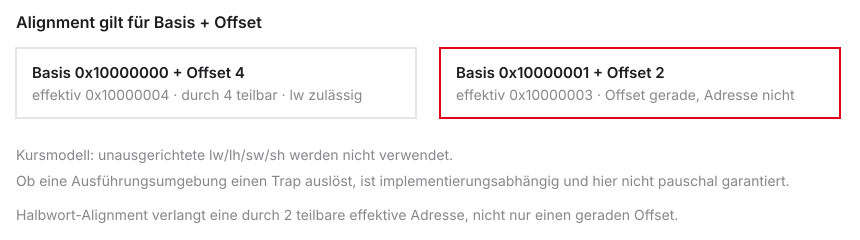
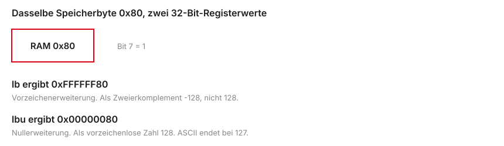

# Speicherzugriff & Kontrollfluss

::: notes
Diese Einheit gehört zu Mikrocomputertechnik 1. Sie verbindet Registerarithmetik mit Daten im Speicher und mit einem Programmablauf, der von Bedingungen abhängt. Die zwei Leitfragen lauten: Wo liegen die Daten, und welche Instruktion folgt als Nächstes? RAM heißt Random Access Memory, der Arbeitsspeicher. Der Program Counter, kurz PC, hält die Adresse der aktuellen Instruktion.

Adresse, Offset und gelesener Wert bleiben drei verschiedene Größen. Die effektive Adresse ist der Inhalt der Basis plus der vorzeichenerweiterte Byteoffset. Ein Load beschreibt das Zielregister, ein Store die adressierten Speicherbytes. Der PC geht um vier Byte weiter, außer ein Branch oder Jump wählt ein anderes Ziel. Kontrollfrage: Welche Groesse lässt ein lw unveraendert? Die Basis und den Speicherinhalt.
:::

## Von Arrays zu Schleifen

- Herzlich willkommen zur dritten Vorlesung in Mikrocomputertechnik 1
- Heute: von einfachen Variablen zu großen Datenmengen
- Kommunikation der CPU mit dem Arbeitsspeicher (RAM)
- Ausbruch aus dem linearen Programmablauf: Entscheidungen treffen
- Ziel: C-Schleifen in Hardware-nahen Assembler-Code übersetzen

```{mermaid}
%%| fig-width: 3.5
%%{init: {'theme': 'base', 'themeVariables': {'background': '#FFFFFF', 'primaryColor': '#FFFFFF', 'primaryBorderColor': '#E5E5EA', 'primaryTextColor': '#1D1D1F', 'lineColor': '#86868B', 'secondaryColor': '#F5F5F7', 'tertiaryColor': '#FFFFFF', 'mainBkg': '#FFFFFF', 'nodeBorder': '#E5E5EA', 'clusterBkg': '#F5F5F7', 'clusterBorder': '#E5E5EA', 'titleColor': '#1D1D1F', 'edgeLabelBackground': '#FFFFFF'}}}%%

graph LR
  RAM[(RAM)] -->|Load| CPU[CPU / Register]
  CPU -->|Branch/Jump| CPU
  CPU -->|Store| RAM
  style CPU fill:#FFFFFF,stroke:#E2001A,stroke-width:2px !important
  style RAM fill:#FFFFFF,stroke:#E5E5EA,stroke-width:1.5px
```

::: notes
Ein Array aus vielen Elementen passt nicht in die 32 allgemeinen Register. Der Zyklus ist: Adresse bestimmen, Wort laden, verarbeiten, gegebenenfalls speichern und zum nächsten Element gehen. Lernziele: einen lw- oder sw-Zugriff nachvollziehen, einen Index in einen Byteoffset umrechnen und eine einfache Schleife zu übersetzen. Die 32 Register sind nicht der gesamte Speicher der CPU, der Central Processing Unit.

Adresse, Offset und gelesener Wert bleiben drei verschiedene Größen. Die effektive Adresse ist der Inhalt der Basis plus der vorzeichenerweiterte Byteoffset. Ein Load beschreibt das Zielregister, ein Store die adressierten Speicherbytes. Der PC geht um vier Byte weiter, außer ein Branch oder Jump wählt ein anderes Ziel. Kontrollfrage: Welche Groesse lässt ein lw unveraendert? Die Basis und den Speicherinhalt.
:::

## Agenda für den heutigen Tag

1. Der Arbeitsspeicher — RAM-Konzept und Pointer-Grundlagen
2. Load & Store (Words) — 32-Bit-Daten und die 4-Byte-Schrittweite
3. Teilzugriffe — einzelne Bytes und das S-Type-Format
4. Kontrollfluss — bedingte Sprünge (Branches) für If-Abfragen
5. Unbedingte Sprünge — Jumps und das Überspringen von Else-Blöcken
6. Praxis in Venus — For- und While-Schleifen über Arrays

```{mermaid}
%%| fig-width: 3.5
%%{init: {'theme': 'base', 'themeVariables': {'background': '#FFFFFF', 'primaryColor': '#FFFFFF', 'primaryBorderColor': '#E5E5EA', 'primaryTextColor': '#1D1D1F', 'lineColor': '#86868B', 'secondaryColor': '#F5F5F7', 'tertiaryColor': '#FFFFFF', 'mainBkg': '#FFFFFF', 'nodeBorder': '#E5E5EA', 'clusterBkg': '#F5F5F7', 'clusterBorder': '#E5E5EA', 'titleColor': '#1D1D1F', 'edgeLabelBackground': '#FFFFFF'}}}%%

graph LR
  A[RAM / Pointer] --> B[Load / Store]
  B --> C[Bytes / S-Type]
  C --> D[Branches]
  D --> E[Jumps]
  E --> F[Venus]
  style A fill:#FFFFFF,stroke:#E2001A,stroke-width:2px !important
  style B fill:#FFFFFF,stroke:#E5E5EA,stroke-width:1.5px
  style C fill:#FFFFFF,stroke:#E5E5EA,stroke-width:1.5px
  style D fill:#FFFFFF,stroke:#E5E5EA,stroke-width:1.5px
  style E fill:#FFFFFF,stroke:#E5E5EA,stroke-width:1.5px
  style F fill:#FFFFFF,stroke:#E5E5EA,stroke-width:1.5px
```

::: notes
Die Agenda teilt die Werkzeuge. Zuerst Speicher: Pointer, Load und Store, ganze Wörter und Teilzugriffe. Danach Kontrollfluss: Branch und Jump. S-Type ist das Maschinenformat der Stores. B-Type, das Format der bedingten Sprünge, bleibt eine kurze Vorschau. Die Summenschleife wird erst ausführbar, wenn beide Teile stehen. Ein Branch if equal, beq, wählt die nächste Adresse abhängig von zwei Registerwerten.

Adresse, Offset und gelesener Wert bleiben drei verschiedene Größen. Die effektive Adresse ist der Inhalt der Basis plus der vorzeichenerweiterte Byteoffset. Ein Load beschreibt das Zielregister, ein Store die adressierten Speicherbytes. Der PC geht um vier Byte weiter, außer ein Branch oder Jump wählt ein anderes Ziel. Kontrollfrage: Welche Groesse lässt ein lw unveraendert? Die Basis und den Speicherinhalt.
:::

## Rückblick: Was wir bisher können

- Basis-Arithmetik: `add`, `sub` und logische Operationen
- Strikte Assembler-Syntax: Befehl `rd, rs1, rs2`
- I-Type: Konstanten direkt im Code (`addi`)
- Wichtige ABI-Register: `t0`–`t6`, `a0`–`a7`, `s0`–`s11`
- Jeder Befehl ist intern exakt 32 Bit groß

```asm
# Bisheriges Maximum an Komplexität:
li t0, 100         # Lade Konstante 100
addi t1, t0, 50    # t1 = 100 + 50
```

::: notes
Aus Einheit 2 bleiben li und addi. li ist load immediate, eine Pseudoinstruktion: der Assembler erzeugt eine oder mehrere echte Instruktionen. addi ist add immediate, Addition einer im Befehl stehenden Konstante. Nach li t0, 100 ist t0 gleich 100; addi t1, t0, 50 setzt t1 auf 150. Native Befehle dieses Kurses sind 32 Bit lang. Das gilt nicht für jede RISC-V-Erweiterung und nicht für jede Quelltextzeile. rd ist das Zielregister, rs1 und rs2 sind Quellen. Die Aliase t, a und s benennen Rollen, keine eigenen Hardwaretypen.

Adresse, Offset und gelesener Wert bleiben drei verschiedene Größen. Die effektive Adresse ist der Inhalt der Basis plus der vorzeichenerweiterte Byteoffset. Ein Load beschreibt das Zielregister, ein Store die adressierten Speicherbytes. Der PC geht um vier Byte weiter, außer ein Branch oder Jump wählt ein anderes Ziel. Kontrollfrage: Welche Groesse lässt ein lw unveraendert? Die Basis und den Speicherinhalt.
:::

## Das Register-Limit (Die Werkbank)

- Die ISA sieht 32 Architekturregister vor
- Jedes Register fasst 32 Bit (4 Bytes)
- `x0` ist fest 0; 31 Register sind beschreibbar
- Das ist nicht die Speicherkapazität der CPU: Caches und CSRs sind weiterer Zustand
- Ein ILP32-`int`-Array mit 1000 Elementen braucht 4000 Bytes im Speicher

::: notes
RV32I hat 32 allgemeine Register zu je 32 Bit. x0 ist fest null, 31 Register sind beschreibbar, zusammen 124 Byte. Ein ILP32-int-Array mit 1000 Elementen braucht 4000 Byte. ILP32 meint: int, long und Zeiger sind hier 32 Bit. Cache und weitere Steuerregister, CSR, gehören nicht zu diesen 124 Byte. Die Werkbank hält nur den gerade bearbeiteten Ausschnitt.

Adresse, Offset und gelesener Wert bleiben drei verschiedene Größen. Die effektive Adresse ist der Inhalt der Basis plus der vorzeichenerweiterte Byteoffset. Ein Load beschreibt das Zielregister, ein Store die adressierten Speicherbytes. Der PC geht um vier Byte weiter, außer ein Branch oder Jump wählt ein anderes Ziel. Kontrollfrage: Welche Groesse lässt ein lw unveraendert? Die Basis und den Speicherinhalt.
:::

## Die Memory Wall (Latenzen)

- Daten in Registern: typisch in etwa einem Taktzyklus verfügbar
- Externe DRAM-Zugriffe können deutlich länger dauern als ein Registerzugriff
- Das ist eine mögliche Hardwarekonfiguration, keine ISA-Latenz
- Mikrocontroller können SRAM auf dem Chip haben
- Diese Kluft heißt in dem Beispiel Memory Wall
- Jeder unnötige RAM-Zugriff bremst das Programm stark ab

```{mermaid}
%%| fig-width: 3.5
%%{init: {'theme': 'base', 'themeVariables': {'background': '#FFFFFF', 'primaryColor': '#FFFFFF', 'primaryBorderColor': '#E5E5EA', 'primaryTextColor': '#1D1D1F', 'lineColor': '#86868B', 'secondaryColor': '#F5F5F7', 'tertiaryColor': '#FFFFFF', 'mainBkg': '#FFFFFF', 'nodeBorder': '#E5E5EA', 'clusterBkg': '#F5F5F7', 'clusterBorder': '#E5E5EA', 'titleColor': '#1D1D1F', 'edgeLabelBackground': '#FFFFFF'}}}%%

graph TD
  R[Register: ca. 1 Takt] --> W[Memory Wall]
  M[RAM: 100 bis 300 Takte] --> W
  style R fill:#FFFFFF,stroke:#E2001A,stroke-width:2px !important
  style M fill:#FFFFFF,stroke:#E5E5EA,stroke-width:1.5px
  style W fill:#FFFFFF,stroke:#E5E5EA,stroke-width:1.5px
```

::: notes
Registerzugriffe sind im einfachen Modell sehr kurz. Ein Zugriff auf externen DRAM kann deutlich länger dauern. DRAM ist Dynamic RAM, SRAM ist Static RAM und kann auf einem Mikrocontroller im Chip liegen. Die ISA schreibt keine Latenz von 100 bis 300 Takten vor. Das Memory-Wall-Bild ist deshalb ein qualitativer Vergleich einer möglichen Konfiguration, keine Messreihe. Wer einen Wert mehrfach braucht, lässt ihn im Register und spart Zugriffe. Load und Store beseitigen die Lücke nicht.

Adresse, Offset und gelesener Wert bleiben drei verschiedene Größen. Die effektive Adresse ist der Inhalt der Basis plus der vorzeichenerweiterte Byteoffset. Ein Load beschreibt das Zielregister, ein Store die adressierten Speicherbytes. Der PC geht um vier Byte weiter, außer ein Branch oder Jump wählt ein anderes Ziel. Kontrollfrage: Welche Groesse lässt ein lw unveraendert? Die Basis und den Speicherinhalt.
:::

## Das RAM-Modell (Refresher)

- RAM als langes Array aus winzigen Fächern
- Jedes Fach hat eine eindeutige Hausnummer: die Speicheradresse
- Adressen in RV32I: 32 Bit (`0x00000000` bis `0xFFFFFFFF`)
- Ein 32-Bit-Zeiger kann $2^{32}$ Bytes benennen
- Das ist die Adressraumgröße dieser Kurskonfiguration, kein Zwang jeder RISC-V-Plattform
- Das C-Programm sieht diesen linearen Adressraum für sich allein

| Adresse (Hex) | Wert (Hex) | Bedeutung   |
|---------------|------------|-------------|
| `0x10000000`  | `0x12`     | Erstes Fach |
| `0x10000001`  | `0xAB`     | Zweites Fach|
| `0x10000002`  | `0x00`     | Drittes Fach|

::: notes
Eine Adresse und der dort gespeicherte Wert sind verschieden. 0x kennzeichnet Hexadezimalzahlen zur Basis 16. Ein 32-Bit-Byteadressraum umfasst 2 hoch 32 Adressen, also 4 Gibibyte, nicht automatisch 4 Gibibyte installierten RAM. Nicht jede Adresse ist zugreifbar. Ein privater Prozessadressraum setzt ein Betriebssystem voraus und gilt nicht für Venus oder Bare-Metal. Die drei Beispieladressen im Abstand von eins liegen je ein Byte auseinander, unabhängig vom gespeicherten Inhalt.

Adresse, Offset und gelesener Wert bleiben drei verschiedene Größen. Die effektive Adresse ist der Inhalt der Basis plus der vorzeichenerweiterte Byteoffset. Ein Load beschreibt das Zielregister, ein Store die adressierten Speicherbytes. Der PC geht um vier Byte weiter, außer ein Branch oder Jump wählt ein anderes Ziel. Kontrollfrage: Welche Groesse lässt ein lw unveraendert? Die Basis und den Speicherinhalt.
:::

## Byte-Adressierbarkeit

- Jedes Fach im RAM fasst exakt 1 Byte (8 Bits)
- Der Arbeitsspeicher ist byte-adressierbar
- Ein RISC-V-Register fasst 32 Bits (4 Bytes = 1 Word)
- Ein Word laden heißt: vier aufeinanderfolgende Fächer lesen
- Ein 32-Bit-Array belegt daher die Adressen 0, 4, 8, 12, …

```{mermaid}
%%| fig-width: 3.5
%%{init: {'theme': 'base', 'themeVariables': {'background': '#FFFFFF', 'primaryColor': '#FFFFFF', 'primaryBorderColor': '#E5E5EA', 'primaryTextColor': '#1D1D1F', 'lineColor': '#86868B', 'secondaryColor': '#F5F5F7', 'tertiaryColor': '#FFFFFF', 'mainBkg': '#FFFFFF', 'nodeBorder': '#E5E5EA', 'clusterBkg': '#F5F5F7', 'clusterBorder': '#E5E5EA', 'titleColor': '#1D1D1F', 'edgeLabelBackground': '#FFFFFF'}}}%%

graph LR
  Reg[32-Bit-Register] -->|braucht 4 Fächer| A0[0x00]
  Reg --> A1[0x01]
  Reg --> A2[0x02]
  Reg --> A3[0x03]
  style Reg fill:#FFFFFF,stroke:#E2001A,stroke-width:2px !important
  style A0 fill:#FFFFFF,stroke:#E5E5EA,stroke-width:1.5px
  style A1 fill:#FFFFFF,stroke:#E5E5EA,stroke-width:1.5px
  style A2 fill:#FFFFFF,stroke:#E5E5EA,stroke-width:1.5px
  style A3 fill:#FFFFFF,stroke:#E5E5EA,stroke-width:1.5px
```

::: notes
Ein Byte hat 8 Bit, ein RV32-Wort 32 Bit, also 4 Byte. Liegt ein Wort bei Basis B, belegt es B bis B+3; das nächste Wort beginnt bei B+4. Die Zahlen 0, 4 und 8 sind Offsets relativ zur Basis, keine Pflichtadressen jedes Arrays. Ein lw liest die vier Bytes gemeinsam. Vier getrennte Byte-Loads wären ein anderes Programm. Im ILP32-Modell ist ein C-int vier Byte groß.

Adresse, Offset und gelesener Wert bleiben drei verschiedene Größen. Die effektive Adresse ist der Inhalt der Basis plus der vorzeichenerweiterte Byteoffset. Ein Load beschreibt das Zielregister, ein Store die adressierten Speicherbytes. Der PC geht um vier Byte weiter, außer ein Branch oder Jump wählt ein anderes Ziel. Kontrollfrage: Welche Groesse lässt ein lw unveraendert? Die Basis und den Speicherinhalt.
:::

## Endianness (Refresher)

- In welcher Reihenfolge landen vier Bytes einer 32-Bit-Zahl im RAM?
- RISC-V nutzt standardmäßig Little-Endian (wie x86)
- Das niederwertigste Byte (LSB) liegt auf der kleinsten Adresse
- Das höchstwertige Byte (MSB) liegt auf der größten Adresse
- Relevant beim Debuggen im Venus-Memory-Tab

```text
Zahl 0xAABBCCDD an Adresse 0x100:
RAM 0x100: DD   (LSB zuerst)
RAM 0x101: CC
RAM 0x102: BB
RAM 0x103: AA
```

::: notes
Little Endian ist die Byte-Reihenfolge dieser Kurs- und Venus-Umgebung, nicht jeder denkbaren RISC-V-Plattform. Das niederwertigste Byte, least significant byte, liegt an der kleinsten Adresse. Das Wort 0xAABBCCDD steht ab Basis B als DD, CC, BB, AA. Ein anschließendes lw rekonstruiert wieder 0xAABBCCDD. Ein Hex-Dump kann Bytes oder zusammengesetzte Wörter zeigen. Die optische Reihenfolge ändert den Zahlenwert nicht. Innerhalb eines Bytes werden die Bits nicht umgedreht.

Adresse, Offset und gelesener Wert bleiben drei verschiedene Größen. Die effektive Adresse ist der Inhalt der Basis plus der vorzeichenerweiterte Byteoffset. Ein Load beschreibt das Zielregister, ein Store die adressierten Speicherbytes. Der PC geht um vier Byte weiter, außer ein Branch oder Jump wählt ein anderes Ziel. Kontrollfrage: Welche Groesse lässt ein lw unveraendert? Die Basis und den Speicherinhalt.
:::

## Die Load/Store-Architektur

- In Einheit 2: goldene RISC-Regel — die ALU greift nie direkt auf den RAM zu
- Befehle wie `add` mit RAM-Operanden existieren in RISC-V nicht
- Zwei Tore zwischen CPU und RAM:
  - Load (Lesen): RAM $\rightarrow$ Register
  - Store (Schreiben): Register $\rightarrow$ RAM

```{mermaid}
%%| fig-width: 3.5
%%{init: {'theme': 'base', 'themeVariables': {'background': '#FFFFFF', 'primaryColor': '#FFFFFF', 'primaryBorderColor': '#E5E5EA', 'primaryTextColor': '#1D1D1F', 'lineColor': '#86868B', 'secondaryColor': '#F5F5F7', 'tertiaryColor': '#FFFFFF', 'mainBkg': '#FFFFFF', 'nodeBorder': '#E5E5EA', 'clusterBkg': '#F5F5F7', 'clusterBorder': '#E5E5EA', 'titleColor': '#1D1D1F', 'edgeLabelBackground': '#FFFFFF'}}}%%

graph LR
  RAM[(Arbeitsspeicher)] -->|Load lw| Reg[Register x1-x31]
  Reg -->|Store sw| RAM
  Reg <-->|Operanden| ALU((ALU))
  style ALU fill:#FFFFFF,stroke:#E5E5EA,stroke-width:1.5px
  style Reg fill:#FFFFFF,stroke:#E2001A,stroke-width:2px !important
  style RAM fill:#FFFFFF,stroke:#E5E5EA,stroke-width:1.5px
```

::: notes
add rechnet mit Registeroperanden. lw und sw veranlassen den Speicherzugriff. Die ALU, die arithmetisch-logische Einheit, darf dabei die Adresse berechnen. Sie ist also nicht vom RAM abgeschnitten. Beispiel: zwei Wörter 10 und 20 liegen bei B und B+4. lw t0, 0(s1) und lw t1, 4(s1) laden sie, add t2, t0, t1 bildet 30. Die Basis liefert die Adresse, die gelesenen Register die Daten.

Adresse, Offset und gelesener Wert bleiben drei verschiedene Größen. Die effektive Adresse ist der Inhalt der Basis plus der vorzeichenerweiterte Byteoffset. Ein Load beschreibt das Zielregister, ein Store die adressierten Speicherbytes. Der PC geht um vier Byte weiter, außer ein Branch oder Jump wählt ein anderes Ziel. Kontrollfrage: Welche Groesse lässt ein lw unveraendert? Die Basis und den Speicherinhalt.
:::

## Was ist ein Pointer?

- Ein Pointer ist eine 32-Bit-Hausnummer (Speicheradresse) — keine Magie
- In Assembler liegen Adressen in normalen Registern (`x0`–`x31`)
- Die CPU unterscheidet die Zahl 10 nicht von der Adresse `0x1000`
- Erst der Befehl (`add` vs. `lw`) bestimmt die Interpretation

```c
// C: Pointer anlegen
int array[3] = {10, 20, 30};
int *ptr = array; // z. B. 0x00400000

// In Assembler ist ptr nur ein Wert in einem Register
```

::: notes
Ein Pointer ist in diesem ILP32-Modell eine 32-Bit-Adresse. In int array[3] = {10, 20, 30} und int *ptr = array enthält ptr die Startadresse, *ptr den Wert 10. Die Adresse liegt in einem beschreibbaren Register. x0 kann nur null liefern und daher keine variable Basis 0x1000 halten. Eine feste Beispieladresse ist illustrativ. C kennt zusätzlich Typen und Objektgrenzen, die ein nackter Registerwert nicht trägt.

Adresse, Offset und gelesener Wert bleiben drei verschiedene Größen. Die effektive Adresse ist der Inhalt der Basis plus der vorzeichenerweiterte Byteoffset. Ein Load beschreibt das Zielregister, ein Store die adressierten Speicherbytes. Der PC geht um vier Byte weiter, außer ein Branch oder Jump wählt ein anderes Ziel. Kontrollfrage: Welche Groesse lässt ein lw unveraendert? Die Basis und den Speicherinhalt.
:::

## Adressen in Registern

- Mit `li` (Load Immediate) Pointer initialisieren
- Die Adresse im Register dient als Base-Pointer
- Der Base-Pointer markiert den Start eines Arrays im RAM
- `addi` auf den Pointer entspricht Bewegung im Speicher
- Von diesem Anker aus adressieren wir alle Elemente

```asm
# Array startet bei 0x10000000 — Base-Pointer in s1:
li s1, 0x10000000

# s1 ist der Finger, der auf den RAM zeigt
```

::: notes
li s1, 0x10000000 schreibt nur eine Zahl in s1 und legt dort kein Array an. la s1, myArray, load address, lädt die Adresse eines deklarierten Labels und kann mehrere native Instruktionen brauchen. addi s1, s1, 4 verschiebt die Basis um ein ILP32-int. Das ist richtig, wenn der Pointer absichtlich zum nächsten Element wandern soll, und unpraktisch, wenn die ursprüngliche Basis danach noch gebraucht wird.

Adresse, Offset und gelesener Wert bleiben drei verschiedene Größen. Die effektive Adresse ist der Inhalt der Basis plus der vorzeichenerweiterte Byteoffset. Ein Load beschreibt das Zielregister, ein Store die adressierten Speicherbytes. Der PC geht um vier Byte weiter, außer ein Branch oder Jump wählt ein anderes Ziel. Kontrollfrage: Welche Groesse lässt ein lw unveraendert? Die Basis und den Speicherinhalt.
:::

## Load & Store (Ganze Wörter)

- Datenfluss zwischen Register und RAM etablieren
- RISC-V-Adressierung: Base + Offset
- `lw` (Load Word): 32-Bit-Blöcke lesen
- `sw` (Store Word): 32-Bit-Blöcke schreiben
- Stolperfalle: 4-Byte-Schrittweite bei Integer-Arrays

```{mermaid}
%%| fig-width: 3.5
%%{init: {'theme': 'base', 'themeVariables': {'background': '#FFFFFF', 'primaryColor': '#FFFFFF', 'primaryBorderColor': '#E5E5EA', 'primaryTextColor': '#1D1D1F', 'lineColor': '#86868B', 'secondaryColor': '#F5F5F7', 'tertiaryColor': '#FFFFFF', 'mainBkg': '#FFFFFF', 'nodeBorder': '#E5E5EA', 'clusterBkg': '#F5F5F7', 'clusterBorder': '#E5E5EA', 'titleColor': '#1D1D1F', 'edgeLabelBackground': '#FFFFFF'}}}%%

graph LR
  Base[Base-Register] -->|Pointer| Addr{plus Offset}
  Addr --> RAM[(RAM-Adresse)]
  style Base fill:#FFFFFF,stroke:#E2001A,stroke-width:2px !important
  style Addr fill:#FFFFFF,stroke:#E5E5EA,stroke-width:1.5px
  style RAM fill:#FFFFFF,stroke:#E5E5EA,stroke-width:1.5px
```

::: notes
lw heißt load word, sw store word. Beide bilden die effektive Adresse als Basis plus Offset und bewegen 32 Bit. Die Instruktion selbst ist ebenfalls 32 Bit breit; Datenbreite und Befehlslänge sind trotzdem verschiedene Dinge. Der Offset erlaubt den Zugriff auf ein Element, ohne die Basis dauerhaft zu ändern. Das gemeinsame Beispiel bleibt ein int-Array mit bekannter Belegung.

Adresse, Offset und gelesener Wert bleiben drei verschiedene Größen. Die effektive Adresse ist der Inhalt der Basis plus der vorzeichenerweiterte Byteoffset. Ein Load beschreibt das Zielregister, ein Store die adressierten Speicherbytes. Der PC geht um vier Byte weiter, außer ein Branch oder Jump wählt ein anderes Ziel. Kontrollfrage: Welche Groesse lässt ein lw unveraendert? Die Basis und den Speicherinhalt.
:::

## Das Problem der Adressierung

- Array mit 5 Werten; Base-Pointer `s1` zeigt auf den Start
- Wie greifen wir elegant auf Element 3 zu?
- `addi s1, s1, 12` verschiebt die Basis dauerhaft auf Index 3
- Für einen Einzelzugriff bleibt die Basis besser unverändert: Offset 12 im Befehl
- Lösung: Syntax der Load-/Store-Befehle

::: notes
Index 3 eines int-Arrays liegt 12 Byte hinter der Basis, weil 3 mal 4 gleich 12 ist. addi s1, s1, 12 setzt die Basis dauerhaft auf dieses Element. Das ist erlaubt, wenn der weitere Ablauf genau dort weitermacht. Für einen einzelnen Zugriff mit weiterhin benötigtem Start ist lw oder sw mit Offset 12 besser: s1 bleibt die Basis. Zerstört wird der Pointer nicht; er wird nur verändert.

Adresse, Offset und gelesener Wert bleiben drei verschiedene Größen. Die effektive Adresse ist der Inhalt der Basis plus der vorzeichenerweiterte Byteoffset. Ein Load beschreibt das Zielregister, ein Store die adressierten Speicherbytes. Der PC geht um vier Byte weiter, außer ein Branch oder Jump wählt ein anderes Ziel. Kontrollfrage: Welche Groesse lässt ein lw unveraendert? Die Basis und den Speicherinhalt.
:::

## Base + Offset (Konzept)

- Speicherzugriffe in RISC-V: immer Base + Offset
- Base: Register mit der Startadresse (z. B. `s1`)
- Offset: konstante Zahl (Immediate), temporär addiert
- Zieladresse = Registerwert + Konstante
- Der Wert im Base-Register bleibt unverändert

```c
// C-Metapher für Base + Offset:
int element = array[3];
// array = Base, 3 (bzw. 12 Bytes) = Offset
```

::: notes
Für die normalen Loads und Stores dieser Einheit gilt: effektive Adresse gleich Inhalt von rs1 plus vorzeichenerweitertes 12-Bit-Immediate. Der Bereich ist −2048 bis +2047 Byte. Mit Basis 0x1000 und Offset 12 entsteht 0x100C, s1 bleibt 0x1000. Die C-Indexzahl 3 ist nicht selbst der Byteoffset. Größere Abstände brauchen mehrere Befehle oder einen verschobenen Pointer. Ein negativer Offset −4 geht vier Byte zurück, er ist kein Arrayindex −4.

Adresse, Offset und gelesener Wert bleiben drei verschiedene Größen. Die effektive Adresse ist der Inhalt der Basis plus der vorzeichenerweiterte Byteoffset. Ein Load beschreibt das Zielregister, ein Store die adressierten Speicherbytes. Der PC geht um vier Byte weiter, außer ein Branch oder Jump wählt ein anderes Ziel. Kontrollfrage: Welche Groesse lässt ein lw unveraendert? Die Basis und den Speicherinhalt.
:::

## Load Word (`lw`)

- 32-Bit-Wort aus dem RAM in ein Register laden
- Syntax: `lw rd, offset(rs1)`
- `rd`: Zielregister für den RAM-Wert
- `offset`: Konstante (12-Bit-Immediate)
- `rs1`: Base-Register (in Klammern)
- Lädt exakt 4 Bytes ab der berechneten Adresse

```asm
# Element 8 Bytes nach dem Pointer in s1 → t0
lw t0, 8(s1)

# Adresse = s1 + 8; hole 4 Bytes
```

::: notes
lw t0, 8(s1) lädt vier Bytes ab s1 plus 8 nach t0. rd ist das Ziel, rs1 die Basis. Bei Basis 0x1000 und Array 10, 20, 30, 40, 50 wird an 0x1008 der Wert 30 gelesen. s1 bleibt unverändert. Unter Little Endian setzen sich die vier Bytes zum Registerwort zusammen. Die Klammern sind Assembler-Syntax, kein Funktionsaufruf. Die Adresse muss gültig und für Wörter durch 4 teilbar sein.

Adresse, Offset und gelesener Wert bleiben drei verschiedene Größen. Die effektive Adresse ist der Inhalt der Basis plus der vorzeichenerweiterte Byteoffset. Ein Load beschreibt das Zielregister, ein Store die adressierten Speicherbytes. Der PC geht um vier Byte weiter, außer ein Branch oder Jump wählt ein anderes Ziel. Kontrollfrage: Welche Groesse lässt ein lw unveraendert? Die Basis und den Speicherinhalt.
:::

## Datenfluss beim `lw`

- Flussrichtung visualisieren: wie eine C-Zuweisung
- Bei `lw` fließt das Datum von rechts nach links
- Klammer (rechts): Quelle (RAM)
- Register (links): Ziel

```{mermaid}
%%| fig-width: 3.5
%%{init: {'theme': 'base', 'themeVariables': {'background': '#FFFFFF', 'primaryColor': '#FFFFFF', 'primaryBorderColor': '#E5E5EA', 'primaryTextColor': '#1D1D1F', 'lineColor': '#86868B', 'secondaryColor': '#F5F5F7', 'tertiaryColor': '#FFFFFF', 'mainBkg': '#FFFFFF', 'nodeBorder': '#E5E5EA', 'clusterBkg': '#F5F5F7', 'clusterBorder': '#E5E5EA', 'titleColor': '#1D1D1F', 'edgeLabelBackground': '#FFFFFF'}}}%%

graph RL
  RAM[(RAM: s1 + 8)] -->|4 Bytes| Reg[Ziel: t0]
  style RAM fill:#FFFFFF,stroke:#86868B,stroke-width:1.5px
  style Reg fill:#FFFFFF,stroke:#E2001A,stroke-width:2px !important
```

::: notes
Der Adressweg ist s1 plus 8. Der Datenweg bringt das Wort 30 nach t0. Links im Befehl steht das Ziel nur als Merkhilfe, nicht als Lage im Chip. Ein alter Wert in t0 wird überschrieben. s1 und der Speicher bleiben gleich. Nach dem Befehl steht 30 in t0, nicht die Adresse 0x1008. Die Adresse wurde nur benutzt.

Adresse, Offset und gelesener Wert bleiben drei verschiedene Größen. Die effektive Adresse ist der Inhalt der Basis plus der vorzeichenerweiterte Byteoffset. Ein Load beschreibt das Zielregister, ein Store die adressierten Speicherbytes. Der PC geht um vier Byte weiter, außer ein Branch oder Jump wählt ein anderes Ziel. Kontrollfrage: Welche Groesse lässt ein lw unveraendert? Die Basis und den Speicherinhalt.
:::

## Store Word (`sw`)

- 32-Bit-Wort vom Register zurück in den RAM schreiben
- Syntax: `sw rs2, offset(rs1)`
- `rs2`: Quellregister (zu speichernde Daten)
- `offset(rs1)`: Zieladresse im RAM
- Ausnahme: Ziel (RAM) steht rechts — Quellregister links

```asm
# Wert aus t0 nach RAM-Adresse (s1 + 12)
sw t0, 12(s1)

# t0 wird nicht überschrieben — es ist die Quelle
```

::: notes
sw t0, 12(s1) speichert die 32 Bit aus t0 ab der Adresse s1 plus 12. rs1 ist die Basis, rs2 die Datenquelle. Es gibt kein rd. Bei s1 gleich B und t0 gleich 150 ändern sich vier Bytes ab B plus 12, also array-Index 3 im ILP32-Modell. t0 und s1 bleiben unverändert. Die Merkhilfe links steht das Ziel gilt für lw, nicht für sw.

Adresse, Offset und gelesener Wert bleiben drei verschiedene Größen. Die effektive Adresse ist der Inhalt der Basis plus der vorzeichenerweiterte Byteoffset. Ein Load beschreibt das Zielregister, ein Store die adressierten Speicherbytes. Der PC geht um vier Byte weiter, außer ein Branch oder Jump wählt ein anderes Ziel. Kontrollfrage: Welche Groesse lässt ein lw unveraendert? Die Basis und den Speicherinhalt.
:::

## Datenfluss beim `sw`

- Bei `sw` fließt das Datum von links nach rechts
- Register (links): Quelle
- Berechnete RAM-Adresse (rechts): Ziel
- Store schreibt keinen neuen Wert ins Register File — kein `rd`

```{mermaid}
%%| fig-width: 3.5
%%{init: {'theme': 'base', 'themeVariables': {'background': '#FFFFFF', 'primaryColor': '#FFFFFF', 'primaryBorderColor': '#E5E5EA', 'primaryTextColor': '#1D1D1F', 'lineColor': '#86868B', 'secondaryColor': '#F5F5F7', 'tertiaryColor': '#FFFFFF', 'mainBkg': '#FFFFFF', 'nodeBorder': '#E5E5EA', 'clusterBkg': '#F5F5F7', 'clusterBorder': '#E5E5EA', 'titleColor': '#1D1D1F', 'edgeLabelBackground': '#FFFFFF'}}}%%

graph LR
  Reg[Quelle: t0] -->|4 Bytes| RAM[(RAM: s1 + 12)]
  style Reg fill:#FFFFFF,stroke:#86868B,stroke-width:1.5px
  style RAM fill:#FFFFFF,stroke:#E2001A,stroke-width:2px !important
```

::: notes
Beim Store fließen die Daten aus t0, die Adresse entsteht aus s1 plus 12. Das Register File ist die Registerbank. Unter Little Endian wird 150, hexadezimal 0x96, als 96 00 00 00 abgelegt. Nachbarbytes außerhalb dieser vier Adressen bleiben unverändert. Der Store ändert den Speicherzustand, obwohl kein allgemeines Register das Ziel ist.

Adresse, Offset und gelesener Wert bleiben drei verschiedene Größen. Die effektive Adresse ist der Inhalt der Basis plus der vorzeichenerweiterte Byteoffset. Ein Load beschreibt das Zielregister, ein Store die adressierten Speicherbytes. Der PC geht um vier Byte weiter, außer ein Branch oder Jump wählt ein anderes Ziel. Kontrollfrage: Welche Groesse lässt ein lw unveraendert? Die Basis und den Speicherinhalt.
:::

## C-Arrays vs. Assembler

- Array aus 32-Bit-Integern (`int`) durchlaufen
- In C abstrahiert: `array[0]`, `array[1]`, `array[2]`
- In Assembler: Bytes zählen — keine Index-Magie
- Jeder `int` ist 4 Bytes groß → Adressen um 4 erhöhen
- Häufigste Fehlerquelle im Labor

```c
// C: Indizes steigen um 1
array[0] = 10;
array[1] = 20;
array[2] = 30;
```

::: notes
Im ILP32-Modell ist sizeof(int) gleich 4. Die Elemente 10, 20 und 30 beginnen bei B, B plus 4 und B plus 8. Der C-Index zählt Elemente, der Assembler-Offset zählt Bytes. Offset 1 ist das zweite Byte des ersten Wortes, nicht das zweite int. Das gilt für dieses Datenmodell, nicht für jede C-Implementierung der Welt.

Adresse, Offset und gelesener Wert bleiben drei verschiedene Größen. Die effektive Adresse ist der Inhalt der Basis plus der vorzeichenerweiterte Byteoffset. Ein Load beschreibt das Zielregister, ein Store die adressierten Speicherbytes. Der PC geht um vier Byte weiter, außer ein Branch oder Jump wählt ein anderes Ziel. Kontrollfrage: Welche Groesse lässt ein lw unveraendert? Die Basis und den Speicherinhalt.
:::

## Die 4-Byte-Schrittweite

- Startadressen aufeinanderfolgender 32-Bit-Wörter: Vielfache von 4
- Index 0 → Offset 0
- Index 1 → Offset 4
- Index 2 → Offset 8
- Index 3 → Offset 12

| C-Index | Assembler-Offset | RAM (Base = `0x100`)   |
|---------|------------------|------------------------|
| `[0]`   | 0                | `0x100`–`0x103`        |
| `[1]`   | 4                | `0x104`–`0x107`        |
| `[2]`   | 8                | `0x108`–`0x10B`        |

::: notes
Offset gleich 4 mal i. Mit Basis 0x100 belegen die Wörter 0x100 bis 0x103, 0x104 bis 0x107, 0x108 bis 0x10B und 0x10C bis 0x10F. Die mittleren Bytes gehören zum jeweiligen int. Es liegen keine drei leeren Fächer zwischen den Elementen. Die Starts sind durch 4 teilbar, wenn die Basis es ist.

Adresse, Offset und gelesener Wert bleiben drei verschiedene Größen. Die effektive Adresse ist der Inhalt der Basis plus der vorzeichenerweiterte Byteoffset. Ein Load beschreibt das Zielregister, ein Store die adressierten Speicherbytes. Der PC geht um vier Byte weiter, außer ein Branch oder Jump wählt ein anderes Ziel. Kontrollfrage: Welche Groesse lässt ein lw unveraendert? Die Basis und den Speicherinhalt.
:::

## Element 0 laden

- Pointer auf Array-Start liegt in `s1`
- `array[0]` nach `t0` laden
- Offset ist 0

```asm
# Lade array[0]
lw t0, 0(s1)

# RAM-Adresse = s1 + 0
```

::: notes
Voraussetzung: s1 enthält die Basis B und das erste Wort ist 10. lw t0, 0(s1) liest B bis B plus 3 und setzt t0 auf 10. Offset 0 heißt Zugriff an der Basis, nicht kein Zugriff und nicht den Wert 0 laden. s1 bleibt B. lw und die beiden Registerrollen gelten auch dann, wenn sie schon vorkamen.

Adresse, Offset und gelesener Wert bleiben drei verschiedene Größen. Die effektive Adresse ist der Inhalt der Basis plus der vorzeichenerweiterte Byteoffset. Ein Load beschreibt das Zielregister, ein Store die adressierten Speicherbytes. Der PC geht um vier Byte weiter, außer ein Branch oder Jump wählt ein anderes Ziel. Kontrollfrage: Welche Groesse lässt ein lw unveraendert? Die Basis und den Speicherinhalt.
:::

## Element 1 und 2 laden

- `array[1]` und `array[2]` laden
- Offsets: 4 und 8
- Base-Register `s1` bleibt unverändert (weiterhin Element 0)

```asm
lw t1, 4(s1)     # array[1], Adresse = s1 + 4
lw t2, 8(s1)     # array[2], Adresse = s1 + 8

# s1 ändert sich durch die Offsets nicht
```

::: notes
lw t1, 4(s1) lädt 20 von B plus 4. lw t2, 8(s1) lädt 30 von B plus 8, beim Array 10, 20, 30, 40, 50. Beide Befehle lassen s1 auf B. Je Zugriff werden vier Bytes gelesen. Die berechnete Adresse wird nicht nach s1 geschrieben. Hätte man s1 vorher um 4 erhöht, läge ein Offset 8 relativ zur neuen Basis bei der alten Adresse B plus 12.

Adresse, Offset und gelesener Wert bleiben drei verschiedene Größen. Die effektive Adresse ist der Inhalt der Basis plus der vorzeichenerweiterte Byteoffset. Ein Load beschreibt das Zielregister, ein Store die adressierten Speicherbytes. Der PC geht um vier Byte weiter, außer ein Branch oder Jump wählt ein anderes Ziel. Kontrollfrage: Welche Groesse lässt ein lw unveraendert? Die Basis und den Speicherinhalt.
:::

## Die Illusion des C-Compilers

- Warum nie `array[i * 4]` in C schreiben?
- Der Compiler nimmt Ihnen die Skalierung ab
- Bei `int`-Arrays weiß er: Elementgröße 4 Bytes
- Aus `array[i]` wird Assembler mit $i \cdot 4$ vor dem Load
- Assembler enttarnt diese High-Level-Abstraktion

```c
// Sie schreiben in ILP32, sizeof(int) = 4:
int x = array[i];

// Typisiert: array + i  bzw.  &array[i]
// Byteadresse: Basis + i * sizeof(array[0])
// &array hat den Typ int (*)[N] und eine andere Schrittweite
```

::: notes
array plus i und die Adresse von array an der Stelle i haben die Schrittweite eines int, hier 4 Byte. Die Adresse des gesamten Arrays, Typ int Zeiger auf ein Feld der Länge 5, hat die Schrittweite 20 Byte. Gleiche Startadresse heißt nicht gleicher Typ. array mit Index 4 mal i wählt das Element mit diesem Index, es ist keine zusätzliche Byteskalierung. Die Formel Basis plus i mal 4 ist die Byteadresse, kein Ersatz für den typisierten C-Ausdruck. Ein Compilerlauf wird hier nicht behauptet.

Adresse, Offset und gelesener Wert bleiben drei verschiedene Größen. Die effektive Adresse ist der Inhalt der Basis plus der vorzeichenerweiterte Byteoffset. Ein Load beschreibt das Zielregister, ein Store die adressierten Speicherbytes. Der PC geht um vier Byte weiter, außer ein Branch oder Jump wählt ein anderes Ziel. Kontrollfrage: Welche Groesse lässt ein lw unveraendert? Die Basis und den Speicherinhalt.
:::

## Komplettes Beispiel (Lesen)

- C-Zeile: `a = array[2];`
- `a` in `s0`, Array-Base in `s1`
- Index 2 → Offset $2 \cdot 4 = 8$

```c
int a = array[2];
```

```asm
# s0 = a, s1 = Base-Pointer
lw s0, 8(s1)
```

::: notes
lw s0, 8(s1) übersetzt a gleich array an Index 2, wenn s1 die Basis ist und das Array 10, 20, 30, 40, 50 enthält. Dann wird s0 gleich 30. Die Zeile ist unter dieser Voraussetzung vollständig, aber noch kein eigenständiges Venus-Programm. Einstieg, la und Abschluss stehen in beispiele/vl3_wordzugriff.s. s0 ist hier das Zielregister der Zuweisung, s1 nur die Adresse.

Adresse, Offset und gelesener Wert bleiben drei verschiedene Größen. Die effektive Adresse ist der Inhalt der Basis plus der vorzeichenerweiterte Byteoffset. Ein Load beschreibt das Zielregister, ein Store die adressierten Speicherbytes. Der PC geht um vier Byte weiter, außer ein Branch oder Jump wählt ein anderes Ziel. Kontrollfrage: Welche Groesse lässt ein lw unveraendert? Die Basis und den Speicherinhalt.
:::

## Komplettes Beispiel (Schreiben)

- Modifikation: `array[3] = a + b;`
- Annahmen: `a` in `s0`, `b` in `t0`, Array in `s1`
- Zwei Schritte: erst ALU, dann Store

```c
array[3] = a + b;
```

```asm
add t1, s0, t0      # t1 = a + b
sw t1, 12(s1)       # Index 3 → Offset 12
```

::: notes
Mit a gleich 7 in s0 und b gleich 8 in t0 bildet add t1, s0, t0 die Summe 15. sw t1, 12(s1) schreibt sie nach Index 3. Die ALU schreibt nicht selbst in den RAM. Das Array 10, 20, 30, 40, 50 wird zu 10, 20, 30, 15, 50. t1 hält das Ergebnis, s1 die Basis. Die Werte bleiben in 32 Bit ohne Überlauf. Initialisierung und Programmende gehören zum ausführbaren Beispiel.

Adresse, Offset und gelesener Wert bleiben drei verschiedene Größen. Die effektive Adresse ist der Inhalt der Basis plus der vorzeichenerweiterte Byteoffset. Ein Load beschreibt das Zielregister, ein Store die adressierten Speicherbytes. Der PC geht um vier Byte weiter, außer ein Branch oder Jump wählt ein anderes Ziel. Kontrollfrage: Welche Groesse lässt ein lw unveraendert? Die Basis und den Speicherinhalt.
:::

## Speicherausrichtung (Alignment)

- Die **effektive** Adresse `Basis + Offset` muss zur Zugriffsbreite passen
- Ein gerader Offset reicht bei ungerader Basis nicht
- Wort: effektiv durch 4 teilbar; Halbwort: durch 2
- Kursmodell: unausgerichtete Zugriffe werden nicht verwendet
- Ein Alignment-Trap ist nicht für jede RISC-V-Umgebung garantiert



::: notes
Ausgerichtet ist ein Zugriff, wenn die effektive Adresse durch die Breite in Byte teilbar ist. Für lw und sw muss Basis plus Offset durch 4 teilbar sein, für lh und sh durch 2. Ein gerader Offset genügt nicht, wenn die Basis ungerade ist. Ob eine Umgebung unausgerichtete Zugriffe ausführt oder mit einem Trap abbricht, steht nicht pauschal in der ISA. Die alte Grafik mit garantierter Exception ist deshalb entfernt. Im Kurs verwenden wir natürliche Ausrichtung.

Adresse, Offset und gelesener Wert bleiben drei verschiedene Größen. Die effektive Adresse ist der Inhalt der Basis plus der vorzeichenerweiterte Byteoffset. Ein Load beschreibt das Zielregister, ein Store die adressierten Speicherbytes. Der PC geht um vier Byte weiter, außer ein Branch oder Jump wählt ein anderes Ziel. Kontrollfrage: Welche Groesse lässt ein lw unveraendert? Die Basis und den Speicherinhalt.
:::

## Teilzugriffe & S-Type-Format

- Nicht alles ist ein 32-Bit-Integer (z. B. ASCII-Zeichen)
- Zugriff auf einzelne Bytes: `lb` und `sb`
- Vorzeichenerweiterung bei kleinen Daten
- Signed vs. Unsigned Loads
- S-Type-Instruction-Format für Store-Befehle

```{mermaid}
%%| fig-width: 3.5
%%{init: {'theme': 'base', 'themeVariables': {'background': '#FFFFFF', 'primaryColor': '#FFFFFF', 'primaryBorderColor': '#E5E5EA', 'primaryTextColor': '#1D1D1F', 'lineColor': '#86868B', 'secondaryColor': '#F5F5F7', 'tertiaryColor': '#FFFFFF', 'mainBkg': '#FFFFFF', 'nodeBorder': '#E5E5EA', 'clusterBkg': '#F5F5F7', 'clusterBorder': '#E5E5EA', 'titleColor': '#1D1D1F', 'edgeLabelBackground': '#FFFFFF'}}}%%

graph LR
  RAM[1 Byte im RAM] -->|lb| Reg[32-Bit-Register]
  Reg -->|Sign Ext| ALU
  style RAM fill:#FFFFFF,stroke:#E5E5EA,stroke-width:1.5px
  style Reg fill:#FFFFFF,stroke:#E2001A,stroke-width:2px !important
  style ALU fill:#FFFFFF,stroke:#E5E5EA,stroke-width:1.5px
```

::: notes
Ein C-char-Array hat ein Byte je Element. Ein Schriftzeichen braucht je nach Codierung nicht immer ein Byte. ASCII, der 7-Bit-Code, reicht von 0 bis 127. Ein lw über einen String kann mehrere Bytes lesen, ist aber nicht die direkte Übersetzung eines einzelnen Zeichenzugriffs. Die zwei Fragen lauten: Wie wird ein kleines Speicherstück zum 32-Bit-Register, und wie codiert ein Store zwei Quellregister plus Offset?

Adresse, Offset und gelesener Wert bleiben drei verschiedene Größen. Die effektive Adresse ist der Inhalt der Basis plus der vorzeichenerweiterte Byteoffset. Ein Load beschreibt das Zielregister, ein Store die adressierten Speicherbytes. Der PC geht um vier Byte weiter, außer ein Branch oder Jump wählt ein anderes Ziel. Kontrollfrage: Welche Groesse lässt ein lw unveraendert? Die Basis und den Speicherinhalt.
:::

## Problem: Kleine Daten laden

- Ein C-String (`char[]`) hat Elemente von 1 Byte
- `lw` würde vier Buchstaben gleichzeitig laden
- Lösung: `lb` (Load Byte) und `lh` (Load Halfword)
- Bei Byte-Arrays ist das Offset tatsächlich +1 (Element = 1 Byte)

```c
char text[] = "ABC";
char a = text[0];
char b = text[1]; // Offset in Assembler wirklich +1
```

::: notes
char text mit dem Inhalt ABC und abschließender Null besteht aus den Bytes 0x41, 0x42, 0x43 und 0x00. text an Index 1 liegt bei B plus 1, nicht bei B plus 4. Für diese positiven ASCII-Werte liefern lb und lbu denselben Registerwert. Der Unterschied erscheint, wenn Bit 7 gesetzt ist. Ob ein schlichtes C-char vorzeichenbehaftet ist, hängt von der Implementierung ab. Ein einzelnes Zeichen lädt man als Byte, ohne jede Wortverarbeitung von Bytefolgen zu verbieten.

Adresse, Offset und gelesener Wert bleiben drei verschiedene Größen. Die effektive Adresse ist der Inhalt der Basis plus der vorzeichenerweiterte Byteoffset. Ein Load beschreibt das Zielregister, ein Store die adressierten Speicherbytes. Der PC geht um vier Byte weiter, außer ein Branch oder Jump wählt ein anderes Ziel. Kontrollfrage: Welche Groesse lässt ein lw unveraendert? Die Basis und den Speicherinhalt.
:::

## Load Byte (`lb`)

- Syntax: `lb rd, offset(rs1)`
- Liest genau 1 Byte von der Adresse
- Zielregister `rd` ist 32 Bit groß
- 8 Bits geladen — was passiert mit den restlichen 24 Bits?
- Die Architektur füllt die Lücke automatisch (Sign-Extension)

```asm
lb t0, 0(s1)

# RAM liefert z. B. 0x8F (8 Bits)
# Register t0: 0x??????8F — linke Bits werden aufgefüllt
```

::: notes
lb, load byte, liest acht Bit und definiert sofort das ganze Zielregister. Das Speicherbyte 0x8F wird zu 0xFFFFFF8F. Bit 7 ist 1 und wird in die oberen 24 Bit kopiert. Als Zweierkomplement ist das −113, weil 143 minus 256 gleich −113 ist. Die Basis bleibt unverändert. Ein Registerzustand mit Fragezeichen entsteht dabei nicht. Solche Zeichen wären nur eine noch offene Frage, kein Zwischenwert der Hardware.

Adresse, Offset und gelesener Wert bleiben drei verschiedene Größen. Die effektive Adresse ist der Inhalt der Basis plus der vorzeichenerweiterte Byteoffset. Ein Load beschreibt das Zielregister, ein Store die adressierten Speicherbytes. Der PC geht um vier Byte weiter, außer ein Branch oder Jump wählt ein anderes Ziel. Kontrollfrage: Welche Groesse lässt ein lw unveraendert? Die Basis und den Speicherinhalt.
:::


## Sign-Extension (Vorzeichenerweiterung)

- Nach `lb` bleiben links im 32-Bit-Register 24 Bits leer
- Die CPU darf diese Lücke nicht mit Zufallswerten oder sturen Nullen füllen
- Lösung: automatische Vorzeichenerweiterung (Sign-Extension)
- Bit 7 des geladenen Bytes wird in alle 24 linken Bits kopiert
- So bleibt der Zweierkomplement-Wert (z. B. $-5$) identisch

```{mermaid}
%%| fig-width: 3.5
%%{init: {'theme': 'base', 'themeVariables': {'background': '#FFFFFF', 'primaryColor': '#FFFFFF', 'primaryBorderColor': '#E5E5EA', 'primaryTextColor': '#1D1D1F', 'lineColor': '#86868B', 'secondaryColor': '#F5F5F7', 'tertiaryColor': '#FFFFFF', 'mainBkg': '#FFFFFF', 'nodeBorder': '#E5E5EA', 'clusterBkg': '#F5F5F7', 'clusterBorder': '#E5E5EA', 'titleColor': '#1D1D1F', 'edgeLabelBackground': '#FFFFFF'}}}%%

graph LR
  Byte[RAM Byte: 10001111] -->|Sign Ext| Reg[Reg: 1111... 10001111]
  Byte2[RAM Byte: 01110000] -->|Sign Ext| Reg2[Reg: 0000... 01110000]
  style Byte fill:#FFFFFF,stroke:#E5E5EA,stroke-width:1.5px
  style Byte2 fill:#FFFFFF,stroke:#E5E5EA,stroke-width:1.5px
  style Reg fill:#FFFFFF,stroke:#E2001A,stroke-width:2px !important
  style Reg2 fill:#FFFFFF,stroke:#E2001A,stroke-width:2px !important
```

::: notes
lb lässt keine Bits leer. Es schreibt alle 32 Ergebnisbits. Das höchstwertige Bit, most significant bit, des Bytes entscheidet die Füllung. 0x8F ist binär 10001111 und bleibt als 0xFFFFFF8F der Wert −113. 0x7F hat Bit 7 gleich 0 und wird 0x0000007F, also 127. Das Beispiel −5 passt zu 0xFB und 0xFFFFFFFB. Erweitert wird das Bitmuster, der Speicher bleibt unverändert.

Adresse, Offset und gelesener Wert bleiben drei verschiedene Größen. Die effektive Adresse ist der Inhalt der Basis plus der vorzeichenerweiterte Byteoffset. Ein Load beschreibt das Zielregister, ein Store die adressierten Speicherbytes. Der PC geht um vier Byte weiter, außer ein Branch oder Jump wählt ein anderes Ziel. Kontrollfrage: Welche Groesse lässt ein lw unveraendert? Die Basis und den Speicherinhalt.
:::

## Unsigned Load (`lbu`)

- Manche Bytes sind keine Zweierkomplement-Zahlen
- ASCII ist 7 Bit; ein Kanalwert oder ein allgemeines Byte kann 0 bis 255 sein
- Dafür `lbu`, nicht `lb`
- `lb` von Byte `0x80` ergibt `0xFFFFFF80`; `lbu` ergibt `0x00000080`



```asm
# Farbwert 0-255 aus dem RAM
lbu t0, 0(s1)

# RAM: 0xFF (255) → t0 = 0x000000FF
```

::: notes
Dieselbe Speicherstelle 0x80 ergibt mit lb den Wert 0xFFFFFF80, signed −128, und mit lbu den Wert 0x00000080, unsigned 128. lbu, load byte unsigned, füllt mit Nullen. lb zerstört das Speicherbyte nicht. Für einen Kanalwert von 0 bis 255 ist lbu passend, für einen vorzeichenbehafteten 8-Bit-Wert lb. ASCII endet bei 127. Das Byte 0xFF wird mit lb zu −1 und mit lbu zu 255. Die Grafik nennt deshalb −128, nicht 128, für das vorzeichenbehaftete Ergebnis.

Adresse, Offset und gelesener Wert bleiben drei verschiedene Größen. Die effektive Adresse ist der Inhalt der Basis plus der vorzeichenerweiterte Byteoffset. Ein Load beschreibt das Zielregister, ein Store die adressierten Speicherbytes. Der PC geht um vier Byte weiter, außer ein Branch oder Jump wählt ein anderes Ziel. Kontrollfrage: Welche Groesse lässt ein lw unveraendert? Die Basis und den Speicherinhalt.
:::

## Halfwords laden (`lh`, `lhu`)

- Zwischen Word (32 Bit) und Byte (8 Bit): Halfword = 16 Bit (2 Bytes)
- Anwendung: `short` in C, Audio-Samples (z. B. 16-Bit-WAV)
- `lh`: mit Sign-Extension; `lhu`: Unsigned mit Zero-Fill
- Alignment: die effektive Adresse Basis + Offset muss durch 2 teilbar sein

```asm
lh t0, 2(s1)    # 16 Bit mit Vorzeichenerweiterung
lhu t1, 4(s1)   # 16 Bit mit Zero-Fill
```

::: notes
Ein Halfword ist hier 16 Bit, zwei Byte. lh erweitert vorzeichenbehaftet, lhu mit Nullen. Dasselbe Muster 0x8000 wird mit lh zu 0xFFFF8000, also −32768, und mit lhu zu 0x00008000, also 32768. Ausgerichtet ist die effektive Adresse, nicht der Offset allein. Basis 0x1001 plus Offset 1 ergibt 0x1002 und ist für ein Halfword natürlich ausgerichtet. Dieselbe Basis plus Offset 2 ergibt 0x1003 und ist es nicht, obwohl der Offset gerade ist. Ein Alignment-Fault ist nicht für jede RISC-V-Umgebung garantiert.

Adresse, Offset und gelesener Wert bleiben drei verschiedene Größen. Die effektive Adresse ist der Inhalt der Basis plus der vorzeichenerweiterte Byteoffset. Ein Load beschreibt das Zielregister, ein Store die adressierten Speicherbytes. Der PC geht um vier Byte weiter, außer ein Branch oder Jump wählt ein anderes Ziel. Kontrollfrage: Welche Groesse lässt ein lw unveraendert? Die Basis und den Speicherinhalt.
:::

## Store Byte & Halfword (`sb`, `sh`)

- Gegenstücke zum Laden: `sb` und `sh`
- Syntax wie bei `sw`: `sb rs2, offset(rs1)`
- Nur die untersten 8 bzw. 16 Bits des Registers wandern in den RAM
- Obere Bits werden abgeschnitten und ignoriert

```asm
# t0 = 0x11223344 — nur 0x44 speichern:
sb t0, 0(s1)
```

::: notes
sb schreibt die unteren acht Bit, sh die unteren 16. Bei t0 gleich 0x11223344 speichert sb das Byte 0x44. sh speichert unter Little Endian 0x44 und danach 0x33. Die oberen Registerbits bleiben im Register erhalten, werden aber nicht mitgeschrieben. Nachbarbytes außerhalb der Zugriffsbreite bleiben unverändert. Die Adresse muss zur Breite passen. sb kann ein ASCII-Zeichen schreiben, verarbeitet aber beliebige acht Bit.

Adresse, Offset und gelesener Wert bleiben drei verschiedene Größen. Die effektive Adresse ist der Inhalt der Basis plus der vorzeichenerweiterte Byteoffset. Ein Load beschreibt das Zielregister, ein Store die adressierten Speicherbytes. Der PC geht um vier Byte weiter, außer ein Branch oder Jump wählt ein anderes Ziel. Kontrollfrage: Welche Groesse lässt ein lw unveraendert? Die Basis und den Speicherinhalt.
:::

## Warum gibt es kein `sbu`?

- Im Handbuch fehlt `sbu` (Store Byte Unsigned) — absichtlich
- Unsigned ist nur relevant, wenn Lücken im Register aufgefüllt werden
- Beim Speichern wird nichts aufgefüllt, nur abgeschnitten
- Dem RAM ist egal, ob die 8 Bits eine Zahl oder ein Pixel sind

```{mermaid}
%%| fig-width: 3.5
%%{init: {'theme': 'base', 'themeVariables': {'background': '#FFFFFF', 'primaryColor': '#FFFFFF', 'primaryBorderColor': '#E5E5EA', 'primaryTextColor': '#1D1D1F', 'lineColor': '#86868B', 'secondaryColor': '#F5F5F7', 'tertiaryColor': '#FFFFFF', 'mainBkg': '#FFFFFF', 'nodeBorder': '#E5E5EA', 'clusterBkg': '#F5F5F7', 'clusterBorder': '#E5E5EA', 'titleColor': '#1D1D1F', 'edgeLabelBackground': '#FFFFFF'}}}%%

graph LR
  Reg[Register: 1111... 10001111] -->|sb schneidet ab| RAM[RAM: 10001111]
  style Reg fill:#FFFFFF,stroke:#E5E5EA,stroke-width:1.5px
  style RAM fill:#FFFFFF,stroke:#E2001A,stroke-width:2px !important
```

::: notes
Für Stores gleicher Breite spielt die signed- oder unsigned-Herkunft keine Rolle, weil dieselben unteren Bits geschrieben werden. Vergleiche wie blt und bltu unterscheiden die Interpretation dagegen. Das Byte 0xFF entsteht per sb sowohl aus dem Registerwert −1 als auch aus 255. Erst ein späteres lb oder lbu erzeugt verschiedene 32-Bit-Werte. sbu ist kein RV32I-Befehl. Unsigned ist also nicht nur beim Laden wichtig, aber beim reinen Speichern dieser Breite entsteht keine zweite Variante.

Adresse, Offset und gelesener Wert bleiben drei verschiedene Größen. Die effektive Adresse ist der Inhalt der Basis plus der vorzeichenerweiterte Byteoffset. Ein Load beschreibt das Zielregister, ein Store die adressierten Speicherbytes. Der PC geht um vier Byte weiter, außer ein Branch oder Jump wählt ein anderes Ziel. Kontrollfrage: Welche Groesse lässt ein lw unveraendert? Die Basis und den Speicherinhalt.
:::

## Decodierung: Der `lw`-Befehl

- `lw` nutzt das bekannte I-Type-Format
- Opcode: Load
- `rs1`: Base-Register
- `imm`: 12-Bit-Offset
- `rd`: Zielregister für den RAM-Wert

| Bits | Feld |
|:---|:---|
| 31:20 | `imm[11:0]` (Offset) |
| 19:15 | `rs1` (Base) |
| 14:12 | `funct3` (Größe) |
| 11:7 | `rd` (Ziel) |
| 6:0 | `opcode` (Load) |

::: notes
Das I-Format eines Loads legt das 12-Bit-Immediate in die Bits 31 bis 20, rs1 in 19 bis 15, funct3 in 14 bis 12, rd in 11 bis 7 und den opcode in 6 bis 0. Für lw t0, 8(s1) gilt rd gleich x5, rs1 gleich x9, Immediate 8, opcode 0x03 und funct3 gleich 010. Die Summe der Breiten ist 32. funct3 unterscheidet auch lb und lbu, nicht nur die Breite. Das Immediate ist vorzeichenbehaftet und zählt Bytes. Die Codierung 0x0084A283 passt zu dieser Registerwahl.

Adresse, Offset und gelesener Wert bleiben drei verschiedene Größen. Die effektive Adresse ist der Inhalt der Basis plus der vorzeichenerweiterte Byteoffset. Ein Load beschreibt das Zielregister, ein Store die adressierten Speicherbytes. Der PC geht um vier Byte weiter, außer ein Branch oder Jump wählt ein anderes Ziel. Kontrollfrage: Welche Groesse lässt ein lw unveraendert? Die Basis und den Speicherinhalt.
:::

## Das Problem beim `sw`-Befehl

- `sw` braucht Base (`rs1`), Datenquelle (`rs2`) und 12-Bit-Offset
- Das I-Type-Format hat keinen Platz für `rs2` (dort liegt das Immediate)
- R-Type hat kein Immediate; I-Type hat kein `rs2`
- Für Stores braucht es ein neues Formular

| Format | `rs1` | `rs2` | `rd` | Immediate |
|--------|-------|-------|------|-----------|
| R-Type | ja    | ja    | ja   | nein      |
| I-Type | ja    | nein  | ja   | ja (12 Bit) |
| Bedarf `sw` | ja | ja | nein | ja (12 Bit) |

::: notes
Ein Store braucht zwei Quellregister und einen Offset, aber kein rd. sw t0, 12(s1) nutzt die Basis x9, die Datenquelle x5 und den Offset 12. Das I-Format hat kein rs2-Feld. Die Tabelle zeigt belegte Felder des Formats, nicht fehlende Prozessorregister. Dass der allgemeine R-Typ kein Immediate hat, heißt nicht, dass RISC-V keine Konstantenbefehle besitzt. addi ist ein anderes Format.

Adresse, Offset und gelesener Wert bleiben drei verschiedene Größen. Die effektive Adresse ist der Inhalt der Basis plus der vorzeichenerweiterte Byteoffset. Ein Load beschreibt das Zielregister, ein Store die adressierten Speicherbytes. Der PC geht um vier Byte weiter, außer ein Branch oder Jump wählt ein anderes Ziel. Kontrollfrage: Welche Groesse lässt ein lw unveraendert? Die Basis und den Speicherinhalt.
:::

## Das S-Type-Format (Die Lösung)

- Store-Befehle nutzen das S-Type Instruction Format
- Kein Zielregister `rd` (Schreiben geht in den RAM)
- Das 5-Bit-`rd`-Feld wird für `imm[4:0]` wiederverwendet
- `imm[11:5]` liegt links (analog zu `funct7` beim R-Type)
- Das Offset ist im Maschinenwort zweigeteilt

| Bits | Feld |
|:---|:---|
| 31:25 | `imm[11:5]` (oberes Offset) |
| 24:20 | `rs2` (Quelle) |
| 19:15 | `rs1` (Base) |
| 14:12 | `funct3` (Größe) |
| 11:7 | `imm[4:0]` (unteres Offset) |
| 6:0 | `opcode` (Store) |

::: notes
Im S-Format liegen imm 11 bis 5 in den Bits 31 bis 25, rs2 in 24 bis 20, rs1 in 19 bis 15, funct3 in 14 bis 12, imm 4 bis 0 in 11 bis 7 und der opcode in 6 bis 0. Bits 11 bis 7 heißen hier nicht rd. Für sw t0, 12(s1) ist der Offset 12, oben 0000000 und unten 01100. Für −4 sind die zwölf Bits 0xFFC, oben 1111111 und unten 11100. Zusammengesetzt und vorzeichenerweitert ergibt das −4. Die Codierung des positiven Beispiels ist 0x0054A623, die von −4 ist 0xFE54AE23.

Adresse, Offset und gelesener Wert bleiben drei verschiedene Größen. Die effektive Adresse ist der Inhalt der Basis plus der vorzeichenerweiterte Byteoffset. Ein Load beschreibt das Zielregister, ein Store die adressierten Speicherbytes. Der PC geht um vier Byte weiter, außer ein Branch oder Jump wählt ein anderes Ziel. Kontrollfrage: Welche Groesse lässt ein lw unveraendert? Die Basis und den Speicherinhalt.
:::

## Warum zerrisst RISC-V das Immediate?

- Zerrissenes Immediate wirkt auf den ersten Blick umständlich
- Grund: Hardware-Effizienz — Silizium sparen
- In (fast) jedem Format liegen `rs1` und `rs2` an denselben Bit-Positionen
- Der Kabelbaum zum Register File muss nicht umgeschaltet werden

```{mermaid}
%%| fig-width: 3.5
%%{init: {'theme': 'base', 'themeVariables': {'background': '#FFFFFF', 'primaryColor': '#FFFFFF', 'primaryBorderColor': '#E5E5EA', 'primaryTextColor': '#1D1D1F', 'lineColor': '#86868B', 'secondaryColor': '#F5F5F7', 'tertiaryColor': '#FFFFFF', 'mainBkg': '#FFFFFF', 'nodeBorder': '#E5E5EA', 'clusterBkg': '#F5F5F7', 'clusterBorder': '#E5E5EA', 'titleColor': '#1D1D1F', 'edgeLabelBackground': '#FFFFFF'}}}%%

graph TD
  R[R-Type: rs1 Bits 15-19, rs2 Bits 20-24]
  I[I-Type: rs1 Bits 15-19]
  S[S-Type: rs1 Bits 15-19, rs2 Bits 20-24]
  R --> Decoder[Feste Kabel zur Register-Werkbank]
  I --> Decoder
  S --> Decoder
  style Decoder fill:#FFFFFF,stroke:#E2001A,stroke-width:2px !important
  style R fill:#FFFFFF,stroke:#E5E5EA,stroke-width:1.5px
  style I fill:#FFFFFF,stroke:#E5E5EA,stroke-width:1.5px
  style S fill:#FFFFFF,stroke:#E5E5EA,stroke-width:1.5px
```

::: notes
rs1 liegt in den Formaten, die es haben, an derselben Bitposition. rs2 ebenso, wo es vorkommt. Ein I-Typ hat kein rs2. Der Assembler verteilt die Immediate-Bits, der Decoder setzt sie wieder zusammen. Der Entwurfsgrund ist eine einfachere Registeradressierung. Konkrete eingesparte Transistorzahlen oder Takte werden hier nicht behauptet. Die Registerbank liefert danach die 32-Bit-Inhalte zu den Nummern.

Adresse, Offset und gelesener Wert bleiben drei verschiedene Größen. Die effektive Adresse ist der Inhalt der Basis plus der vorzeichenerweiterte Byteoffset. Ein Load beschreibt das Zielregister, ein Store die adressierten Speicherbytes. Der PC geht um vier Byte weiter, außer ein Branch oder Jump wählt ein anderes Ziel. Kontrollfrage: Welche Groesse lässt ein lw unveraendert? Die Basis und den Speicherinhalt.
:::

## Zusammenfassung: Load & Store

- Werkzeuge, um die Memory Wall zu überwinden
- Alle nutzen Base + Offset mit runden Klammern
- Das Offset wird vorzeichenerweitert — auch negative Offsets wie `-4(s1)` sind möglich

| Mnemonic     | Name           | Breite            | Sign-Ext. (Laden)   |
|--------------|----------------|-------------------|---------------------|
| `lw` / `sw`  | Word           | 32 Bit (4 Bytes)  | entfällt / (egal)   |
| `lh` / `sh`  | Halfword       | 16 Bit (2 Bytes)  | ja / (egal)         |
| `lhu`        | Half Unsigned  | 16 Bit (2 Bytes)  | nein (Zero-Fill)    |
| `lb` / `sb`  | Byte           | 8 Bit (1 Byte)    | ja / (egal)         |
| `lbu`        | Byte Unsigned  | 8 Bit (1 Byte)    | nein (Zero-Fill)    |

::: notes
Loads und Stores machen Speicherdaten zugänglich. Sie überwinden keine feste Memory Wall. lw übernimmt 32 Bit, lh und lb erweitern vorzeichenbehaftet, lhu und lbu mit Nullen. sw, sh und sb schreiben die unteren 32, 16 oder 8 Bit. Ausrichtung gilt für die effektive Adresse. Der 12-Bit-Adressoffset ist auch bei lbu vorzeichenbehaftet. Ein Kanalwert 255 wird mit lbu geladen. Der Offset −4 ist ein Byteabstand, kein Elementindex −4.

Adresse, Offset und gelesener Wert bleiben drei verschiedene Größen. Die effektive Adresse ist der Inhalt der Basis plus der vorzeichenerweiterte Byteoffset. Ein Load beschreibt das Zielregister, ein Store die adressierten Speicherbytes. Der PC geht um vier Byte weiter, außer ein Branch oder Jump wählt ein anderes Ziel. Kontrollfrage: Welche Groesse lässt ein lw unveraendert? Die Basis und den Speicherinhalt.
:::

## Der Kontrollfluss (Branches)

- Ausbruch aus der starren, linearen Code-Ausführung
- Program Counter (PC) und seine Manipulation
- Labels als Ankerpunkte im Text
- Bedingte Sprünge (`beq`, `bne`, `blt`) für If/Else
- Operanden vertauschen, um fehlende Relationen zu simulieren

```{mermaid}
%%| fig-width: 3.5
%%{init: {'theme': 'base', 'themeVariables': {'background': '#FFFFFF', 'primaryColor': '#FFFFFF', 'primaryBorderColor': '#E5E5EA', 'primaryTextColor': '#1D1D1F', 'lineColor': '#86868B', 'secondaryColor': '#F5F5F7', 'tertiaryColor': '#FFFFFF', 'mainBkg': '#FFFFFF', 'nodeBorder': '#E5E5EA', 'clusterBkg': '#F5F5F7', 'clusterBorder': '#E5E5EA', 'titleColor': '#1D1D1F', 'edgeLabelBackground': '#FFFFFF'}}}%%

graph TD
  A[Code Zeile 1] --> B{Entscheidung}
  B -->|Wahr Branch| C[Zeile 50]
  B -->|Falsch| D[Zeile 2]
  style B fill:#FFFFFF,stroke:#E2001A,stroke-width:2px !important
  style A fill:#FFFFFF,stroke:#E5E5EA,stroke-width:1.5px
  style C fill:#FFFFFF,stroke:#E5E5EA,stroke-width:1.5px
  style D fill:#FFFFFF,stroke:#E5E5EA,stroke-width:1.5px
```

::: notes
Kontrollfluss wählt die nächste Instruktionsadresse. Datenbefehle ändern Register oder Speicher. Ein Branch ist bedingt, ein Jump nicht von einem Datenvergleich abhängig. PC ist der Program Counter. Ein Label ist eine symbolische Stelle. Wenn später bne die C-Bedingung invertiert, darf die Beschriftung wahr nicht stillschweigend den genommenen Branch meinen. C-wahr und Branch-taken werden deshalb getrennt benannt.

Adresse, Offset und gelesener Wert bleiben drei verschiedene Größen. Die effektive Adresse ist der Inhalt der Basis plus der vorzeichenerweiterte Byteoffset. Ein Load beschreibt das Zielregister, ein Store die adressierten Speicherbytes. Der PC geht um vier Byte weiter, außer ein Branch oder Jump wählt ein anderes Ziel. Kontrollfrage: Welche Groesse lässt ein lw unveraendert? Die Basis und den Speicherinhalt.
:::

## Der Program Counter (Der Dirigent)

- Der PC speichert die RAM-Adresse des aktuellen Befehls (Venus zeigt genau diese Adresse)
- Folgeinstruktion: $PC+4$; Normalfall: Hardware erhöht nach dem Befehl um $+4$
- Warum 4? Jeder RV32I-Befehl ist exakt 4 Bytes groß
- Der Prozessor fällt von Zeile zu Zeile (Fall-Through)

```text
RAM-Adresse | Maschinencode | Assembler
0x00000000  | 0x...         | add t0, t1, t2   <-- PC
0x00000004  | 0x...         | sub t3, t0, t1   <-- PC + 4
0x00000008  | 0x...         | lw  t2, 0(s1)    <-- PC + 8
```

::: notes
Der PC speichert die Adresse der aktuellen Instruktion. Er ist keines der Register x0 bis x31. In Venus sieht man diese Adresse in der Codeliste. Auf einem Mikrocontroller kann der Code im Flash liegen, nicht im RAM. Im unkomprimierten Modell ist die Folgeadresse PC plus 4. Steht der PC bei 0, liegt die nächste Instruktion bei 4 und die übernächste bei 8, nicht beide bei PC plus 4. Eine Pseudoinstruktion kann mehrere native Befehle erzeugen.

Adresse, Offset und gelesener Wert bleiben drei verschiedene Größen. Die effektive Adresse ist der Inhalt der Basis plus der vorzeichenerweiterte Byteoffset. Ein Load beschreibt das Zielregister, ein Store die adressierten Speicherbytes. Der PC geht um vier Byte weiter, außer ein Branch oder Jump wählt ein anderes Ziel. Kontrollfrage: Welche Groesse lässt ein lw unveraendert? Die Basis und den Speicherinhalt.
:::

## Das IF-Problem

- In C ist Kontrollfluss abstrahiert: `if (a == b) { ... } else { ... }`
- Geschweifte Klammern markieren in C einen Block; im Maschinencode gibt es dafür kein eigenes Zeichen
- Zum Überspringen muss der PC auf die Adresse nach dem Block zeigen
- Adressabstände per Hand zu pflegen wäre fehleranfällig

```c
if (a == b) {
    // Block ausführen
}
// Wie finden wir diese Zeile im RAM?
```

::: notes
In C begrenzen geschweifte Klammern einen Block und können den Gültigkeitsbereich bestimmen. Im Maschinencode gibt es kein ausführbares Klammerzeichen. Eine falsche Bedingung muss den Rumpf überspringen, also den PC auf die Adresse nach dem Block setzen. Labels benennen diese Stellen. Ein Rumpf mit sichtbarer Wirkung, etwa t0 gleich 1, macht beide Wege prüfbar. Kosmetik sind die Klammern nicht.

Adresse, Offset und gelesener Wert bleiben drei verschiedene Größen. Die effektive Adresse ist der Inhalt der Basis plus der vorzeichenerweiterte Byteoffset. Ein Load beschreibt das Zielregister, ein Store die adressierten Speicherbytes. Der PC geht um vier Byte weiter, außer ein Branch oder Jump wählt ein anderes Ziel. Kontrollfrage: Welche Groesse lässt ein lw unveraendert? Die Basis und den Speicherinhalt.
:::

## Labels (Sprungmarken)

- Labels: Textmarken mit Doppelpunkt (`:`) im Quelltext
- Keine Prozessor-Befehle — kosten keine Ausführungszeit
- Der Assembler berechnet die exakte RAM-Adresse des Labels
- Sprungbefehle referenzieren den Label-Namen, nicht die Hex-Adresse

```asm
    add t0, t1, t2
ZielMarke:              # Label → z. B. Adresse 0x08
    sub t3, t0, t1
```

::: notes
Ein Label der Form Name und Doppelpunkt bezeichnet die Adresse der folgenden Instruktion und verbraucht selbst kein Instruktionswort. Liegt ein natives add bei Adresse 0, liegt das unmittelbar folgende native sub bei 4, nicht ungeprüft bei 8. Konkrete Adressen setzen voraus, dass keine Pseudoinstruktion dazwischen expandiert. Ein Label vor .word benennt Daten. Das Label allein reserviert sie nicht.

Adresse, Offset und gelesener Wert bleiben drei verschiedene Größen. Die effektive Adresse ist der Inhalt der Basis plus der vorzeichenerweiterte Byteoffset. Ein Load beschreibt das Zielregister, ein Store die adressierten Speicherbytes. Der PC geht um vier Byte weiter, außer ein Branch oder Jump wählt ein anderes Ziel. Kontrollfrage: Welche Groesse lässt ein lw unveraendert? Die Basis und den Speicherinhalt.
:::

## Branch Equal (`beq`)

- Syntax: `beq rs1, rs2, Label` (Branch if Equal)
- Vergleich der Registerinhalte
- Bei Gleichheit: PC → Label-Adresse (Sprung)
- Bei Ungleichheit: Fall-Through mit PC $+4$

```asm
    beq t0, t1, Weiter
    addi t2, t2, 1      # übersprungen, wenn t0 == t1
Weiter:
    sub t3, t0, t1
```

::: notes
beq, branch if equal, springt, wenn die beiden Registerbitmuster gleich sind, sonst fällt die Ausführung durch. Mit t0 und t1 beide 5 wird addi t2, t2, 1 übersprungen und t2 bleibt 0, wenn es vorher 0 war. Mit t1 gleich 6 wird addi ausgeführt und t2 wird 1. Ein allgemeines Vergleichsergebnisregister ist nicht nötig. Eine ALU-Differenz ist ein mögliches Hardwaremodell, keine ISA-Pflicht. addi ist hier der richtige Immediate-Befehl.

Adresse, Offset und gelesener Wert bleiben drei verschiedene Größen. Die effektive Adresse ist der Inhalt der Basis plus der vorzeichenerweiterte Byteoffset. Ein Load beschreibt das Zielregister, ein Store die adressierten Speicherbytes. Der PC geht um vier Byte weiter, außer ein Branch oder Jump wählt ein anderes Ziel. Kontrollfrage: Welche Groesse lässt ein lw unveraendert? Die Basis und den Speicherinhalt.
:::

## Branch Not Equal (`bne`)

- Gegenstück zu `beq`: `bne rs1, rs2, Label`
- Springt nur bei unterschiedlichen Registerwerten
- Typisches Schleifen-Muster: solange Zähler ungleich Grenze, zurück nach oben

```asm
    li   t0, 0               # Zaehler, sonst unbestimmt
    li   t1, 10              # Grenze
LoopStart:
    # Rumpf zuerst: fußgesteuert, nicht while
    addi t0, t0, 1
    bne  t0, t1, LoopStart   # zurueck, solange t0 != 10
```

::: notes
bne, branch if not equal, springt bei ungleichen Mustern. Das gezeigte Beispiel ist fußgesteuert: t0 beginnt ausdrücklich bei 0, t1 bei 10, der Rumpf erhöht t0, und bne springt zurück, solange t0 ungleich 10 ist. Die Werte 1 bis 10 werden erreicht. Bei einer gewünschten Anzahl 0 würde der Rumpf trotzdem einmal laufen. Das ist deshalb keine allgemeine kopfgesteuerte while- oder for-Schleife. bne ist ein Werkzeug, nicht automatisch die passende Schleifenbedingung.

Adresse, Offset und gelesener Wert bleiben drei verschiedene Größen. Die effektive Adresse ist der Inhalt der Basis plus der vorzeichenerweiterte Byteoffset. Ein Load beschreibt das Zielregister, ein Store die adressierten Speicherbytes. Der PC geht um vier Byte weiter, außer ein Branch oder Jump wählt ein anderes Ziel. Kontrollfrage: Welche Groesse lässt ein lw unveraendert? Die Basis und den Speicherinhalt.
:::

## Relationen (`blt`, `bge`)

- `blt`: Branch if Less Than — springt wenn $rs1 < rs2$
- `bge`: Branch if Greater or Equal — springt wenn $rs1 ≥ rs2$
- Interpretation als Zweierkomplement (mit Vorzeichen)
- $-5$ ist für `blt` korrekt kleiner als $2$

```asm
# Sensorwert t0 kleiner als Grenzwert t1?
blt t0, t1, AlarmAusloesen
```

::: notes
blt, branch if less than, und bge, branch if greater or equal, vergleichen im Zweierkomplement. Die Quellregister werden nicht beschrieben. Mit t0 gleich −5 und t1 gleich 2 ist blt genommen und bge nicht. Bei Gleichheit ist blt nicht genommen und bge genommen. Ein Label wie Alarm ist eine Sprungmarke, kein eingebauter Dienst. Das höchste Bit ist nicht von selbst ein Minuszeichen. Die Vergleichsart legt die Interpretation fest.

Adresse, Offset und gelesener Wert bleiben drei verschiedene Größen. Die effektive Adresse ist der Inhalt der Basis plus der vorzeichenerweiterte Byteoffset. Ein Load beschreibt das Zielregister, ein Store die adressierten Speicherbytes. Der PC geht um vier Byte weiter, außer ein Branch oder Jump wählt ein anderes Ziel. Kontrollfrage: Welche Groesse lässt ein lw unveraendert? Die Basis und den Speicherinhalt.
:::

## Unsigned Branches (`bltu`, `bgeu`)

- Pointer und Rohdaten (Farben) sind oft vorzeichenlos
- Adresse `0xF0000000` wäre als signed negativ — `blt` läge falsch
- Suffix `u`: `bltu`, `bgeu` vergleichen die Bitmuster vorzeichenlos
- Dasselbe Muster `0xFFFFFFFF`: signed kleiner als `1`, unsigned größer als `1`
- Adressvergleiche in diesem Kurs deshalb mit `bltu`/`bgeu`

```asm
bltu t0, t1, AdresseIstKleiner
```

::: notes
Dieselben Bits können signed und unsigned verschieden geordnet sein. 0xFFFFFFFF ist signed −1 und damit kleiner als 1, unsigned aber 4294967295 und damit nicht kleiner als 1. bltu und bgeu verwenden die vorzeichenlose Ordnung. 0xF0000000 ist ein illustrativ hoher Wert, keine feste Venus-Adresse. C-Zeigervergleiche haben zusätzliche Objektregeln. Für die Assembleradressrechnung des Kurses ist der vorzeichenlose Vergleich die passende Zahlenordnung.

Adresse, Offset und gelesener Wert bleiben drei verschiedene Größen. Die effektive Adresse ist der Inhalt der Basis plus der vorzeichenerweiterte Byteoffset. Ein Load beschreibt das Zielregister, ein Store die adressierten Speicherbytes. Der PC geht um vier Byte weiter, außer ein Branch oder Jump wählt ein anderes Ziel. Kontrollfrage: Welche Groesse lässt ein lw unveraendert? Die Basis und den Speicherinhalt.
:::

## Warum gibt es kein $\le$?

- Keine Hardware-Befehle für $\le$ oder $>$
- Absichtlicher Minimalismus: jeder Befehl kostet Decoder-Fläche
- $A ≤ B$ ist logisch identisch mit $B ≥ A$
- Fehlendes $\le$ simulieren: Operanden tauschen und `bge` nutzen

```asm
# Gewünscht: if (t0 <= t1)
# Identisch: if (t1 >= t0)
bge t1, t0, Label
```

::: notes
RV32I hat keinen eigenen nativen Befehl ble oder bgt. Die Relation existiert trotzdem. A kleiner oder gleich B gilt genau dann, wenn B größer oder gleich A ist, also bge mit vertauschten Operanden. Die Fälle kleiner, gleich und größer bestätigen das. Für unsigned gilt dasselbe mit bgeu. Eine eingesparte Decoderfläche wird nicht in Transistoren beziffert.

Adresse, Offset und gelesener Wert bleiben drei verschiedene Größen. Die effektive Adresse ist der Inhalt der Basis plus der vorzeichenerweiterte Byteoffset. Ein Load beschreibt das Zielregister, ein Store die adressierten Speicherbytes. Der PC geht um vier Byte weiter, außer ein Branch oder Jump wählt ein anderes Ziel. Kontrollfrage: Welche Groesse lässt ein lw unveraendert? Die Basis und den Speicherinhalt.
:::

## Pseudo-Branches (`ble`, `bgt`)

- Ständiges Umdenken der Operanden ist fehleranfällig
- Venus bietet Pseudo-Instruktionen: z. B. `ble` (Branch Less Equal)
- Der Assembler vertauscht Operanden und erzeugt echtes `bge`

```asm
# Lesbar im Quelltext:
ble t0, t1, Label

# Tatsächliche Hardware:
bge t1, t0, Label
```

::: notes
ble und bgt sind Pseudoinstruktionen. ble A, B wird zu bge B, A. bgt A, B wird zu blt B, A. Die vorzeichenlosen Formen nutzen bgeu und bltu. In der hier angenommenen Venus-Linie werden sie unterstützt. Sonst bleiben die nativen Formen. Anders als li mit einer großen Konstante ist jeder dieser direkten Vergleiche ein nativer Branch. Lesbarkeit und Codierung bleiben getrennt.

Adresse, Offset und gelesener Wert bleiben drei verschiedene Größen. Die effektive Adresse ist der Inhalt der Basis plus der vorzeichenerweiterte Byteoffset. Ein Load beschreibt das Zielregister, ein Store die adressierten Speicherbytes. Der PC geht um vier Byte weiter, außer ein Branch oder Jump wählt ein anderes Ziel. Kontrollfrage: Welche Groesse lässt ein lw unveraendert? Die Basis und den Speicherinhalt.
:::

## Architektur: Das B-Type-Format (Vorschau)

- Branches nutzen das B-Type-Format (Vorschau; vereinfacht: verwandt mit S-Type)
- Das Label wird zum Immediate (Distanz), nicht zur absoluten RAM-Adresse
- Neuer PC = alter PC + Immediate (PC-relative Adressierung)
- Vorteil: verschiebbarer Code bleibt korrekt

```text
Warum relativ?
Absolute Adressen brechen, wenn das Programm im RAM verschoben wird.
Die relative Distanz (z. B. +16 Bytes) bleibt gleich.
```

::: notes
Das Ziel eines Branches ist die Adresse der Branch-Instruktion plus vorzeichenbehafteter Byteoffset, nicht PC plus 4 plus Offset. Von 0x100 nach 0x110 ist der Offset plus 16. Verschiebt man beide um 0x1000, bleibt der Abstand 16. Ein Sprung von 0x118 nach 0x100 hat den Offset −24. Das B-Immediate enthält Bit 0 bereits als Null. Ein zweites Schieben wäre falsch. Gleiche Abstände machen ein ganzes Programm noch nicht positionsunabhängig. Absolute Bezüge kann eine Toolchain relocieren.

Adresse, Offset und gelesener Wert bleiben drei verschiedene Größen. Die effektive Adresse ist der Inhalt der Basis plus der vorzeichenerweiterte Byteoffset. Ein Load beschreibt das Zielregister, ein Store die adressierten Speicherbytes. Der PC geht um vier Byte weiter, außer ein Branch oder Jump wählt ein anderes Ziel. Kontrollfrage: Welche Groesse lässt ein lw unveraendert? Die Basis und den Speicherinhalt.
:::


## Unbedingte Sprünge (Jumps)

- Architektonisches Puzzleteil für vollständige Kontrollstrukturen
- Warum Branches allein nicht ausreichen
- Code-Blöcke ohne Wenn und Aber überspringen
- Pseudo-Instruktion `j` (Jump)
- Mentaler Algorithmus: If/Else aus C übersetzen

```{mermaid}
%%| fig-width: 3.5
%%{init: {'theme': 'base', 'themeVariables': {'background': '#FFFFFF', 'primaryColor': '#FFFFFF', 'primaryBorderColor': '#E5E5EA', 'primaryTextColor': '#1D1D1F', 'lineColor': '#86868B', 'secondaryColor': '#F5F5F7', 'tertiaryColor': '#FFFFFF', 'mainBkg': '#FFFFFF', 'nodeBorder': '#E5E5EA', 'clusterBkg': '#F5F5F7', 'clusterBorder': '#E5E5EA', 'titleColor': '#1D1D1F', 'edgeLabelBackground': '#FFFFFF'}}}%%

graph LR
  A[Bedingung] -->|Wahr| IF[If-Block]
  A -->|Falsch| ELSE[Else-Block]
  IF -->|ueberspringe Else| END[Ende]
  ELSE --> END
  style IF fill:#FFFFFF,stroke:#E2001A,stroke-width:2px !important
  style A fill:#FFFFFF,stroke:#E5E5EA,stroke-width:1.5px
  style ELSE fill:#FFFFFF,stroke:#E5E5EA,stroke-width:1.5px
  style END fill:#FFFFFF,stroke:#E5E5EA,stroke-width:1.5px
```

::: notes
Für eine Umleitung ohne Datenbedingung ist j das passende Idiom. beq x0, x0 könnte ebenfalls immer springen, hat aber eine andere Reichweite und ist hier nicht der empfohlene Stil. Bedingungslos heißt ohne Vergleich, nicht absolut adressiert. Der Jump überspringt auf diesem Pfad den Else-Rumpf, nachdem der If-Rumpf fertig ist. Er löscht keine Register und beendet das Programm nicht.

Adresse, Offset und gelesener Wert bleiben drei verschiedene Größen. Die effektive Adresse ist der Inhalt der Basis plus der vorzeichenerweiterte Byteoffset. Ein Load beschreibt das Zielregister, ein Store die adressierten Speicherbytes. Der PC geht um vier Byte weiter, außer ein Branch oder Jump wählt ein anderes Ziel. Kontrollfrage: Welche Groesse lässt ein lw unveraendert? Die Basis und den Speicherinhalt.
:::

## Das If-Else-Problem

- If/Else erzwingt eine Entweder-Oder-Entscheidung
- Beide Blöcke liegen im RAM direkt untereinander
- Bei wahrer Bedingung: Fall-Through durch den If-Block
- Danach fällt der PC physikalisch in den Else-Block
- Am Ende des If-Blocks muss der Else-Block strikt übersprungen werden

```c
if (a == b) {
    // wahr: nur dieser Block ...
    // ... dann SOFORT das gesamte Konstrukt verlassen
} else {
    // falsch: nur dieser Block
}
```

::: notes
Ohne weiteren Sprung fällt die Ausführung nach dem If-Rumpf in den Else-Rumpf. Setzt der If-Rumpf das Ergebnis auf 1 und der Else-Rumpf auf 2, ginge die 1 verloren. Genau einer der Blöcke soll laufen. Verlassen heißt hier: hinter dem gesamten If-Else weiter, nicht aus einer Funktion zurückkehren. Andere Blockanordnungen sind möglich. Das lineare Layout ist eine verständliche Wahl.

Adresse, Offset und gelesener Wert bleiben drei verschiedene Größen. Die effektive Adresse ist der Inhalt der Basis plus der vorzeichenerweiterte Byteoffset. Ein Load beschreibt das Zielregister, ein Store die adressierten Speicherbytes. Der PC geht um vier Byte weiter, außer ein Branch oder Jump wählt ein anderes Ziel. Kontrollfrage: Welche Groesse lässt ein lw unveraendert? Die Basis und den Speicherinhalt.
:::

## Der bedingungslose Sprung

- Branches (`beq`, `blt`) fragen die ALU nach einer Bedingung
- Wir brauchen: Springe. Immer.
- Solche Befehle heißen Jumps
- Sie überschreiben den PC absolut bedingungslos
- Unverzichtbar für If-Ausstiege, Endlosschleifen und später Funktionsaufrufe

```{mermaid}
%%| fig-width: 3.5
%%{init: {'theme': 'base', 'themeVariables': {'background': '#FFFFFF', 'primaryColor': '#FFFFFF', 'primaryBorderColor': '#E5E5EA', 'primaryTextColor': '#1D1D1F', 'lineColor': '#86868B', 'secondaryColor': '#F5F5F7', 'tertiaryColor': '#FFFFFF', 'mainBkg': '#FFFFFF', 'nodeBorder': '#E5E5EA', 'clusterBkg': '#F5F5F7', 'clusterBorder': '#E5E5EA', 'titleColor': '#1D1D1F', 'edgeLabelBackground': '#FFFFFF'}}}%%

graph TD
  IF[Ende des IF-Blocks] -->|bedingungsloser Sprung| END[Code nach dem Else]
  ELSE[ELSE-Block] -.-> END
  style IF fill:#FFFFFF,stroke:#E2001A,stroke-width:2px !important
  style ELSE fill:#FFFFFF,stroke:#E5E5EA,stroke-width:1.5px
  style END fill:#FFFFFF,stroke:#E5E5EA,stroke-width:1.5px
```

::: notes
Ein Jump wählt sein Ziel unabhängig von den Datenwerten. Auf diesem Pfad wird der normale Folgecode übersprungen. Die Adressierung kann trotzdem PC-relativ sein. Unbedingtheit und absolute Adresse sind verschiedene Begriffe. Der Sprung löscht keine Register und ist kein Programmende. Funktionsaufrufe mit Rückkehradresse folgen in Einheit 4.

Adresse, Offset und gelesener Wert bleiben drei verschiedene Größen. Die effektive Adresse ist der Inhalt der Basis plus der vorzeichenerweiterte Byteoffset. Ein Load beschreibt das Zielregister, ein Store die adressierten Speicherbytes. Der PC geht um vier Byte weiter, außer ein Branch oder Jump wählt ein anderes Ziel. Kontrollfrage: Welche Groesse lässt ein lw unveraendert? Die Basis und den Speicherinhalt.
:::

## Jump (`j`) — die Pseudo-Instruktion

- Im Labor: Pseudo-Instruktion `j`
- Syntax: `j Label`
- Label → relatives Offset; die CPU addiert es zum PC
- Code physisch unter dem `j` wird nicht erreicht (toter Code)

```asm
    add t0, t1, t2
    j Ueberspringen     # sofort zum Label

    sub t3, t0, t1      # wird nie ausgeführt

Ueberspringen:
    lw t4, 0(s1)
```

::: notes
j EndIf überspringt auf diesem Pfad das sub beziehungsweise den Else-Code und setzt bei dem Label vor dem folgenden lw fort. Übersprungen heißt nicht in jedem Programm tot. Ein anderer Sprung könnte denselben Code erreichen. Für das lw muss s1 auf gültige Daten zeigen. Das Fragment nennt diese Voraussetzung. j selbst ist noch keine native Schreibweise.

Adresse, Offset und gelesener Wert bleiben drei verschiedene Größen. Die effektive Adresse ist der Inhalt der Basis plus der vorzeichenerweiterte Byteoffset. Ein Load beschreibt das Zielregister, ein Store die adressierten Speicherbytes. Der PC geht um vier Byte weiter, außer ein Branch oder Jump wählt ein anderes Ziel. Kontrollfrage: Welche Groesse lässt ein lw unveraendert? Die Basis und den Speicherinhalt.
:::

## Vorschau: Der echte Befehl (`jal`)

- Der Chip kennt `j` nicht; Venus übersetzt zu `jal`
- `jal` = Jump and Link
- Syntax: `jal rd, Label` — springt und speichert die Rücksprungadresse in `rd`
- Für normales `j` ohne Rückkehr: Ziel `x0` (Hardwired Zero)

```asm
# Was wir tippen:
j EndIf

# Was Venus daraus macht (x0-Trick):
jal x0, EndIf
# Rücksprungadresse landet wirkungslos in x0
```

::: notes
j wird zu jal x0, Ziel. jal, jump and link, berechnet aus dem alten PC die Linkadresse PC plus 4 und das Sprungziel. Bei rd gleich x0 wird die Linkadresse verworfen. x0 bleibt null, ra wird nicht beschrieben. Die Rückkehradresse steht also nicht in x0. Diese Einheit erklärt nur den Sprung. Aufruf, Rückkehr und Sicherung folgen in Einheit 4.

Adresse, Offset und gelesener Wert bleiben drei verschiedene Größen. Die effektive Adresse ist der Inhalt der Basis plus der vorzeichenerweiterte Byteoffset. Ein Load beschreibt das Zielregister, ein Store die adressierten Speicherbytes. Der PC geht um vier Byte weiter, außer ein Branch oder Jump wählt ein anderes Ziel. Kontrollfrage: Welche Groesse lässt ein lw unveraendert? Die Basis und den Speicherinhalt.
:::

## If-Else übersetzen (Konzept)

- Beispiel: `if (s0 == s1) { t0 = 1; } else { t0 = 2; }`
- Drei Bausteine: bedingter Sprung (`bne`), unbedingter Sprung (`j`), zwei Labels
- Struktur als Blöcke denken
- Streng in vier algorithmischen Schritten vorgehen

```c
if (s0 == s1) {
    t0 = 1;
} else {
    t0 = 2;
}
```

::: notes
Die verglichenen Werte stehen in s0 und s1, das Ergebnis in t0. Bei 7 und 7 soll t0 gleich 1 werden, bei 7 und 8 gleich 2. Die Bausteine sind bne, j und Labels. Das ist eine verständliche Anordnung, nicht die einzige Compilerstrategie. Die C-Zeilen bilden das Registerbeispiel ab. Sie sind kein C-Programm, das Hardware-Registernamen als Variablen kennt.

Adresse, Offset und gelesener Wert bleiben drei verschiedene Größen. Die effektive Adresse ist der Inhalt der Basis plus der vorzeichenerweiterte Byteoffset. Ein Load beschreibt das Zielregister, ein Store die adressierten Speicherbytes. Der PC geht um vier Byte weiter, außer ein Branch oder Jump wählt ein anderes Ziel. Kontrollfrage: Welche Groesse lässt ein lw unveraendert? Die Basis und den Speicherinhalt.
:::

## Schritt 1: Die Invertierung

- Wir fragen nicht, ob die C-Bedingung wahr ist
- Wir fragen, ob sie falsch ist
- C: `if (s0 == s1)` → Assembler: `bne s0, s1, ElseBlock`
- Wahr → Fall-Through in den If-Block (spart Befehle)
- Falsch → Sprung zum Else-Label

```asm
# Wenn s0 UNGLEICH s1: sofort zum Else
bne s0, s1, ElseBlock

# darunter geht es weiter, wenn sie GLEICH waren
```

::: notes
Die C-Bedingung s0 gleich s1 wird für dieses Layout zu bne bei Ungleichheit. Bei 7 und 8 ist bne genommen und der Else-Pfad erreicht. Bei 7 und 7 fällt die Ausführung in den If-Rumpf. C-wahr und Branch-taken sind hier entgegengesetzt. Das Invertieren folgt aus dem Layout, nicht aus einem Gesetz jedes Compilers. Eine garantierte Einsparung von Befehlen wird nicht behauptet.

Adresse, Offset und gelesener Wert bleiben drei verschiedene Größen. Die effektive Adresse ist der Inhalt der Basis plus der vorzeichenerweiterte Byteoffset. Ein Load beschreibt das Zielregister, ein Store die adressierten Speicherbytes. Der PC geht um vier Byte weiter, außer ein Branch oder Jump wählt ein anderes Ziel. Kontrollfrage: Welche Groesse lässt ein lw unveraendert? Die Basis und den Speicherinhalt.
:::

## Schritt 2: Der IF-Block

- `bne` hat nicht gegriffen → Bedingung war wahr
- Hier der normale If-Code; kein If-Label nötig (Fall-Through)
- Beispiel: Konstante 1 nach `t0`

```asm
    bne s0, s1, ElseBlock

    # IF-Block (erreicht, wenn s0 == s1)
    li t0, 1
```

::: notes
Im Gleichheitsfall führt li t0, 1 den Wert 1 ein. Im Ungleichheitsfall hat bne diesen Befehl schon übersprungen. If-Label, Else und der gemeinsame Ausgang werden erst zusammen vollständig. Ein zusätzliches Label vor dem If-Rumpf ist für den Fall-through nicht nötig, kann die Lesbarkeit aber erhöhen. li lädt die Konstante, es liest keinen Speicher.

Adresse, Offset und gelesener Wert bleiben drei verschiedene Größen. Die effektive Adresse ist der Inhalt der Basis plus der vorzeichenerweiterte Byteoffset. Ein Load beschreibt das Zielregister, ein Store die adressierten Speicherbytes. Der PC geht um vier Byte weiter, außer ein Branch oder Jump wählt ein anderes Ziel. Kontrollfrage: Welche Groesse lässt ein lw unveraendert? Die Basis und den Speicherinhalt.
:::

## Schritt 3: Der rettende Jump

- Unter dem If-Block liegt im Speicher der Else-Block
- Ohne Gegenmaßnahme würde der PC auch `t0 = 2` ausführen
- Am If-Ende: `j EndIf` — Else überspringen
- `EndIf` steht ganz am Ende der Struktur

```asm
    bne s0, s1, ElseBlock

    li t0, 1
    j EndIf                 # Else überspringen
```

::: notes
j EndIf steht unmittelbar nach li t0, 1. Der Gleichheitsfall behält dadurch die 1. Ohne diesen Sprung würde der folgende Else-Code 2 schreiben. Der Ungleichheitsfall erreicht diesen j nicht, weil bne bereits zum Else gesprungen ist. Ein weiterer Jump am Ende des Else ist unnötig, wenn EndIf direkt dahinter liegt.

Adresse, Offset und gelesener Wert bleiben drei verschiedene Größen. Die effektive Adresse ist der Inhalt der Basis plus der vorzeichenerweiterte Byteoffset. Ein Load beschreibt das Zielregister, ein Store die adressierten Speicherbytes. Der PC geht um vier Byte weiter, außer ein Branch oder Jump wählt ein anderes Ziel. Kontrollfrage: Welche Groesse lässt ein lw unveraendert? Die Basis und den Speicherinhalt.
:::

## Schritt 4: Der Else-Block

- Label `ElseBlock:` — Ziel des ersten Branches
- Alternative: `t0 = 2`
- Darunter `EndIf:` als Sammelbecken beider Pfade
- Ab dort wieder linearer Ablauf

```asm
    bne s0, s1, ElseBlock

    li t0, 1
    j EndIf

ElseBlock:
    li t0, 2

EndIf:
    # ab hier wieder gemeinsam weiter
```

::: notes
Bei 7 und 7 ist bne nicht genommen, t0 wird 1, j erreicht EndIf. Bei 7 und 8 ist bne genommen, Else setzt t0 auf 2, und die Ausführung fällt nach EndIf. Labels führen keine Operation aus. Das vollständige Programm steht in beispiele/vl3_if_else.s. Beobachten sollte man t0, bevor a0 zur Exit-Dienstnummer wird. Lässt man j weg, wird im Gleichheitsfall am Ende ebenfalls 2 geschrieben. Das ist eine gekennzeichnete Fehlerquelle, nicht die Referenz.

Adresse, Offset und gelesener Wert bleiben drei verschiedene Größen. Die effektive Adresse ist der Inhalt der Basis plus der vorzeichenerweiterte Byteoffset. Ein Load beschreibt das Zielregister, ein Store die adressierten Speicherbytes. Der PC geht um vier Byte weiter, außer ein Branch oder Jump wählt ein anderes Ziel. Kontrollfrage: Welche Groesse lässt ein lw unveraendert? Die Basis und den Speicherinhalt.
:::

## Praxis: Algorithmen in Venus

- Transfer in die Labor-Umgebung
- C-Schleifen (`while`, `for`) in Assembler
- Kontrollfluss + Speicherzugriff kombinieren
- Iteration über Arrays im RAM
- Memory-Interface in Venus

```{mermaid}
%%| fig-width: 3.5
%%{init: {'theme': 'base', 'themeVariables': {'background': '#FFFFFF', 'primaryColor': '#FFFFFF', 'primaryBorderColor': '#E5E5EA', 'primaryTextColor': '#1D1D1F', 'lineColor': '#86868B', 'secondaryColor': '#F5F5F7', 'tertiaryColor': '#FFFFFF', 'mainBkg': '#FFFFFF', 'nodeBorder': '#E5E5EA', 'clusterBkg': '#F5F5F7', 'clusterBorder': '#E5E5EA', 'titleColor': '#1D1D1F', 'edgeLabelBackground': '#FFFFFF'}}}%%

graph LR
  Array[RAM Array] -->|Iteration| Loop((Schleife))
  Loop -->|Pointer + 4| Array
  style Loop fill:#FFFFFF,stroke:#E2001A,stroke-width:2px !important
  style Array fill:#FFFFFF,stroke:#E5E5EA,stroke-width:1.5px
```

::: notes
Venus ist der Lernsimulator dieser Einheit. Editor, Register und Speicher gehören zusammen und zeigen denselben Zustand. Die Kurslinie ist die verlinkte Venus-Distribution. Datenpfad und Pipeline betrachtet später Ripes. Das Laborergebnis der Summe ist 150 in s0 und, vor den Dienstnummern, auch in a0. Eine Word-Ansicht und eine Byte-Ansicht müssen zur gewählten Endianness passen.

Adresse, Offset und gelesener Wert bleiben drei verschiedene Größen. Die effektive Adresse ist der Inhalt der Basis plus der vorzeichenerweiterte Byteoffset. Ein Load beschreibt das Zielregister, ein Store die adressierten Speicherbytes. Der PC geht um vier Byte weiter, außer ein Branch oder Jump wählt ein anderes Ziel. Kontrollfrage: Welche Groesse lässt ein lw unveraendert? Die Basis und den Speicherinhalt.
:::

## Die `while`-Schleife

- Einfachstes Loop-Konstrukt; kopfgesteuert
- Label am Start (`LoopStart`)
- Branch bei falscher Bedingung zum Exit (`LoopExit`)
- Am Rumpf-Ende: `j LoopStart`

```c
int a = 0;
while (a < 10) {
    a++;
}
```

::: notes
Eine while-Schleife prüft vor dem Rumpf. Mit Start 0 und Grenze 10 erzeugt a plus eins die Werte 1 bis 10. Danach beendet der Test die Schleife. Beginnt a schon bei 10, läuft der Rumpf nicht. Das unterscheidet sie vom fußgesteuerten bne auf der früheren Folie. Die Zahl der Tests ist um eins größer als die Zahl der Rumpfausführungen. Labels markieren Test und Ausgang.

Adresse, Offset und gelesener Wert bleiben drei verschiedene Größen. Die effektive Adresse ist der Inhalt der Basis plus der vorzeichenerweiterte Byteoffset. Ein Load beschreibt das Zielregister, ein Store die adressierten Speicherbytes. Der PC geht um vier Byte weiter, außer ein Branch oder Jump wählt ein anderes Ziel. Kontrollfrage: Welche Groesse lässt ein lw unveraendert? Die Basis und den Speicherinhalt.
:::

## `while` in Assembler

- Zähler `a` in `t0`, Grenze 10 in `t1`
- C: `a < 10` → Exit mit `bge` (sobald $a \ge 10$)

```asm
    li t0, 0
    li t1, 10

LoopStart:
    bge t0, t1, LoopExit    # a >= 10 → raus

    addi t0, t0, 1          # a++

    j LoopStart

LoopExit:
```

::: notes
li t0, 0 und li t1, 10 initialisieren einmal. bge, branch if greater or equal, ist der signed Ausstieg, wenn t0 nicht mehr kleiner als 10 ist. addi erhöht, j führt zum Test zurück. Die Tests sehen 0 bis 10. Der Rumpf läuft zehnmal, der Test elfmal, der Endwert ist 10. Startet t0 bei 10, gibt es null Durchläufe. bge liest Register, nicht den Speicher.

Adresse, Offset und gelesener Wert bleiben drei verschiedene Größen. Die effektive Adresse ist der Inhalt der Basis plus der vorzeichenerweiterte Byteoffset. Ein Load beschreibt das Zielregister, ein Store die adressierten Speicherbytes. Der PC geht um vier Byte weiter, außer ein Branch oder Jump wählt ein anderes Ziel. Kontrollfrage: Welche Groesse lässt ein lw unveraendert? Die Basis und den Speicherinhalt.
:::

## Die `for`-Schleife

- Syntaktisch kompakte `while`-Schleife
- Vier Zonen: Init, Condition, Step, Body
- Init vor der Schleife; Step zwingend am Ende des Bodies (vor dem Jump)

```c
for ( Init ; Condition ; Step ) {
    Body
}
```

::: notes
Die Schreibweise einer for-Schleife nennt Init, Bedingung und Schritt zusammen. Ausgeführt wird Init einmal, danach Bedingung, bei wahr der Rumpf, dann der Schritt und wieder die Bedingung. Der Schritt steht in diesem einfachen Assembler hinter dem Rumpf. Bei continue in C gehört die Aktualisierung ebenfalls vor den nächsten Test. Für i von 0 bis kleiner 3 laufen die Indizes 0, 1 und 2.

Adresse, Offset und gelesener Wert bleiben drei verschiedene Größen. Die effektive Adresse ist der Inhalt der Basis plus der vorzeichenerweiterte Byteoffset. Ein Load beschreibt das Zielregister, ein Store die adressierten Speicherbytes. Der PC geht um vier Byte weiter, außer ein Branch oder Jump wählt ein anderes Ziel. Kontrollfrage: Welche Groesse lässt ein lw unveraendert? Die Basis und den Speicherinhalt.
:::

## `for` in Assembler

- Zähler `i` in `t0`, Grenze in `t1`
- Struktur fast wie `while` — Position des Steps beachten

```asm
    li t0, 0                # INIT
    li t1, 10

ForStart:
    bge t0, t1, ForExit     # CONDITION

    # BODY

    addi t0, t0, 1          # STEP (am Ende!)
    j ForStart

ForExit:
```

::: notes
Init liegt außerhalb des Rücksprungs. Der Test steht vor dem Rumpf, der Schritt danach, dann j zum Test. Bei Grenze 3 sind die Rumpfwerte 0, 1 und 2, der Endzähler 3. Ein Zähler-Update an der falschen Stelle verschiebt den ersten Index. Liegt die Initialisierung im Rücksprungziel, wird der Fortschritt jedes Mal gelöscht. Der Rumpf soll eine sichtbare Wirkung haben, nicht nur das Wort BODY.

Adresse, Offset und gelesener Wert bleiben drei verschiedene Größen. Die effektive Adresse ist der Inhalt der Basis plus der vorzeichenerweiterte Byteoffset. Ein Load beschreibt das Zielregister, ein Store die adressierten Speicherbytes. Der PC geht um vier Byte weiter, außer ein Branch oder Jump wählt ein anderes Ziel. Kontrollfrage: Welche Groesse lässt ein lw unveraendert? Die Basis und den Speicherinhalt.
:::

## Arrays iterieren (Pointer Math)

- Ziel: alle Array-Elemente aufsummieren
- In der Schleife: `lw`
- Problem: Offset bei `lw` ist eine feste Konstante — keine Variable `i`
- Lösung: Base-Pointer in jedem Durchlauf verschieben

```c
summe = summe + array[i]; // i aendert sich dynamisch
```

::: notes
Das Immediate eines lw ist eine feste Konstante, kein Laufzeitregister i. Zwei Muster sind richtig: den Pointer nach jedem Element um 4 erhöhen und mit Offset 0 laden, oder die Basis festlassen und eine temporäre Adresse über slli und add bilden. slli, shift left logical immediate, um 2 multipliziert den Index mit 4, solange der Index in den Grenzen bleibt. Die Muster darf man nicht mischen. Im Labor wandert der Pointer.

Adresse, Offset und gelesener Wert bleiben drei verschiedene Größen. Die effektive Adresse ist der Inhalt der Basis plus der vorzeichenerweiterte Byteoffset. Ein Load beschreibt das Zielregister, ein Store die adressierten Speicherbytes. Der PC geht um vier Byte weiter, außer ein Branch oder Jump wählt ein anderes Ziel. Kontrollfrage: Welche Groesse lässt ein lw unveraendert? Die Basis und den Speicherinhalt.
:::

## Das Pointer-Update (Labor-Trick)

- Offset starr auf 0: immer `lw t2, 0(s1)`
- Nächstes Element: Base-Pointer aktualisieren
- Bei 32-Bit-Integern: `addi s1, s1, 4` pro Durchlauf

```asm
    lw t2, 0(s1)            # Wert an aktueller Adresse
    add s0, s0, t2          # Summe in s0, wie im Labor

    addi s1, s1, 4          # Pointer + 4 Bytes
    addi t0, t0, 1          # i++
```

::: notes
Die Summe steht in s0, nicht in einem zweiten Namen t4. Der Rumpf lautet: lw t2, 0(s1), add s0, s0, t2, addi s1, s1, 4 und addi t0, t0, 1. Summe und Zähler beginnen bei 0, s1 bei der Basis. Der erste Durchlauf lädt 10, setzt die Summe auf 10, den Pointer auf B plus 4 und den Zähler auf 1. t0 zählt Elemente, s1 zählt Bytes. Der Test vor dem Load verhindert das Lesen hinter dem Array. Die vier Zeilen allein sind noch nicht die Schleife.

Adresse, Offset und gelesener Wert bleiben drei verschiedene Größen. Die effektive Adresse ist der Inhalt der Basis plus der vorzeichenerweiterte Byteoffset. Ein Load beschreibt das Zielregister, ein Store die adressierten Speicherbytes. Der PC geht um vier Byte weiter, außer ein Branch oder Jump wählt ein anderes Ziel. Kontrollfrage: Welche Groesse lässt ein lw unveraendert? Die Basis und den Speicherinhalt.
:::

## Venus Onboarding: Memory-Tab

- Register-Ansicht reicht nicht mehr: Blick in den RAM
- Venus: Reiter Memory (neben Editor/Simulator)
- Hex-Dump; Adressen im Raster `0x00`, `0x04`, `0x08`, …
- Word-Inspektion: Little-Endian beachten

::: notes
Der Memory-Reiter zeigt den Speicher der gewählten Venus-Version. Eine Word-Ansicht in Viererschritten bleibt byteadressiert. Little Endian bestimmt die Bytefolge. Die Adresse des Arrays kommt vom Label, nicht aus einer festen Tabellenposition. Ein Screenshot wäre nur mit Version und Programmzustand belegt. Ohne ausgeführten Lauf bleibt die Darstellung schematisch. sw-Ergebnisse prüft man an genau diesen vier Bytes.

Adresse, Offset und gelesener Wert bleiben drei verschiedene Größen. Die effektive Adresse ist der Inhalt der Basis plus der vorzeichenerweiterte Byteoffset. Ein Load beschreibt das Zielregister, ein Store die adressierten Speicherbytes. Der PC geht um vier Byte weiter, außer ein Branch oder Jump wählt ein anderes Ziel. Kontrollfrage: Welche Groesse lässt ein lw unveraendert? Die Basis und den Speicherinhalt.
:::

## Daten im Editor deklarieren (`.data`)

- Startwerte vor Programmstart in den RAM bringen
- Direktive `.data` für statische Variablen
- `.word` legt 32-Bit-Werte hintereinander (Abstand 4 Bytes)
- Im `.text`-Block: Adresse per Label laden (`la`)

```asm
.data
myArray:  .word  10, 20, 30, 40, 50

.text
.globl main
main:
    la s1, myArray    # Load Address — Pointer nach s1
```

::: notes
.data leitet Daten ein, .word legt 32-Bit-Werte an, .text leitet Code ein, .globl main macht den Einstieg sichtbar. Das Label myArray benennt die Basis. .word ist keine fünfmal ausgeführte Store-Instruktion. la lädt die Adresse, nicht den Wert 10. Das erste lw mit Offset 0 lädt 10. Der Abstand der Wörter ist 4 Byte. Der Assembler der Umgebung richtet .word natürlich aus. Der Programmstart bei main ist eine Werkzeugkonvention.

Adresse, Offset und gelesener Wert bleiben drei verschiedene Größen. Die effektive Adresse ist der Inhalt der Basis plus der vorzeichenerweiterte Byteoffset. Ein Load beschreibt das Zielregister, ein Store die adressierten Speicherbytes. Der PC geht um vier Byte weiter, außer ein Branch oder Jump wählt ein anderes Ziel. Kontrollfrage: Welche Groesse lässt ein lw unveraendert? Die Basis und den Speicherinhalt.
:::

## Debugging von Schleifen

- Falscher Branch → Endlosschleife (Run stoppt nicht)
- Workflow: Register auf Dezimal, nur Step nutzen
- Prüfen: wächst der Zähler (`t0`)?
- Prüfen: springt der Pointer (`s1`) in 4er-Schritten?
- Prüfen: löst `bge` an der Grenze korrekt aus?

```{mermaid}
%%| fig-width: 3.5
%%{init: {'theme': 'base', 'themeVariables': {'background': '#FFFFFF', 'primaryColor': '#FFFFFF', 'primaryBorderColor': '#E5E5EA', 'primaryTextColor': '#1D1D1F', 'lineColor': '#86868B', 'secondaryColor': '#F5F5F7', 'tertiaryColor': '#FFFFFF', 'mainBkg': '#FFFFFF', 'nodeBorder': '#E5E5EA', 'clusterBkg': '#F5F5F7', 'clusterBorder': '#E5E5EA', 'titleColor': '#1D1D1F', 'edgeLabelBackground': '#FFFFFF'}}}%%

graph TD
  Klick[Klick Step] --> CheckZaehler[Wird i groesser?]
  CheckZaehler --> CheckPointer[Wird Pointer +4?]
  CheckPointer --> Branch[Ist bge invertiert?]
  style Klick fill:#FFFFFF,stroke:#E2001A,stroke-width:2px !important
  style CheckZaehler fill:#FFFFFF,stroke:#E5E5EA,stroke-width:1.5px
  style CheckPointer fill:#FFFFFF,stroke:#E5E5EA,stroke-width:1.5px
  style Branch fill:#FFFFFF,stroke:#E5E5EA,stroke-width:1.5px
```

::: notes
Ein falscher Branch kann zu früh enden, zu oft laufen oder eine Endlosschleife bilden. Er muss es nicht. Step zeigt jeden Zustand. Run mit Haltepunkt ist ebenfalls sinnvoll, wenn die Version ihn bietet. Vor dem Load und am nächsten Test prüft man t0, s1, s0 und t2. Bleibt der Pointer stehen, fehlt das addi um 4. Adressen liest man hexadezimal, die Summe bei Bedarf dezimal. Vor einem neuen Versuch setzt man zurück. Die Summe prüft man, bevor a0 zur Dienstnummer wird.

Adresse, Offset und gelesener Wert bleiben drei verschiedene Größen. Die effektive Adresse ist der Inhalt der Basis plus der vorzeichenerweiterte Byteoffset. Ein Load beschreibt das Zielregister, ein Store die adressierten Speicherbytes. Der PC geht um vier Byte weiter, außer ein Branch oder Jump wählt ein anderes Ziel. Kontrollfrage: Welche Groesse lässt ein lw unveraendert? Die Basis und den Speicherinhalt.
:::

## Labor-Aufgabe: Array summieren

- Mit einer Schleife über ein Array iterieren und die Summe bilden
- Setup: Array mit 5 Werten unter `.data`
- Prüfpunkt: nach `mv a0, s0` steht 150 in `a0`, bevor `a0` zur Dienstnummer wird

Checkliste:

- Array-Adresse laden (`la`)
- Startwerte: Summe $= 0$, Zähler $= 0$, Grenze $= 5$
- Labels und Exit-Branch (`bge`)
- Wert lesen (`lw`) und zur Summe addieren
- Pointer um 4 erhöhen
- Zähler um 1 erhöhen

```asm
.data
myArray:  .word  10, 20, 30, 40, 50

.text
.globl main
main:
    la   s1, myArray
    li   t0, 0
    li   t1, 5
    li   s0, 0
Loop:
    bge  t0, t1, Done
    lw   t2, 0(s1)
    add  s0, s0, t2
    addi s1, s1, 4
    addi t0, t0, 1
    j    Loop
Done:
    mv   a0, s0            # Pruefpunkt: a0 = 150
Ergebnis_pruefen:
    mv   a1, a0
    li   a0, 1
    ecall
    li   a0, 10
    ecall
```

Die Summe $10+20+30+40+50$ ist 150. Am Label `Ergebnis_pruefen`, vor `mv a1, a0`, steht diese Summe in `a0` und in `s0`. Danach wird `a0` zur Venus-Dienstnummer.

::: notes
Das Programm in beispiele/vl3_array_summe.s summiert 10, 20, 30, 40 und 50. s1 beginnt bei B, t0 zählt verarbeitete Elemente, t1 ist N gleich 5, s0 ist die Summe. bge vor dem lw beendet bei N gleich 0 ohne Load. Nach k Durchläufen gilt: t0 gleich k, s1 gleich B plus 4k, s0 die Summe der ersten k Elemente. Bei k gleich 5 ist s0 gleich 150 und s1 gleich B plus 20. Dort wird nicht mehr geladen. mv a0, s0 kopiert die Summe. Am Label Ergebnis_pruefen, vor mv a1, a0, ist a0 gleich 150. Danach wird a0 zu 1 und später zu 10, den Venus-Diensten. s0 bleibt 150.
:::

## Abschlussblatt

- Begriffe: effektive Adresse, `lb`/`lbu`, Branch-Offset, Little Endian.
- Modellannahme: ILP32, `sizeof(int) = 4`, unausgerichtete Zugriffe vermeiden.
- Typischer Fehler: `&array + i*4` als C-Ausdruck oder ASCII mit dem Bereich 0 bis 255 gleichsetzen.
- Übung: Index 3 hat Offset 12; `lb` von `0xFF` ergibt $-1$, `lbu` ergibt 255; Summe 10+20+30+40+50 = 150, danach zeigt der Pointer 20 Byte hinter die Basis.

::: notes
ILP32 legt hier 32 Bit für int und Zeiger fest. Die effektive Adresse ist Basis plus vorzeichenerweiterten Byteoffset. Little Endian legt das niederwertigste Byte an die kleinste Adresse. lb erweitert vorzeichenbehaftet, lbu mit Nullen. Der Branch-Offset zählt ab der Branch-Instruktion. Typische Fehler: den Offset statt der effektiven Adresse prüfen, den C-Index mit dem Byteoffset verwechseln, array plus i mit der Adresse des gesamten Arrays plus i verwechseln, ASCII bis 127 mit Bytes bis 255 gleichsetzen und a0 nach dem Laden der Dienstnummer noch für die Summe zu halten. Index 3 hat Offset 12. lb von 0xFF ergibt −1, lbu ergibt 255. Von 0x100 nach 0x110 ist der Offset plus 16. N gleich 0 lädt nichts. N gleich 5 ergibt 150, der Pointer steht 20 Byte hinter der Basis. Einheit 4 zeigt, wie solche Abläufe als Funktionen aufgerufen werden.
:::
