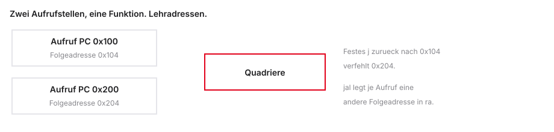
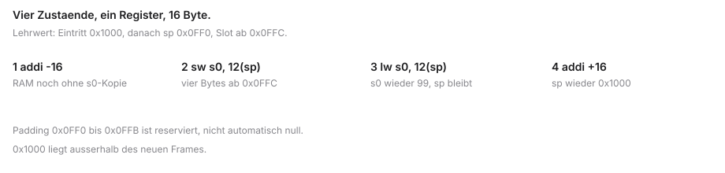
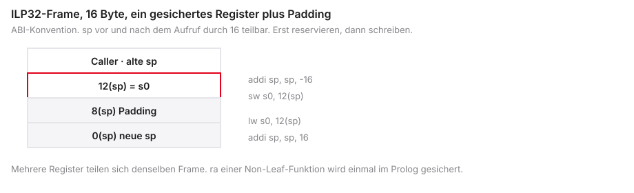
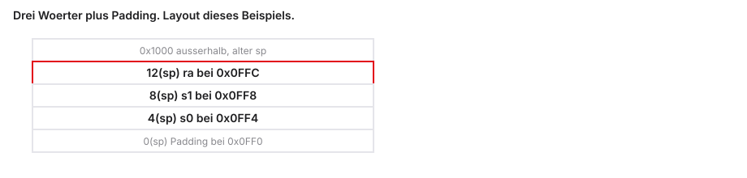
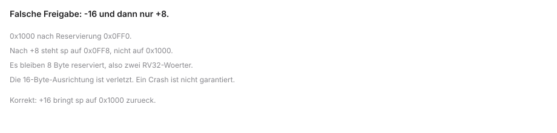
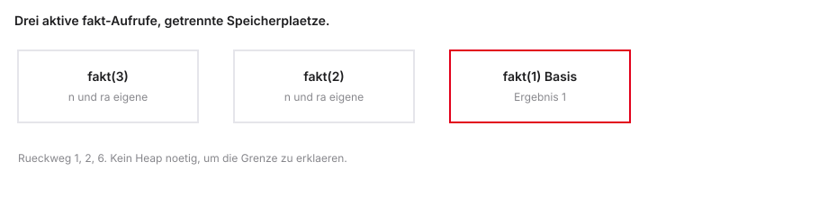

# Funktionen & der Stack

::: notes
Diese Einheit gehört zu Mikrocomputertechnik 1 an der DHBW Stuttgart.

Sie lernen, wie ein Unterprogramm angesprungen wird, wie Integer-Argumente und ein 32-Bit-Ergebnis übergeben werden und wie verschachtelte Aufrufe Register und Stack benutzen.

Ausgangspunkt ist der vertraute C-Aufruf. Die technische Umsetzung durch den Program Counter, die ABI (Application Binary Interface, die binäre Schnittstellenvereinbarung) und den Stack wird erst in den folgenden Folien aufgebaut.

Beispiel: calc(5, 10) ist zunächst nur die Schreibweise, noch kein Registerbild.

Ein typischer Denkfehler ist, man müsse die Calling Convention schon kennen, um die Einheit zu beginnen. Kontrollfrage: Was leistet der Prozessor hinter einem Funktionsaufruf? Er springt zu einer Adresse und die Softwarekonvention legt fest, welche Register dabei welche Rolle haben.

Als Nächstes wird aus der bekannten Schreibweise die konkrete Arbeit von Prozessor und Konvention.
:::

## Die Kunst der Unterprogramme

- Herzlich willkommen zur vierten Vorlesung in Mikrocomputertechnik 1
- Wir verlassen das Niveau einfacher Skripte und Spaghetti-Codes
- Ziel: wiederverwendbare, professionelle Code-Blöcke (Funktionen)
- Wie findet der Prozessor zu seinem Aufrufer zurück?
- Zusätzliche Speicherplätze für Werte, die einen Aufruf überdauern müssen

```{mermaid}
%%| fig-width: 3.5
%%{init: {'theme': 'base', 'themeVariables': {'background': '#FFFFFF', 'primaryColor': '#FFFFFF', 'primaryBorderColor': '#E5E5EA', 'primaryTextColor': '#1D1D1F', 'lineColor': '#86868B', 'secondaryColor': '#F5F5F7', 'tertiaryColor': '#FFFFFF', 'mainBkg': '#FFFFFF', 'nodeBorder': '#E5E5EA', 'clusterBkg': '#F5F5F7', 'clusterBorder': '#E5E5EA', 'titleColor': '#1D1D1F', 'edgeLabelBackground': '#FFFFFF'}}}%%

graph LR
  Main[Main] -->|jal| Func[Funktion]
  Func -->|ret| Main
  style Func fill:#FFFFFF,stroke:#E2001A,stroke-width:2px !important
  style Main fill:#FFFFFF,stroke:#E5E5EA,stroke-width:1.5px
```

::: notes
Ein Unterprogramm ist ein Instruktionsbereich mit Eintrittslabel und vereinbartem Verhalten. Eine Funktion im C-Sinn ist derselbe Gedanke auf höherer Ebene.

RISC-V ist der Name der offenen Befehlssatzarchitektur; das V ist kein Hinweis auf die Wortbreite. RV32I meint hier 32-Bit-Integer-Register x0 bis x31 mit dem Basisbefehlssatz I. x0 ist konstant null. Die ABI weist den übrigen Registern Rollen zu, erzeugt aber keine getrennten Registersätze pro Funktion.

Ein Analog-Digital-Wandler, englisch Analog-to-Digital Converter, liefert einen Integer-Rohwert. Eine Umrechnung dafür soll einmal als Funktion vorliegen und von mehreren Stellen aufgerufen werden.

Beispiel: Dieselbe Funktion liest dieselben physischen Register wie der Aufrufer.

Ein typischer Denkfehler ist, der Stack sei ein automatischer Tresor, den die Hardware für jede Funktion anlegt. Kontrollfrage: Bekommt jede Funktion eigene Hardware-Register? Nein. Alle teilen sich die Architekturregister.

Die Aufgabe zerfällt in Rückweg, Datenübergabe, Registererhaltung und Speicherverwaltung.
:::

## Agenda für den heutigen Tag

1. Rücksprünge — warum einfache Jumps nicht reichen und das Register `ra`
2. Die ABI und der Register-Krieg — wer darf welches Register wann überschreiben?
3. Der Stack — LIFO und der Stack Pointer im Arbeitsspeicher
4. Prolog und Epilog — Vorbereitung und Aufräumen, wenn ein Frame nötig ist
5. Verschachtelung — wenn Funktionen wiederum Funktionen aufrufen
6. Praxis (Venus) — Stack-Traces und Vorbereitung der Rekursion

```{mermaid}
%%| fig-width: 3.5
%%{init: {'theme': 'base', 'themeVariables': {'background': '#FFFFFF', 'primaryColor': '#FFFFFF', 'primaryBorderColor': '#E5E5EA', 'primaryTextColor': '#1D1D1F', 'lineColor': '#86868B', 'secondaryColor': '#F5F5F7', 'tertiaryColor': '#FFFFFF', 'mainBkg': '#FFFFFF', 'nodeBorder': '#E5E5EA', 'clusterBkg': '#F5F5F7', 'clusterBorder': '#E5E5EA', 'titleColor': '#1D1D1F', 'edgeLabelBackground': '#FFFFFF'}}}%%

graph LR
  A[Aufruf jal] --> B[Prolog Stack]
  B --> C[Body Logik]
  C --> D[Epilog Stack]
  D --> E[Ruecksprung ret]
  style C fill:#FFFFFF,stroke:#E2001A,stroke-width:2px !important
  style A fill:#FFFFFF,stroke:#E5E5EA,stroke-width:1.5px
  style B fill:#FFFFFF,stroke:#E5E5EA,stroke-width:1.5px
  style D fill:#FFFFFF,stroke:#E5E5EA,stroke-width:1.5px
  style E fill:#FFFFFF,stroke:#E5E5EA,stroke-width:1.5px
```

::: notes
Die Agenda beantwortet nacheinander vier Fragen.

ra (return address, Rückkehradresse) klärt den Rückweg. Die ABI klärt, wer Registerwerte erhält. LIFO (Last In, First Out) und sp (stack pointer, Stapelzeiger) klären die Speicherverwaltung. Prolog und Epilog sind nur die Vorbereitung und das Aufräumen, soweit ein Frame nötig ist. Nicht jeder Aufruf braucht einen nichtleeren Frame.

Venus ist der RISC-V-Simulator dieser Übung. Ripes dient später dem Datenpfad und der Pipeline und ist hier nicht die Ablaufumgebung.

Beispiel: Lernziele: die Rückkehradresse aus dem alten PC bestimmen; begründen, wer einen Wert sichert; Frame-Adressen und den Endzustand von sp berechnen.

Ein typischer Denkfehler ist, es gebe eine Pflichtschablone mit Frame für jede Funktion. Kontrollfrage: Was ist ein Prolog zunächst? Die Vorbereitung einer Funktion, wenn sie Speicher oder erhaltene Register braucht.

Zuerst werden die schon bekannten Sprung- und Speicherbefehle für diese neue Aufgabe genutzt.
:::

## Rückblick: Was wir bisher können

- Bedingt (`beq`, `blt`) oder unbedingt (`j`) springen
- Pointer auf Arrays und Offsets (`lw`, `sw`)
- `while`- und `for`-Schleifen in Assembler
- Der Program Counter (PC) als Dirigent
- Invertierung für If/Else-Logik

```asm
# Bisher: bedingungsloser Sprung
    j Ueberspringen

    # ... toter Code ...

Ueberspringen:
    # hier geht es weiter
```

::: notes
Der Program Counter, kurz PC, hält die Adresse der gerade betrachteten Instruktion. Ein Label ist eine symbolische Adresse und keine ausgeführte Anweisung. Ein Offset ist ein Abstand in Byte.

j heisst jump und ist ein unbedingter Sprung. beq heisst branch if equal, blt heisst branch if less than und vergleicht hier vorzeichenbehaftet. lw heisst load word, sw heisst store word.

Im Beispiel springt j Überspringen über den folgenden Block. Der Block ist in diesem Ablauf nicht erreicht, aber nicht in jedem denkbaren Programm toter Code. Eine Quelltextzeile ist nicht automatisch eine Maschineninstruktion.

Beispiel: j speichert keine Rückkehradresse in ra.

Ein typischer Denkfehler ist, ein Sprungziel sei immer die nächste Quelltextzeile. Kontrollfrage: Kennt j sein Rücksprungziel? Nein. Der Sprung legt keine für die Rückkehr verwendete Adresse in ra ab.

Einfache Sprünge lösen Kontrollfluss, aber noch nicht die Mehrfachverwendung eines Unterprogramms.
:::

## Das Copy-Paste-Problem

- Szenario: Code-Block, der eine Zahl quadriert
- Benötigt an drei Stellen im Programm
- Bisher: Assembler-Zeilen dreimal kopieren
- Nachteil: der Instruktionsspeicher wächst; auf Mikrocontrollern liegt Code oft in Flash, nicht im RAM
- Bugfixen heißt: drei Stellen pflegen

```c
int a = quadriere(5);
// ... anderer Code ...
int b = quadriere(10);
int c = quadriere(x);
```

::: notes
Dreimal kopierter Assembler und eine Funktion mit drei Aufrufstellen unterscheiden sich in der Pflege.

Das gezeigte C mit quadriere ist der gewünschte Zielzustand, nicht der duplizierte Ausgang. Ein Bugfix in einer Kopie erreicht die anderen Kopien nicht.

.text bezeichnet den Code. Mehr Code beansprucht Instruktionsspeicher. Auf einem Mikrocontroller liegt der oft in Flash oder ROM (Read-Only Memory), nicht im RAM (Random Access Memory, Arbeitsspeicher). Ein Aufruf kostet selbst Instruktionen und ist nicht automatisch die schnellere Ausführung.

Beispiel: Quadriere kleiner Eingaben, damit ein C-Überlauf nicht zum Nebenthema wird.

Ein typischer Denkfehler ist, Funktionen seien stets schneller als kopierter Code. Kontrollfrage: Warum reichen drei Kopien nicht? Weil eine Korrektur an drei Stellen nachgezogen werden müsste.

Der Code soll einmal vorliegen; jetzt muss der Kontrollfluss hinein- und wieder herausführen.
:::

## Funktionen in Hardware

- Den Code nur einmal im Instruktionsspeicher ablegen
- Label z. B. `Quadriere:`
- Bei Bedarf: PC dorthin springen
- Danach zurück zum Aufrufer (`main`)
- Isolierter Block: Parameter rein, Ergebnis raus

```asm
Main:
    # Springe zur Funktion
    # <--- danach hier weiterarbeiten

Quadriere:
    add t0, a0, a0      # RV32I-Lehrskizze, kein lauffaehiges Programm
    # Zurueckspringen!
```

::: notes
Eine Assemblerfunktion ist zunächst ein Bereich mit Label und vereinbartem Verhalten. Der Prozessor legt am Label keinen neuen Registersatz an.

Das Fragment ist eine Skizze, kein lauffähiges Programm. Sichtbar sein müssen Eintritt, Rumpf und Rückkehrstelle. add bleibt im RV32I-Basisbefehlssatz. mul würde die M-Erweiterung verlangen und wird hier nicht vorausgesetzt.

Parameter und Rückgabewert werden auf den nächsten Folien festgelegt. a0 und t0 haben hier noch keine stillschweigende Rollen.

Beispiel: Der Code liegt im Instruktionsspeicher, nicht pauschal im RAM.

Ein typischer Denkfehler ist, ein Label allein erzeuge eine fertige Funktion mit eigenen Registern. Kontrollfrage: Wohin muss die Funktion zurückkehren? Zur Folgeinstruktion des jeweiligen Aufrufs, nicht an eine fest eingebaute Adresse.

Als Nächstes wird geprüft, ob ein einfacher j-Sprung den Hin- und Rückweg schon abbildet.
:::

## Versuch 1: Der einfache Jump

- Aufruf: `j Quadriere` — PC springt korrekt
- Rücksprung: `j Main_Zeile_2` am Funktionsende
- Fatal: Rücksprung ist hardcodiert
- Zweiter Aufruf von `Main_Zeile_50` landet trotzdem bei Zeile 2

```asm
Main_Aufruf_1:
    j Quadriere
Main_Zeile_2:
    j Fertig

Main_Aufruf_2:
    j Quadriere
Main_Zeile_50:

Quadriere:
    j Main_Zeile_2
Fertig:
```



::: notes
Dieser Abschnitt ist ein Fehlversuch. Er soll nur das Rückwegproblem zeigen.

j ist eine Pseudoinstruktion, also eine Assembler-Schreibweise für jal x0, Ziel. Ein festes Rücksprunglabel ist eine festgelegte Adresse, kein Hardwaredefekt.

Erster Aufruf: j Quadriere, am Ende j zurück zur ersten Folgeadresse. Zweiter Aufruf: wieder j Quadriere, derselbe Rücksprung trifft erneut die erste Folgeadresse und verfehlt die zweite.

Beispiel: Der Aufbau darf keinen zusätzlichen Fall-through enthalten, der den ersten Aufruf schon scheitern lässt.

Ein typischer Denkfehler ist, der erste Aufruf sei damit automatisch korrekt, auch wenn der Code danach weiterläuft. Kontrollfrage: Warum scheitert der zweite Aufruf? Weil das Rücksprungziel nicht vom aktuellen Aufruf abhängt.

Die Funktion braucht statt eines festen Labels eine pro Aufruf bestimmte Adresse.
:::

## Das „Wo komme ich her?“-Problem

- Eine echte Funktion muss blind aufrufbar sein
- Sie darf nicht im Voraus wissen, wer sie aufruft
- Im Moment des Aufrufs: aktuelle Folgeadresse merken
- Diese Brotkrumenspur heißt Return Address

```{mermaid}
%%| fig-width: 3.5
%%{init: {'theme': 'base', 'themeVariables': {'background': '#FFFFFF', 'primaryColor': '#FFFFFF', 'primaryBorderColor': '#E5E5EA', 'primaryTextColor': '#1D1D1F', 'lineColor': '#86868B', 'secondaryColor': '#F5F5F7', 'tertiaryColor': '#FFFFFF', 'mainBkg': '#FFFFFF', 'nodeBorder': '#E5E5EA', 'clusterBkg': '#F5F5F7', 'clusterBorder': '#E5E5EA', 'titleColor': '#1D1D1F', 'edgeLabelBackground': '#FFFFFF'}}}%%

graph LR
  A[Aufruf 1 PC=0x100] -->|merke 0x104| F[Funktion]
  B[Aufruf 2 PC=0x200] -->|merke 0x204| F
  F -->|zur gemerkten Adresse| C((Rueckkehr))
  style F fill:#FFFFFF,stroke:#E2001A,stroke-width:2px !important
  style A fill:#FFFFFF,stroke:#E5E5EA,stroke-width:1.5px
  style B fill:#FFFFFF,stroke:#E5E5EA,stroke-width:1.5px
  style C fill:#FFFFFF,stroke:#E5E5EA,stroke-width:1.5px
```

::: notes
Die Return Address ist die Adresse der Maschineninstruktion direkt nach dem Aufruf.

Im RV32I-Lehrmodell ohne komprimierte Instruktionen sind echte Instruktionen 4 Byte lang. Der PC ist byteadressiert. 0x kennzeichnet eine hexadezimale Zahl.

Liegt der Aufruf bei 0x00400000, ist die Folgeadresse 0x00400004. Ein Label oder ein mehrzeiliger Pseudobefehl ist keine verlässliche Einheit namens Zeile darunter.

Beispiel: Das Unterprogramm muss seinen Aufrufer nicht kennen, aber die Rückkehradresse dieses Aufrufs. Datenübergabe ist ein eigener Teil des Vertrags.

Ein typischer Denkfehler ist, PC+4 meine vier Takte oder vier Quelltextzeilen. Kontrollfrage: Was steht in der Rückkehradresse? Nur die Fortsetzungsadresse, keine Parameter und kein Ergebnis.

Als Nächstes wird diese Adresse unter dem ABI-Namen ra abgelegt.
:::

## Die Return Address (`ra`)

- Allgemeines Integer-Register $x1$, ABI-Name `ra`
- ABI-Name: `ra` (Return Address)
- Speichert die Adresse der Instruktion direkt nach dem Aufruf
- Rettungsanker für den Rückweg aus dem Unterprogramm

```text
# PC = 0x00400000  (Aufruf-Befehl)
# ra muss 0x00400004 werden  (Zeile darunter)
```

::: notes
x1 ist ein allgemeines Integer-Register, ein GPR (General Purpose Register). Die Standard-ABI nennt es ra. Der PC ist ein anderes Register und nicht x1.

Die ISA (Instruction Set Architecture, Befehlssatzarchitektur) schreibt keinen Software-Stack vor. jal und ret reservieren keinen Frame.

Vorher: Aufruf bei 0x00400000, ra noch alt. Nachher: ra enthält 0x00400004. Diese Adresse bleibt nur erhalten, solange sie nicht überschrieben wird.

Beispiel: Damit ist der spätere Konflikt verschachtelter Aufrufe vorbereitet.

Ein typischer Denkfehler ist, ra sei ein dediziertes Spezialregister ausserhalb der normalen GPR. Kontrollfrage: Enthält ra Parameter oder das Ergebnis? Nein. Es enthält eine Adresse.

jal berechnet diese Adresse und springt im selben architektonischen Vorgang.
:::

## Jump and Link (`jal`)

- Ein Befehl, zwei Ergebnisse aus dem **alten** PC
- „Ein Takt“ ist eine Annahme des Single-Cycle-Lehrmodells, keine ISA-Regel
- Linkwert = alter PC $+ 4$
- Ziel = alter PC $+$ Byteoffset
- `ra` ist ein normales GPR mit ABI-Rolle

```asm
jal ra, Quadriere
# ra  = oldPC + 4
# PC   = oldPC + Byteoffset
```


::: notes
jal heisst jump and link. rd ist das Zielregister des Linkwerts, der Byteoffset ist vorzeichenbehaftet.

Beide Ergebnisse kommen aus dem alten PC: ra_neu = PC_alt + 4 und PC_neu = PC_alt + Offset. Die Zahl 4 ist die Instruktionslänge in Byte, keine Taktzahl. Single Cycle ist nur das Lehrmodell einer Instruktion pro Takt, keine ISA-Pflicht.

Illustration: Aufruf bei 0x100, Ziel 0x180, Linkwert 0x104, Offset +0x80. Das Assemblerlabel wird in diesen Offset umgesetzt. Die Länge der Funktion ändert den Linkwert nicht. rd darf architektonisch ein anderes Register sein; der Standardaufruf nutzt ra.

Beispiel: Abbildung vl4-jal-zyklus.svg zeigt alt, neu und Fortsetzung getrennt.

Ein typischer Denkfehler ist, der Linkwert hänge davon ab, wie lang das Unterprogramm ist. Kontrollfrage: Welcher PC wird für ra und das Ziel benutzt? Beide Rechnungen nutzen den alten PC.

Als Nächstes steht dieser Aufruf dem Sprung ohne verwendeten Linkwert gegenüber.
:::

## Der Funktionsaufruf

- Standard ab heute: `jal ra, Label`
- Pseudo `j` aus Einheit 3 war getarntes `jal`
- Venus übersetzt `j Label` zu `jal x0, Label`
- Der berechnete Linkwert wird nach $x0$ geschrieben und damit verworfen; `ra` bleibt unverändert

```asm
# Aufruf mit Rueckkehr:
jal ra, MeineFunktion

# Simpler Sprung ohne Rueckkehr (If/Else):
j ElseBlock      # intern: jal x0, ElseBlock
```

::: notes
jal ra, Label speichert die Folgeadresse in ra und springt. j Label ist die Pseudoinstruktion für jal x0, Label.

x0 bleibt null. Der berechnete Schreibwert PC+4 wird verworfen, ra bleibt bei diesem j unverändert. j beendet nicht jede spätere Rückkehrmöglichkeit; es erzeugt nur selbst keine neue Rückkehradresse.

Das Else-Beispiel aus Einheit 3 ist ein Kontrollflusssprung. Ein Funktionsaufruf braucht jal ra.

Beispiel: Eine Pseudoinstruktion ist Assembler-Schreibweise und kann in eine oder mehrere echte Instruktionen umgesetzt werden.

Ein typischer Denkfehler ist, PC+4 verpuffe spurlos, ohne dass ein Zielregister beteiligt wäre. Kontrollfrage: Warum ändert j Label ra nicht? Weil das Zielregister x0 ist und x0 Schreibzugriffe verwirft.

Der Rückweg muss die zur Laufzeit in ra stehende Adresse verwenden.
:::

## Jump and Link Register (`jalr`)

- `jal` hat ein PC-relatives Ziel; der Rücksprung braucht die Adresse aus `ra`
- Ziel ist die dynamische Adresse in `ra`
- `jalr`: Ziel $= (rs1 + \mathrm{signextend}(imm))$ mit gelöschtem Bit 0
- Linkwert = alter PC $+ 4$
- `ret` ist `jalr x0, 0(ra)`

```asm
jalr x0, 0(ra)

# PC = ra + 0
# Link-Ziel x0: keine zweite Brotkrumenspur
```

::: notes
jalr heisst jump and link register. rs1 ist das Basisregister, imm das Immediate, vorzeichenerweitert. Danach wird Bit 0 des Ziels gelöscht.

Bei jalr x0, 0(ra) verwirft x0 den Linkwert PC_alt+4, ra liefert die Basis, 0 ist der Byteoffset. In einem normalen, ausgerichteten Beispiel ändert das Löschen von Bit 0 das Ziel nicht. Es garantiert aber keine beliebige gültige Adresse.

Rücksprung nach 0x104: der PC wird 0x104, ra wird dabei nicht neu beschrieben.

Beispiel: jal ist PC-relativ, jalr rechnet aus Register und Immediate.

Ein typischer Denkfehler ist, jalr sei nur eine andere Schreibweise für ein festes Label. Kontrollfrage: Wird ra beim normalen ret überschrieben? Nein. Das Zielregister ist x0.

Für diesen häufigen Fall stellt der Assembler die Schreibweise ret bereit.
:::

## Der Rücksprung (`ret`)

- `jalr x0, 0(ra)` ist korrekt, aber unleserlich
- Pseudo-Instruktion: `ret`
- Venus generiert daraus den `jalr`-Befehl
- Nur der Sprung; ein C-`return` kann zusätzlich Ergebnis und Aufräumen enthalten

```asm
Quadriere:
    # ... Funktionsrumpf ...
    ret                 # = jalr x0, 0(ra)
```

::: notes
ret ist eine Pseudoinstruktion für jalr x0, 0(ra), kein zusätzlicher Hardwarebefehl.

x0 verwirft den neuen Linkwert, ra liefert das Ziel. Ein C-return kann ausserdem das Ergebnis berechnen und aufräumen. ret allein setzt a0 nicht und stellt s-Register oder sp nicht wieder her.

Steht in Quadriere am Ende nur ret, dann ist der PC danach der Wert, der gerade in ra steht.

Beispiel: War ra vorher überschrieben, springt ret an diese neue Adresse.

Ein typischer Denkfehler ist, ret sei dasselbe wie ein vollständiges C-return. Kontrollfrage: Stellt ret s0 wieder her? Nein. Das müssen passende Load-Befehle vorher tun.

Hin- und Rückweg werden jetzt gemeinsam betrachtet.
:::

## Visualisierung: Der Zyklus

- Zusammenspiel von `jal` und `ret` als geschlossener Kreis
- Brotkrumenspur beim Absprung gelegt, beim Rücksprung eingelöst
- Dieselbe Funktion ist von mehreren Aufrufstellen erreichbar; gleichzeitige Verschachtelung bleibt durch den Stack begrenzt

```{mermaid}
%%| fig-width: 3.5
%%{init: {'theme': 'base', 'themeVariables': {'background': '#FFFFFF', 'primaryColor': '#FFFFFF', 'primaryBorderColor': '#E5E5EA', 'primaryTextColor': '#1D1D1F', 'lineColor': '#86868B', 'secondaryColor': '#F5F5F7', 'tertiaryColor': '#FFFFFF', 'mainBkg': '#FFFFFF', 'nodeBorder': '#E5E5EA', 'clusterBkg': '#F5F5F7', 'clusterBorder': '#E5E5EA', 'titleColor': '#1D1D1F', 'edgeLabelBackground': '#FFFFFF'}}}%%

sequenceDiagram
  participant Main
  participant ra as Register ra
  participant Func as Funktion
  Main->>ra: jal speichert PC+4
  Main->>Func: jal springt zum Label
  Func-->>Func: fuehrt Code aus
  Func->>ra: ret liest ra
  ra-->>Main: ret setzt PC = ra
```

::: notes
Die Abbildung trennt Aufrufstelle, Funktionseintritt, Funktionsende und Fortsetzungsadresse.

Der jal-Pfeil führt zum Label. Der ret-Pfeil führt zur Folgeinstruktion, nicht zurück auf die jal-Instruktion selbst. Eine zweite Aufrufstelle desselben Labels hat eine andere Folgeadresse.

Lehrwerte: PC 0x100, ra danach 0x104, Funktions-PC 0x180, nach ret wieder 0x104.

Beispiel: Die Funktion teilt Register und Speicher mit dem Aufrufer und folgt einem Vertrag. Sie ist nicht isoliert. Mehrere Aufrufstellen sind keine unbegrenzte gleichzeitige Verschachtelung.

Ein typischer Denkfehler ist, ret führe wieder auf den jal-Befehl. Kontrollfrage: Wohin zeigt ret? Auf die Instruktion nach dem Aufruf.

Die Navigation steht. Als Nächstes werden Parameter, Ergebnis und gemeinsame Register geregelt.
:::

## Die ABI und der Register-Krieg

- Funktionen wissen nichts voneinander (blinder Flug)
- Sichere Datenübergabe: `a`-Register
- Konflikt: 32 Register für das gesamte Programm
- Lösung: Application Binary Interface (ABI) als sozialer Vertrag
- Flüchtig (Caller-Saved) vs. sicher (Callee-Saved)

```{mermaid}
%%| fig-width: 3.5
%%{init: {'theme': 'base', 'themeVariables': {'background': '#FFFFFF', 'primaryColor': '#FFFFFF', 'primaryBorderColor': '#E5E5EA', 'primaryTextColor': '#1D1D1F', 'lineColor': '#86868B', 'secondaryColor': '#F5F5F7', 'tertiaryColor': '#FFFFFF', 'mainBkg': '#FFFFFF', 'nodeBorder': '#E5E5EA', 'clusterBkg': '#F5F5F7', 'clusterBorder': '#E5E5EA', 'titleColor': '#1D1D1F', 'edgeLabelBackground': '#FFFFFF'}}}%%

graph LR
  A[Caller / Main] -->|Parameter| B(ABI)
  B -->|Ordnung| C[Callee / Funktion]
  C -->|Ergebnis| A
  style B fill:#FFFFFF,stroke:#E2001A,stroke-width:2px !important
  style A fill:#FFFFFF,stroke:#E5E5EA,stroke-width:1.5px
  style C fill:#FFFFFF,stroke:#E5E5EA,stroke-width:1.5px
```

::: notes
Die ABI ist die binäre Schnittstellenvereinbarung. Die Calling Convention ist der Teil für Aufrufe, Argumente, Rückgabe und Registererhaltung.

Die ISA legt fest, wie ein Schreibbefehl wirkt. Die ABI legt fest, welche Werte eine korrekte Funktion bei Rückkehr erhalten muss. Die Hardware sperrt s-Register nicht.

Zwei getrennt übersetzte Programmteile können zusammenarbeiten, wenn beide dieselbe ILP32-Konvention einhalten. ILP32 meint hier 32 Bit für int, long und Zeiger, nicht für jeden C-Typ.

Beispiel: Caller-saved und callee-saved sind zunächst zwei Verantwortlichkeiten, noch keine Speicherimplementierung.

Ein typischer Denkfehler ist, die ABI werde von der CPU automatisch erzwungen. Kontrollfrage: Wer prüft den Vertrag gewöhnlich nicht? Die CPU führt Instruktionen aus und prüft die ABI nicht.

Zuerst die positive Seite: Wohin legt der Aufrufer die Argumente?
:::

## Datenübergabe (Argumente)

- Parameter und Ergebnis in C: `calc(5, 10);`
- In RISC-V: vor dem Sprung Werte in Register legen
- ABI: `a0` bis `a7` für Argumente
- Die Funktion erwartet ihre Zutaten exakt dort

```asm
li a0, 5
li a1, 10
jal ra, Calc
```

::: notes
Ein Argument steht am Aufruf, ein Parameter in der Definition.

li heisst load immediate und ist eine Pseudoinstruktion. Sie lädt eine Konstante in ein Register und liest nicht aus dem RAM. jal springt danach.

Nach li a0, 5 und li a1, 10 stehen 5 und 10 in den vereinbarten Registern. Calc liest genau diese Werte. a0 bis a7 gelten hier für einfache 32-Bit-Integer-Argumente. Weitere Argumente können über den Stack gehen; mehr als acht Registerargumente sind kein Verbot einer Funktion mit mehr Parametern.

Beispiel: Die Funktion erwartet die Werte an der vereinbarten Stelle, nicht in einem beliebigen Register.

Ein typischer Denkfehler ist, li lese die Zahl aus dem Arbeitsspeicher. Kontrollfrage: Wo steht die 10 unmittelbar vor jal? In a1.

Derselbe Vertrag muss festlegen, wo das Ergebnis liegt.
:::

## Der Rückgabewert

- Ein einzelnes 32-Bit-Integer-Ergebnis liegt in diesem Beispiel in `a0`
- Vor `ret`: Endresultat nach `a0` kopieren
- Aufrufer holt die Antwort nach dem `jal` aus `a0`

```asm
Calc:
    add t0, a0, a1
    mv a0, t0           # ABI: Ergebnis in a0
    ret
```

::: notes
Ein einzelnes 32-Bit-Integer-Ergebnis dieses Beispiels steht in a0. a0 ist zugleich Argument- und Ergebnisregister, deshalb darf der alte Argumentwert nach der Rückkehr fehlen.

mv ist regulär addi mit Immediate 0. add mit x0 ist wirkungsgleich, aber nicht pauschal dieselbe Assembler-Expansion. t markiert ein temporary-Register, rd das Ziel, rs die Quelle.

add t0, a0, a1 mit 5 und 10 ergibt 15 in t0. mv a0, t0 legt 15 nach a0. a1 kann bei manchen Rückgabetypen ein zweites Registerwort sein, ist aber kein frei wählbares zweites C-Ergebnis. a2 bis a7 sind keine allgemeinen Ergebnisregister. Eine Funktion ohne Ergebnis liefert keinen vertraglich nutzbaren Wert in a0.

Beispiel: Der Aufrufer liest a0 nach jal.

Ein typischer Denkfehler ist, jedes Ergebnis müssen a0 und a1 gemeinsam tragen. Kontrollfrage: Wo steht 15 nach ret? In a0, sofern der Epilog a0 nicht überschreibt.

Argumente, Rechnung, Rücksprung und Übernahme folgen in einem Programm.
:::

## Code-Beispiel: Parameter komplett

- Vertrag Caller/Callee in der Praxis
- Compiler-Muster hinter `int x = func(y);`

```asm
Main:
    li a0, 5
    li a1, 10
    jal ra, Addiere
    mv s0, a0           # Ergebnis sichern
    li a0, 10           # Venus: exit
    ecall

Addiere:
    add a0, a0, a1      # Summe direkt in a0
    ret
```

::: notes
Jede Zeile hat eine beobachtbare Wirkung. li und mv laden Werte, jal ruft auf, ret springt zurück, ecall ist der environment call der Umgebung.

Nach der Vorbereitung: a0=5, a1=10. Nach add: a0=15. Nach ret am Fortsetzungslabel: a0=15. Nach mv s0, a0: s0=15. Nach der Exit-Vorbereitung: a0=10. Die 10 ist die Dienstnummer des Venus-Exit dieser Kurskonvention, nicht das Rechenergebnis und nicht die allgemeine RISC-V-ABI.

Der Exit verhindert den Fall-through in Addiere. Main ist hier der Simulator-Einstieg mit Programmende, nicht ein normal zurückkehrendes C-main. Addiere ändert s0 nicht und braucht keinen Frame.

Beispiel: s0 des Aufrufers bleibt 15, weil Addiere es nicht anfasst.

Ein typischer Denkfehler ist, a0=10 nach dem Exit-Befehl sei die Summe. Kontrollfrage: Warum braucht Addiere keinen Frame? Es ist eine Leaf-Funktion ohne weitere Aufrufe und ohne veränderte s-Register.

Als Nächstes wird gezeigt, was ein unerlaubtes Überschreiben anrichtet.
:::

## Der Register-Konflikt

- Nur 32 Architekturregister, von allen Funktionen geteilt
- Szenario: `Main` speichert Zwischenwert in `s0`, ruft `Print()` auf
- `Print()` nutzt `s0` ahnungslos als Zähler
- Nach `ret`: Wert in `Main` ist zerstört

::: notes
Main und die aufgerufene Funktion sprechen dieselben Architekturregister an. Labels erzeugen keine lokalen Register.

CPU heisst Central Processing Unit. Die ABI ist wieder die Schnittstellenvereinbarung. Liegt 99 in s0 und die aufgerufene Funktion schreibt 0 nach s0, ohne den Eintrittswert wiederherzustellen, ist das in diesem Beispiel ABI-widrig, nicht das normale Verhalten jeder Bibliothek.

Main braucht den Wert nach dem Aufruf noch. Der Name Print meint hier nur eine Funktion, die s0 ändert, keine implementierte Ausgabe.

Beispiel: Die Lebensdauer des Werts endet nicht am Aufruf, wenn Main ihn danach liest.

Ein typischer Denkfehler ist, jede Bibliotheksfunktion zerstöre s0 zwangsläufig. Kontrollfrage: Ist der Konflikt ein Hardwarefehler? Nein. Es fehlt die vereinbarte Wiederherstellung.

Ein Trace macht den Verlust beobachtbar.
:::

## Zerstörte Variablen (Trace)

- Funktionen werden isoliert programmiert (Bibliotheken)
- Autor von `Print` kennt die Register von `Main` nicht
- CPU blockiert Register nicht — Schreiben überschreibt Flip-Flops

```asm
Main:
    li s0, 99
    jal ra, BoeseFunc
    # s0 ist jetzt 0
    li a0, 10
    ecall

BoeseFunc:
    li s0, 0
    ret
```

`Main` endet mit dem Venus-Exit. Es gibt keinen Fall-through in `BoeseFunc`. Der isolierte Fehler ist das ungesicherte `s0`.

::: notes
Der Exit bleibt, damit kein Fall-through den Fehler verursacht.

Ablauf: li s0, 99 setzt s0. jal ra, BoeseFunc speichert die Folgeadresse in ra und springt. li s0, 0 setzt s0 auf 0. ret kehrt zur Folgeadresse zurück. Danach ist s0 noch 0. Clobbering meint das Überschreiben eines noch benötigten Werts. BoeseFunc verstosst absichtlich gegen die ABI.

Die CPU führt das regulär aus. Ein falscher Datenwert ist kein Absturz. Ein zweiter Fehler, etwa ein fehlendes ret, dürfte die Ursache verdecken.

Beispiel: ra zeigt nach dem jal auf die Instruktion nach dem Aufruf, nicht auf BoeseFunc.

Ein typischer Denkfehler ist, die CPU werde den Vertrag erkennen und den Schreibzugriff ablehnen. Kontrollfrage: Welcher Wert steht nach ret in s0? 0, weil nichts zurückgeladen wurde.

Daraus folgt die Forderung, Save und Restore eindeutig zuzuordnen.
:::

## Die Lösung: ABI-Verträge

- Hardware sperrt keine Register — Software muss retten
- ABI erzwingt Save/Restore vor Überschreiben
- Inhalt in den RAM evakuieren, später wiederherstellen
- Offene Frage: Wer ist verantwortlich — Caller oder Callee?

```{mermaid}
%%| fig-width: 3.5
%%{init: {'theme': 'base', 'themeVariables': {'background': '#FFFFFF', 'primaryColor': '#FFFFFF', 'primaryBorderColor': '#E5E5EA', 'primaryTextColor': '#1D1D1F', 'lineColor': '#86868B', 'secondaryColor': '#F5F5F7', 'tertiaryColor': '#FFFFFF', 'mainBkg': '#FFFFFF', 'nodeBorder': '#E5E5EA', 'clusterBkg': '#F5F5F7', 'clusterBorder': '#E5E5EA', 'titleColor': '#1D1D1F', 'edgeLabelBackground': '#FFFFFF'}}}%%

graph TD
  Vertrag[ABI-Konvention] --> C[Caller-Saved]
  Vertrag --> D[Callee-Saved]
  C --> E[t0-t6, a0-a7]
  D --> F[s0-s11]
  style Vertrag fill:#FFFFFF,stroke:#E2001A,stroke-width:2px !important
  style C fill:#FFFFFF,stroke:#E5E5EA,stroke-width:1.5px
  style D fill:#FFFFFF,stroke:#E5E5EA,stroke-width:1.5px
  style E fill:#FFFFFF,stroke:#E5E5EA,stroke-width:1.5px
  style F fill:#FFFFFF,stroke:#E5E5EA,stroke-width:1.5px
```

::: notes
Save, Modify, Restore am Beispiel s0: Eintrittswert 99 sichern, im Rumpf einen anderen Wert benutzen, vor der Rückkehr 99 herstellen.

Die ABI ist eine Softwarevereinbarung, keine automatische Hardwareaktion. Nicht jeder Wert wird bei jedem Aufruf in den RAM geschrieben. Gesichert wird, was der Vertrag und die weitere Lebensdauer verlangen.

Unverändert nach dem Aufruf sind nur die vereinbarten erhaltenen Werte. a0 darf ein Ergebnis enthalten. Speicher darf vereinbarte Änderungen enthalten.

Beispiel: Die Tabelle der Verantwortlichkeiten folgt, bevor alle Registernamen auf einmal nötig sind.

Ein typischer Denkfehler ist, die ABI schreibe bei jedem Aufruf alle Register in den RAM. Kontrollfrage: Wer stellt 99 wieder her, wenn die Funktion s0 benutzt? Die Funktion selbst, weil s0 callee-saved ist.

Caller und Callee benennen, wem welche Pflicht gehört.
:::

## Rollenverteilung: Caller vs. Callee

- Caller (Aufrufer): führt `jal` aus (z. B. `Main`)
- Callee (Aufgerufener): wird angesprungen und arbeitet
- Rollen sind relativ: wer selbst aufruft, wird Caller
- ABI teilt Register in zwei Haftungspflichten

```text
Main:               <--- CALLER
    jal ra, Print

Print:              <--- CALLEE
    ret
```

::: notes
Caller heisst Aufrufer, Callee heisst aufgerufene Funktion.

Main ruft Print auf: Main ist Caller, Print ist Callee. Ruft Print danach DrawPixel auf, ist Print gegenüber DrawPixel selbst Caller. Die Rolle hängt am Aufruf, nicht am Namen.

jal markiert den Aufruf, ret die Rückkehr zur Folgeadresse. Eine Funktion kann beide Rollen haben. Deshalb muss eine Non-Leaf-Funktion ihre eigene eingehende Rückkehradresse erhalten, wenn sie sie nach dem inneren Aufruf noch braucht.

Beispiel: Dieselbe Funktion ist nicht für immer nur Callee.

Ein typischer Denkfehler ist, Main sei immer Caller und nie etwas anderes. Kontrollfrage: Welche Rolle hat Print gegenüber DrawPixel? Caller.

Zuerst wird die Pflicht der Aufruferseite für nicht erhaltene Register konkret.
:::

## Caller-Saved Register (Flüchtig)

- Register: `t0`–`t6`, `a0`–`a7`, und `ra`
- ABI: Not Preserved — flüchtig
- Callee darf sie ohne Rettung überschreiben
- Caller muss wichtige Werte vor `jal` selbst sichern

```asm
# Caller schuetzt sich selbst:
    # ... t0 in den RAM retten ...
    jal ra, Funktion
    # ... t0 wiederherstellen ...
```

::: notes
t0 bis t6, a0 bis a7 und ra sind caller-saved: ein normaler Aufruf sichert ihren alten Inhalt nicht zu. Not preserved heisst genau das.

jal ra ändert ra selbst. Die anderen Register kann der Callee ändern, muss es aber nicht. Gelöscht wird nichts automatisch.

Wird t0 nach dem Aufruf noch gebraucht, muss der Caller ihn erhalten. Ein neues Ergebnis in a0 ist die gewollte Belegung, kein Verlust. Die konkrete Speicherstelle folgt mit dem Stack. Jeden t-Wert nur deshalb in ein s-Register zu schieben, verschiebt die Erhaltungspflicht.

Beispiel: Ein unveränderter t0 nach einem Aufruf ist Glück, kein Vertrag.

Ein typischer Denkfehler ist, alle t-Register würden von jal auf null gesetzt. Kontrollfrage: Muss der Caller t0 immer sichern? Nur wenn er den alten Wert nach dem Aufruf noch braucht.

Der Vergleich mit dem Compiler zeigt, warum C-Variablen trotzdem erhalten bleiben.
:::

## Die Konsequenz für t-Register

- `t`-Register nur für Kurzzeit-Rechnungen
- Nach `jal` ist ein alter `t`-Wert nur verlässlich, wenn er eigens erhalten wurde
- Vorteil: kleine Hilfsfunktionen ohne teure RAM-Backups

```c
/* Kein C-Beispiel: der Compiler erhält die Lebensdauer. */
```

```asm
# Isolierter ABI-Fehler, kein C:
    li   t0, 5
    jal  ra, Print      # Print darf t0 überschreiben
    # t0 ist danach nicht mehr verlässlich 5
```

::: notes
Das Fragment ist Assembler, kein C-Programm. t0 wird auf 5 gesetzt, danach folgt ein Aufruf. Danach darf man nicht voraussetzen, dass t0 noch 5 ist.

Der Callee darf t0 unverändert lassen. Der Vertrag erlaubt die Änderung, also beweist ein einmal unveränderter Wert keinen Schutz. Ein korrekter C-Compiler erhält eine später noch benötigte Variable durch Registerwahl oder Sicherung.

t-Register eignen sich bevorzugt für Werte, die über den Aufruf hinweg nicht erhalten werden müssen. Mit expliziter Sicherung dürfen sie auch länger leben.

Beispiel: Unsichere Annahme: t0 ist nach jal noch 5. Zulässig: den Wert vorher sichern oder ihn nicht mehr brauchen.

Ein typischer Denkfehler ist, dieses Fragment beweise, dass C-Variablen nach einem Aufruf undefiniert sind. Kontrollfrage: Was unterscheidet der Compiler? Er erhält die Semantik der Variablen, auch wenn das konkrete Register caller-saved wäre.

Als Gegenstück müssen s-Register vom Aufgerufenen wiederhergestellt werden.
:::

## Callee-Saved Register (Sicher)

- Register: `s0`–`s11`
- ABI: Preserved — sicher über den Aufruf hinweg
- Caller darf sich darauf verlassen
- Callee, der `s` nutzt: alten Wert retten und vor `ret` wiederherstellen

```asm
Funktion:
    # 1. fremdes s0 in den RAM
    # 2. eigene Rechnung mit s0
    # 3. altes s0 zurueck
    ret
```

::: notes
saved und preserved bedeuten: der Eintrittswert ist nach korrekter Rückkehr wieder da. s0 bis s11 sind diese Register. Sicher heisst hier nicht gesperrt.

Nur ein tatsächlich verändertes s-Register muss gesichert werden. Ein nur gelesenes s-Register braucht kein Backup. s0 kann zusätzlich die Rolle frame pointer haben; diese Einheit verlangt keinen Frame Pointer für jede Funktion.

Eintritt s0=99, Rumpf s0=42, Rückkehr s0=99. Der Aufrufer darf den letzten Zustand erwarten.

Beispiel: Die ABI wird lokal wieder als Schnittstellenvereinbarung verstanden.

Ein typischer Denkfehler ist, s-Register seien während der Funktion unveränderlich. Kontrollfrage: Muss ein ungenutztes s-Register gesichert werden? Nein.

Die nächste Folie zeigt den Zeitpunkt von Sicherung und Wiederherstellung.
:::

## Das Versprechen in der Praxis

- Callee schützt `s0` vor der Zerstörung
- Caller sieht nach `ret` denselben Wert wie zuvor

- Die Funktion teilt Register und Speicher; sie ist nicht hardwareseitig isoliert


::: notes
Die Abbildung zeigt drei Zustände desselben Registers s0.

Vorher liegt 99 im Register und als Kopie im Frame. Während des Rumpfs darf s0 42 enthalten, die Kopie bleibt 99. Nachher steht wieder 99 im Register. Save, Modify, Restore ist genau diese Folge.

Offen bleibt nur der Ort der Kopie. Nicht der ganze Zustand der CPU ist unverändert: a0 darf das Ergebnis sein.

Beispiel: Farben markieren den mittleren Zustand, die Beschriftung nennt die Zahlen. Die Bedeutung steht im Text, nicht in einer Metapher.

Ein typischer Denkfehler ist, nach dem Aufruf seien alle Register wie vorher. Kontrollfrage: Wo liegt 99, während s0 im Rumpf 42 ist? In der Sicherung, nicht im Register.

Mehrere gleichzeitige Aufrufe brauchen getrennte Speicherplätze.
:::

## Das „Wo?“-Problem

- Retten geht in den RAM (nicht in ein anderes Register — Teufelskreis)
- Hartcodierte Adresse `0x1000` scheitert bei Verschachtelung/Rekursion
- Jeder Aufruf bräuchte exklusiven, frischen Speicher
- Wir brauchen einen dynamisch wachsenden Bereich

```text
Benötigt: Ein Ort im RAM, der für JEDEN Funktionsaufruf
frisch und exklusiv bereitsteht.
```

::: notes
Zwei aktive Aufrufe dürfen nicht denselben festen Slot, etwa die Lehradresse 0x1000, beschreiben. Der zweite Store würde den älteren Wert überschreiben.

Ein anderes freies Register kann in engen Fällen genügen, ist aber begrenzt und hat selbst eine Erhaltungspflicht. Ein dynamisch verwalteter Bereich trägt verschachtelte Lebensdauern systematisch.

0x1000 ist ein Lehrwert, keine universell vorhandene Adresse.

Beispiel: Die Lebensdauer folgt der Aufrufverschachtelung: der innere Aufruf endet zuerst.

Ein typischer Denkfehler ist, Retten in ein Register sei prinzipiell unmöglich. Kontrollfrage: Warum kollidieren zwei Aufrufe bei einer festen Adresse? Weil beide dieselbe Stelle beschreiben.

Der Stack wird zunächst in ein schematisches Speicherbild eingeordnet.
:::


## Die Struktur des Arbeitsspeichers (RAM)

- Wie teilt ein modernes Betriebssystem den RAM auf?
- Text / Code: ganz unten das kompilierte Maschinenprogramm
- Static Data: globale Variablen (z. B. Arrays unter `.data`)
- Heap: dynamischer Speicher (z. B. `malloc` in C), wächst nach oben
- Stack: startet oben bei der größten Adresse und wächst nach unten

```{mermaid}
%%| fig-width: 3.5
%%{init: {'theme': 'base', 'themeVariables': {'background': '#FFFFFF', 'primaryColor': '#FFFFFF', 'primaryBorderColor': '#E5E5EA', 'primaryTextColor': '#1D1D1F', 'lineColor': '#86868B', 'secondaryColor': '#F5F5F7', 'tertiaryColor': '#FFFFFF', 'mainBkg': '#FFFFFF', 'nodeBorder': '#E5E5EA', 'clusterBkg': '#F5F5F7', 'clusterBorder': '#E5E5EA', 'titleColor': '#1D1D1F', 'edgeLabelBackground': '#FFFFFF'}}}%%

graph TD
  Stack[Stack: lokale Variablen / Backups]
  Frei[freier Speicher]
  Heap[Heap: dynamische Daten]
  Data[Static Data .data]
  Text[Code .text]
  Stack -->|waechst nach unten| Frei
  Heap -->|waechst nach oben| Frei
  Frei --- Data
  Data --- Text
  style Stack fill:#FFFFFF,stroke:#E2001A,stroke-width:2px !important
  style Frei fill:#F5F5F7,stroke:#E5E5EA,stroke-width:1.5px
  style Heap fill:#FFFFFF,stroke:#E5E5EA,stroke-width:1.5px
  style Data fill:#FFFFFF,stroke:#E5E5EA,stroke-width:1.5px
  style Text fill:#FFFFFF,stroke:#E5E5EA,stroke-width:1.5px
```

::: notes
Die Folie zeigt ein schematisches Adressbild der gewählten Umgebung, keine universelle physische RAM-Aufteilung.

RAM ist Arbeitsspeicher. .text ist Code und kann auf einem Mikrocontroller in Flash liegen. .data sind statische Daten. Der Heap, zum Beispiel durch malloc, und der Stack sind getrennte Bereiche mit eigenen Grenzen. Eine virtülle Adresse ist nicht automatisch eine physische RAM-Adresse.

Der Stack beginnt an einer von Simulator oder Startup gesetzten Adresse innerhalb eines reservierten Bereichs, nicht zwingend an der grössten Zahl. Heap und Stack müssen nicht aufeinander zuwachsen. Die Grenze gilt vor einer möglichen Kollision.

Beispiel: Für Funktionsaufrufe reichen danach Lebensdauer, sp und die Speicherbefehle.

Ein typischer Denkfehler ist, Code liege immer im selben physischen RAM wie der Stack. Kontrollfrage: Muss der Stack den Heap erreichen, bevor eine Grenze gilt? Nein.

Als Nächstes werden nur Stack, sp und die Zugriffe gebraucht.
:::


## Der Stack (LIFO und Stack Pointer)

- Dynamisch wachsender Keller für gerettete Register und lokale Variablen
- LIFO: Last In, First Out
- Stack Pointer (`sp`): Zeigefinger auf die Spitze
- Push und Pop in RISC-V-Assembler

::: notes
Ein Stack ist ein Speicherbereich mit einer Verwaltungsregel. LIFO heisst Last In, First Out: zuletzt abgelegt, zuerst entnommen.

sp ist der ABI-Name von x2. Push und Pop sind Schritte des Lehrmodells, keine einzelnen RV32I-Befehle. Reservieren, speichern, laden und freigeben sind getrennte Instruktionen. Andere Erweiterungen sind nicht Thema dieser Einheit.

Verschachtelte Aufrufe passen zu LIFO, weil der zuletzt aktivierte Aufruf zuerst endet.

Beispiel: Die spätere Adressrechnung ersetzt die reine Stapelmetapher.

Ein typischer Denkfehler ist, Push sei ein einzelner Maschinenbefehl von RV32I. Kontrollfrage: Welche vier Schritte ersetzen Push und Pop hier? addi zum Reservieren, sw, lw und addi zum Freigeben.

Zuerst wird die abstrakte Reihenfolge gezeigt, danach die Adressen.
:::

## Das Stack-Konzept (LIFO)

- Stack = abstrakte Datenstruktur (Stapel / Keller)
- Metapher: Tellerstapel in der Cafeteria
- Push: neuer Teller oben auflegen
- Pop: nur den obersten Teller nehmen
- LIFO: Last In, First Out — keine Operation in der Mitte

::: notes
Drei abgelegte Objekte A, B, C werden in der Reihenfolge C, B, A entnommen.

Übertragen: Main ruft Calc, Calc ruft Sum. Sum endet zuerst, dann Calc, dann kehrt der Ablauf zu Main zurück.

Keine Operation in der Mitte gilt für die abstrakte Freigabe ganzer Frames. Innerhalb eines reservierten Frames darf das Programm Slots über Offsets ansprechen. Das widerspricht LIFO nicht.

Beispiel: Die zulässige Rückkehrreihenfolge ist die umgekehrte Aktivierungsreihenfolge.

Ein typischer Denkfehler ist, man dürfe innerhalb eines Frames keine mittleren Slots lesen. Kontrollfrage: Wer endet zuerst, Sum oder Main? Sum.

Die abstrakte Spitze wird zur Adresse in sp.
:::

## Der Stack Pointer (`sp`)

- Zeigefinger auf die Spitze des Stapels im RAM
- Architektur-Register $x2$, ABI-Name `sp`
- `sp` hält die Adresse des zuletzt belegten Faches
- Beim Boot: Betriebssystem setzt `sp` auf eine hohe RAM-Adresse

```asm
# sp zeigt auf die untere Grenze des reservierten Frames
# Der zuletzt gespeicherte Wert kann bei einem positiven Offset liegen
```

::: notes
sp ist der stack pointer und der ABI-Name von x2. x2 und sp sind dasselbe Register.

Bei den 16-Byte-Beispielen zeigt sp auf die untere reservierte Grenze. Der gespeicherte Wert kann bei 12(sp) liegen. sp zeigt also nicht allgemein auf den zuletzt beschriebenen Datenslot.

Den Anfangswert setzt hier die Simulatorumgebung. Andere Systeme nutzen Startup-Code oder eine Laufzeitumgebung. Ein Betriebssystem beim Boot ist keine allgemeine Erklärung für Venus oder Bare-Metal. Der symbolische Startwert heisst S und muss gültig sowie durch 16 teilbar sein.

Beispiel: Ein blindes li sp, 0x1000 ist kein Ersatz für einen reservierten Bereich.

Ein typischer Denkfehler ist, das Betriebssystem setze in jeder Übung sp. Kontrollfrage: Zeigt sp immer auf die zuletzt gespeicherte Kopie? Nein. Es zeigt auf die untere Grenze des reservierten Frames.

Die Wachstumsrichtung wird als Änderung dieses Zahlenwerts sichtbar.
:::

## RISC-V-Regel: Stack wächst nach unten

- Stack beginnt oben — Wachstum heißt Richtung Adresse 0
- Push (Platz schaffen): Adressen werden kleiner — Subtraktion von `sp`
- Pop (Platz freigeben): Adressen werden wieder größer — Addition zu `sp`
- Historisch: Kollision mit dem von unten wachsenden Heap verzögern

```{mermaid}
%%| fig-width: 3.5
%%{init: {'theme': 'base', 'themeVariables': {'background': '#FFFFFF', 'primaryColor': '#FFFFFF', 'primaryBorderColor': '#E5E5EA', 'primaryTextColor': '#1D1D1F', 'lineColor': '#86868B', 'secondaryColor': '#F5F5F7', 'tertiaryColor': '#FFFFFF', 'mainBkg': '#FFFFFF', 'nodeBorder': '#E5E5EA', 'clusterBkg': '#F5F5F7', 'clusterBorder': '#E5E5EA', 'titleColor': '#1D1D1F', 'edgeLabelBackground': '#FFFFFF'}}}%%

graph TD
  A[sp = 0x7FFFF010] -->|Frame −16| B[sp = 0x7FFFF000]
  B --> D[16-Byte-Frame, ABI-ausgerichtet]
  style D fill:#FFFFFF,stroke:#E2001A,stroke-width:2px !important
  style A fill:#FFFFFF,stroke:#E5E5EA,stroke-width:1.5px
  style B fill:#FFFFFF,stroke:#E5E5EA,stroke-width:1.5px
```

::: notes
Die Richtung zu kleineren Adressen ist eine Konvention der betrachteten ABI, keine zwangsläufige Folge der RISC-V-Hardware.

Lehrwerte: Reservieren von 0x1000 nach 0x0FF0, Freigeben zurück nach 0x1000. Oben und unten beziehen sich auf die Adresszahl, nicht auf die Lage in einer Zeichnung. 16 Byte sind vier RV32-Wörter. Eine historische Heap-Erklärung ist nur Kontext.

Die Ausrichtung gilt während der Funktion, nicht nur an Aufrufgrenzen. Ein bereits falscher Eintritts-sp wird durch minus 16 nicht repariert.

Beispiel: Die Abbildung markiert die Adressrichtung ausdrücklich.

Ein typischer Denkfehler ist, der Stack wachse nach unten, weil die Hardware nichts anderes könne. Kontrollfrage: Welcher sp-Wert folgt aus 0x1000 und addi sp, sp, -16? 0x0FF0.

Der erste Push-Schritt reserviert Speicher und schreibt noch keinen Wert.
:::

## Push: Etwas ablegen (Schritt 1)

- Register `s0` vor dem Überschreiben sichern
- ABI-Konvention ILP32: der Frame ist 16 Byte groß, auch für ein Wort
- `addi sp, sp, -16`, danach `sw` innerhalb des Frames
- Padding füllt den Rest; `sp` bleibt an der Aufrufgrenze ausgerichtet

```asm
addi sp, sp, -16    # ein Wort plus Padding
```





::: notes
addi heisst add immediate. addi sp, sp, -16 zieht 16 vom alten sp ab.

ILP32 ist das Datenmodell dieser ABI. Padding sind reservierte, hier nicht als Nutzdaten verwendete Bytes. 16 Byte sind ein passender minimaler positiver Frame für ein gesichertes Wort, nicht die Frame-Grösse jeder Funktion. Ein Frame von 0 Byte ist zulässig, wenn nichts reserviert werden muss.

Bei sp_alt=0x1000 umfasst der Frame die Adressen 0x0FF0 bis 0x0FFF. Der spätere s0-Slot beginnt bei 0x0FFC. Nach diesem addi sind noch keine Bytes von s0 gespeichert, und das Padding ist nicht automatisch null.

Beispiel: Die vier Wortpositionen zeigt vl4-frame-zustaende.svg. Dieser Schritt ist nur die Reservierung.

Ein typischer Denkfehler ist, die Reservierung lösche den Speicher oder schreibe Nullen. Kontrollfrage: Steht s0 nach addi schon im RAM? Nein.

Der alte Registerwert wird jetzt in einen Slot dieses Frames geschrieben.
:::

## Push: Etwas ablegen (Schritt 2)

- Daten mit `sw` in das reservierte Fach schreiben
- Base: der frisch verschobene `sp`, Byteoffset 12
- Befehl: `sw s0, 12(sp)`

```asm
addi sp, sp, -16
sw s0, 12(sp)
```

::: notes
Auf der vorherigen Folie hat addi sp, sp, -16 nur die untere Grenze verschoben. Der alte Wert von s0 steht noch im Register.

sw heisst store word. In RV32I schreibt es vier Byte. In sw s0, 12(sp) liefert s0 die Daten, sp die Basis, 12 den Byteoffset. Die Adresse ist sp+12. sp selbst ändert sich nicht.

Lehrwert: Eintritt 0x1000, nach der Reservierung sp=0x0FF0, Store ab 0x0FFC bis 0x0FFF. War s0 gleich 99, enthält der Slot diese Kopie. Zwölf Byte Padding bleiben ungenutzt und werden nicht automatisch genullt. Danach darf der Rumpf s0 auf 42 setzen.

Beispiel: Das Backup ist kein Rückgabewert. Die konkrete Bytefolge hängt von der Endianness ab; die Wortrechnung genügt hier.

Ein typischer Denkfehler ist, Offset 0 und der Code mit 12 gehören zusammen. Das tun sie nicht: massgeblich ist 12. Kontrollfrage: Zeigt sp direkt auf das Backup? Nein. sp steht bei 0x0FF0, das Backup beginnt zwolf Byte höher.

Vor der Rückkehr wird derselbe Slot mit lw gelesen.
:::

## Pop: Etwas herunternehmen (Schritt 1)

- Vor `ret`: `s0` aus dem RAM zurückholen
- `sp` zeigt weiter auf die untere Frame-Grenze, nicht auf den s0-Slot
- `lw s0, 12(sp)` holt das Wort zurück ins Register
- RAM-Platz ist noch als belegt markiert

```asm
lw s0, 12(sp)
```

::: notes
lw heisst load word. lw s0, 12(sp) liest vier Byte ab sp+12 nach s0.

sp zeigt weiter auf 0x0FF0, nicht auf den Slot. Nach einem Rumpf mit s0=42 stellt der Load den Eintrittswert 99 wieder her. sp und die RAM-Bytes bleiben durch den Load unverändert.

Belegt heisst hier: der Frame ist noch reserviert, weil sp noch auf der unteren Grenze steht. Es gibt keine separate Belegungstabelle in der CPU.

Beispiel: Die Freigabe darf erst nach dem Load kommen, sonst würde man aus einem nicht mehr eigenen Bereich lesen.

Ein typischer Denkfehler ist, der Load gebe den Frame schon frei. Kontrollfrage: Welcher sp-Wert gilt unmittelbar nach lw? Weiter 0x0FF0.

s0 ist wiederhergestellt; der zweite Schritt gibt den Frame frei.
:::

## Pop: Etwas herunternehmen (Schritt 2)

- Platz freigeben: `addi sp, sp, 16`
- Die nächste Reservierung verschiebt nur `sp`; erst spätere `sw` ändern Bytes
- `sp` steht wieder dort, wo er vor dem Push war

```asm
lw s0, 12(sp)
addi sp, sp, 16
```

::: notes
addi sp, sp, 16 stellt den Eintritts-sp wieder her. Aus 0x0FF0 wird 0x1000.

Die nächste Reservierung verschiebt nur sp. Erst spätere sw-Befehle ändern ihre Slots. Padding kann unberührt bleiben. Nach der Freigabe sind die alten Bytes kein verlässliches eigenes Backup mehr. Für die ABI müssen sie nicht gelöscht werden.

Zuerst lw, danach die Freigabe: der Load adressiert noch den reservierten Frame. Ein Lesen nach der Freigabe ist keine Anleitung dieser Folie.

Beispiel: Der Endzustand von sp ist der Eintrittswert.

Ein typischer Denkfehler ist, der nächste Push überschreibe den alten Inhalt automatisch. Kontrollfrage: Warum steht lw vor addi sp, sp, 16? Weil die Adresse nur gültig im noch reservierten Frame benutzt werden soll.

Reservierung und Freigabe müssen am Ende jedes normalen Aufrufs im Gleichgewicht sein.
:::

## Das Gleichgewichts-Gesetz

- Jede Funktion hinterlässt den Stack exakt wie vorgefunden
- Summe der Pushes = Summe der Pops
- Beispiel: Prolog $-16$ → Epilog $+16$ vor `ret`
- Ungleichgewicht verschiebt Frames des Aufrufers — Crash

```{mermaid}
%%| fig-width: 3.5
%%{init: {'theme': 'base', 'themeVariables': {'background': '#FFFFFF', 'primaryColor': '#FFFFFF', 'primaryBorderColor': '#E5E5EA', 'primaryTextColor': '#1D1D1F', 'lineColor': '#86868B', 'secondaryColor': '#F5F5F7', 'tertiaryColor': '#FFFFFF', 'mainBkg': '#FFFFFF', 'nodeBorder': '#E5E5EA', 'clusterBkg': '#F5F5F7', 'clusterBorder': '#E5E5EA', 'titleColor': '#1D1D1F', 'edgeLabelBackground': '#FFFFFF'}}}%%

graph LR
  A[sp = 0x1000] -->|Frame −16| B[sp = 0x0FF0]
  B -->|Epilog +8| C[sp = 0x0FF8]
  C -->|ret| D((Crash))
  style D fill:#FFFFFF,stroke:#E2001A,stroke-width:2px !important
  style A fill:#FFFFFF,stroke:#E5E5EA,stroke-width:1.5px
  style B fill:#FFFFFF,stroke:#E5E5EA,stroke-width:1.5px
  style C fill:#FFFFFF,stroke:#E5E5EA,stroke-width:1.5px
```

::: notes
Bei Rückkehr hat sp seinen Eintrittswert, erforderliche erhaltene Register sind restauriert, und keine eigene Reservierung bleibt bestehen.

Die alten Frame-Bytes müssen nicht auf den Ursprungsinhalt zurückgesetzt werden. Korrekt ist die Nettoänderung -16+16=0. Ein Fehlfall hat eine Nettoänderung ungleich null. Zugriffe des Aufrufers, die relativ zu sp rechnen, treffen dann falsche Adressen. Nicht jeder solche Fehler stürzt sofort ab.

Die Abbildung vl4-ungleichgewicht.svg zeigt den Fehlfall getrennt vom korrekten Paar.

Beispiel: Gleichgewicht betrifft sp und die gesicherten Register, nicht eine Löschpflicht.

Ein typischer Denkfehler ist, der RAM müsse nach dem Epilog byteweise wie vorher aussehen. Kontrollfrage: Welche Nettoänderung ist korrekt? Null.

Ein Frame kann mehrere Werte aufnehmen, ohne sp vor jedem Store erneut zu verschieben.
:::

## Effizienz: Multi-Push

- Viermal einzeln reservieren ist unnötig
- Besser: ein Frame, Vielfaches von 16 Byte
- Zwei Register passen in denselben 16-Byte-Frame

```asm
# Ineffizient: vier einzelne Wortreservierungen
# Kursrahmen: ein gemeinsamer 16-Byte-Frame
addi sp, sp, -16
sw s0, 12(sp)
sw s1, 8(sp)
```

::: notes
Das gezeigte Beispiel sichert zwei Register, nicht vier.

Zwei getrennte 16-Byte-Reservierungen wären ABI-konform, aber grösser. Eine gemeinsame 16-Byte-Reservierung fasst s0 und s1. Einzelne 4-Byte-Reservierungen sind hier keine standardkonforme Zwischenlösung.

addi reserviert einmal, sw schreibt mit festen Offsets. Weniger Instruktionen und weniger reservierter Speicher sind sichtbar. Eine Aussage über ALU-Takte ohne Mikroarchitektur wäre unbelegt.

Beispiel: Restore: die beiden Wörter laden, dann addi sp, sp, 16.

Ein typischer Denkfehler ist, vier getrennte addi -4 seien die ABI. Kontrollfrage: Wie gross ist der gemeinsame Frame für zwei Wörter? 16 Byte, weil 8 Byte Nutzdaten auf 16 aufgerundet werden.

Die Slots werden durch feste Byteoffsets unterschieden.
:::

## Mehrere Register im Frame (Offsets)

- Nach `addi sp, sp, -16` zeigt `sp` auf das untere Ende
- Drei Wörter plus 4 Byte Padding: Offsets 12, 8 und 4

```asm
addi sp, sp, -16
sw ra, 12(sp)
sw s1, 8(sp)
sw s0, 4(sp)
```

::: notes
Der Code sichert Register. Er ist kein C-Array. Die Offsets unterscheiden Slots, nicht Array-Indizes.

Drei Register: ra bei 12(sp), s1 bei 8(sp), s0 bei 4(sp), Padding bei 0(sp), zusammen 16 Byte. Jede Adresse ist neuer sp plus Offset. Die Zuordnung ist eine Wahl des Beispiels, kein universelles ABI-Layout. Die Slots liegen innerhalb der Reservierung und überlappen nicht.

Ein echtes Array hätte eine eigene Basis und eine Elementgrösse. Das wird hier nicht mit den Save-Slots vermischt.

Beispiel: B=12 Byte Nutzdaten, S=16, Padding=4.

Ein typischer Denkfehler ist, 0(sp), 4(sp) und 8(sp) seien automatisch die Indizes eines C-Arrays. Kontrollfrage: Welcher Offset gehört in diesem Beispiel zu ra? 12.

Dieselbe relative Tabelle bekommt jetzt absolute Lehradressen.
:::

## Visualisierung im RAM



- So sieht ein Multi-Push im Venus-Memory-Tab aus:

| Adresse (relativ) | Inhalt |
|-------------------|--------|
| alte `sp` | Caller-Frame |
| `12(sp)` | `ra` |
| `8(sp)` | `s1` |
| `4(sp)` | `s0` |
| `0(sp)` | Padding, neue `sp` |

::: notes
Zur relativen Tabelle gehören illustrative Absolutadressen. sp_alt=0x1000, sp_neu=0x0FF0. Padding beginnt bei 0x0FF0, s0 bei 0x0FF4, s1 bei 0x0FF8, ra bei 0x0FFC. 0x1000 liegt ausserhalb.

Ein Hex-Dump zeigt Speicherbytes. Ein Wort ist vier Byte. Die Bytefolge innerhalb des Worts hängt von Little Endian der Kursumgebung ab. Die Zeichnung ist ein Schema, kein Venus-Screenshot.

Loads dürfen bei unverändertem sp in einer anderen Reihenfolge als die Stores erfolgen, solange jeder Load den richtigen Slot trifft und vor der Freigabe geschieht.

Beispiel: Abbildung vl4-drei-slots.svg trägt Offset und Adresse gemeinsam.

Ein typischer Denkfehler ist, die Tabelle sei ein Foto des Simulators. Kontrollfrage: Welche Adresse hat der ra-Slot bei sp=0x0FF0? 0x0FFC.

Wiederkehrende Reservierung und Wiederherstellung heissen Prolog und Epilog.
:::

## Stack Frames (Prolog und Epilog)

- Multi-Push in standardisierte Schablonen gießen
- Burger-Metapher: Aufbau einer professionellen Funktion
- Prolog: Frame erschaffen
- Epilog: aufräumen und schließen
- Leaf vs. Non-Leaf Funktionen

```{mermaid}
%%| fig-width: 3.5
%%{init: {'theme': 'base', 'themeVariables': {'background': '#FFFFFF', 'primaryColor': '#FFFFFF', 'primaryBorderColor': '#E5E5EA', 'primaryTextColor': '#1D1D1F', 'lineColor': '#86868B', 'secondaryColor': '#F5F5F7', 'tertiaryColor': '#FFFFFF', 'mainBkg': '#FFFFFF', 'nodeBorder': '#E5E5EA', 'clusterBkg': '#F5F5F7', 'clusterBorder': '#E5E5EA', 'titleColor': '#1D1D1F', 'edgeLabelBackground': '#FFFFFF'}}}%%

graph TD
  A[Prolog: Frame] --> B[Body: Logik]
  B --> C[Epilog: Frame zerstoeren]
  style A fill:#FFFFFF,stroke:#E5E5EA,stroke-width:1.5px
  style B fill:#FFFFFF,stroke:#E2001A,stroke-width:2px !important
  style C fill:#FFFFFF,stroke:#E5E5EA,stroke-width:1.5px
```

::: notes
Ein Stack Frame, auch Activation Record, ist der Speicherbereich einer Aktivierung, sofern sie einen braucht. Der Prolog bereitet vor, der Body rechnet, der Epilog räumt auf.

Nicht jeder C-Compiler baut jede Funktion dreiteilig mit Speicherzugriffen. Einfache Leaf-Funktionen und Optimierungen können ohne Speicher-Prolog auskommen. ABI-konform ist das beobachtbare Verhalten, nicht eine feste Quelltextform.

Leaf und Non-Leaf werden später genau getrennt. Eine Metapher darf die drei Teile ordnen, die Bedeutung tragen Code und Zustände.

Beispiel: Ein Frame von 0 Byte ist ein zulässiger Sonderfall ohne Reservierung.

Ein typischer Denkfehler ist, jede Funktion habe zwingend Prolog, Body und Epilog mit sw und lw. Kontrollfrage: Ist eine Funktion ohne Speicher-Prolog automatisch falsch? Nein, wenn sie nichts sichern und nichts reservieren muss.

Die nächste Folie ordnet jedem Teil seine Verantwortung zu.
:::

## Die Anatomie einer Funktion

- Oberes Brötchen (Prolog): zuerst — Stack reservieren, ABI-Register sichern
- Fleisch (Body): eigentliche C-Logik — Register dürfen (dank Prolog) überschrieben werden
- Unteres Brötchen (Epilog): vor `ret` — Register wiederherstellen, Stack freigeben

::: notes
Im gezeigten Muster reserviert der Prolog nötigen Speicher und sichert erforderliche Eintrittswerte. Der Body rechnet. Der Epilog stellt diese Werte und sp vor ret wieder her.

Ohne Bedarf ist ein Body aus Registern und ret korrekt. Im Body sind nicht beliebige Register frei: ein weiteres s-Register darf nicht ungeplant geändert werden. Der Rückgabewert liegt in a0 und darf vom Epilog nicht überschrieben werden.

Die Codeklammer Prolog, Body, Epilog ersetzt eine reine Bildmetapher.

Beispiel: ret steht nach dem Epilog, nicht davor.

Ein typischer Denkfehler ist, man dürfe den Body nie ohne Prolog schreiben. Kontrollfrage: Wo steht das Ergebnis, während s-Register restauriert werden? In a0, getrennt von den restaurierten Registern.

Als Nächstes wird die Grösse des reservierten Bereichs berechnet.
:::

## Was ist ein Stack Frame?

- Der per `addi sp, sp, -X` reservierte Bereich heißt Stack Frame (Activation Record)
- Nicht jeder Aufruf braucht einen Speicher-Frame
- Ein Frame gehört einer Aktivierung, die ihn benötigt
- Stack Overflow: die verfügbare Stack-Grenze ist überschritten

```text
Eine Heap-Kollision ist nur eine moegliche Folge mancher Layouts.
```

::: notes
Ein Activation Record gehört einer konkreten Aktivierung, die Speicher braucht. Manche Aufrufe haben keinen Speicher-Frame.

Typische Inhalte sind erhaltene Registerwerte, bei Bedarf die eigene Rückkehradresse, lokale Objekte und Padding. Stack Overflow bedeutet, dass die verfügbare Stack-Grenze überschritten ist. Eine Heap-Kollision ist nur eine mögliche Folge mancher Layouts. Der Fehler kann erkannt werden oder still andere Daten beschädigen.

1000 Byte Nutzdaten allein werden auf 1008 Byte aufgerundet, weil 1008 das nächste Vielfache von 16 ist. Weitere Slots erhöhen den Bedarf vor der Rundung. Ein pauschales addi -1000 wäre nicht die ABI-Grösse.

Beispiel: Die Formel lautet S = 16 * ceil(B/16).

Ein typischer Denkfehler ist, Stack Overflow sei definiert als Treffen von Stack und Heap. Kontrollfrage: Wie gross ist der Frame für genau 1000 Byte Nutzdaten ohne weitere Slots? 1008 Byte.

Der Bedarf wird jetzt am konkreten Prolog gezählt und ausgerichtet.
:::

## Der Prolog (Die Tür öffnen)

- Steht direkt unter dem Funktions-Label
- Nutzbedarf in Byte zählen, dann auf ein Vielfaches von 16 aufrunden
- Zwei RV32-Register: 8 Byte Nutzdaten, Frame 16 Byte, Padding 8 Byte
- Im Beispiel: `s1` bei `12(sp)`, `s0` bei `8(sp)`

```asm
MeineFunktion:
    addi sp, sp, -16
    sw s1, 12(sp)
    sw s0, 8(sp)
```

::: notes
Nicht Registerzahl mal 4 von sp abziehen. Zuerst den Nutzbedarf B bestimmen, dann S = 16 * ceil(B/16).

Zwei RV32-Registerkopien: B=8 Byte, S=16 Byte, Padding=8 Byte. Im Leaf-Beispiel liegt s1 bei 12(sp) und s0 bei 8(sp). Ein ra-Backup oder lokale Daten würden B erhöhen. Gesichert werden nur veränderte callee-saved Register.

addi hat ein begrenztes Immediate. Sehr grosse Frames brauchen eine andere Reservierungsfolge; das bleibt hier ein Hinweis.

Beispiel: Nach den beiden sw dürfen s0 und s1 im Body andere Werte annehmen.

Ein typischer Denkfehler ist, zwei Register belegten genau 8 Byte Frame ohne Rundung. Kontrollfrage: Wie gross ist S bei B=8? 16.

Der Body darf die gesicherten Register danach für die Rechnung nutzen.
:::

## Der Body (Die Arbeit)

- Callee-Saved sind gesichert — Body ist frei
- `s0`/`s1` bedenkenlos nutzen; `t0`–`t6` für Flüchtiges (ohne Prolog-Rettung)
- Ergebnis vor dem Epilog nach `a0`

```asm
    # --- BODY ---
    li s0, 42
    li s1, 99
    add a0, s0, s1
    # --- BODY ENDE ---
```

::: notes
li s0, 42 und li s1, 99 laden Arbeitswerte. add a0, s0, s1 schreibt 141 nach a0.

Die Eintrittswerte von s0 und s1 liegen weiter in ihren Slots. li ändert nur die Register. Der Rückgabewert geht beim späteren Restore nicht verloren, weil er in a0 steht.

Frei ist der Body nur für die passend gesicherten Register. Dieses Leaf-Muster enthält keinen inneren Aufruf, also bleiben Fragen zu t- und a-Registern über jal hier aussen vor.

Beispiel: 141 ist 42+99 und ein Lehrwert ohne besonderen Hintergrund.

Ein typischer Denkfehler ist, der Body dürfe jedes Register ohne Sicherung ändern. Kontrollfrage: Welcher Wert steht nach add in a0? 141.

Die Rechnung ist fertig; der Vertrag verlangt die Eintrittswerte zurück.
:::

## Der Epilog (Aufräumen)

- Spiegelbild des Prologs, umgekehrte Reihenfolge
- `lw` aus denselben Offsets
- denselben Betrag positiv zu `sp` addieren
- erst dann `ret`

```asm
    lw s0, 8(sp)
    lw s1, 12(sp)
    addi sp, sp, 16
    ret
```

::: notes
lw s0, 8(sp) und lw s1, 12(sp) lesen die Slots der vorigen Prolog-Folie. addi sp, sp, 16 gibt den Frame frei. ret springt danach.

Endzustand: s0 und s1 haben ihre Eintrittswerte, sp seinen Eintrittswert, a0 bleibt 141, der PC erreicht die Fortsetzungsadresse. Die gewählte Load-Reihenfolge ist passend, aber keine universelle Pflicht für unabhängige Loads. Zwingend sind die richtigen Slots und das Laden vor der Freigabe. ret restauriert die Register nicht selbst. Die Bytes im freigegebenen Frame dürfen bleiben.

Spiegelbild ist eine Merkhilfe, keine Pflicht zur buchstäblich umgekehrten Instruktionsliste.

Beispiel: a0 wird von diesen lw nicht beschrieben.

Ein typischer Denkfehler ist, ret stelle s0 automatisch wieder her. Kontrollfrage: Welcher Wert bleibt in a0? 141.

Eine falsche Freigabe kann den Aufrufer beschädigen, obwohl ret noch springt.
:::

## Falsche Frame-Freigabe

- Prolog $-16$, Epilog nur $+8$: Netto $-8$ Byte, also zwei RV32-Wörter
- Bei Lehrwert `sp` $0x1000$ endet der Fehler bei $0x0FF8$
- Die 16-Byte-Ausrichtung ist verletzt; ein Crash ist nicht garantiert



::: notes
Die Folie zeigt ein Stack-Ungleichgewicht, nicht ein Off-by-One um ein Wort.

Prolog -16 und Epilog +8 ergeben Netto -8. Es bleiben 8 Byte reserviert, also zwei RV32-Wörter. Bei sp_alt=0x1000 steht sp danach auf 0x0FF8 statt 0x1000. Die 16-Byte-Ausrichtung fehlt. Ein folgender Zugriff des Aufrufers wäre um 8 Byte verschoben. Ein Absturz ist nicht garantiert. ra kann trotzdem stimmen, deshalb prüft eine scheinbar gelungene Rückkehr den Vertrag nicht.

Abbildung vl4-ungleichgewicht.svg zeigt 0x1000, 0x0FF0 und 0x0FF8.

Beispiel: Off-by-One passt nur, wenn wirklich um eine betrachtete Einheit abgewichen wird.

Ein typischer Denkfehler ist, hier bleibe ein einzelnes Wort übrig. Kontrollfrage: Wie viele Byte fehlen an der Freigabe? 8.

Ein klar benanntes Muster vermindert das, wenn seine Grenzen sichtbar sind.
:::

## Das komplette Template

- Leaf-Muster nur für verändertes `s0`, ohne inneren Aufruf
- Keine universelle Schablone für Non-Leaf-Funktionen

```asm
MeineTolleFunktion:
    addi sp, sp, -16
    sw s0, 12(sp)

    # Body

    lw s0, 12(sp)
    addi sp, sp, 16
    ret
```

::: notes
Das Muster ist ein Leaf-Template für ein verändertes s0. Es sichert kein ra und taugt nicht für Bodies mit inneren normalen Aufrufen.

Voraussetzung ist ein gültiger, durch 16 teilbarer Eintritts-sp. Der Body soll eine kleine Integerrechnung mit Ergebnis in a0 sein. Das Non-Leaf-Muster folgt später; der Verweis ersetzt nicht die Warnung auf dieser Folie. Eine Leaf-Funktion ohne veränderte s-Register und ohne lokale Daten kann noch kürzer sein: nur die Rechnung und ret.

Slot: s0 bei 12(sp), 12 Byte Padding, Frame 16 Byte.

Beispiel: Prolog und Epilog paarweise zu schreiben hilft, ist aber keine Formpflicht der ABI.

Ein typischer Denkfehler ist, dieses Template sei die Master-Schablone für jeden Body. Kontrollfrage: Warum fehlt ra in diesem Prolog? Weil das Muster keinen inneren Aufruf enthält, der ra überschreibt.

Der Begriff Leaf-Funktion begründet diese Vereinfachung.
:::

## Die Leaf-Funktion

- Leaf: ruft keine andere Funktion auf (Blatt am Baum)
- Vorteil: `ra` muss nicht auf dem Stack gesichert werden
- Kein `jal` im Body — niemand überschreibt `ra`

```c
int addiere(int a, int b) {
    return a + b;
}
```

::: notes
Leaf heisst: die Funktion ruft keine andere Funktion auf, sie ist ein Blatt im betrachteten Aufrufbaum.

Ein nur bedingt ausgeführter innerer Aufruf macht die Funktion nicht allgemein zur Leaf-Funktion. Die gezeigte Leaf-Addition überschreibt ra nicht. Ein j ist jal mit rd=x0 und überschreibt ra ebenfalls nicht; entscheidend ist ein weiterer Aufruf, der die eigene Rückkehradresse noch braucht.

RV32I-Lehrimplementierung: add a0, a0, a1 und ret. Kein Frame, kein s-Backup. Kleine Eingaben vermeiden signed Overflow in der C-Sicht. Eine Leaf-Funktion mit grossem lokalem Array kann trotzdem einen Frame brauchen.

Beispiel: Oft nur s-Register im Prolog ist kein Mindestbedarf.

Ein typischer Denkfehler ist, jede Leaf-Funktion sei framefrei und jedes j zerstöre ra. Kontrollfrage: Welche zwei Instruktionen genügen für addiere? add a0, a0, a1 und ret.

Sobald eine Funktion selbst normal aufruft und danach weiterarbeitet, muss ihre Rückkehradresse erhalten werden.
:::

## Non-Leaf-Funktion

- Non-Leaf: ruft selbst weitere Funktionen auf
- Jeder `jal` mit Zielregister `ra` überschreibt die bisherige Rückkehradresse
- Eigenes Rückflugticket zum Caller würde sonst verloren gehen
- Pflicht: `ra` im Prolog auf den Stack pushen

```c
int sum(int a, int b) { return a + b; }

int calc(int a, int b) {
    int zwischenwert = sum(a, b);
    return zwischenwert + a;   /* nach dem Aufruf wird a noch gebraucht */
}
```

::: notes
Das Integerbeispiel ersetzt eine Gleitkomma-sqrt. calc ruft sum auf und addiert danach noch a. Mit 5 und 10 gilt sum=15 und calc=20.

Non-Leaf heisst: die Funktion ruft weitere Funktionen auf und ist gegenüber dem Äusseren Callee, gegenüber der inneren Funktion Caller. jal mit Zielregister ra überschreibt ra. Die eingehende Rückkehradresse wird vor dem ersten inneren Aufruf gesichert, wenn die normale Rückkehr sie noch braucht.

Ein Tailcall wäre die kurze Ausnahme, bei der nach dem inneren Aufruf nichts mehr zu tun ist und die eigene Rückkehr direkt weitergereicht werden kann. Das gezeigte calc ist kein Tailcall, weil nach sum noch a addiert wird. Der Assembler ist eine Lehrimplementierung, kein beobachteter Compileroutput.

Beispiel: Der Compiler darf inlinen oder andere Register wählen.

Ein typischer Denkfehler ist, jedes jal, auch j mit x0, zerstöre ra. Kontrollfrage: Warum reicht ein Tailcall hier nicht als Normalfall? Weil nach dem inneren Aufruf noch gerechnet wird.

Mehrere Aufrufe werden im Aufrufbaum und danach im Trace verfolgt.
:::

## Verschachtelte Funktionen (Nested Calls)

- Alltag: `Main` ruft `A` auf, `A` ruft `B` auf
- Sichern und Wiederherstellen von `ra`
- Mehrere Stack Frames übereinander im RAM
- Stack-Trace Schritt für Schritt visualisieren

```{mermaid}
%%| fig-width: 3.5
%%{init: {'theme': 'base', 'themeVariables': {'background': '#FFFFFF', 'primaryColor': '#FFFFFF', 'primaryBorderColor': '#E5E5EA', 'primaryTextColor': '#1D1D1F', 'lineColor': '#86868B', 'secondaryColor': '#F5F5F7', 'tertiaryColor': '#FFFFFF', 'mainBkg': '#FFFFFF', 'nodeBorder': '#E5E5EA', 'clusterBkg': '#F5F5F7', 'clusterBorder': '#E5E5EA', 'titleColor': '#1D1D1F', 'edgeLabelBackground': '#FFFFFF'}}}%%

graph LR
  Main -->|jal ra=Main| A[Funktion A]
  A -->|jal ra=A| B[Funktion B]
  B -->|ret| A
  A -->|ret| Main
  style A fill:#FFFFFF,stroke:#E2001A,stroke-width:2px !important
  style Main fill:#FFFFFF,stroke:#E5E5EA,stroke-width:1.5px
  style B fill:#FFFFFF,stroke:#E5E5EA,stroke-width:1.5px
```

::: notes
Nested Calls sind verschachtelte Aufrufe, nicht Funktionsdefinitionen innerhalb anderer Funktionen.

Main ruft Calc, Calc ruft Sum, der Rückweg ist Sum, Calc, Main. Main ist hier ein Einstiegssymbol des Lehrprogramms. Sum ist im durchgehenden Beispiel eine Leaf ohne Frame. Calc braucht einen Frame. Nicht jede Ebene hat einen nichtleeren Frame.

Verschachtelung ist durch Speicher und weitere Ressourcen begrenzt, nicht beliebig tief. Ein Stack-Trace ist hier das Ablaufprotokoll von Aufrufen, Registern und Speicher, nicht automatisch ein Debugger-Backtrace.

Beispiel: Die Abbildung zeigt zwei jal und zwei ret in der richtigen Richtung.

Ein typischer Denkfehler ist, beliebig tiefe Aufrufe seien immer zulässig. Kontrollfrage: Welche Funktion im Labor braucht keinen Frame? Sum.

Zuerst wird der Fehler bei ungesichertem ra isoliert.
:::


## Der Nested Call (Das Szenario)

- In Hochsprachen rufen Funktionen oft Hilfsfunktionen auf
- Das heißt verschachtelter Aufruf (Nested Call)
- Szenario: `main()` ruft `calc()` auf
- `calc()` ruft intern `sum()` auf
- Zwei `jal`-Befehle, zeitlich versetzt — bevor ein `ret` folgt

```c
void main() {
    calc(); // Aufruf 1
}
void calc() {
    sum();  // Aufruf 2
}
```

::: notes
Main ruft Calc, Calc ruft Sum, bevor eine Rückkehr erfolgt. Das ist der zeitliche Ablauf, nicht nur der Baum.

Der C-Text ist eine Skizze des Kontrollflusses. void main ist keine allgemeingültige Form eines C-Programmeinstiegs. Das vollständige Labor steht in beispiele/mct1_vl4_nested_calls_ok.s und ist von diesem absichtlich unvollständigen Fehlerbild getrennt.

Argumente dürfen das Labor vorbereiten, dürfen den ra-Fehler aber nicht verdecken. Zuerst zählt, dass zwei Aufrufe nacheinander dasselbe Register ra beschreiben.

Beispiel: Die spätere korrekte Datei sichert ra. Diese Folie tut das noch nicht.

Ein typischer Denkfehler ist, die Skizze sei schon das lauffähige Labor. Kontrollfrage: Welcher Aufruf geschieht zuerst? Main ruft Calc, danach Calc ruft Sum.

Jede Aufrufstelle schreibt eine andere Folgeadresse in dasselbe ra.
:::

## Der zweite Aufruf überschreibt `ra`

- Schritt 1: `Main` macht `jal ra, Calc` — `ra` = z. B. $0x104$ (zurück zu Main)
- Schritt 2: Code in `Calc` bis zum Aufruf von `Sum`
- Schritt 3: `Calc` macht `jal ra, Sum`
- Katastrophe: Hardware überschreibt `ra` mit z. B. $0x208$ — Main-Adresse ist weg

```{mermaid}
%%| fig-width: 3.5
%%{init: {'theme': 'base', 'themeVariables': {'background': '#FFFFFF', 'primaryColor': '#FFFFFF', 'primaryBorderColor': '#E5E5EA', 'primaryTextColor': '#1D1D1F', 'lineColor': '#86868B', 'secondaryColor': '#F5F5F7', 'tertiaryColor': '#FFFFFF', 'mainBkg': '#FFFFFF', 'nodeBorder': '#E5E5EA', 'clusterBkg': '#F5F5F7', 'clusterBorder': '#E5E5EA', 'titleColor': '#1D1D1F', 'edgeLabelBackground': '#FFFFFF'}}}%%

graph TD
  A[ra = 0x104] -->|jal ueberschreibt| B[ra = 0x208]
  style B fill:#FFFFFF,stroke:#E2001A,stroke-width:2px !important
  style A fill:#FFFFFF,stroke:#E5E5EA,stroke-width:1.5px
```

::: notes
Illustratives Fehlerlisting, nicht das korrigierte Programm mit Prolog. Main-jal bei 0x100 schreibt 0x104 nach ra. Calc-jal bei 0x204 schreibt 0x208 nach ra. Werden Instruktionen ergänzt, müssen die Adressen neu bestimmt werden. 0x208 gilt nicht automatisch für die Labordatei.

Tabelle: Schritt, PC vor dem Befehl, Befehl, ra danach, PC danach. Nach dem ersten jal: ra=0x104, PC=Calc. Nach dem zweiten jal: ra=0x208, PC=Sum. 0x104 steht ohne Backup nicht mehr in ra. Ein Register hält nur einen aktuellen Wortwert.

Labels verbrauchen keine Bytes. Pseudoinstruktionen können mehrere echte Instruktionen erzeugen. Zeilennummer mal 4 ist deshalb keine Adressrechnung.

Beispiel: Abbildung vl4-ra-backup.svg trennt Register und Slot; der Slot existiert in diesem Fehlerbild noch nicht.

Ein typischer Denkfehler ist, dieselben Adressen gelten unverändert im Programm mit Prolog. Kontrollfrage: Welcher Wert geht verloren? Die Folgeadresse zurück zu Main, 0x104 in diesem Bild.

Der erste Rücksprung kann noch stimmen; der zweite zeigt den Fehler.
:::

## Der zweite `ret` bleibt in Calc

- `Sum` kehrt zur Folgeinstruktion in `Calc` zurück
- Dort steht in diesem Minimalbeispiel sofort `ret`
- `ra` zeigt noch auf diese `ret`-Instruktion
- Es entsteht eine Schleife, nicht zwingend ein Absturz

```asm
Calc_Zeile_X:
    jal ra, Sum     # ra wird Calc_Zeile_X+4
Calc_Zeile_Y:
    ret             # springt wieder zu Zeile_Y!
```

::: notes
Im minimalen Fehlerlisting folgt auf jal ra, Sum unmittelbar ret. Sum.ret erreicht diese ret-Instruktion korrekt. Calc.ret liest dasselbe ra und springt wieder auf diese ret-Instruktion.

Mindestens zwei Wiederholungen: PC bleibt auf calc_bad_return. Das ist eine Schleife, kein zwingender Crash. Liegen zwischen Aufruf und ret weitere Befehle, würden sie wiederholt; nicht jede ra-Verletzung erzeugt genau diese Schleife.

Die Datei beispiele/mct1_vl4_ra_fehler.s enthält nur diesen Fehler, ohne zusätzliche falsche Frame-Freigabe. Die Ursache ist das fehlende Backup der Adresse zu Main, nicht ein grundsätzlich falscher ret.

Beispiel: main_after_calc_bad wird nie erreicht.

Ein typischer Denkfehler ist, jeder ra-Fehler stürze das Programm sofort ab. Kontrollfrage: Welche Adresse steht beim zweiten ret in ra? Weiter die Folgeadresse des inneren Aufrufs.

Ein eigener Slot kann die ältere Adresse halten, während ra für den inneren Aufruf genutzt wird.
:::

## Die Lösung: `ra` retten


- Laut ABI ist `ra` Caller-Saved (flüchtig)
- Eine Non-Leaf-Funktion ist Callee und Caller zugleich
- Regel: `ra` einmal im Prolog des Non-Leaf sichern. Weitere innere Aufrufe nutzen dasselbe Backup, sofern der Frame stehen bleibt.
- `ra` einmal im Prolog sichern; die Lage bei `12(sp)` ist die Wahl dieses Beispiels

```{mermaid}
%%| fig-width: 3.5
%%{init: {'theme': 'base', 'themeVariables': {'background': '#FFFFFF', 'primaryColor': '#FFFFFF', 'primaryBorderColor': '#E5E5EA', 'primaryTextColor': '#1D1D1F', 'lineColor': '#86868B', 'secondaryColor': '#F5F5F7', 'tertiaryColor': '#FFFFFF', 'mainBkg': '#FFFFFF', 'nodeBorder': '#E5E5EA', 'clusterBkg': '#F5F5F7', 'clusterBorder': '#E5E5EA', 'titleColor': '#1D1D1F', 'edgeLabelBackground': '#FFFFFF'}}}%%

graph LR
  RAM[(Stack Frame von Calc)] -->|beinhaltet| RA[gerettetes ra 0x104]
  RAM -->|beinhaltet| S0[gerettetes s0]
  style RAM fill:#FFFFFF,stroke:#E2001A,stroke-width:2px !important
  style RA fill:#FFFFFF,stroke:#E5E5EA,stroke-width:1.5px
  style S0 fill:#FFFFFF,stroke:#E5E5EA,stroke-width:1.5px
```

::: notes
Die vorige Folie hat gezeigt, dass Calc die Rückkehradresse zu Main verliert, sobald jal ra, Sum eine neue Adresse nach ra schreibt. ra ist der ABI-Name von x1. Die ABI zählt ra zu den caller-saved Registern: ein normaler Aufruf sichert den alten Inhalt nicht zu.

Calc hat zwei Rollen. Gegenüber Main ist es Callee, gegenüber Sum ist es Caller. Beim Eintritt enthält ra die Fortsetzung in Main. Calc braucht diesen Wert nach Sum für die eigene Rückkehr und sichert ihn deshalb vor dem inneren Aufruf. Das widerspricht caller-saved nicht.

Im Lehrbeispiel schreibt Calc die eingehende Adresse nach 12(sp). jal ra, Sum darf ra danach überschreiben. Sum.ret kehrt zu Calc zurück. lw ra, 12(sp) holt die Main-Adresse, bevor ret ausgeführt wird. Mehrere aufeinanderfolgende Hilfsaufrufe können dasselbe Backup nutzen. Die Lage am oberen Ende ist keine allgemeine Pflicht.

Beispiel: Ein erneutes Speichern von ra auf denselben Slot vor jedem inneren Aufruf könnte die Main-Adresse überschreiben.

Ein typischer Denkfehler ist, caller-saved bedeute, Calc dürfe ra nie sichern. Kontrollfrage: Muss ra vor jedem inneren Aufruf erneut auf denselben Slot geschrieben werden? Nein. Einmal beim Eintritt sichern und vor der normalen Rückkehr laden genügt hier.

Der Prolog reserviert den 16-Byte-Frame und sichert ra sowie s0.
:::

## Prolog für Non-Leafs

- `ra` einmal im Prolog sichern, im Epilog wiederherstellen
- Nicht vor jedem inneren `jal` erneut, solange derselbe Frame gilt
- Ein Tailcall kann die Sicherung entbehrlich machen; das ist die Ausnahme

```asm
Calc:
    addi sp, sp, -16
    sw ra, 12(sp)
    sw s0, 8(sp)
```

::: notes
addi sp, sp, -16 reserviert. sw ra, 12(sp) sichert die Rückkehr zu Main. sw s0, 8(sp) sichert den Eintrittswert, weil Calc s0 als Arbeitsregister nutzen wird.

Gegenüber dem Einregister-Beispiel steigt der Nutzbedarf, der Frame bleibt 16 Byte, das Padding sinkt auf 8 Byte. Minimal grösser wäre die falsche Beschreibung der Reservierung.

Danach wird a0, im Beispiel 5, nach s0 kopiert, weil Calc den Wert nach Sum noch braucht. Eine Kopie nur in t0 ohne Erhaltung wäre über den Aufruf hinweg unzuverlässig. ra und s0 dürfen nicht denselben Slot belegen.

Beispiel: Nach den Stores enthält 12(sp) die Main-Adresse und 8(sp) den Wert 99, während s0 anschliessend 5 wird.

Ein typischer Denkfehler ist, der Frame müsse grösser als 16 Byte werden, sobald zwei Wörter gesichert werden. Kontrollfrage: Warum wird s0 gesichert, ra aber auch? s0 ist ein verändertes callee-saved Register, ra die noch benötigte eigene Rückkehradresse.

Nach dem inneren Aufruf lädt der Epilog genau diese beiden Werte zurück.
:::

## Epilog für Non-Leafs

- Spiegelverkehrt zum Prolog: zuerst `s0`, dann `ra` aus dem Frame
- `addi sp, sp, 16` gibt den Frame frei
- Erst danach `ret` — liest das wiederhergestellte `ra` (zurück zu Main)

```asm
    lw s0, 8(sp)
    lw ra, 12(sp)
    addi sp, sp, 16
    ret
```

::: notes
lw s0, 8(sp) stellt den Main-Eintrittswert wieder her. lw ra, 12(sp) stellt die Fortsetzung in Main wieder her. addi sp, sp, 16 gibt den Frame frei. ret nutzt danach ra.

Vor dem Epilog enthält s0 im Body das Argument 5, a0 bereits 20, der Slot von s0 den Wert 99 und der Slot von ra die Main-Adresse. Nach dem Epilog: a0=20, s0=99, sp=S. ret erreicht main_after_calc.

Restauriert werden Eintrittswerte, nicht alle Zwischenergebnisse. Die beiden Loads dürfen ihre Reihenfolge tauschen; beide müssen vor der Freigabe stehen. Die hier gewählte Reihenfolge ist s0 dann ra.

Beispiel: a0 wird von diesen Loads nicht beschrieben.

Ein typischer Denkfehler ist, der Epilog stelle auch das Arbeits-s0 mit dem Wert 5 wieder her und lösche damit das Ergebnis. Kontrollfrage: Welcher Wert steht nach ret in a0 und s0? a0 ist 20, s0 ist 99.

Dieses Verhalten wird im Simulator an Haltepunkten geprüft, nicht aus Fragmenten zusammengesetzt.
:::


## Praxis: Stack-Traces in Venus

- Transfer: Nested Calls im Simulator beobachten
- Reiter Memory: Stack-Frames als Hex-Dump sehen
- Register-Ansicht: `sp`, `ra`, `s0` parallel verfolgen
- Nur Step nutzen — Run verwischt den Trace
- Ziel: jeden Push/Pop und jedes `jal`/`ret` vorhersagen

```{mermaid}
%%| fig-width: 3.5
%%{init: {'theme': 'base', 'themeVariables': {'background': '#FFFFFF', 'primaryColor': '#FFFFFF', 'primaryBorderColor': '#E5E5EA', 'primaryTextColor': '#1D1D1F', 'lineColor': '#86868B', 'secondaryColor': '#F5F5F7', 'tertiaryColor': '#FFFFFF', 'mainBkg': '#FFFFFF', 'nodeBorder': '#E5E5EA', 'clusterBkg': '#F5F5F7', 'clusterBorder': '#E5E5EA', 'titleColor': '#1D1D1F', 'edgeLabelBackground': '#FFFFFF'}}}%%

graph LR
  Step[Step] --> Reg[sp / ra / s0]
  Reg --> Mem[Memory-Tab]
  Mem --> Pred[Vorhersage pruefen]
  style Step fill:#FFFFFF,stroke:#E2001A,stroke-width:2px !important
  style Reg fill:#FFFFFF,stroke:#E5E5EA,stroke-width:1.5px
  style Mem fill:#FFFFFF,stroke:#E5E5EA,stroke-width:1.5px
  style Pred fill:#FFFFFF,stroke:#E5E5EA,stroke-width:1.5px
```

::: notes
Das vollständige Programm steht in beispiele/mct1_vl4_nested_calls_ok.s. Die absichtlich fehlerhafte Datei ist beispiele/mct1_vl4_ra_fehler.s.

Angenommene Umgebung: die im Kurs verlinkte Venus-Distribution. Einstieg main, .globl main, Exit li a0, 10 und ecall. sp heisst S, ist zu Beginn durch 16 teilbar und wird vom Simulator bereitgestellt. Diese Vorlesungsfassung wurde statisch geprüft, nicht in Venus ausgeführt. Konkrete PC-Zahlen müssen aus dem Listing der Umgebung kommen, nicht aus Folie 53.

Erwartung nach Calc.ret: s0=99, a0=20, sp=S. Nach mv s1, a0 ist s1=20. Nach li a0, 10 ist a0 die Dienstnummer, s1 bleibt 20. Step meint einen Schritt der Simulatoranzeige, nicht zwingend eine Quellzeile.

Beispiel: Die Trace-Tabelle mit den 16 Kontrollpunkten steht im Änderungsbericht und in den Kommentaren der Datei. Unbekannte Frame-Bytes werden nicht als 0 erfunden.

Ein typischer Denkfehler ist, man solle das Beispiel aus einzelnen Folienfragmenten selbst zusammensetzen. Kontrollfrage: Warum darf a0 am Exit 10 sein, obwohl das Ergebnis 20 war? Weil 20 vorher nach s1 übernommen wurde und 10 die Dienstnummer ist.

Aus den Zuständen wird eine Prüfliste für eigene Funktionen.
:::

## Debugging-Checkliste (Funktionen)

- Wächst `sp` im Prolog um die erwartete Byte-Zahl nach unten?
- Liegt `ra` bei Non-Leafs wirklich im Frame, bevor das innere `jal` kommt?
- Stellt der Epilog dieselben Offsets wieder her und addiert denselben Betrag?
- Nach `ret`: landet der PC bei Main — nicht erneut in `Calc`?
- Caller-Saved (`t*`) nach `jal` nicht weiterverwenden ohne Restore

::: notes
Die Prüfung nutzt die 16-Byte-Beispiele. Ein alter Hinweis auf +4 statt +8 gehört nicht mehr hierher.

Beobachten: Eintritts-sp notieren, neue Grenze und Alignment prüfen, Stores innerhalb der Reservierung, ra vor dem ersten inneren Aufruf sichern, dieselben Register aus denselben Slots laden, sp exakt restaurieren, ret am richtigen Fortsetzungslabel. Direkt nach Calc.ret müssen s0=99 und a0=20 sein.

Ein alter caller-saved Wert muss erhalten werden, wenn er nach dem Aufruf noch gebraucht wird. Nicht jedes Lesen eines t-Registers nach jal ist automatisch falsch. Die Rückkehr führt zum unmittelbaren Aufrufer, nicht bei jeder Funktion direkt zu Main. Ein falscher Wert ohne Absturz ist eine gültige Diagnose.

Beispiel: Der Fehlfall +8 statt +16 lässt sp auf S-8 stehen und kann trotzdem ein richtiges ra haben.

Ein typischer Denkfehler ist, jede Rückkehr lande in Main und jedes t-Register nach jal sei verboten. Kontrollfrage: Welcher sp-Wert ist direkt nach einem korrekten Calc.ret richtig? Der Eintrittswert S.

Dieselbe Mechanik trägt auch einen Aufruf derselben Funktion, also Rekursion.
:::

## Ausblick: Rekursion

- Rekursion = Funktion ruft sich selbst auf (Non-Leaf auf sich selbst)
- Jeder Aufruf braucht einen eigenen Stack Frame (frisches `ra`, frische Locals)
- Genau deshalb wächst der Stack dynamisch — feste Adresse `0x1000` würde kollabieren
- Zu tiefe Rekursion kann die Stack-Grenze überschreiten; das ist kein Synonym für eine Heap-Kollision

```c
int fakt(int n) {
    if (n <= 1) return 1;
    return n * fakt(n - 1);
}
```



::: notes
Rekursion bedeutet, dass eine Funktion sich selbst aufruft. Ein Basisfall beendet die Kette. Mehrere Aktivierungen derselben Funktion sind gleichzeitig lebendig und brauchen getrennte Speicherplätze.

fakt(3) ruft fakt(2), das fakt(1) ruft. Die Rückgaben sind 1, dann 2, dann 6. Pro normaler, nicht optimierter Aktivierung müssen die Rückkehradresse und das nach dem inneren Aufruf noch benötigte n erhalten werden. Gleiche Funktion bedeutet nicht gleiche Slots. Nicht jeder rekursive Code hat zwingend einen nichtleeren Frame; dieses Beispiel braucht den Erhalt von n und ra.

n bleibt klein, damit das Fakultätsprodukt nicht überläuft. Die frühere Kollision bei einer festen Backup-Adresse beschreibt einen gemeinsamen Slot, nicht einen korrekt verwalteten Anfangs-sp. Stack Overflow ist das Überschreiten der Stack-Grenze.

Beispiel: Drei Instanzen zeigt vl4-rekursion.svg.

Ein typischer Denkfehler ist, Rekursion kollidiere zwangsläufig mit dem Heap. Kontrollfrage: Warum genügt ein einzelnes ra für fakt(3) und fakt(2) nicht gleichzeitig? Weil beide Aktivierungen ihre eigene Fortsetzungsadresse brauchen.

Der Abschluss verbindet Navigation, Registervertrag und Speicher und grenzt die nächste Einheit ab.
:::

## Zusammenfassung und Ausblick

- Funktionen: `jal` / `ret`; einfache Integer-Argumente in `a0`–`a7`
- Ein einzelnes 32-Bit-Ergebnis in diesem Kurs in `a0`
- Leaf darf ohne Frame auskommen; ein normal zurückkehrender Non-Leaf sichert `ra`, wenn er es noch braucht
- ABI: Caller-Saved vs. Callee-Saved; Non-Leafs retten `ra`
- Stack: LIFO, `sp` nach unten, Prolog/Epilog im Gleichgewicht
- Venus: Stack-Traces steppen; Rekursion = Nested Calls auf sich selbst
- Als Nächstes: Datenpfad und Pipeline visuell in Ripes

::: notes
Einfache Integer-Argumente gehen über a0 bis a7. Das hier gezeigte einzelne 32-Bit-Ergebnis geht über a0. a0 und a1 können je nach Rückgabetyp gemeinsam beteiligt sein; das ist kein Freibrief, jedes Ergebnis auf a0 bis a7 zu verteilen.

Vier Regeln: die Rückkehradresse richtig bestimmen und bei Bedarf sichern; noch benötigte caller-saved Werte erhalten; geänderte callee-saved Werte restaurieren; sp und die 16-Byte-Ausrichtung bei der Rückkehr wiederherstellen. Leaf-Funktionen dürfen framefrei sein. Ein normal zurückkehrender Non-Leaf sichert ra, wenn er es nach dem inneren Aufruf noch braucht.

Transfer: Sum hat keinen Frame, weil es keine s-Register ändert und niemanden aufruft. ra und s0 teilen sich einen 16-Byte-Frame, weil 8 Byte Nutzdaten auf 16 aufgerundet werden. Die ISA-Wirkung von jal und ret bleibt in der nächsten Einheit gleich; Datenpfad und Pipeline betrachten nur die interne Umsetzung.

Beispiel: LIFO und sp werden hier noch einmal als Stapelregel und Stapelzeiger gelesen.

Ein typischer Denkfehler ist, Argumente und Rückgabe laufen pauschal über a0 bis a7. Kontrollfrage: Warum hat Sum keinen Frame? Es braucht weder eine eigene Rückkehradresse zu sichern noch ein verändertes s-Register.

Die Einheit ist hier abgeschlossen. Die nächste Betrachtung gilt dem Datenpfad, nicht einem weiteren Aufrufvertrag.
:::
