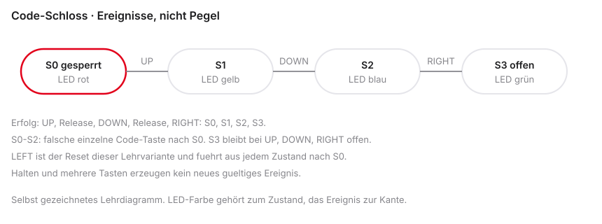

# Wrap-Up & C-to-Assembly


::: notes
Wrap-Up bedeutet Abschluss, C-to-Assembly die Verbindung von C und Assembler. Mikrocomputertechnik 1 bündelt heute Berechnung, Bedingung und ein Code-Schloss. Vorausgesetzt sind RISC-V-Befehle, Speicher und die einfache Funktions-ABI, das Application Binary Interface. Compileroptimierung und Linkerskripte werden nicht vorausgesetzt.

Kontrollfrage: Ist Assembler hier das Endziel? Nein, die Verbindung zur C-Wirkung. Die offene Lücke folgt.
:::
## Der Kreis schließt sich

- Herzlich willkommen zur letzten regulären Vorlesung in Mikrocomputertechnik 1
- Intensives Semester: Computer von Grund auf verstanden
- Heute: Hochsprachen (C/C++) final mit RISC-V-Assembler verbinden
- Theorie kurz (ca. 45 Min.), danach ca. 3 Stunden Labor
- Abschluss: Mini-Projekt und gezielte Klausurvorbereitung

```{mermaid}
%%| fig-width: 3.5
%%{init: {'theme': 'base', 'themeVariables': {'background': '#FFFFFF', 'primaryColor': '#FFFFFF', 'primaryBorderColor': '#E5E5EA', 'primaryTextColor': '#1D1D1F', 'lineColor': '#86868B', 'secondaryColor': '#F5F5F7', 'tertiaryColor': '#FFFFFF', 'mainBkg': '#FFFFFF', 'nodeBorder': '#E5E5EA', 'clusterBkg': '#F5F5F7', 'clusterBorder': '#E5E5EA', 'titleColor': '#1D1D1F', 'edgeLabelBackground': '#FFFFFF'}}}%%

graph LR
  C[C-Code] --> Comp[Compiler]
  Comp --> ASM[Assembler]
  ASM --> HW[Hardware]
  style Comp fill:#FFFFFF,stroke:#E2001A,stroke-width:2px !important
  style C fill:#FFFFFF,stroke:#E5E5EA,stroke-width:1.5px !important
  style ASM fill:#FFFFFF,stroke:#E5E5EA,stroke-width:1.5px !important
  style HW fill:#FFFFFF,stroke:#E5E5EA,stroke-width:1.5px !important
```

::: notes
Die Ebenen sind Logik, Befehlssatz, Datenpfad, Pipeline und Ein-/Ausgabe. Die einfache CPU ist ein Lehrmodell, kein vollständiger Computer. C beschreibt eine Berechnung mit Bedingung. Der Compiler, der Assembler und die Ausführungsumgebung sind getrennte Schritte. Die Kette ohne Linker und Start ist eine gekürzte Übersicht.

Kontrollfrage: Läuft C-Text direkt auf der ALU? Nein. Die Agenda nennt die Arbeitsschritte.
:::

## Agenda für den heutigen Tag

1. Der Übersetzungsprozess — klassische C/C++-Toolchain
2. C-to-Assembly — `if`, `while`, `for`
3. Mini-Projekt (State Machine) — Briefing in Ripes
4. Klausurvorbereitung — Organisatorisches und Aufgabentypen
5. Q&A & Labor — freies Coden und Fragen

```{mermaid}
%%| fig-width: 3.5
%%{init: {'theme': 'base', 'themeVariables': {'background': '#FFFFFF', 'primaryColor': '#FFFFFF', 'primaryBorderColor': '#E5E5EA', 'primaryTextColor': '#1D1D1F', 'lineColor': '#86868B', 'secondaryColor': '#F5F5F7', 'tertiaryColor': '#FFFFFF', 'mainBkg': '#FFFFFF', 'nodeBorder': '#E5E5EA', 'clusterBkg': '#F5F5F7', 'clusterBorder': '#E5E5EA', 'titleColor': '#1D1D1F', 'edgeLabelBackground': '#FFFFFF'}}}%%

graph LR
  A[Toolchain] --> B[C zu Assembler]
  B --> C[State Machine]
  C --> D[Klausur-Tipps]
  D --> E[Labor und Q&A]
  style E fill:#FFFFFF,stroke:#E2001A,stroke-width:2px !important
  style A fill:#FFFFFF,stroke:#E5E5EA,stroke-width:1.5px !important
  style B fill:#FFFFFF,stroke:#E5E5EA,stroke-width:1.5px !important
  style C fill:#FFFFFF,stroke:#E5E5EA,stroke-width:1.5px !important
  style D fill:#FFFFFF,stroke:#E5E5EA,stroke-width:1.5px !important
```

::: notes
Toolchain ist die abgestimmte Werkzeugkette. Kontrollfluss sind Entscheidungen und Schleifen. FSM bedeutet Finite State Machine, ein endlicher Zustandsautomat. Q&A bedeutet Questions and Answers. Die Fragen lauten: welche Datei entsteht, wie wird eine Bedingung zum Sprung, wie merkt sich das Schloss den Fortschritt, und wie prüft man das an Aufgaben? Ripes zeigt das Schloss, ein Compilervergleich zeigt echten Text nur nach einem Lauf. Dieser Lauf liegt hier nicht vor.

Kontrollfrage: Ist die Agenda schon die Klausur? Nein. Der Rückblick aktiviert die Grundlagen.
:::

## Rückblick auf das Semester

- Einheit 1: Logikgatter und Transistoren
- Einheiten 2–4: RISC-V-Assembler und ABI
- Einheiten 5–6: Datenpfad und Control Unit
- Einheit 7: Pipelining — Durchsatz steigern
- Einheit 8: I/O und Syscalls — Außenwelt und OS

```text
Die Blackbox Computer ist entschlüsselt.
Auf Hardware-Ebene bleiben keine Geheimnisse.
```

::: notes
Transistoren realisieren Logik. Die ISA, Instruction Set Architecture, beschreibt die beobachtbare Befehlswirkung. Die ABI ist der Softwarevertrag. Der Datenpfad führt aus, die Pipeline überlappt. I/O, Input/Output, verbindet Geräte. Ein Syscall ist ein Dienst einer Umgebung. Es bleiben keine absoluten Geheimnisse beseitigt. Cache, Betriebssystem und Plattform bleiben offen. OS bedeutet Operating System.

Kontrollfrage: Ist die ISA dasselbe wie der Datenpfad? Nein. Offen ist die Übersetzung aus C.
:::

## Die letzte Lücke

- Wochenlang Assembler in Venus und Ripes
- Industrie: große Programme in C, C++, Rust, ...
- Frage: Wie wird aus `printf("Hallo");` ausführbarer Maschinencode (viele Wörter / Syscalls)?
- Antwort: die Toolchain (Werkzeugkette)

```{mermaid}
%%| fig-width: 3.5
%%{init: {'theme': 'base', 'themeVariables': {'background': '#FFFFFF', 'primaryColor': '#FFFFFF', 'primaryBorderColor': '#E5E5EA', 'primaryTextColor': '#1D1D1F', 'lineColor': '#86868B', 'secondaryColor': '#F5F5F7', 'tertiaryColor': '#FFFFFF', 'mainBkg': '#FFFFFF', 'nodeBorder': '#E5E5EA', 'clusterBkg': '#F5F5F7', 'clusterBorder': '#E5E5EA', 'titleColor': '#1D1D1F', 'edgeLabelBackground': '#FFFFFF'}}}%%

graph LR
  C[Hochsprache C] -->|Toolchain| ASM[RISC-V Assembler]
  ASM -->|Assembler-Tool| Bin[Binärcode]
  style ASM fill:#FFFFFF,stroke:#E2001A,stroke-width:2px !important
  style C fill:#FFFFFF,stroke:#E5E5EA,stroke-width:1.5px !important
  style Bin fill:#FFFFFF,stroke:#E5E5EA,stroke-width:1.5px !important
```

::: notes
printf ist eine Bibliotheksfunktion, kein RISC-V-Befehl. Eine Bibliothek und eine Laufzeit müssen den Dienst umsetzen. Bare Metal hat nicht automatisch eine Standardausgabe. Derselbe RISC-V-Text läuft nicht auf jedem Ziel ohne passende Umgebung. Heute betrachten wir C, nicht die ganze C++-Sprache. Rust ist nur ein Motiv.

Kontrollfrage: Ist printf ein Opcode? Nein. Die Werkzeugkette wird zerlegt.
:::

# Die Toolchain


::: notes
Eine Toolchain übersetzt und baut Programme. Präprozessor, Compiler, Assembler und Linker erzeugen verschiedene Dateien. Der Host ist der Rechner, auf dem die Werkzeuge laufen. Das Ziel kann RV32 sein, auch wenn der Host kein RISC-V-Prozessor ist. RV32I ist die 32-Bit-Integerbasis.

Kontrollfrage: Erzeugt ein gewöhnlicher Host-gcc automatisch RV32-Code? Nein. Ein konkreter Befehl folgt.
:::
## Der Übersetzungsprozess

- `riscv64-unknown-elf-gcc -march=rv32i -mabi=ilp32` erzeugt RISC-V-Code
- Ein nacktes `gcc main.c` auf dem Host tut das nicht
- Ausgabearten: Assemblertext, Objektdatei mit Relocation, gelinktes ELF
- `printf` braucht eine passende Laufzeit; ein ELF ist kein Venus-Assemblertext
- Output des einen = Input des nächsten

```{mermaid}
%%| fig-width: 3.5
%%{init: {'theme': 'base', 'themeVariables': {'background': '#FFFFFF', 'primaryColor': '#FFFFFF', 'primaryBorderColor': '#E5E5EA', 'primaryTextColor': '#1D1D1F', 'lineColor': '#86868B', 'secondaryColor': '#F5F5F7', 'tertiaryColor': '#FFFFFF', 'mainBkg': '#FFFFFF', 'nodeBorder': '#E5E5EA', 'clusterBkg': '#F5F5F7', 'clusterBorder': '#E5E5EA', 'titleColor': '#1D1D1F', 'edgeLabelBackground': '#FFFFFF'}}}%%

graph LR
  A[main.c] --> B[Preprocessor]
  B --> C[Compiler]
  C --> D[Assembler]
  D --> E[Linker]
  E --> F[Executable]
  style C fill:#FFFFFF,stroke:#E2001A,stroke-width:2px !important
  style A fill:#FFFFFF,stroke:#E5E5EA,stroke-width:1.5px !important
  style B fill:#FFFFFF,stroke:#E5E5EA,stroke-width:1.5px !important
  style D fill:#FFFFFF,stroke:#E5E5EA,stroke-width:1.5px !important
  style E fill:#FFFFFF,stroke:#E5E5EA,stroke-width:1.5px !important
  style F fill:#FFFFFF,stroke:#E5E5EA,stroke-width:1.5px !important
```

::: notes
riscv64-unknown-elf-gcc kann bei passender Toolchain RV32-Code erzeugen. -march=rv32i wählt die Basis, -mabi=ilp32 das Datenmodell mit 32-Bit-int, long und Pointer. gcc ist der Treiber der GNU Compiler Collection. -E liefert vorverarbeiteten Text, -S Assemblertext, -c ein Objekt. Ein gelinktes ELF, Executable and Linkable Format, braucht noch Laden und Start. Es ist nicht automatisch Venus-Text und kein garantiertes printf.

Kontrollfrage: Ist -S schon ein startfähiges Programm? Nein. Zuerst Präprozessor und Compiler.
:::

## 1. Preprocessor und 2. Compiler

- Preprocessor: Text-Ersetzer für `#...` (`#include`, `#define`)
- Header-Text wird eingefügt; Makros expandiert
- Compiler: Syntax/Semantik, Optimierung; Ausgabe: RISC-V-Assembler (`.s`)

```c
int a = 5;
```

```asm
li s0, 5
```

::: notes
#include und Makros folgen Regeln, kein beliebiges Ersetzen. Ein Header deklariert printf, er enthält nicht automatisch dessen Maschinenkörper. int a gleich 5 als li s0, 5 ist eine Lehrzuordnung. Der Compiler kann a anders ablegen oder streichen. Ein C-Name hat keine feste Registeradresse.

Kontrollfrage: Liegt jede Variable dauerhaft in s0? Nein. Der Assembler kodiert den Text.
:::

## 3. Assembler

- Eingabe: Text mit `add`, `lw`, `beq`
- Ausgabe: 32-Bit-Maschinencode (Object-File `.o`)
- Nutzt Instruktionsformate R/I/S/B/J (Einheit 2)
- Noch nicht ausführbar: Adressen oft noch offen

```text
Text:   add t0, t1, t2
Hex:    0x007302B3
```

::: notes
add t0, t1, t2 ist das Wort 0x007302B3. t0 ist x5, t1 ist x6, t2 ist x7. Opcode, funct3 und funct7 bestimmen die Operation. Ein Objekt enthält Code, Daten, Symbole und gegebenenfalls Relocations, nicht nur nackte Zahlen. Die gezeigten RV32I-Instruktionen sind 32 Bit. Die C-Erweiterung wäre ein anderer Fall. Die Formatliste ohne U-Typ ist eine Auswahl.

Kontrollfrage: Ist 0x007302B3 der Datenwert der Register? Nein, die Codierung. Der Linker löst offene Symbole.
:::

## 4. Linker

- Compiler kennt die finale Adresse von `printf` oft nicht
- `jal`/`lw`-Ziele können Lücken haben
- Linker: alle `.o` + Libraries (z. B. `libc`) zusammenkleben
- Finale Adressen eintragen
- Output: Executable (`.elf` / `.exe`)

::: notes
Ein undefiniertes Symbol kann eine Funktion in einer anderen Datei sein. Lücke ist eine Metapher. Manche lokalen Ziele kennt schon der Assembler. Der Linker verbindet kompatible Objekte und platziert Bereiche. Bei Bare Metal zählen Startcode und Speicherlayout. Ein ELF kann auch ein verschiebbares Objekt sein. Die Endung beweist keine Ausführbarkeit. Linker, Loader und Startcode sind verschieden.

Kontrollfrage: Macht der Linker jedes Programm allein startfähig? Nein. Danach die Kontrollstrukturen.
:::

# C-to-Assembly: Kontrollstrukturen


::: notes
C drückt Entscheidungen und Wiederholungen aus. RISC-V führt Registeroperationen und Sprünge aus. Die folgenden Muster sind manuelle Lehrformen, kein garantierter Compileroutput. Labels benennen Adressen.

Kontrollfrage: Ist ein if ein RISC-V-Befehl? Nein. Die Grenzen der Schablone folgen.
:::
## Muster des Compilers

- Wie wird übersetzt?
- Rolle: Compiler-Hut aufsetzen
- `if`, `while`, `for` - Schablonen
- Relevant für Klausur, Reverse Engineering, Debugging

```{mermaid}
%%| fig-width: 3.5
%%{init: {'theme': 'base', 'themeVariables': {'background': '#FFFFFF', 'primaryColor': '#FFFFFF', 'primaryBorderColor': '#E5E5EA', 'primaryTextColor': '#1D1D1F', 'lineColor': '#86868B', 'secondaryColor': '#F5F5F7', 'tertiaryColor': '#FFFFFF', 'mainBkg': '#FFFFFF', 'nodeBorder': '#E5E5EA', 'clusterBkg': '#F5F5F7', 'clusterBorder': '#E5E5EA', 'titleColor': '#1D1D1F', 'edgeLabelBackground': '#FFFFFF'}}}%%

graph TD
  C_Code[C Kontrollstruktur] -->|Muster| ASM[Assembler-Schablone]
  style ASM fill:#FFFFFF,stroke:#E2001A,stroke-width:2px !important
  style C_Code fill:#FFFFFF,stroke:#E5E5EA,stroke-width:1.5px !important
```

::: notes
Eine Kontrollstruktur hat mehrere passende Assemblerformen. Ein Label hat keine eigene Laufzeitwirkung. Die Umkehrung einer Bedingung ist eine mögliche Anordnung. Reverse Engineering rekonstruiert Verhalten aus niedrigerer Darstellung. Debugging ist die systematische Fehlersuche. Beide Anordnungen im Bild sind keine Pflicht des Compilers.

Kontrollfrage: Gibt es nur eine richtige Sprungform? Nein. Zuerst braucht eine Variable einen Ort.
:::

## Variablen und Register

- Lokale Variablen: Compiler bevorzugt schnelle Register
- ABI: oft `s0`-`s11` für langlebige Lokale
- Register Pressure: Spilling auf den Stack (`sw`/`lw`)

```c
int a = 5;
int b = 10;
int c = a + b;
```

```asm
li s0, 5
li s1, 10
add s2, s0, s1
```

::: notes
Registerallokation wählt Orte. Register Pressure ist der Druck, wenn zu wenige Register frei sind. Spilling lagert Werte in den Speicher. Die ABI zwingt langlebige lokale Variablen nicht in s0 bis s11. a-, t- und s-Register, Speicher oder Wegfall sind möglich. Verändert eine Funktion ein s-Register, muss sie es bei normalen Aufrufen wiederherstellen. Die drei Konstanten hier sind manuell zugeordnet. Ein optimierender Compiler kann 15 direkt liefern.

Kontrollfrage: Garantiert -O0 s0 für die erste Variable? Nein. Die Bedingung folgt.
:::

## Das if-Statement (C-Code)

- Klassisches If-Else
- Vergleich `a` und `b`
- Gleich: Block 1; sonst Block 2

```c
int a = 5;
int b = 10;
int c;

if (a == b) {
    c = 1;
} else {
    c = 2;
}
```

::: notes
Der Then-Zweig und der Else-Zweig treffen sich danach. Mit a gleich 5 und b gleich 10 wird c gleich 2. Mit a gleich b wird c gleich 1. == vergleicht, = weist zu. Konstanten sind leicht lesbar, ein echter Compiler kann die Entscheidung entfernen. Für den Vergleich eignet sich eine Funktion mit Parametern.

Kontrollfrage: Welches c entsteht bei Gleichheit? 1. Labels und Branches folgen.
:::

## Das if-Statement (Assembler)

- C: `a == b` → Assembler oft `bne` (Gegenteil)
- Ungleich: zum Else springen
- Am Ende des If-Blocks: `j End` - sonst Rutschen in Else

```asm
    li s0, 5
    li s1, 10
    bne s0, s1, Else_Block

If_Block:
    li s2, 1
    j End

Else_Block:
    li s2, 2

End:
```

::: notes
In der Lehrkonvention sind s0, s1 und s2 die Werte a, b und c. bne springt bei Ungleichheit. Bei Gleichheit läuft der Then-Zweig weiter. j zum gemeinsamen Ende verhindert den Else-Zweig. Fehlt dieser Sprung, wird c danach mit 2 überschrieben. Ein Label ohne weitere Befehle ist nur eine Adresse. Ein vollständiges Programm braucht einen Abschluss. Gleichheit unterscheidet nicht signed und unsigned.

Kontrollfrage: Was passiert ohne j zum Ende? Der Else-Zweig überschreibt c. Eine Schleife entsteht durch Rücksprung.
:::

## Die while-Schleife (C-Code)

- Kopfgesteuert: Bedingung vor dem Körper
- `i` hochzählen, bis 10

```c
int i = 0;

while (i < 10) {
    i++;
}
```

::: notes
Die Prüfung steht vor jedem Durchlauf. Start i gleich 0 führt den Körper zehnmal aus und prüft elfmal. Danach ist i gleich 10. Start i gleich 10 führt den Körper nicht aus. Hochzählen bis 10 bedeutet nicht, den Körper bei i gleich 10 auszuführen. Ein Compiler kann das Beispiel vereinfachen, wenn nur der Endwert zählt.

Kontrollfrage: Wie oft wird bei Start 0 geprüft? Elfmal. Prüfung und Rücksprung folgen im Assembler.
:::

## Die while-Schleife (Assembler)

- Label `While_Start` am Kopf
- C: `i < 10` → Assembler oft `bge` (Abbruch)
- Am Ende: `j While_Start`

```asm
    li s0, 0
    li t0, 10

While_Start:
    bge s0, t0, While_End
    addi s0, s0, 1
    j While_Start

While_End:
```

::: notes
s0 ist i, t0 die Grenze 10. bge prüft signed i größer oder gleich 10, das Gegenstück zu i kleiner 10. j führt vor die Prüfung zurück. Bei Start 0 wird der Körper ausgeführt, bei Start 10 nur die Abbruchprüfung. Unsigned-Werte bräuchten einen passenden Vergleich. t0 ist nicht über einen Unteraufruf erhalten, wenn der Vertrag das nicht sagt.

Kontrollfrage: Welcher Befehl entspricht dem Abbruch? bge. Die for-Schleife benennt die Phasen.
:::

## Die for-Schleife (C-Code)

- Syntaktischer Zucker für while
- Init, Bedingung, Inkrement in einer Zeile
- Beispiel: Array-Summe

```c
int sum = 0;
int arr[10] = { /* ... */ };

for (int i = 0; i < 10; i++) {
    sum = sum + arr[i];
}
```

::: notes
Initialisierung einmal, Bedingung vor dem Körper, Update danach. Für die Werte 1 bis 10 ist die Summe 55, die Indizes sind 0 bis 9. Das unvollständige arr gleich Kommentarklammern ist kein lauffähiges Programm. Syntaktischer Zucker gilt hier als Einstieg. continue muss das Update trotzdem ausführen. Der Geltungsbereich von int i ist eine C-Regel, keine Assemblerregel.

Kontrollfrage: Wird arr von 10 beschrieben? Nein, die Indizes enden bei 9. Die Phasen werden getrennt.
:::

## Die for-Schleife (Assembler)

1. Initialisierung vor dem Label
2. Bedingung direkt danach
3. Body
4. Inkrement
5. Rücksprung

```asm
    li s0, 0            # sum = 0
    li s1, 0            # i = 0
    li t0, 10
    la s2, arr

For_Loop:
    bge s1, t0, For_End
    # Body: siehe nächste Folie
    addi s1, s1, 1
    j For_Loop

For_End:
```

::: notes
s0 ist die Summe, s1 der Index, s2 die Basis, t0 die Grenze. la lädt eine Adresse, nicht den Inhalt. Der Körper folgt auf der nächsten Folie. Die vollständige manuelle Summe 0 bis 4 steht in beispiele/vl9_sum_0_to_4.s und ergibt 10. Startindex 10 darf arr von 10 nicht lesen. Das ist eine mögliche Übersetzung dieser Schleife, nicht jede for-Schleife. s-Register in einer Funktion brauchen Sicherung, wenn der Vertrag das verlangt.

Kontrollfrage: Ist la ein Load des ersten Elements? Nein. Der Index wird zum Byteoffset.
:::

## Arrays: `arr[i]` in Hardware

- C: `arr[i]` = i-tes Element
- CPU: Bytes - `int` = 4 Byte
- Adresse = Base + $(i \times 4)$ oft als `slli` um 2

```asm
    slli t1, s1, 2      # i * 4
    add  t2, s2, t1     # Base + Offset
    lw   t3, 0(t2)
    add  s0, s0, t3     # sum += arr[i]
```

::: notes
Die Adresse ist Basis plus Index mal der Elementgröße. In diesem ILP32-Modell ist int vier Byte. slli um 2 multipliziert den Offset mit 4. add bildet die effektive Adresse, lw lädt den Wert. Index 3 mit Wert 4 hat den Offset 12. Die Verschiebung prüft nicht die Grenze. Eine illustrative Adresse ist keine gemessene Simulatoradresse.

Kontrollfrage: Lädt slli den Elementwert? Nein, es bildet den Offset. Die Berechnung kann eine Funktion sein.
:::

## Funktionen: ABI, `a0` und `ret`

- Parameter in `a0`, `a1`, … (ABI, Einheit 4)
- C-`return` = Wert nach `a0`, dann `ret` (Sprung über `ra`)
- Leaf-Beispiel unten; nicht-leaf braucht Stack-Prolog/Epilog (Klausur-Typ 2)

```c
int calc(int a) {
    return a * 2;
}
```

```asm
# Fragment, kein vollständiges Programm:
calc:
    slli a0, a0, 1
    ret

# Aufrufer separat, mit Exit, damit calc nicht per Fall-through erneut läuft
```

::: notes
Für dieses skalare Beispiel steht das Argument in a0, das Ergebnis wieder in a0, und ret springt über ra. Nicht jedes C-Ergebnis passt in a0. calc verändert kein s-Register und ruft nichts auf, deshalb kein Frame. Ein normaler call überschreibt ra. Eine Nicht-Leaf-Funktion sichert ra. Die Stackausrichtung im Standardvertrag ist 16 Byte. Testwerte 21 und minus 3 bleiben im definierten Bereich. Signed-Überlauf in C ist nicht dasselbe wie der Maschinenwrap.

Kontrollfrage: Warum braucht calc keinen Stack? Es ist ein Leaf ohne s-Register. Der echte Compiler kann anders aussehen.
:::

## Compiler-Output in Echt (Godbolt)

- Lehrübersetzung und Compileroutput unterscheiden
- `-O0` verspricht keine feste Belegung von `s0`/`s1`
- `-O3` verspricht keinen bestimmten Pipelineplan
- Konstanten wie `a = 5; b = 10; c = a + b` können vollständig entfallen
- Compiler Explorer: Version, `-march=rv32i`, `-mabi=ilp32` dokumentieren

::: notes
Lehrcode und Compileroutput sind verschieden. -O0 garantiert keine festen s0- oder s1-Zuordnungen. Konstanten können entfallen. Optimierung hängt von Ziel, Version und Stufe ab und plant nicht ausschließlich die Pipeline. Die Datei beispiele/vl9_control.c ist die Eingabe. Ein konkreter -O0- oder -O2-Text wurde hier nicht erzeugt. Godbolt braucht -march=rv32i und -mabi=ilp32.

Kontrollfrage: Muss der Compiler s0 für a wählen? Nein. Deshalb bleibt Assemblerwissen nützlich.
:::

## Warum Assembler lernen?

1. Maschinenverständnis: Caches, Stalls, Spilling
2. Embedded: Bootloader, ISR, Treiber - C und Assembler gemischt
3. Security / Reverse Engineering: oft nur Disassembly

```text
Assembler ist selten für große Apps.
Assembler ist das Röntgengerät des Informatikers.
```

::: notes
Ein unerwarteter Speicherzugriff, ein ABI-Fehler oder Startcode werden im Disassembly sichtbar. Eine ISR, Interrupt Service Routine, und ein Bootloader können Assembler enthalten. Ein Treiber muss nicht in Assembler geschrieben sein. Assemblerwissen macht C nicht automatisch schneller. Messung und Zielhardware bleiben nötig. Ein Cache und ein Stall sind Beobachtungen, keine Versprechen jedes Compilers.

Kontrollfrage: Schreibt man große Anwendungen in Assembler? Selten. Das Schloss wendet das Wissen an.
:::

# Labor & Klausur


::: notes
Zwei Ziele: das Schloss verbindet Zustände, Eingaben und Ausgaben. Die Aufgaben schätzen den Lernstand. Das sind keine garantierten Klausuraufgaben ohne autorisierte Grundlage.

Kontrollfrage: Ist jede Übungsaufgabe eine Klausuraufgabe? Nein. Der Ablauf der Praxis folgt.
:::
## Übergang in die Praxisphase

- Formaler Vorlesungsteil beendet
- Ca. 3 Stunden Praxis
- Abschlussprojekt: Finite State Machine (FSM)
- Danach: Klausur-Formalia und Aufgabentypen

```{mermaid}
%%| fig-width: 3.5
%%{init: {'theme': 'base', 'themeVariables': {'background': '#FFFFFF', 'primaryColor': '#FFFFFF', 'primaryBorderColor': '#E5E5EA', 'primaryTextColor': '#1D1D1F', 'lineColor': '#86868B', 'secondaryColor': '#F5F5F7', 'tertiaryColor': '#FFFFFF', 'mainBkg': '#FFFFFF', 'nodeBorder': '#E5E5EA', 'clusterBkg': '#F5F5F7', 'clusterBorder': '#E5E5EA', 'titleColor': '#1D1D1F', 'edgeLabelBackground': '#FFFFFF'}}}%%

graph LR
  A[Theorie] --> B[FSM-Briefing]
  B --> C[Klausur-Tipps]
  C --> D[Freies Labor]
  style D fill:#FFFFFF,stroke:#E2001A,stroke-width:2px !important
  style A fill:#FFFFFF,stroke:#E5E5EA,stroke-width:1.5px !important
  style B fill:#FFFFFF,stroke:#E5E5EA,stroke-width:1.5px !important
  style C fill:#FFFFFF,stroke:#E5E5EA,stroke-width:1.5px !important
```

::: notes
Die Anwendung braucht dokumentiertes Verhalten, Ereigniserkennung, Übergänge und LED-Farben. LED bedeutet Leuchtdiode. Die Schritte sind Vertrag, Geräte, Teilfunktionen und Tests. Drei Stunden gelten nur, wenn der Veranstaltungsplan sie bestätigt. Sie sind keine gemessene Bearbeitungszeit.

Kontrollfrage: Reicht die Farbe ohne Ereignisregeln? Nein. Das Modell wird präzise.
:::

## Projekt: Die State Machine

- Finite State Machine (FSM): zu jedem Zeitpunkt genau ein Zustand
- Eingaben (Taster) → Übergänge (Transitions)
- Fundament: Ampeln, Spiele, Protokolle, Steuerungstechnik

::: notes
Eine FSM hat endlich viele Zustände, einen Speicher, Ereignisse, Übergänge und Ausgaben. Genau ein abstrakter Softwarezustand ist gemeint, keine Behauptung über jede Schaltung. Hier ist die Farbe nur vom Zustand abhängig, ein Moore-Modell. Der Zustand ist nicht der Program Counter. Dieselbe Schleife kann den Verteiler immer wieder durchlaufen.

Kontrollfrage: Ist der Zustand der PC? Nein. Die Schlossregeln folgen.
:::

## Code-Schloss

- S0 gesperrt, LED rot; S1 nach UP, LED gelb; S2 nach DOWN, LED blau; S3 offen, LED grün
- Sequenz der Ereignisse: UP, DOWN, RIGHT
- Halten erzeugt höchstens ein Ereignis; Release trennt die Drücke
- LEFT ist der Reset dieser Lehrvariante und führt nach S0
- Falsche einzelne Code-Taste setzt S0 bis S2 nach S0; S3 bleibt bis Reset offen
- Halten und mehrere Tasten erzeugen kein gültiges Ereignis



Trace: UP, Release, DOWN, Release, RIGHT, Release führt von S0 über S1 und S2 nach S3.

::: notes
S0 ist rot 0x00FF0000, S1 gelb 0x00FFFF00, S2 blau 0x000000FF, S3 grün 0x0000FF00. RGB ist Rot, Grün, Blau. LEFT ist der Reset. Falsche einzelne Code-Tasten setzen S0 bis S2 nach S0. S3 bleibt bei UP, DOWN und RIGHT offen. Mehrere Tasten und Halten sind kein gültiges Ereignis. Der Erfolg ist UP, Freigabe, DOWN, Freigabe, RIGHT. Die Grafik zeigt die Erfolgskanten. Die vollständige Tabelle steht in der Spezifikation und in beispiele/vl9_next_state.s.

Kontrollfrage: Schließt DOWN in S3 das Schloss? Nein. Der Assembler muss den Zustand wirklich schreiben.
:::

## Umsetzung in Assembler

- Zustandsvariable in sicherem Register (z. B. `s0`)
- Endlosschleife: Turm aus `beq` zu State-Labels
- Im State: Arbeit (LED, Taster), dann `s0` ändern, `j Loop`

```asm
# Unvollstaendige Skizze. Vier Zustaende brauchen eigene Labels.
# Default muss den Zustand wirklich auf 0 setzen:
    li s0, 0
    j Loop
```

::: notes
Die Zwei-Zustands-Skizze ist unvollständig. Vier Labels und ein ungültiger Wert sind nötig. j State_0 setzt s0 nicht auf 0. Der Default muss li s0, 0 ausführen. s0 ist bei normalen Funktionen callee-saved, aber nicht magisch sicher. Eingabe, Filter, next_state und Farbe bleiben getrennte Schritte. Ein Helfer mit call muss ra sichern. Die Funktion steht in beispiele/vl9_next_state.s.

Kontrollfrage: Repariert ein Sprung auf das Label den Wert 99? Nein. Die Tests folgen.
:::

## Laboraufgabe: Das Code-Schloss

- Ripes: D-Pad + LED-Matrix
- Geheimcode: OBEN, UNTEN, RECHTS
- Start: LED rot (State 0)
- Richtig: State 1 gelb → State 2 blau → grün (offen)
- Falsche einzelne Code-Taste in S0 bis S2: zurück nach S0
- S3 bleibt bei UP, DOWN und RIGHT offen; LEFT setzt zurück
- Halten erzeugt kein zweites Ereignis; mehrere Tasten kein gültiges Ereignis

```text
Freigabe vor dem nächsten Druck. Halten ist kein zweites Ereignis.
```

::: notes
D-Pad und LED-Matrix kommen aus den Ripes-Exports, nicht aus universellen Adressen. Oben, unten, rechts ist die Folge. Start ist rot. Halten bleibt ein Ereignis. Mehrere Tasten bleiben ohne Fortschritt, auch wenn danach eine Taste noch gehalten wird. Erst volle Freigabe und ein neuer einzelner Druck zählen. Das ist keine physische Entprellung und keine Messung. Die GUI muss nicht prellen.

Kontrollfrage: Rast ein gehaltener Taster durch alle Zustände? In diesem Vertrag nein. Prüfung und Übung werden getrennt.
:::

## Die Klausur (Organisatorisches)

- Schriftliche Klausur; Dauer und Hilfsmittel nur verbindlich, wenn die aktuelle Kursangabe sie bestätigt
- Orientierung: Reference Sheet liegt bei, Opcodes müssen nicht auswendig sitzen

::: notes
Dauer, Hilfsmittel und Reference Sheet sind nur verbindlich, wenn die aktuelle Kursangabe sie bestätigt. Kein Auswendiglernen ist hier eine Lernorientierung, keine Prüfungszusage. Ein Sheet hilft beim Nachschlagen, ersetzt aber nicht das Erklären eines Ablaufs. Es werden keine Termine erfunden.

Kontrollfrage: Sind 90 Minuten hier verbindlich? Nur wenn die Kursstelle das sagt. Der erste Übungstyp ist der Trace.
:::

## Klausur-Typ 1: Code-Analyse (Tracing)

- Assembler-Snippet + Startwerte
- Rolle: menschlicher Simulator
- Frage z. B.: Wert in `t2` nach Ablauf?

```asm
    li t0, 5
    li t1, 3
    sub t2, t0, t1   # t2 = 2
    slli t2, t2, 1   # *2
    # Ergebnis: t2 = 4
```

::: notes
li t0, 5 und li t1, 3 setzen die Quellen. sub schreibt 2 nach t2. slli um 1 schreibt 4. Der Kommentar mal 2 gilt für diesen Wert. Unbenutzte Register sind nicht automatisch null. Ein Branch-Beispiel fragt zusätzlich, welche Zeile als Nächstes läuft. li ist ein Pseudobefehl.

Kontrollfrage: Welcher Wert steht am Ende in t2? 4. Danach schreibt man selbst eine Folge.
:::

## Klausur-Typ 2: Code schreiben

- Das gezeigte `for` mit `i < 5` summiert 0+1+2+3+4 und ergibt 10
- Die Summe 1 bis 10 gleich 55 ist eine andere Aufgabe

```c
int summe = 0;
for (int i = 0; i < 5; i++) {
    summe += i;
}
```

::: notes
Die sichtbare Schleife i kleiner 5 summiert 0 bis 4 und ergibt 10. Die Summe 1 bis 10 gleich 55 ist eine andere Aufgabe. beispiele/vl9_sum_0_to_4.s ist die manuelle Übersetzung, kein Compileroutput. Ein Frame ist nur nötig, wenn der Vertrag ihn verlangt. Die Phasen sind Initialisierung, Prüfung, Körper, Update und Abbruch.

Kontrollfrage: Wird i gleich 5 addiert? Nein. Die Befehle werden im Datenpfad wiedererkannt.
:::

## Klausur-Typ 3: Hardware / Datenpfad

- Einheiten 5–6: Single-Cycle-Blockdiagramm
- Datenweg eines `lw` markieren
- Control-Zeile für z. B. `or` ausfüllen

| Befehl | ALUSrc | MemtoReg | RegWrite | MemRead | MemWrite | Branch | ALUOp |
|---|---|---|---|---|---|---|---|
| `or` | 0 | 0 | 1 | 0 | 0 | 0 | 10 |

- Main Control ist für alle R-Types gleich; `or` vs. `add` entscheidet die ALU Control (`funct3`)

::: notes
ALUSrc wählt den zweiten ALU-Eingang. MemtoReg wählt die Rückschreibquelle. RegWrite, MemRead und MemWrite sind die Freigaben. Branch kennzeichnet den Sprungpfad des Kursmodells. ALUOp 10 ist die Kurskategorie für Registeroperationen, keine ISA-Konstante. or hat dieselbe Main-Control-Zeile wie add. funct3 und funct7 unterscheiden die ALU-Operation. ALU bedeutet Arithmetic Logic Unit.

Kontrollfrage: Unterscheidet die Main Control add und or? In diesem Modell nein. Die Zeitachse kommt dazu.
:::

## Klausur-Typ 4: Pipelining & Hazards

- Einheit 7: Timing-Raster IF/ID/EX/MEM/WB
- RAW-Hazards erkennen; Forwarding-Pfeile
- Unvermeidbarer Stall (Load-Use)

| Befehl | 1 | 2 | 3 | 4 | 5 | 6 | 7 |
|---|---|---|---|---|---|---|---|
| `lw t0, 0(a0)` | IF | ID | EX | MEM | WB | | |
| `add t1, t0, t0` | | IF | ID | ID gehalten | EX | MEM | WB |

::: notes
IF, ID, EX, MEM und WB sind die fünf Stufen des Lehrmodells. RAW bedeutet Read After Write. Der Load-Wert steht erst nach MEM bereit. In Takt 4 bleibt add in ID, eine Bubble liegt in EX. In Takt 5 kommt der Wert aus MEM/WB nach EX. Beide Operanden von add t1, t0, t0 brauchen ihn. Unvermeidbar gilt nur in diesem Modell. Die Bubble ist kein zusätzlicher Programmbefehl.

Kontrollfrage: Reicht Forwarding im selben Takt wie MEM? Hier nein. Die vier Typen bilden den Übungsplan.
:::

## Tipps zur Vorbereitung

1. Alte Laborblätter ohne Vorlage neu lösen; Venus Step nutzen
2. Godbolt: kleine C-Snippets, `-O0`, Sprünge analysieren
3. Lerngruppen: erklären, warum `MemtoReg` bei `sw` Don't Care ($X$) ist

```text
Wie Mathematik: Durchlesen reicht nicht.
Sie müssen Code tippen.
```

::: notes
Zuerst selbst lösen, dann im passenden Simulator prüfen und die erste Abweichung suchen. Godbolt braucht Ziel rv32i und ABI ilp32. Ein Hostcompiler ist kein RV32-Beleg. Bei sw ist MemtoReg ein Don't Care, weil RegWrite 0 das Rückschreiben verhindert. X ist tabellarisch unerheblich, kein zufälliger Pegel.

Kontrollfrage: Warum ist MemtoReg bei sw egal? Weil kein Register geschrieben wird. Danach die Rückmeldung zur Veranstaltung.
:::

## Feedback & Evaluation

- Evaluation nur über den tatsächlichen Hochschulweg; Anonymität nur, wenn das Verfahren sie zusichert
- QR-Code und Link nicht erfinden, wenn sie hier nicht vorliegen

::: notes
Hilfreich sind konkrete Folien, zu schnelle Übergänge und fehlende Laborvoraussetzungen. Anonymität gilt nur, wenn das Verfahren sie zusichert. Ein QR-Code, Quick Response, oder Link wird hier nicht erfunden. Es wird nichts automatisch abgesendet.

Kontrollfrage: Ist jede Evaluation anonym? Nur wenn das Verfahren das sagt. Der Abschluss bündelt das Modell.
:::

## Das war Mikrocomputertechnik 1

- Fundamentaler Meilenstein erreicht
- Computer als klare, logische Maschine
- Später in C/Java/Python: physikalische Konsequenzen im Blick
- Danke für Mitarbeit - viel Erfolg in der Klausur

```asm
# Offizieller Ausstieg (Venus-ABI, nicht Ripes-MMIO):
li a0, 10
ecall
```

::: notes
Erreicht sind Hochsprache, Befehlssatz, Datenpfad, ABI und Gerätevertrag, nicht jede Rechnerfrage. Der Venus-Exit mit a0 gleich 10 gilt für diesen Dienstvertrag. Das Schloss bleibt eine Endlosschleife, weil die Aufgabe das so definiert. Ripes kann trotzdem Environment Calls. Der symbolische Ausstieg ist nicht das Schloss-Ende.

Kontrollfrage: Muss das Schloss ecall 10 ausführen? Nein. Die letzte Folie nennt prüfbare Ergebnisse.
:::

## Q&A und Hands-On

- Restliche Zeit: Ihnen
- Ripes: Code-Schloss (FSM)
- Dozent zum Debuggen und für Klausurfragen da
- Labor ist eröffnet

```{mermaid}
%%| fig-width: 3.5
%%{init: {'theme': 'base', 'themeVariables': {'background': '#FFFFFF', 'primaryColor': '#FFFFFF', 'primaryBorderColor': '#E5E5EA', 'primaryTextColor': '#1D1D1F', 'lineColor': '#86868B', 'secondaryColor': '#F5F5F7', 'tertiaryColor': '#FFFFFF', 'mainBkg': '#FFFFFF', 'nodeBorder': '#E5E5EA', 'clusterBkg': '#F5F5F7', 'clusterBorder': '#E5E5EA', 'titleColor': '#1D1D1F', 'edgeLabelBackground': '#FFFFFF'}}}%%

graph LR
  Ende[Theorie] --> Code[Ripes]
  Code --> Safe[State Machine]
  Safe --> Fragen[Klausur Q&A]
  Fragen --> Win[Erfolg]
  style Win fill:#FFFFFF,stroke:#E2001A,stroke-width:2px !important
  style Ende fill:#FFFFFF,stroke:#E5E5EA,stroke-width:1.5px !important
  style Code fill:#FFFFFF,stroke:#E5E5EA,stroke-width:1.5px !important
  style Safe fill:#FFFFFF,stroke:#E5E5EA,stroke-width:1.5px !important
  style Fragen fill:#FFFFFF,stroke:#E5E5EA,stroke-width:1.5px !important
```

::: notes
Prüfbar sind eine begründete C-Übersetzung, das Schloss nach der Tabelle, ein Control-Wert und der Load-Use-Stall. choose liefert 1 bei Gleichheit, sonst 2. constant_sum liefert 15, die Variablen können optimiert verschwinden. count_to_ten von 0 und von 10 liefert 10, von 12 liefert 12. Die Arraysumme von 1 bis 10 ist 55, bei Länge 0 ist sie 0. next_state von Zustand 99 liefert 0. S3 und DOWN bleibt 3. Ein Sprung ohne Schreiben repariert 99 nicht. Eine verbleibende Taste einer Mehrfachgruppe ist kein neuer Druck. Es wird keine Folgevorlesung erfunden.

Kontrollfrage: Was liefert die Summe 0 bis 4? 10. Damit sind Quelltext, Zustand und beobachtbare Farbe verbunden.
:::
